> 注：本文作者为88完美邮箱测试主管李雪兰。

2019年，全球领先的文化娱乐产业集团完美世界拿下了“一定是东半球最贵的”顶级域名www.88.com。2020年8月8号，历时一年研发，88完美邮箱与大家正式见面。立足产品角度，这是完美世界正式进军邮箱赛道的起点。对于88邮箱团队来说，此举迈出了从0到1的第一步。

不同于QQ邮箱和网易邮箱，88完美邮箱主打商务与协同办公，提供团队邮件快速创建（日报、周报、月报、任务和审批）、团队通讯录、团队邮件组管理、88便签、对接飞书会议、在线文档，以及免费开放5GB容量网盘等高效协同的功能。

对于完美世界来说，邮箱业务的诞生与快速发展催生出一个全新的团队，从0到1组建团队，需要建立新的研发流程和规范。在这一过程中，测试如何发挥更大的价值是一个重要的课题，而测试实现左移和右移是关键目标和突破方向。

## 测试左移和测试右移模型
对软件产品而言，传统的质量模式通过测试左移和测试右移被赋予更多的内涵，也承担起更多的职责。
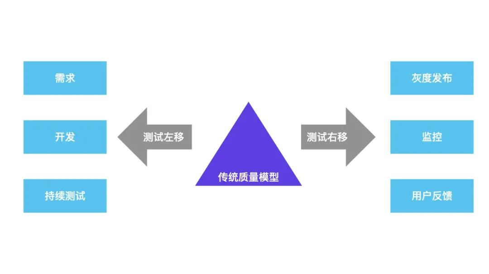

- **测试左移**：测试左移，本质上是借助工具和测试手段更早地发现问题和预防问题
  - 需求：对需求、架构和设计模型的测试
  - 开发：着重增加对单元、组件和服务层的测试
  - 持续测试：自动化测试
- **测试右移**：对测试同学来说，版本上线后需要持续关注线上监控和预警，及时发现问题并跟进解决，将影响范围降到最低
  - 灰度发布：新版本线上测试
  - 监控：合理的性能监测、数据监控和预警机制
  - 用户反馈：线上问题处理、跟踪机制

## 测试左移如何落地？
### 测试任务跟踪
测试任务跟踪，不仅仅只是跟踪测试本身的工作，还需要介入到需求、技术方案、编码的全过程。只有前序每一步都跟踪到位，才能尽量避免测试过程中的不可控因素，从而保证产品质量。
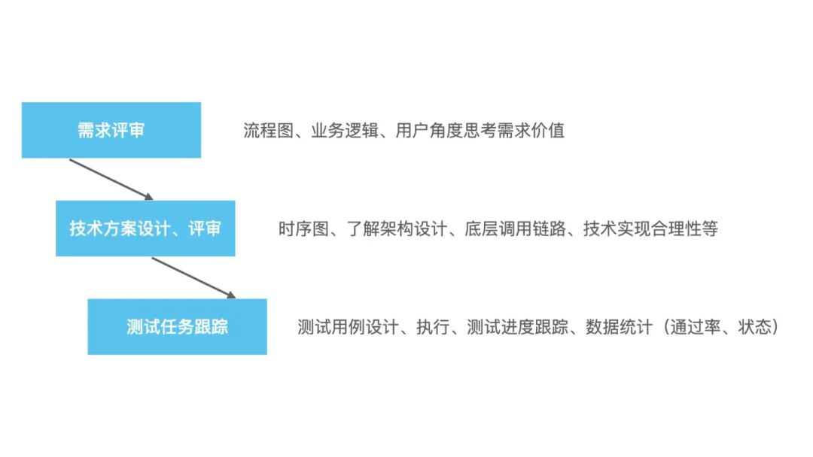
测试同学的任务其实是不好度量和跟踪的，但是MeterSphere开源持续测试平台为我们解决了这个痛点。测试计划、测试用例、执行情况等都可以在MeterSphere平台上直观地看到，做到了“让数据为质量说话”。
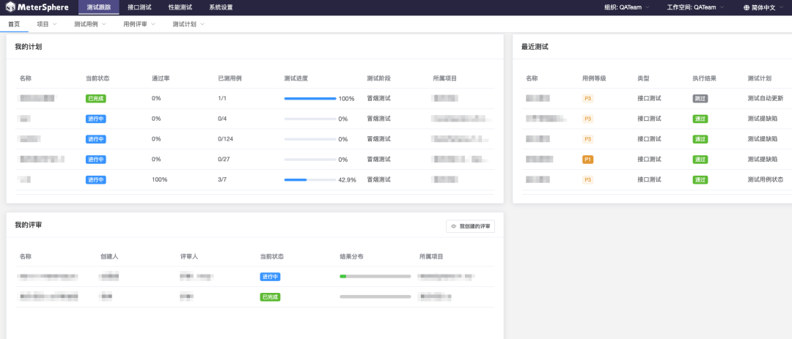
### 建立代码分支管理规范
开发同学在编码过程中，经常会因为环境不够用、或者代码被覆盖等问题而烦恼。对于敏捷开发模式的团队，需求多、分支多是常态，怎样让开发测试有序地协同工作，规范分支管理流程是必要的。
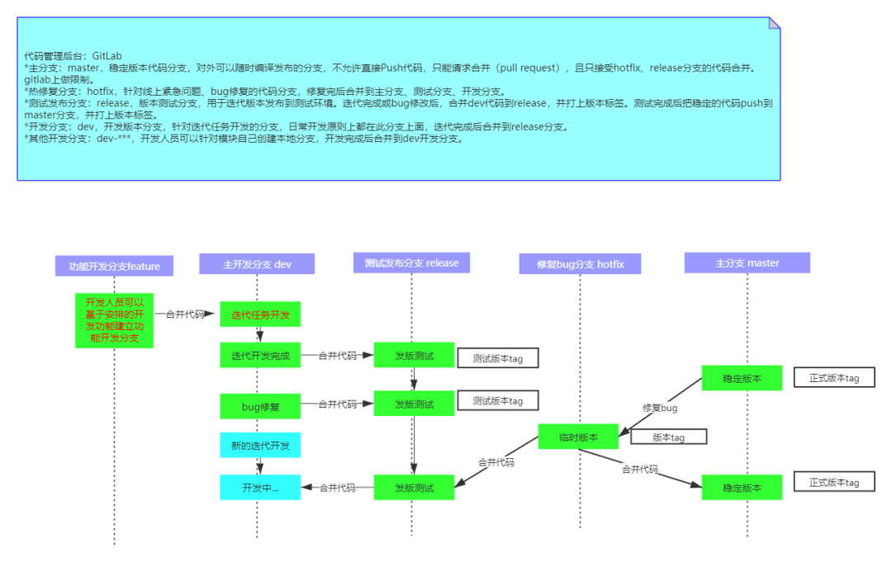
### Sonar代码质量检测
Sonar是可视化的代码质量检查平台，支持的语言包括PHP、Java、Python、C#等，包含项目、问题、代码规则、质量配置、质量阀和配置五个模块。
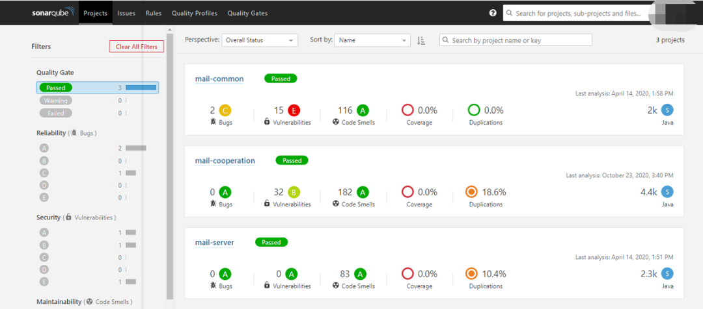

以下是项目执行情况的概览，每个项目名称代表一个项目，项目检查的结果简单呈现在项目首页概览中，包含Bug数量、漏洞数量、不规范、单元覆盖率、代码重复度等维度。

我们通常会将Sonar发现的问题以Bug的方式提交给开发团队，要求致命、严重级别的Bug必需修改，并跟踪解决进度。在实际的运用过程中，也会根据项目实际情况调整质量阀门，以避免误报等情况出现。
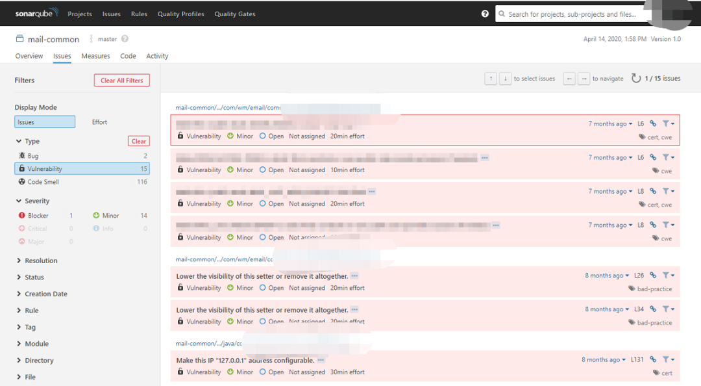
### 持续测试：基于Metersphere平台实现接口自动化
接口测试提前接入，通过YApi管理接口文档，开发同学在需求评审后即进入技术设计与接口设计阶段，测试同学则根据接口文档进行Mock测试。
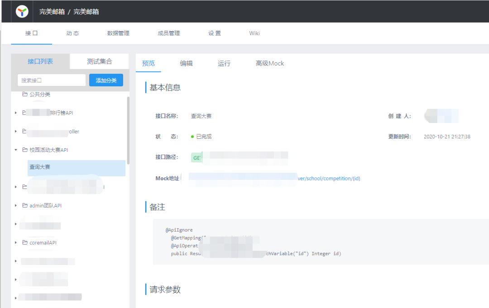
基于MeterSphere开源持续测试平台，我们实现了测试工作的自动化。提测后自动化测试接口通过率，提前发现问题，有效提升测试效率。
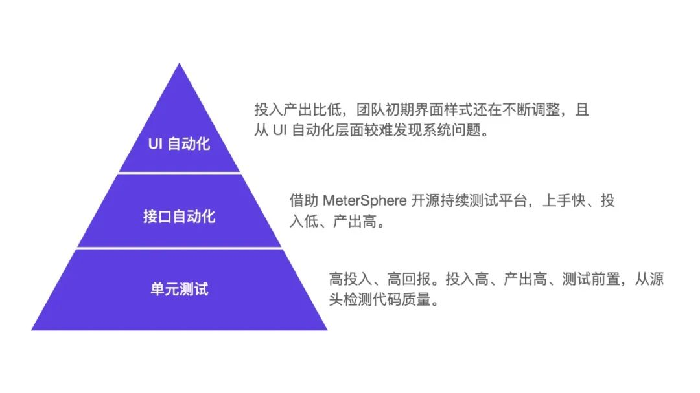

MeterSphere持续测试平台采用开源可扩展框架，实现了测试跟踪、接口自动化、性能自动化的全覆盖，特别适合创业团队。从测试团队的角度看，MeterSphere平台既能切实地提升产品质量和测试效率，又解决了自研自动化框架人力不足的痛点。 

同时，MeterSphere支持与Jenkins的集成，每次有新的代码提交后，平台自动触发环境部署和接口自动化Job执行，并发送邮件通知，实现了主流程功能的回归测试，提升测试效率。
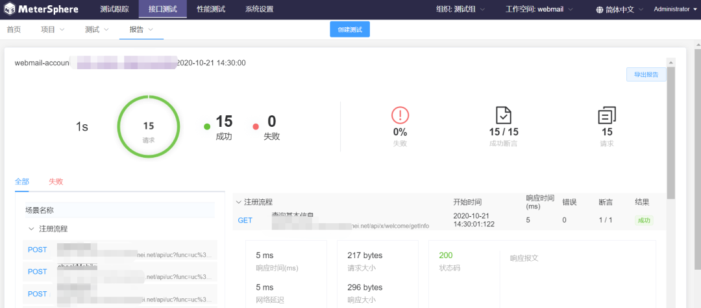

## 测试右移如何落地？
### 灰度发布
使用灰度发布方式，新版本上线后先更新部分服务器，测试人员先进行验收通过后，再全量发布。这样一来，尽可能地避免了测试和正式环境配置不一致、数据库更新不及时等不确定因素引起的问题。
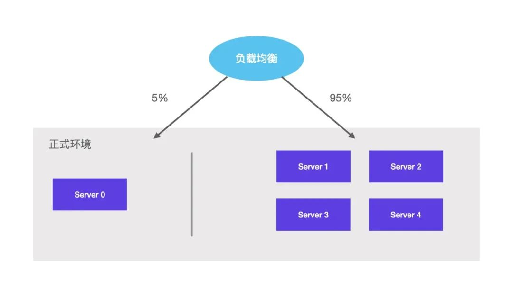
### 服务监控
对于测试人员来说，服务上线后仍然需要关注服务的运行情况，以便在出现系统问题时能够快速做出反应，将影响降至最低。在这一环节，我们引入了Zabbix系统检测工具，实时监控系统硬件资源使用情况。同时设置报警通知，将异常情况第一时间通知给相关负责人。

Zabbix通过调用ODBC来获取数据库的数据，以及数据库状态等信息；通过IPMI Agent 监控硬件设备，例如Dell或者HP服务器的主板温度、CPU电压、盖子是不是被打开等；通过JMX Agent监控Java JVM，例如Tomcat；通过追踪模拟鼠标在Web网站上的点击操作，来检查Web网站的功能和响应时间。
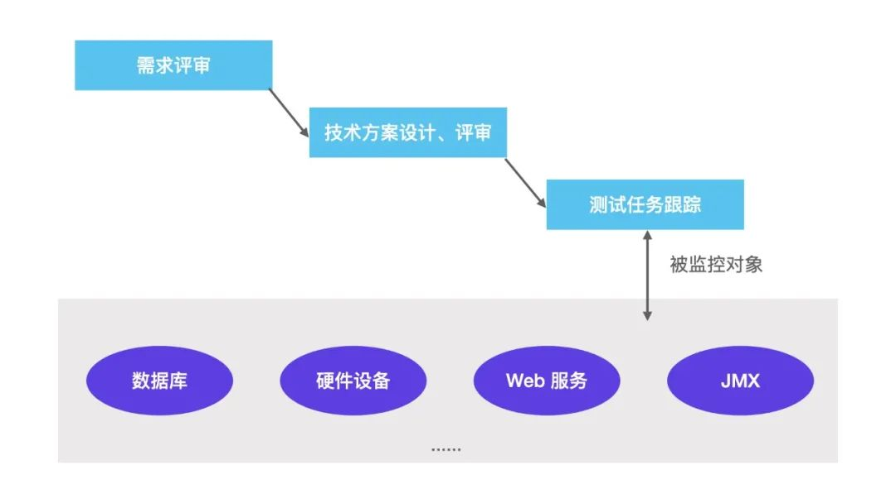
### 用户反馈
“用户就是上帝”。任何产品的成功与否，都取决于用户。为此，我们建立了完善的用户反馈处理机制：对于用户反馈的问题，第一时间进行修复上线；针对用户提出的建议，结合实际情况对产品进行打磨和优化。

## 专项测试
#### 安全
保证邮箱数据安全性，是产品研发的一个重要环节。数据面临的安全威胁来自于多个方面，如何有效地保护数据的保密性、完整性、可用性和真实性，邮箱团队一直在不断地升级和优化。这部分的工作主要涉及系统安全加固、数据库加密、全链路传输加密、反作弊策略、反黑策略、反入侵策略、安全管理、反商业泄密等。
#### 性能
##### 接口层面
根据用户量预期，制定系统性能要求，再构造数据借助JMeter对系统进行持续压测，测试系统的极限处理能力，以及最佳处理能力。

同时，将部分主要流程性脚本通过MeterSphere开源持续测试平台建立自动化性能测试任务，每次版本升级后自动执行稳定性测试，大大提升了测试效率，也能在早期发现问题并解决问题，进一步提升产品质量。
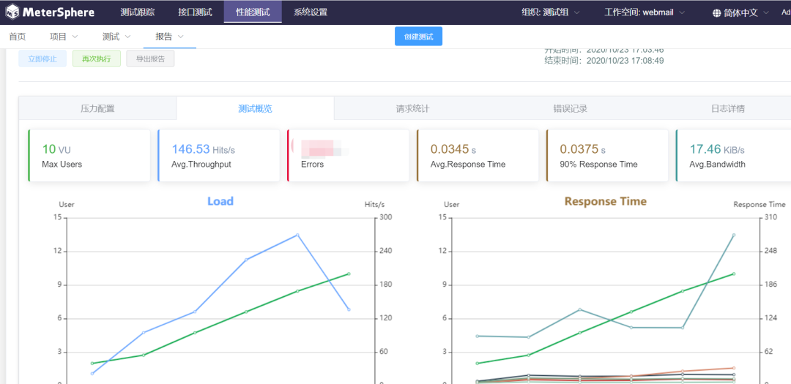
##### Web页面
从资源加载时间、页面渲染、接口调用逻辑多方面分析Web页面性能。这这方面，通过 www.webpagetest.org 工具，测试首页资源加载、接口响应时长、页面渲染时间等数据记录页面性能。

从不限于以下不同维度的测试数据分析页面性能，并给出合理的改进措施：
- 多次测试取平均值
- 是否有缓存数据
- SSL握手时间
- 接口响应时间
- 接口调用合理性（并行、串行、重复请求）
- 资源优化
- 弱网
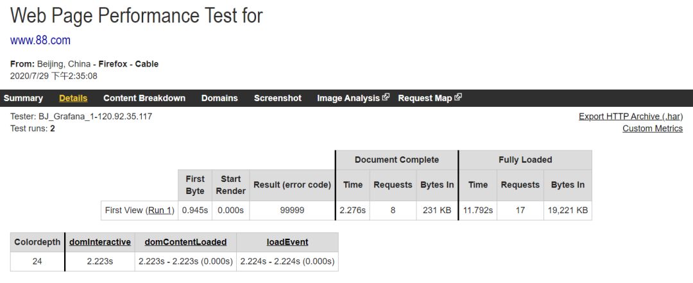
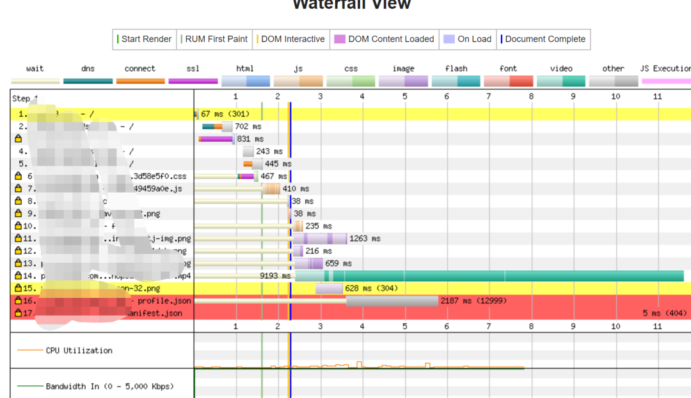

## MeterSphere使用体会
对于创业者来说，时间少任务重是常态，反复地手工测试让人精疲力竭，要着手去写自动化代码，又需要投入大量的人力，让人应接不暇。我们团队引入MeterSphere工具之后产生了非常好的效果。

现在来总结一下MeterSphere持续测试平台的优点：
- 它规范了测试用例，测试计划可追溯，任务执行情况一目了然，团队合作变得高效；
- 接口测试上手成本低，将接口用例与部署平台结合，每次有新代码部署后，都自动执行自动化脚本，在保证质量的同时提升了效率；
- 性能测试提供图形化可视界面，且保留历史数据，方便追溯，性能结果一目了然；
- 开源！开源！开源！

MeterSphere项目还在持续不断优化和改进，如果能增加以下些功能就更好啦：
- 增加UI自动化模块；
- 增加性能测试数据的对比功能，方便稳定性测试数据的对比；
- 场景支持在接口中调用，方便用例的组合测试，减少写重复接口。

对于测试团队来说，保证产品质量，测试左移和测试右移都是非常重要的突破方向。我们也将在此基础上不断地完善和优化，全方位提升研发测试效能。
