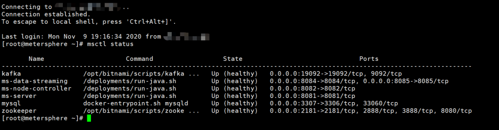
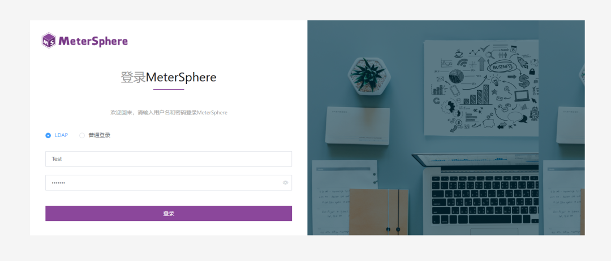
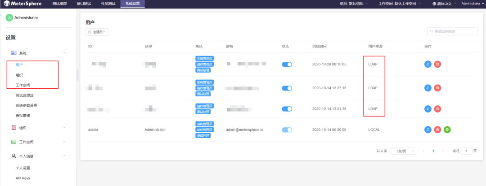
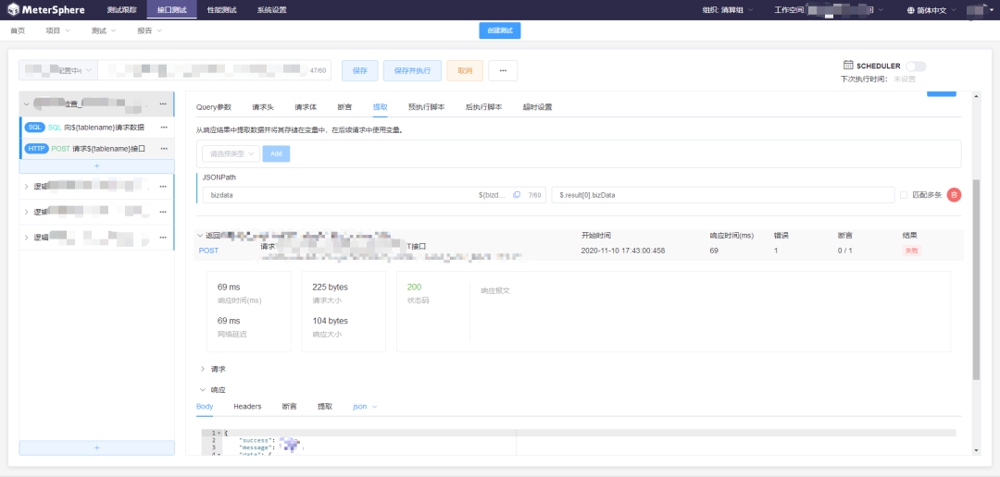
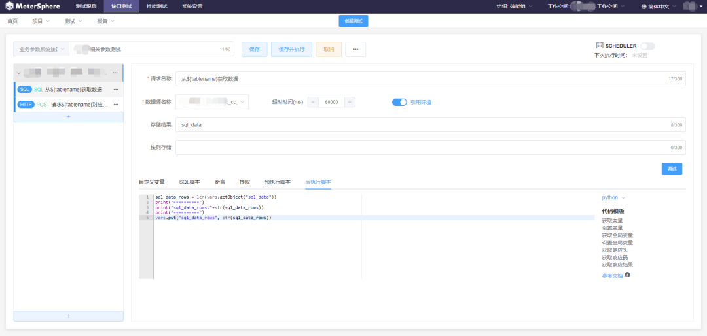
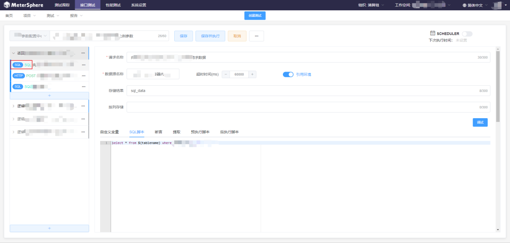

> 注：本文作者为郑州易盛信息技术有限公司测试中心效能组狄雨晨。

郑州易盛信息技术有限公司（以下简称为易盛信息）是郑州商品交易所的全资技术子公司。其主要的发展战略为“两个面向”，即面向郑州商品交易所和面向全球金融期货市场。

目前，易盛信息一个普通交易日6小时处理的交易额远远超过了天猫双十一全天的交易额，核心系统处理时延精确至纳秒级，部分系统数据精度要到小数点后三十多位。系统的稳定性至关重要，如果交易系统发生故障导致中断会影响世界范围内相关产品定价。总而言之一句话，我们要千方百计地确保系统“不能出事”。

## 系统测试阶段面临的问题

在系统测试阶段，针对接口测试我们主要面临两类问题。

- 第一类是私有协议问题，期货交易采用基于TCP和UDP的期货报文交换协议，市面上没有针对性的测试工具。如果需要自动化，就需要编写C++代码来进行测试，这无疑对测试人员提出了很高的要求；

- 第二类问题则是我们的办理申报类业务，对HTTP接口测试的需求具有鲜明的特点。此类采用非私有协议的系统，大部分采用Java开发，通过HTTP接口进行交互。

而在这一环节中，我们需要和数据库进行比较。业务中有大量的表单填写和各种计算，需要对接口处理后的数据进行一定规则的校验。传统接口测试工具均无法支持数据库相关操作。

在这方面，我们也进行了一些尝试，今年疫情期间，我们开发了一版以HttpRunner为核心引擎的接口测试工具原型，结合自有Python操作Oracle封装的库，实现了和数据库结果的比较，但由于脚本编写内容多、UI不够便捷、文档不够清晰等一系列原因最终搁置了这一自研工具；

接口测试的另一个特点是具有复杂且长的流程性接口。对于很多审批、申报类业务，需要按照顺序和逻辑条件请求十几个接口，中间由不同的用户登录并操作，过程之繁琐远超微服务的无状态调用，对于很多长流程组成的场景，无论是手工测试还是编写自动化测试脚本都很复杂。

## MeterSphere给我们带来的帮助

任何技术都有着自己的生命周期，从诞生到衰落也符合事物发展的客观规律。传统金融行业的互联网转型是漫长的，为了求稳，对于业内的众多新兴技术，并不会立刻采纳，但我们仍然持续关注相关理论、技术、工具及平台，争取成为早期技术红利的受益者。

2020年8月，在朱少民老师的公众号“软件质量报道”上第一次了解到了MeterSphere这个开源项目，并在9月的QECon大会上第一次见面。真的是“相见恨晚”呀！

经过一段时间的使用，我们逐步将MeterSphere开源持续测试平台引入到我们的业务场景测试之中，也收获了一些使用心得和体会。在这里和大家分享一下。

### 平台即服务

在使用MeterSphere之前，我们主要用Postman进行接口测试。与工具型的Postman相比，MeterSphere是一个持续测试的平台。MeterSphere的主要优势包含以下几点：

- 搭建方便

MeterSphere基于Docker提供服务，并提供完备的私有化部署能力，支持一键安装和升级，整个过程非常流畅，体验良好。容器化的部署方式避免了测试人员安装工具的成本，搭建好平台后即可直接使用。

▲图1 MeterSphere支持一键安装和升级

- 管理规范

MeterSphere能够实现组织、工作空间、项目、测试、场景等多级管理，角色权限分离，井井有条。它还可以与内部LDAP对接，使用起来非常方便。

▲图2 MeterSphere可与LDAP进行对接

▲图3 MeterSphere支持用户、组织和工作空间管理

### 与MeterSphere的“一见钟情”

初次试用MeterSphere，就发现了它非同一般的易用性，提供接口测试解决方案上也恰好直击我们的痛点。我们选择了具体的业务组进行了试用推广，真的很香，主要的原因来自以下几个方面：

- 调试功能

测试过程中常常需要调试，MeterSphere贴心地提供了调试按钮，可以立刻看到当前接口的执行情况，方便使用者及时调整，这方面体验和Postman完全一样。

▲图4 MeterSphere接口测试提供了与Postman类似的体验

- 支持Python的前后置脚本

Postman支持使用JavaScript编写脚本，但我的同事们更熟悉Python，而MeterSphere支持Python的前后置脚本就给接口测试增加了更多的灵活性。在这方面，MeterSphere更具优势。

▲图5 MeterSphere支持Python的前后置脚本

- 支持SQL语句

这应该是支持我的团队开始使用MeterSphere最关键的原因了。支持SQL就满足了我们在接口测试中50%的需求，结合自定义变量和数据库源配置及调试功能，可以非常便捷地编写用例。即使测试人员不会写代码只会写SQL，也可以通过简单的培训快速上手，相较于原有需要测试人员手动编写Python测试代码要便捷许多。

▲ 图6 MeterSphere在接口测试中支持SQL语句

▲图7 SQL请求返回结果

### 支持测试跟踪和性能测试

除了我们主要关注的接口测试，MeterSphere也支持测试跟踪和性能测试。官方有意和我们目前正在使用的禅道平台打通，进行缺陷管理，这样工具就可以联动起来。对于性能测试的功能，我们也正在探索中，将接口测试用例一键转为性能测试用例，并辅以可视化施压曲线，非常直观，点个赞！

### 与技术栈契合

基于Vue.js和SpringBoot的前后端分离程序是当前主流的技术实现方式，MeterSphere没有藏着掖着，核心功能代码全部开源，使用Swagger作为接口文档清晰易读，大大降低了二次开发和定制化的门槛。

### 支持持续集成

MeterSphere提供了Jenkins插件用来打通持续集成，能够和内部的CI/CD流水线配合工作，提高自动化率。同时，基于前后端分离的设计，MeterSphere还能够便捷地通过自定义脚本触发接口批量执行。

## 使用情况

我们目前对MeterSphere的使用方法是在诸多测试团队中选择了一个典型团队进行试点推广，文中截图均来源于此团队的测试实践。具体项目由专职测试团队进行系统测试，充分设计场景和用例，开始逐渐将原有零散的用例向MeterSphere平台迁移，充分利用其管理能力和复用能力。当用例积累到一定规模后，可以便捷地展开冒烟和回归测试。

## 感受与评价

MeterSphere开源持续测试平台是一款经过细心雕琢的产品，易用性相较于之前接触过的开源工具有极大的提升。

社区的活跃度是评价一个开源项目的关键指标。没有社区哪来的生命力？MeterSphere团队的同学非常热情，积极协助我们解决使用中的各种问题，同时我们将发现的问题和意见建议提交Issue，官方再有选择地采纳，这就形成了一个良性的互补和循环，互相促进各自的产品质量持续提升，共同受益。

## 期待与建议

截至目前，MeterSphere每一个新版本都能解决多个切实关心的实际问题，并且积极采纳用户合理的意见和建议，永葆活力。希望MeterSphere开源项目不忘初心，在开源社区持续不断地茁壮成长，成为测试工程师们不可或缺的工具。
