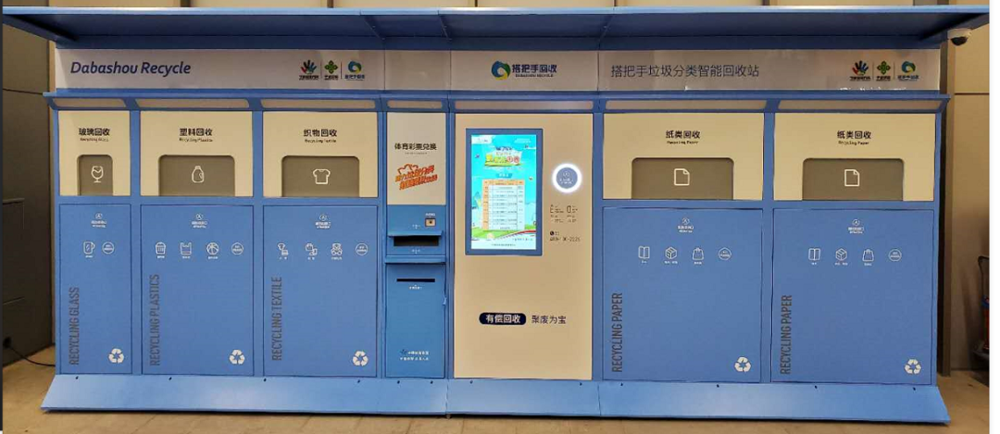
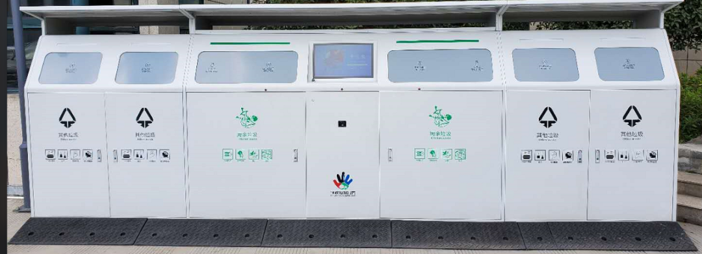
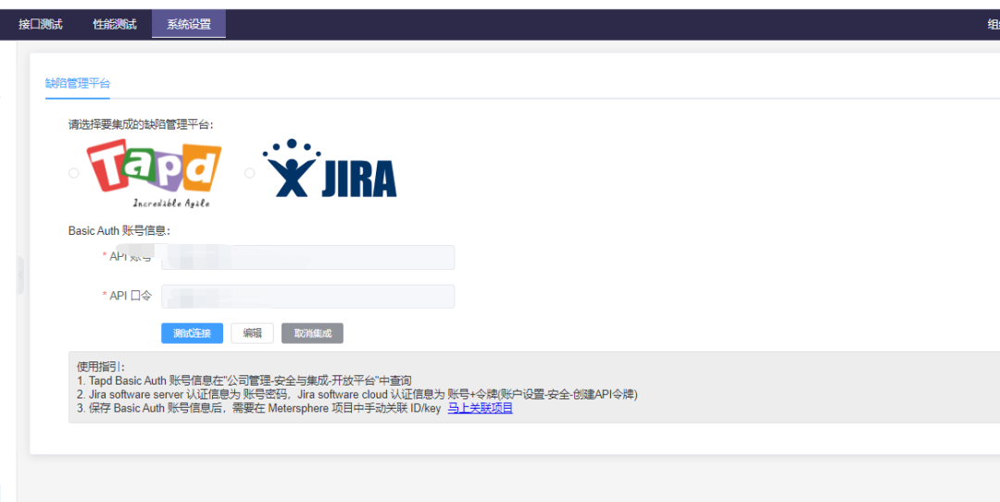
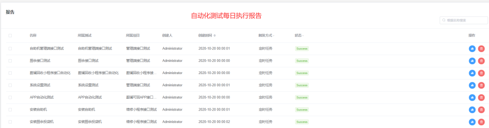

> 注：本文作者为宁波蔚澜环保科技有限公司测试经理张浩。

宁波蔚澜环保科技有限公司（以下简称为蔚澜环保）是一家致力于“碧海蓝天”的环保科技公司，主要的产品包括智能分类垃圾箱，以及小程序、安卓端主机、服务端等提供垃圾智能分类功能的软件产品。

蔚澜环保目前的软件团队有19人，包括软件总监1人，产品经理兼项目经理2人，UI设计1人，开发12人，测试3人。其中，测试经理兼任自动化测试，功能测试人员2人。

作为一家成立于2019年的公司，软件团队组建时间较短，但是产品已经更新了3代（包括硬件）。随着产品功能的增多，新功能的加入难以有效评估影响范围，直接导致回归测试的时间越来越长。如果仍然采取之前的功能测试模式，很难满足公司业务发展的需要，引入自动化测试势在必行。

## 为什么采纳 MeterSphere？
在引入自动化测试框架时，我们舍弃了UI自动化测试，直接选择了接口测试。这主要考虑到我们的产品是嵌入式开发，UI层面的元素比较少，UI自动化测试无法满足我们的需求。

在选择接口自动化测试框架时，我们评估了市面上流行的几款自动化测试框架，包括RobotFramework+HTTP接口自动化测试、Python+Request、JMeter、HttpRunner等。经过比较，我们最终选择了HttpRunner。

相比其他的自动化测试框架，选择HttpRunner的理由如下：

1. 小巧灵活
2. 开源
3. 学习成本相对较低

基于这些原因，我们在内部开始使用HttpRunner作为自动化测试平台。经过一段时间的使用后，我们发现该开源框架存在诸多问题，例如脚本维护成本较高、查找和编辑不方便、对格式要求严格、可视化程度低、无法使用注释功能等。

团队内部对这一款开源框架从喜欢到排斥，感觉“不好用”，用户体验非常差。正在我们为自动化框架苦恼时，一个测试朋友推荐了MeterSphere开源持续测试平台。我自己下载安装体验一周后，向团队内部安利，请他们到我的本机体验MeterSphere的自动化脚本编写和运行。

正所谓“吃一堑，长一智”，我们这次充分调研了自动化测试平台的后续维护和用户体验。团队内部经过一段时间的充分评估后，最终选择了MeterSphere作为自动化测试平台，选择理由如下：

1. 学习成本低。团队内部之前使用Postman进行接口测试，MeterSphere接口编写方式基本与Postman接口测试无缝衔接，可以直接在MeterSphere上进行接口测试，并实现自动化。
2. 开源。对于小型公司而言，没有预算去购买商业化的自动化测试工具，开源是必选。其次，MeterSphere还打通了TAPD和Jira直接的关联。接口自动化测试发现的缺陷，可以直接同步到TAPD和Jira中，正好我司使用的是TAPD，这样又省去了手动创建缺陷的过程。
    

3. 响应及时，更新迭代快。MeterSphere v1.0版本时，还不支持函数和单个脚本调试，导致测试数据要手动输入。但其后续版本中，可以引用函数并调试，极大地降低了维护成本，用户体验越来越好。
    

4. 易用。从上面的截图可以看出，MeterSphere对于脚本和测试报告的导入导出、全局变量配置、函数的调用、执行定时任务等需求都能够满足。这些功能点在其他自动化测试平台上，要么没有，要么有而不好用。对于一款经常使用的工具而言，易用性是非常重要的，否则在公司内部极难推广使用。

## MeterSphere的使用情况
前面把选择MeterSphere开源持续测试平台的理由说了一遍，实际的使用效果怎么样呢？

我司现在使用在MeterSphere中编写自动化脚本330多条，覆盖基本的核心业务场景，极大地减轻了我们在回归测试时的工作压力和回归测试时长。

在实现核心业务场景覆盖的基础上，我们现在还借助MeterSphere实现测试左移。开发人员完成接口开发后，即可转交接口测试，将接口测试脚本加入到自动化测试体系中。

我们现在自动化的执行还是以定时执行任务为主，还没有实现MeterSphere和Jenkins的衔接。未来，我们希望将MeterSphere部署到Jenkins流水线中，开发人员提交构建后，即可实现自动化测试。

## MeterSphere带来的收益
虽然我们只是采用了MeterSphere接口测试部分的功能，但是该平台给蔚澜环保带来的收益已经初步展现出来了。

- 最明显和最直接的收益是——我们通过MeterSphere发现了5个严重bug，使其成为我们捉虫子的好帮手；
- 其次，我们两周一个迭代，测试部门之前功能回归测试需要3人天，现在可以缩短到1人天，极大地降低了回归测试的成本，测试部门有更多的时间进行探索性的测试；
- 最后，降低了风险，增强了信心。之前的回归测试由于时间不足，总是承担很大的风险。使用自动化测试之后，有了数据支撑，悬着的心可以缓一缓了。

## 感受与评价
现在来谈谈对MeterSphere开源项目的整体感觉吧。个人感觉MeterSphere开源持续测试平台是个好产品，不仅满足我司现阶段对自动化测试平台的所有要求，而且很好用。总结起来优点主要包含以下几方面：

- 安装简单方便。在Linux系统上几乎是一键安装，升级也是如此。这里要点个赞，好多产品都需要自己配置一大堆问题，产生很多配置问题。
- 脚本易于维护和推广，学习成本低。MeterSphere支持在Web页面直接编辑调试脚本，这样很容易在团队内部共享自动化测试的成果。
- 社区互动氛围良好。在这里要表扬一下MeterSphere项目的开发团队，使用中有问题在微信交流群里提问，MeterSphere团队小伙伴能够及时地回复，并且有效地解决问题，希望MeterSphere的开发团队能够保持初心不改，产品越做越好。

## 期待与建议
最后，作为MeterSphere项目的深度用户和粉丝，对于这款产品既热爱，也期待她能够越来越好。因此，我在这里将建议转为了期待，和大家梳理一下我所期待的MeterSphere项目在未来能够增加的新特性：

1. 期待MeterSphere以后可以在初次进入产品页面时提供产品引导，帮助用户快速地熟悉产品功能分布。更新版本后，核心的特性也要提供指引，毕竟大部分人都不会看发布日志的；
2. 期待在场景中可以一次删除多个脚本，因为我会复制上个场景，在其基础上编辑新场景的脚本，但是可能会删除场景下的多个脚本。希望在这里可以按住Shift或Ctrl键，支持选中多个脚本进行删除、禁用等操作；
3. 在脚本执行结果中，希望能够标记脚本失败的原因。是发现了Bug？还是脚本不稳定等其他问题所导致的？这样我们可以统计脚本失败的数据，并分析改进；
4. 希望可以在首页对测试报告进行可视化，类似仪表盘那样进行展示。运行了多少条脚本？多少条通过？多少条失败？要尽量醒目一点。个人感觉测试日历没有多大作用，可以放在次要的位置；
5. 希望在用例界面和接口测试界面增加一个全局搜索功能，要支持全局搜索用例、场景和脚本；
6. 期待MeterSphere可以打通和TAPD或其他研发管理平台的对接，支持将TAPD中的用例导入到MeterSphere平台中；
7. 社区运营层面，MeterSphere团队可以创建一个超级粉丝群，一群对测试热爱的人，有时间可以开一个远程头脑风暴会议，大家一起吐槽，对平台发展建言献策。
