# 更新日志

## 1 模板中心

### 1.1 工作台新增模板中心和使用模板新建的快速入口
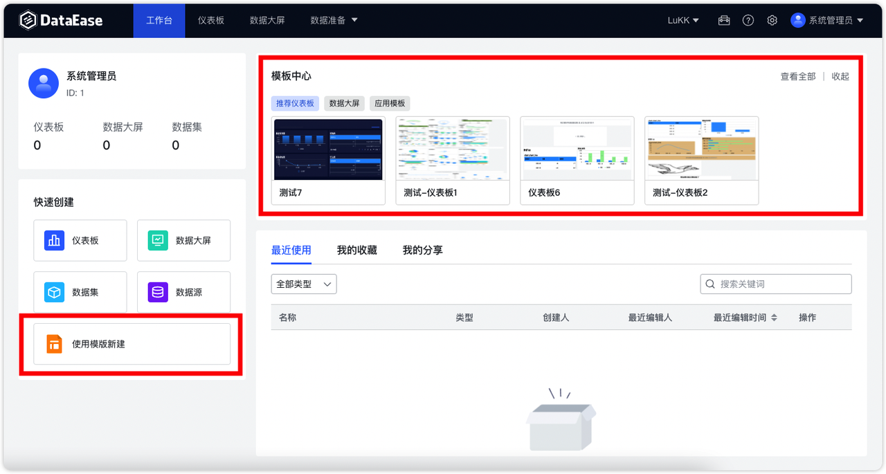{ width="900px" }

### 1.2 新增【模板管理】

!!! Abstract ""
    可用来自行管理自己 DataEase 内上传的模板，并通过分类来做标记。
    请注意：v2 的模版管理不再区分用户模板与系统模板，均是全局可用的。
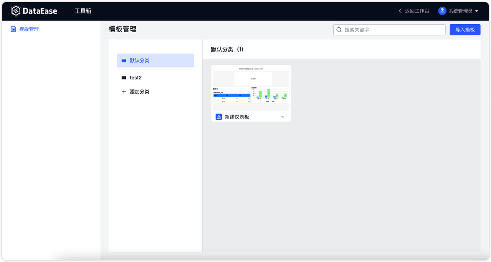{ width="900px" }

### 1.3 仪表板与数据大屏均增加使用模板新建的入口
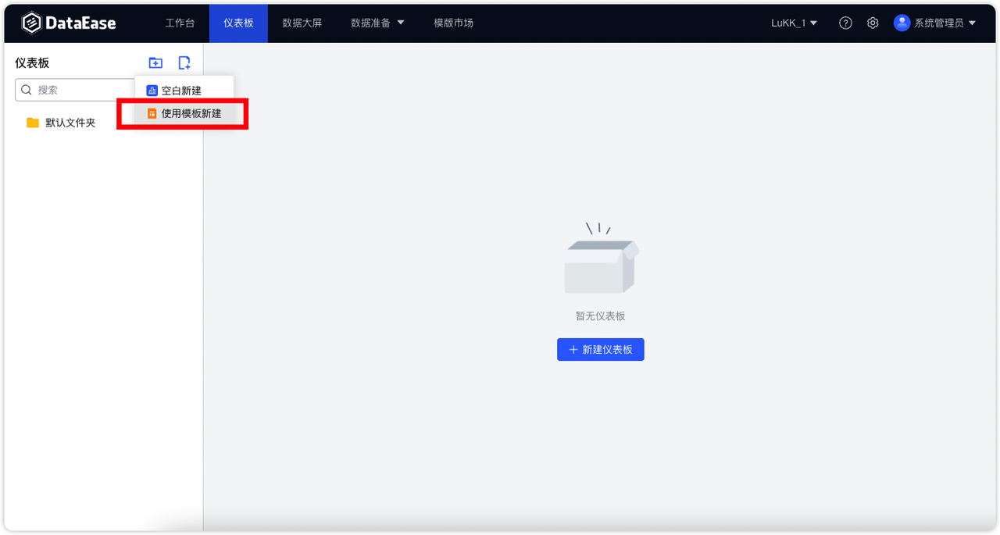{ width="900px" }

### 1.4 支持仪表板或数据大屏导出为模板
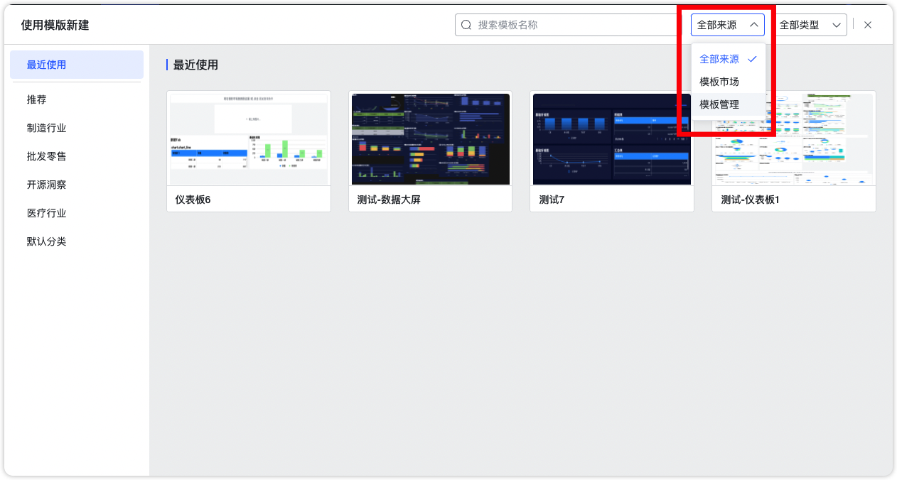{ width="900px" }

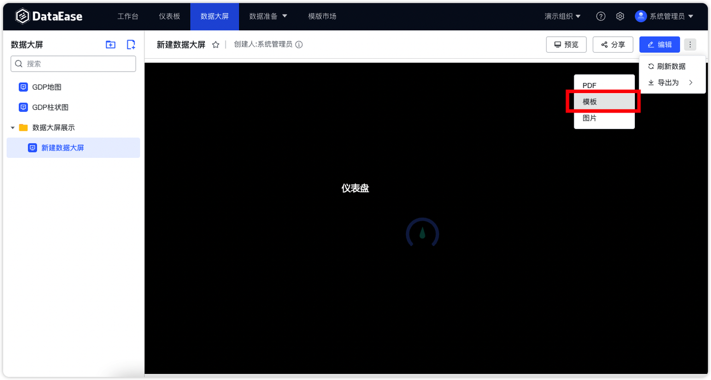{ width="900px" }

## 2 数据准备
### 2.1 支持数据集的复制
!!! Abstract ""
    可快速基于已有数据集创建新数据集，复制完成后自动进入新复制数据集的编辑界面。
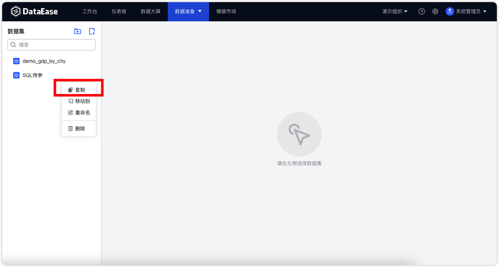{ width="900px" }

## 3 系统设置
!!! Abstract ""
    新增系统设置模块。
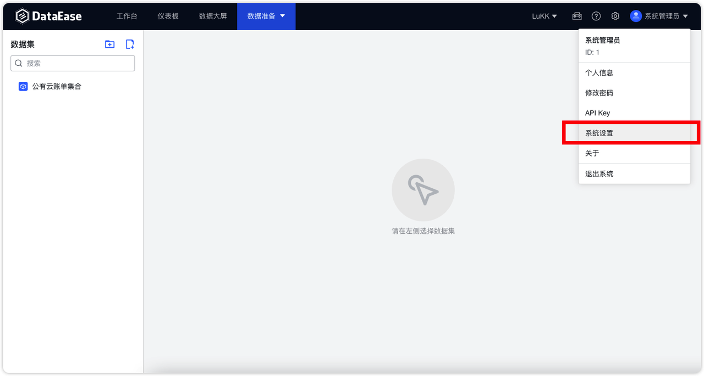{ width="900px" }
### 3.1  参数设置
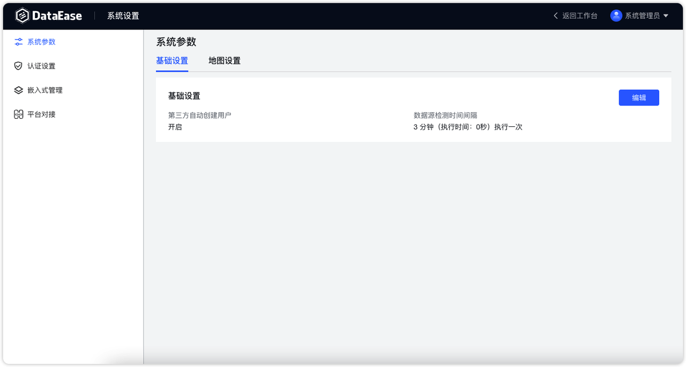{ width="900px" }
### 3.2 嵌入式管理(XPack)
!!! Abstract ""
    用于做嵌入式集成，每个 DataEase 默认最多可创建 5 个嵌入式应用。创建完嵌入式应用后，可以获取到该应用对应的 APP ID 和 APP Secret（嵌入式对接时需要用到）。
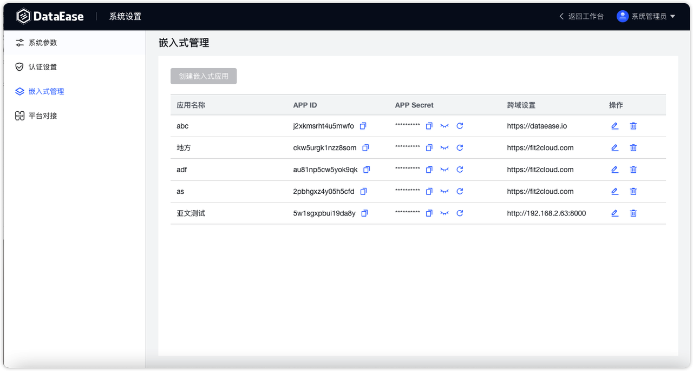{ width="900px" }
### 3.3 飞书对接(XPack)
!!! Abstract ""
    新增飞书对接，可通过扫码方式登录 DataEase。
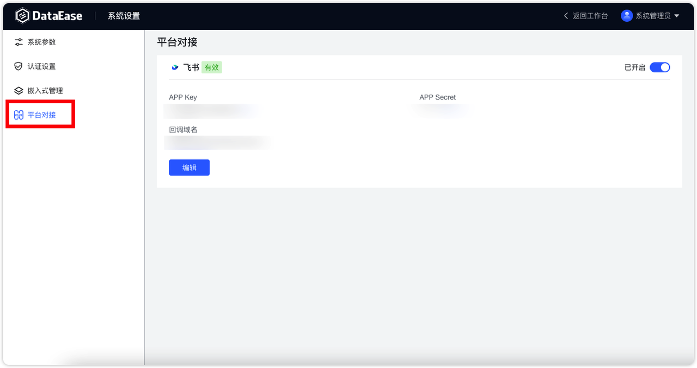{ width="900px" }
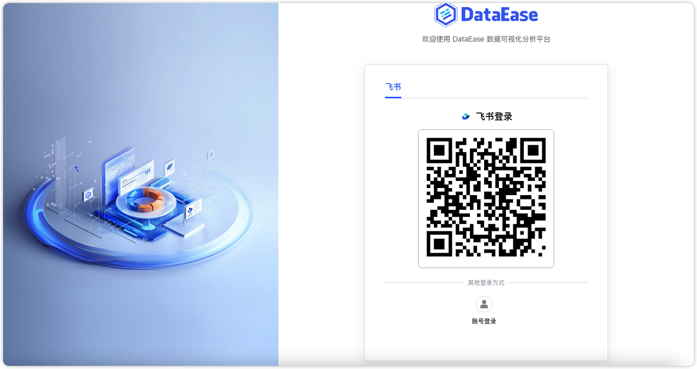{ width="900px" }
## 4 其他
### 4.1 API Key 管理(XPack)
!!! Abstract ""
    新增 API Key 配置与管理页面。
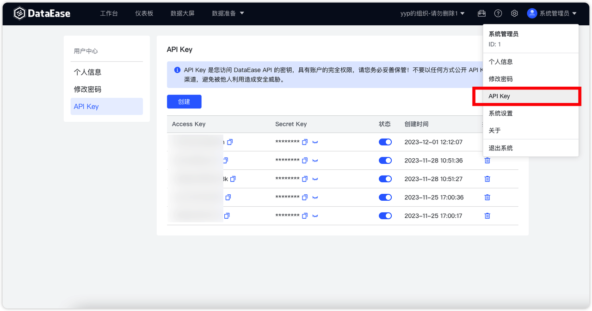{ width="900px" }