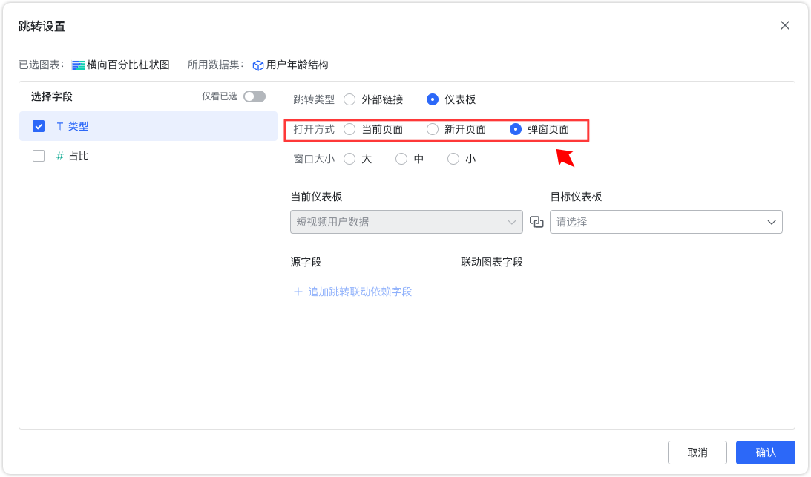
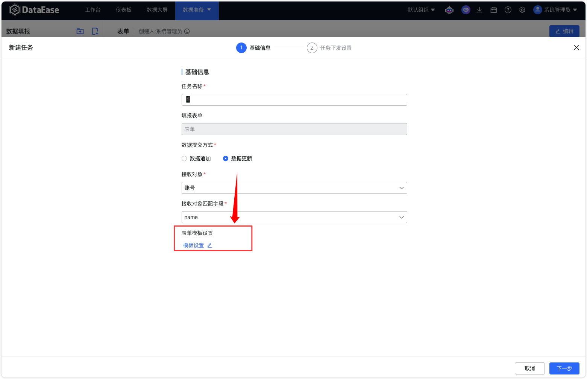

# 更新日志

## 1  仪表板与数据大屏

### 1.1 同环比增加具体数值选项

{ width="900px" }

### 1.2 仪表板和数据大屏支持浏览器整体刷新
!!! Abstract ""
    仪表板和数据大屏会在每次刷新时重载整个浏览器页面内容。  
    **注意：整体刷新仅公共链接和新 Tab 预览生效，避免在设计时频繁刷新影响编辑体验。**

{ width="900px" }
{ width="900px" }

### 1.3 Tab 组件支持整个 Tab 页的内容复制

{ width="900px" }

### 1.4 新增双线组合图

{ width="900px" }

### 1.5 分组柱线组合图支持子类别排序
!!! Abstract ""
    分组柱线组合图可基于类别进行排序，还可以在类别内设置子类型的顺序。

{ width="900px" }

### 1.6 跳转设置中打开方式支持弹窗页面
!!! Abstract ""
    外部链接和仪表板跳转，均支持弹窗页面方式打开。此外，还支持设置弹窗的窗口大小。

{ width="900px" }

## 2 数据准备

### 2.1 数据填报在下发任务时，支持表单模板设置（XPack）
!!! Abstract ""
    数据提交方式为【数据更新】时，会出现【表单模板设置】选项，可以设置表单中的表单项是否允许被修改。

{ width="900px" }
{ width="900px" }

## 3 组织管理这些（XPack）
### 3.1 定时报告增加水印设置
!!! Abstract ""
    当定时报告所指定的仪表板或数据大屏开启水印，定时报告中支持水印设置。
{ width="900px" }

## 4 系统设置
### 4.1 新增 OAuth2 认证支持（XPack）

{ width="900px" }

