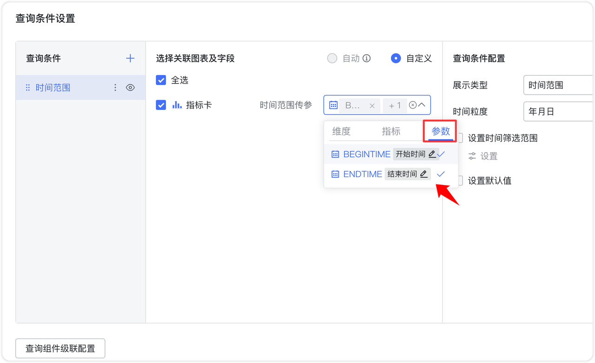
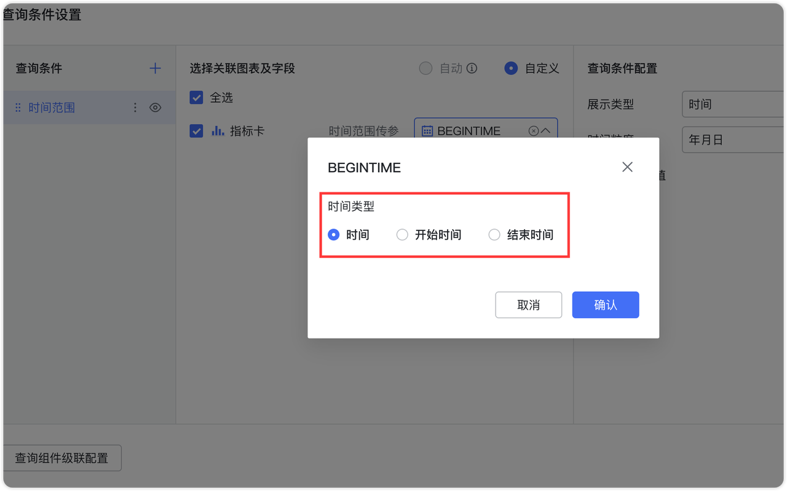
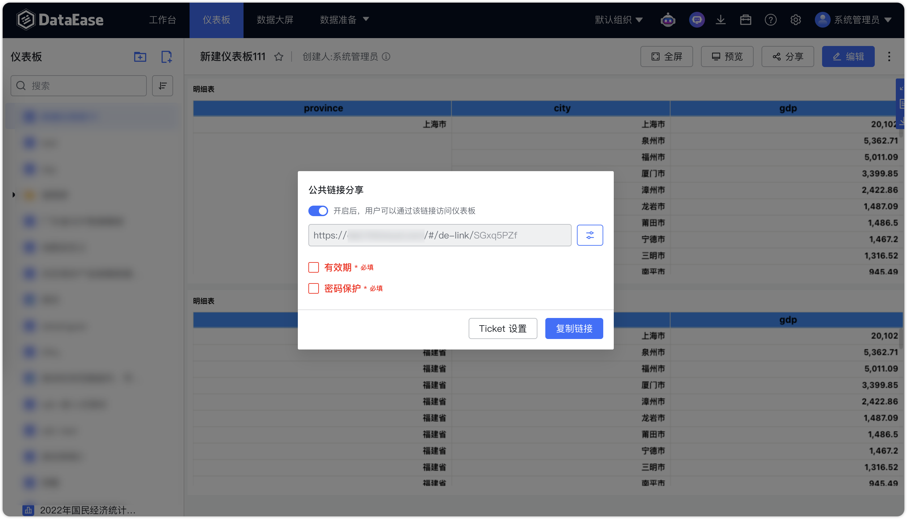

# 更新日志

## 1  仪表板与数据大屏

### 1.1 更新地图文件
!!! Abstract ""
    新增了新加坡和深圳大鹏新区等地区的详细地图支持。
{ width="900px" }

{ width="900px" }

### 1.2 表格条件样式支持动态值设定

{ width="900px" }

{ width="900px" }

### 1.3 表格自适应模式铺满组件
!!! Abstract ""
    明细表和汇总表列宽的【自适应】选项，会根据内容宽度比例自动调整组件容器宽度，实现组件的全宽铺满显示。

{ width="900px" }

### 1.4 查询组件支持自定义背景图片

{ width="900px" }

### 1.5 查询组件支持在年月日时间参数下选择时间粒度为年、年月或年月日

{ width="900px" }

### 1.6 时间范围组件支持分别绑定开始时间和结束时间参数
!!! Abstract ""
    当选择时间类型参数时，系统默认设置为时间类型。点击【时间】后的编辑按钮，可以进一步选择该参数为开始时间或结束时间。

{ width="900px" }

{ width="900px" }

### 1.7 查询组件支持配置外部显示或隐藏精确匹配和模糊匹配

{ width="900px" }

### 1.8 查询组件支持数值区间
!!! Abstract ""
    在设置查询条件时，支持选择指标字段选择【数值区间】作为过滤组件，便于根据特定数值范围筛选数据。
    
    - 应用场景：适用于需要在特定数值范围内进行数据筛选的场景，例如筛选预算、实际金额等数值类型字段。

{ width="900px" }

{ width="900px" }

### 1.9 查询组件支持配置清空和重置按钮的颜色

{ width="900px" }

### 1.10 查询组件支持自定义提示词内容设置
!!! Abstract ""
    可以针对每个查询条件设置不同的提示词，同时支持文字颜色和大小的自定义设置。

{ width="900px" }

### 1.11 图表过滤条件的日期字段新增“为空/不为空”筛选选项

{ width="900px" }

### 1.12 柱状图均支持圆角设置（不包括瀑布图、K 线图）

{ width="900px" }

### 1.13 堆叠柱状图的总计标签与主标签支持单独控制

{ width="900px" }

{ width="900px" }

### 1.14 符号地图现支持自定义气泡大小范围
!!! Abstract ""

    - 【数据】中拖入字段到【气泡大小】栏后，【样式】中的【大小】会自动禁用，同时启用【大小区间】设置。通过调整【大小区间】的最小值和最大值，可灵活控制气泡的尺寸范围。
    - 【气泡大小】中未拖入字段时，【样式】中的【大小】滑块将保持启用，允许手动统一调整气泡大小。

{ width="900px" }

### 1.15 Tab 组件操作优化
!!! Abstract ""
    支持从上部拖动组件移出 Tab 组件。当图表从 Tab 组件中移出后，图表将自动放置在鼠标当前位置。

{ width="900px" }

### 1.16 地图和气泡地图支持区域填充功能

{ width="900px" }

### 1.17 新增图片组组件
!!! Abstract ""
    支持简单的图片上传和轮播功能。
{ width="900px" }

!!! Abstract ""
    图片组还支持与指定数据集关联设置条件样式，根据数据集的变化展示不同的图片。

{ width="900px" }
{ width="900px" }

### 1.18 明细表和汇总表支持行列冻结

{ width="900px" }

{ width="900px" }

### 1.19 明细表和汇总表支持隐藏字段
!!! Abstract ""
    允许用户将数据表中的某些字段设置为“隐藏”状态，这样这些列就不会被显示出来。

    - 适用于当用户需要使用特定字段进行排序，但又不希望这些字段在表中显示的情况。
{ width="900px" }

### 1.20 地图支持自定义图例区间
!!! Abstract ""
    地图图例提供【自动】和【自定义】两种模式，用户通过【自定义】选择【等分区间】或【自定义区间】，可以更加灵活控制各区域的颜色填充，从而更清晰地反映不同区间的数据分布情况。

    - 等分区间：系统自动将最小值和最大值之间的区间等分成指定数量的图例。
    - 自定义区间：用户可以手动设置每个图例的区间值，实现更灵活的展示效果。

{ width="900px" }

{ width="900px" }

### 1.21 支持自定义地图风格
!!! Abstract ""
    用户可在高德地图上创建并发布自定义地图样式，并将生成的地图 URL 及 API Key 添加至 DataEase 的地图设置中。设置完成后，可在地图图表中选择自定义地图风格，以实现个性化的地图展示效果求。    
    登录高德地图网站，访问高德地图的样式编辑页面：https://geohub.amap.com/mapstyle/index。

{ width="900px" }

!!! Abstract ""
    创建自定义地图：在已有地图的基础上，选择“标准地图”作为模板，进入编辑界面。可在地图编辑界面中找到相应的资源选项，通过改变显隐、颜色纹理等来更改地图元素。

{ width="900px" }

!!! Abstract ""
    在发布后的自定义地图页面，点击“分享”按钮。复制生成的地图访问 URL，用于后续的地图配置。

{ width="900px" }

{ width="900px" }

!!! Abstract ""
    登录高德地图开发者控制台：https://console.amap.com/dev/key/app。在【我的应用】中找到对应的 API Key 和安全密钥。

{ width="900px" }

!!! Abstract ""
    如果没有应用，可以新建应用和添加 Web 端(JS API) 的 Key 获取。

{ width="900px" }

!!! Abstract ""
    在 DataEase 的【系统设置】页面，将从高德地图获取的 API Key 和安全密钥填入相应位置。

{ width="900px" }

!!! Abstract ""
    在制作在线地图时，地图风格选择【自定义】，URL 填入高德自定义地图分享的 URL 即可。

{ width="900px" }

### 1.22 在线地图功能增强
!!! Abstract ""

    - 地名标签控制：支持在线地图的地名标签显示设置，用户可自由开启或关闭地名标签。
    - 缩放级别：新增默认缩放级别配置（取消自适应缩放后生效），用户可指定地图加载时的初始缩放比例。
    - 中心点：支持设置地图的默认中心点经纬度（取消自适应缩放后生效），便于地图聚焦于特定区域。

{ width="900px" }

### 1.23 下钻字段支持自定义显示名称和排序设置

{ width="900px" }

### 1.24 标签显示支持全量和自适应两种模式
!!! Abstract ""

    - 全量显示：所有标签全部展示，无论重叠与否均展示。
    - 自适应显示：标签根据布局自动调整显示，避免重叠，确保清晰度。

{ width="900px" }

### 1.25 符号地图支持自定义符号形状

{ width="900px" }

### 1.26 表格支持用复制多个单元格的数据
!!! Abstract ""
    可通过鼠标拖动选择表格中的多个数据单元格，右键点击后即可快速复制所选数据。

{ width="900px" }

{ width="900px" }

### 1.27 移动端支持独立样式配置
!!! Abstract ""
    仪表板组件在移动端支持独立样式配置，便于与PC端样式区分，更好地适配移动端展示需求。

{ width="900px" }

{ width="900px" }

### 1.28 图表、仪表板、数据大屏支持查看资源 ID

{ width="900px" }

{ width="900px" }

{ width="900px" }

### 1.29 明细表支持单元格合并

{ width="900px" }

## 2 数据准备

### 2.1 数据集的批量管理中字段增加表名列

{ width="900px" }

### 2.2 支持 Elasticsearch 数据源

{ width="900px" }

{ width="900px" }

### 2.3 增加数据源状态显示

{ width="900px" }

### 2.4 调整替换 Excel 数据源时 sheet 变化的处理方式

!!! Abstract ""
    仪表板组件在移动端支持独立样式配置，便于与PC端样式区分，更好地适配移动端展示需求。
    替换 Excel 数据源时，按以下规则处理：

    - 若新文件中包含相同的 sheet 页，则直接替换。
    - 若新文件的 sheet 页不一致（发生变化）：
        - 对于新文件中缺失的原有 sheet 页，保持不变。
        - 对于新文件中新增的 sheet 页，自动创建新数据集。

### 2.5  数据填报添加任务时支持设置校验字段及相应的规则（XPack）
!!! Abstract ""
    在创建或更新数据类型的填报任务时，在填报任务的【模板设置】中支持设置校验字段及其规则。
{ width="900px" }

!!! Abstract ""
    目前支持的规则之间的逻辑关系为“与”（AND）。
{ width="900px" }

!!! Abstract ""
    当用户在界面中填写数据时，系统会实时检查每个字段的输入是否符合已设置的校验规则。如果发现不符合要求的输入，系统会进行提示，
{ width="900px" }

## 3 组织管理这些（XPack）
### 3.1 阈值告警规则支持动态值设置
!!! Abstract ""
    数值类型字段则支持二次计算选项，例如最小值、最大值和平均值。，定时报告中支持水印设置。
{ width="900px" }

!!! Abstract ""
    时间类型字段的动态值类似于查询组件中的时间组件，能够根据图表中时间字段的显示格式自动设定时间粒度。
{ width="900px" }

## 4 系统设置
### 4.1 新增全局禁用分享链接设置
!!! Abstract ""
    系统设置支持全局禁用分享链接功能。禁用后，所有在此之前创建的分享链接将无法访问。
{ width="900px" }

!!! Abstract ""
    禁用分享后访问分享链接将显示以下页面：
{ width="900px" }

### 4.2 新增全局分享链接有效期和密码必填设置
!!! Abstract ""
    系统设置支持分享链接的有效期和密码必填设置。开启该选项后，之前创建的所有分享链接将无法访问。
{ width="900px" }

!!! Abstract ""
    创建分享链接时，系统将提示有效期和密码为必填项。
{ width="900px" }

!!! Abstract ""
    未设置有效期和密码的分享链接访问时会显示以下页面：
{ width="900px" }

### 4.3 默认文案跟随外观配置网站名称（XPack）
!!! Abstract ""
    页面相关文案也跟随网站名称设置。
{ width="900px" }

