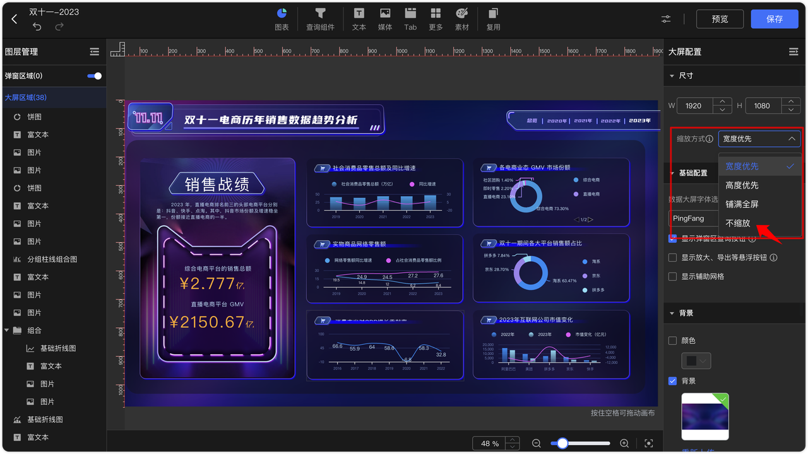

# 更新日志

## 1  仪表板与数据大屏

### 1.1 选项卡支持关闭 Tab 标签进行标题隐藏

{ width="900px" }

### 1.2  数据大屏设计面板支持开启辅助网格线

{ width="900px" }

### 1.3 图表跳转支持携带查询组件的过滤值并传递给外部参数
!!! Abstract ""
    在目标仪表板上创建外部参数，添加所需的外部参数，并选择与其关联的查询组件或图表。

{ width="900px" }

!!! Abstract ""
    在跳转仪表板上配置跳转设置，选择需要支持跳转功能的图表进入跳转配置界面。  

    如果目标仪表板中有多个图表需要联动，可在【联动图表】中进行字段关联设置。  

{ width="900px" }

!!! Abstract ""
    切换【携带查询条件】，将源仪表板的查询组件值绑定到目标仪表板的外部参数。 

{ width="900px" }

!!! Abstract ""
    可将源仪表板上的查询条件动态传递至目标仪表板，实现跨仪表板的图表联动。

{ width="900px" }

### 1.4  地图和气泡地图支持配置边线和区块填充透明度

{ width="900px" }

{ width="900px" }

### 1.5 线图和面积图支持设置条件样式
!!! Abstract ""
    设置的条件样式将影响折线图的线条（或面积）和标签文字的颜色。

{ width="900px" }

### 1.6  折线图和面积图支持配置标签位置

{ width="900px" }

### 1.7 数据大屏缩放方式增加不缩放模式

{ width="900px" }

!!! Abstract ""
    当显示设备尺寸大于或者小于数据大屏的设计尺寸时，内容将按设计尺寸显示，不进行拉伸或缩放。

{ width="900px" }

### 1.8 明细表支持自动换行
!!! Abstract ""
    注意：自动换行功能启用后，表头的行高无法固定。在开启合并单元格时，自动换行则会失效。

{ width="900px" }

### 1.9 数据大屏中 Tab 组件支持标签排序
!!! Abstract ""
    可以通过鼠标右键点击选项卡，选择【排序】功能对 Tab 标签进行自定义排序，影响标签的显示顺序。

{ width="900px" }

{ width="900px" }

### 1.10 Tab 组件在调整大小时，支持设置内部组件的大小是否自动调整
!!! Abstract ""
    在调整 Tab 组件大小时勾选【调整大小保持内部组件尺寸】，Tab 组件大小变化将不会影响内部组件的大小。

{ width="900px" }

{ width="900px" }

### 1.11 数据大屏支持按住空格键时拖动画布
!!! Abstract ""
    按住空格键并同时使用鼠标或者触摸板，可自由移动数据大屏的画布位置。

{ width="900px" }

### 1.12 支持移动端访问数据大屏

{ width="900px" }

### 1.13 查询组件支持自定义排序

!!! Abstract ""
    当显示字段与排序字段相同时，文本下拉和数值下拉支持选择自定义排序规则。且勾选后，下拉查询组件的默认值选项将按照自定义排序显示。

{ width="900px" }

{ width="900px" }

{ width="900px" }

### 1.14 查询组件支持内边距和圆角设置

{ width="900px" }

### 1.15 时间查询组件支持设置时间筛选范围
!!! Abstract ""
    区间类型支持以下设置：开始于、结束于、时间区间。

    - 开始于：【开始于】日期前的日期无法被选择。
    - 结束于：【结束于】日期后的日期无法被选择。
    - 时间区间：只能选择该区间内的日期进行查询。
    - 以上区间类型均支持设置【固定时间】与【动态时间】。

{ width="900px" }

### 1.16 查询条件支持单独设置宽度
!!! Abstract ""
    允许为每个查询条件单独设置宽度，实现更灵活的布局调整。

{ width="900px" }

### 1.17 支持组件背景模糊/毛玻璃效果
!!! Abstract ""
    支持设置组件背景模糊，该效果能够透过组件展示并模糊下层内容，透明区域也将应用模糊处理。若为图片，需确保其具有透明背景以生效。

{ width="900px" }

### 1.18 明细表支持总计

{ width="900px" }

### 1.19 条形图的纵轴支持设置显示标签的长度限制

{ width="900px" }

### 1.20 图例支持设置图标大小

{ width="900px" }

### 1.21 仪表盘标签支持显示占比

{ width="900px" }

### 1.22 进度条标签支持自定义显示指标或百分比

{ width="900px" }

### 1.23 雷达图支持设置辅助点显示、大小及面积显示

{ width="900px" }

### 1.24 地图支持自定义区域及其区域下钻
!!! Abstract ""
    在【系统设置】→【系统参数】→【地图设置】中，可以添加自定义地理区域，并对中国省份进行自定义组合。

{ width="900px" }

{ width="900px" }

!!! Abstract ""
    在地图和气泡地图等离线地图中，可以选择并显示自定义区域，在维度中添加区域字段（数据值如东区、南区、北区）。配置区域与省份的下钻，可支持从区域下钻到省份。

{ width="900px" }

{ width="900px" }

### 1.25 仪表板和数据大屏支持字体更换

{ width="900px" }

{ width="900px" }

## 2 数据准备

### 2.1 API 数据源支持主键设置及基于主键的增量同步更新
!!! Abstract ""
    注意：

    - API 数据源支持设置字段类型、长度以及是否为主键。
    - 增量更新时，系统会根据主键自动更新已存在的数据。
    - 仅在新建 API 数据源表时，才能为选定的字段设置主键，已有数据源表不支持修改主键设置。

{ width="900px" }

### 2.2 上传 Excel 数据源时支持字段选择
!!! Abstract ""
    注意：

    - 在上传 Excel 数据源时，支持选择指定字段进行导入，无需导入全部数据。选择字段时可自定义设置字段长度。
    - 对已有 Excel 数据源进行数据替换时，同样支持字段选择和字段长度调整。

{ width="900px" }

### 2.3 数据填报支持多条录入并新增“快速确认完成”按钮
!!! Abstract ""
    可以在同一界面填写多条记录并提交，增加每条记录的状态标签。并提供“快速确认完成”按钮，支持用户快速修改单条记录状态或批量设置为完成。

{ width="900px" }

## 3 组织管理中心（XPack）
### 3.1 权限管理新增导出控制
!!! Abstract ""
    导出权限具体包括：

    - 资源权限：控制图片、PDF、模板等资源的导出权限。
    - 图表权限：支持以 Excel 格式导出图表展示的数据的导出权限。
    - 明细权限：支持导出图表对应的详细数据的导出权限。
{ width="900px" }

### 3.2 同步管理目标数据源支持自定义配置 Doris 的 FE/BE 端口地址
!!! Abstract ""
    可以分别设置 Doris FE（前端）和 BE（后端）的 IP 地址、查询端口及 HTTP 端口，提供更灵活的配置选项，以满足不同环境下的部署需求。

{ width="900px" }

## 4 系统设置
### 4.1 支持设置用户登录限制

{ width="900px" }

### 4.2 系统设置增加页面打开方式选项

{ width="900px" }

### 4.3 增加资源默认排序方式的配置项
!!! Abstract ""
    系统管理员可以设置各类资源的默认排序方式，用户则可以根据个人需求调整资源的排序。用户自定义的排序方式将保存在浏览器本地，优先级高于系统默认设置。

{ width="900px" }

### 4.4 新增游离资源管理（XPack）
!!! Abstract ""
    游离资源是指在没有组织管理下创建的资源，如在社区版中创建的资源，或是许可证到期后创建的资源。系统管理员可以在【系统设置】中管理这些游离资源，具体功能如下：

    - 查看游离资源：可查看所有无组织关联的资源，包括可视化资源（如仪表板、数据大屏）、数据集和数据源。
    - 资源血缘关系：支持查看选中资源的血缘关系，帮助了解资源之间的依赖和联系。
    - 资源迁移：提供一键迁移和单资源迁移两种方式。通过一键迁移，所有游离资源可统一迁移到指定组织下；在单个资源迁移时，系统会提示是否一并迁移相关联的资源。
    - 资源删除：支持一键删除和单资源删除操作。删除前会弹出确认提示，避免误操作；删除单个资源时，会显示该资源的血缘关系。

{ width="900px" }

{ width="900px" }

## 5 嵌入式（XPack）

### 5.1 嵌入式应用指定密钥长度

{ width="900px" }

### 5.2 支持嵌入 Tab 和组合形式的组件

{ width="900px" }

{ width="900px" }

{ width="900px" }

### 5.3 支持嵌入数据填报
!!! Abstract ""
    支持嵌入【数据填报列表】和【我的填报】页面。

{ width="900px" }

## 6 其他
### 6.1 资源树节点支持拖拽移动位置

{ width="900px" }

### 6.2 新增消息中心

{ width="900px" }

{ width="900px" }

