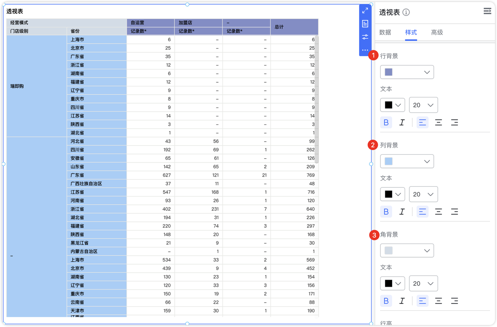
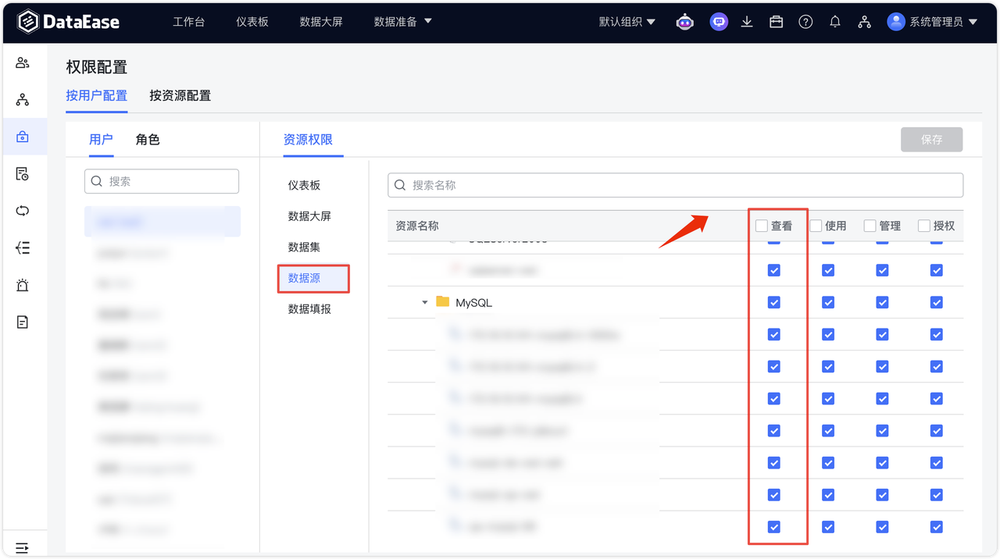

# 更新日志

## 1  仪表板与数据大屏

### 1.1 选项卡 Tab 标签支持下划线、加粗、斜体样式设置

{ width="900px" }

### 1.2 数据大屏 Tab 组件支持图表以组合的形式进行拖入操作
!!! Abstract ""
    Tab 组件的图表组合支持规则：

    - 支持 Tab 组件与其他组件进行组合操作。
    - 支持普通组合（不包含 Tab 组件）拖入 Tab 组件。若组合中包含 Tab 组件，则该组合无法拖入其他 Tab 组件。
    - Tab 组件内部支持组件组合和解除组合操作。


{ width="900px" }

### 1.3 新增圆形填充图

{ width="900px" }

### 1.4  柱状图和符号地图支持条件样式设置

{ width="900px" }

{ width="900px" }


### 1.5 柱状图支持自定义柱宽

{ width="900px" }

### 1.6  透视表支持为表头单独设置背景颜色
!!! Abstract ""
    透视表支持分别设置行背景、列背景和角背景的样式，包括背景颜色、文本颜色和字体格式。

{ width="900px" }

### 1.7 地图缩放等级可精确设置至 0.1

{ width="900px" }

## 2 数据准备

### 2.1 API 数据源支持分页获取数据
!!! Abstract ""
    支持两种分页方式：【页码+大小】和【游标+大小】。  
    【页码+大小】示例：

    - 选择分页方式为“页码+大小”。
    - 在请求参数中设置页码和分页大小的默认值。
    - 在响应参数中填写总数字段的 JsonPath。
    - 在 Query 参数中，将页码和大小参数与内置分页参数进行映射。

{ width="900px" }

{ width="900px" }

!!! Abstract ""
    【页码+大小】同时支持将页码和大小参数嵌入 URL 路径中（如 DataEase 分页 API）。使用时，可按照下图所示，在路径中直接使用 ${pageNumber} 和 ${pageSize} 引用内置分页参数，总数字段的设置与前述方法一致。

{ width="900px" }

!!! Abstract ""
    【游标+大小】示例：

    - 在请求参数中设置游标和分页大小的默认值。
    - 在响应参数中，指定游标字段的 JsonPath。
    - 在 Query 参数中，将页码和大小参数映射到内置分页参数。

{ width="900px" }

{ width="900px" }


### 2.2 Excel 数据源追加策略调整
!!! Abstract ""

    - 只有新上传的 Excel 文件的 Sheet 页与原数据源的 Sheet 页匹配时，才会执行数据追加。匹配后，将新数据追加到原 Sheet 页，且不进行主键替换。
    - 如果新上传的 Excel 文件中包含原数据源中不存在的 Sheet 页，则不处理这些不匹配的 Sheet 页。

### 2.3 数据集自定义 SQL 时支持选择系统变量作为查询条件
!!! Abstract ""
    在 SQL 查询中可以使用系统变量，实现行权限的效果。该条件在数据集预览和仪表板/数据大屏展示中均会生效。

{ width="900px" }

## 3 组织管理中心（XPack）
### 3.1 数据源新增查看权限
!!! Abstract ""
    查看权限：

    - 允许操作：

        - 查看数据源的基本信息（例如名称、描述、连接方式、数据表结构等）。
        - 通过数据集读取数据（用户有权限访问与该数据源相关联的已公开数据集）。

    - 禁止操作：

        - 编辑数据源：用户无权修改数据源配置，如连接字符串、用户名和密码。
        - 基于数据源创建数据集：用户在创建数据集时，无法选择该数据源作为基础数据源。
        - 数据源不可见：在“创建数据集”界面，用户无权看到该数据源。
        - 修改已包含数据源的数据集：如果用户对某数据集有编辑权限，但该数据集依赖一个用户无查看权限的数据源，则在编辑数据集时，将提示“权限不足，无法修改”。禁止保存对数据集的任何更改。
{ width="900px" }

### 3.2 新增 Webhook 管理
!!! Abstract ""

    Webhook 是组织级别的内容，以便于统一管理和扩展消息推送，当前主要用于图表的阈值告警推送。
    字段说明：

    - 名称：简短描述 Webhook 的用途，便于快速理解和区分。
    - URL：DataEase 将告警信息回调给指定 URL。
    - 内容类型：指定 Webhook 数据发送的内容类型（如 application/json 或 application/x-www-form-urlencoded）。
    - Secret（可选）：如果填写 Secret，DataEase 会使用它计算加密的哈希签名，用于数据加密和验证。

{ width="900px" }
!!! Abstract ""
    在具体图表的阈值告警中，可以选择需要生效的 Webhook。

{ width="900px" }


### 3.3 支持 Elasticsearch 数据源作为数据同步的源数据源

{ width="900px" }

{ width="900px" }

## 4 系统设置
### 4.1 新增 MFA 支持（XPack）
!!! Abstract ""
    系统管理员可以在“系统设置 > 安全设置”中配置多因素认证（MFA）。 
    配置说明：

    - 全局启用 MFA 认证：可以选择启用或禁用全局 MFA 功能。
    - 第三方认证启用 MFA：设置三方登录方式（OIDC、CAS）是否开启 MFA 绑定。
    - MFA 校验有效期：设置 MFA 校验码的有效时间（单位：秒），默认值为 30 秒。
    - OTP 延迟有效次数：设置用户 OTP 验证的允许失败次数。
    - 扫描名称配置：可自定义用户扫描绑定 MFA 时的名称显示。
{ width="900px" }

!!! Abstract ""
    在系统设置中，系统管理员可以配置全局 MFA 设置，用于控制 MFA 的强制生效范围。

    - 未启用：不强制使用 MFA，但用户可根据自身需要自行开启 MFA。
    - 所有用户：所有用户登录时必须使用 MFA（钉钉等第三方平台扫码方式除外，以及第三方认证开启默认不开启MFA）。
    - 仅系统管理员：仅强制 admin 用户使用 MFA。  

    **注意：若用户未绑定 MFA，但系统已启用 MFA，用户在常规登录后，进入 MFA 验证页面时将出现绑定页面，包含 App下载链接和用于扫码绑定 MFA。**

{ width="900px" }

!!! Abstract ""
    用户绑定 MFA 操作流程：

{ width="900px" }

!!! Abstract ""
    扫码下载 MFA 应用：  

{ width="900px" }

!!! Abstract ""
    绑定 MFA 多因子认证：   

{ width="900px" }

!!! Abstract ""
    用户绑定并开启 MFA 后，登陆后进行 MFA 多因子认证：

{ width="900px" }

!!! Abstract ""
    **注意：钉钉等第三方平台扫码方式不需要进行 MFA 多因子认证，第三方认证登陆时默认不开启 MFA。**

### 4.2 OIDC 认证配置现支持字段映射功能（XPack）

{ width="900px" }


## 5 嵌入式（XPack）

### 5.1 Copilot 支持嵌入

{ width="900px" }

### 5.2 网页组件支持通过 PostMessage 的方式向外层仪表板传递参数

!!! Abstract ""
    在仪表板和数据大屏中，支持嵌入网页组件实现组件内操作与外部仪表板视图的联动。网页组件通过类似 PostMessage 的方式向外层仪表板传递包含图表 ID 和参数值的消息，触发视图更新。

    ``` 
    参数说明：
    {
        type: 'webParams',
        targetSourceId: '${仪表板或数据大屏ID}',
        params: {
            '${图表ID}': [
             {
                 fieldId: '${数据集字段ID}',
                 operator: 'in',
                 value: ['${字段值}'],
                 viewIds: ['${图表ID}'']
               }
            ]
        }
    }

    ``` 
!!! Abstract ""
    传参示例：

{ width="900px" }

{ width="900px" }


