# 更新日志

## 1  仪表板与数据大屏

### 1.1 仪表板支持画布比例和组件比例两种缩放方式设置
!!! Abstract ""
    仪表板提供两种缩放显示方式，满足不同场景需求：

    - 按画布比例缩放：高度和宽度独立按画布比例缩放。组件在设计阶段于画布中所占的比例将在预览阶段保持一致，从而确保布局的高度还原。
    - 按组件比例缩放：保持组件高度与宽度的比例固定。设计阶段设置的组件高度与宽度的比例将在预览阶段严格保持不变，确保视觉一致性。

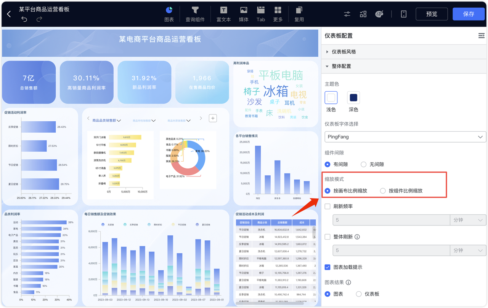{ width="900px" }

### 1.2 仪表板和数据大屏支持更多组件修改名称
!!! Abstract ""
    所有组件均支持通过双击组件编辑区域的名称进行改名操作。

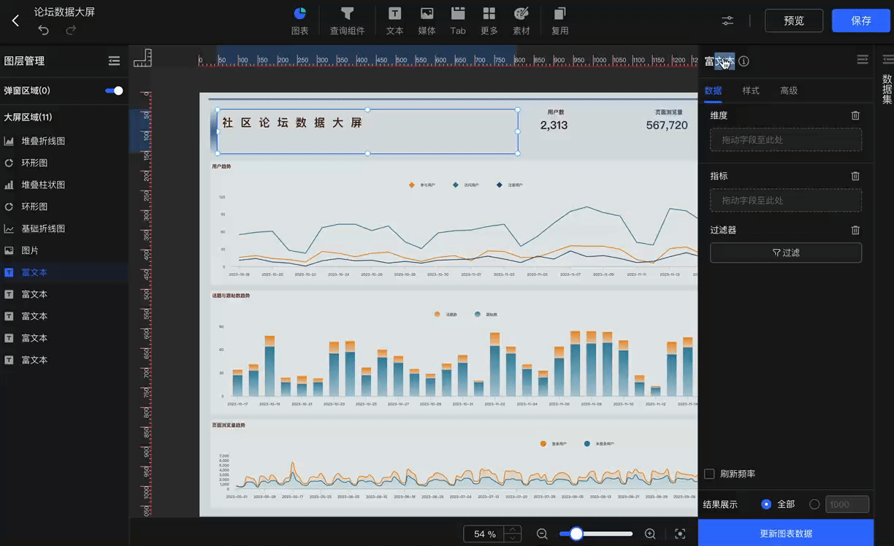{ width="900px" }

### 1.3 数据大屏新建图表后自动定位到屏幕中心
!!! Abstract ""
    在数据大屏中新建组件时，新组件将自动显示在屏幕中心位置，同时画布区域也会同步定位到屏幕中心。

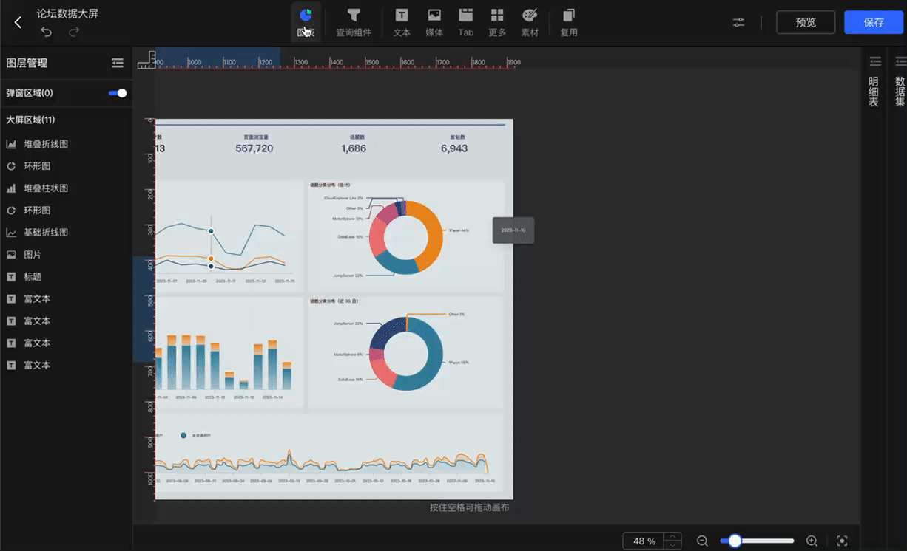{ width="900px" }

### 1.4  跳转设置的弹窗页面样式变更为内嵌式弹窗
!!! Abstract ""
    跳转设置的弹窗页面已优化为内嵌式 DIV 弹窗样式。

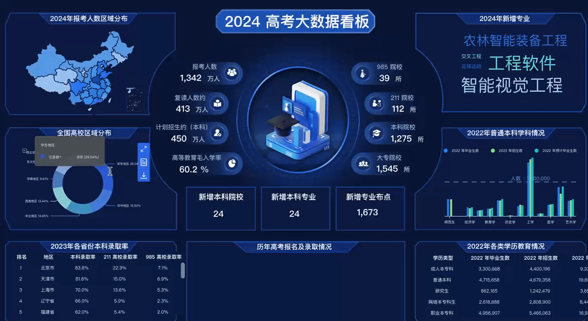{ width="900px" }

### 1.5  富文本支持指标同环比功能
!!! Abstract ""
    富文本组件现已支持同环比功能，但使用该功能时需确保维度字段类型为日期类型。   

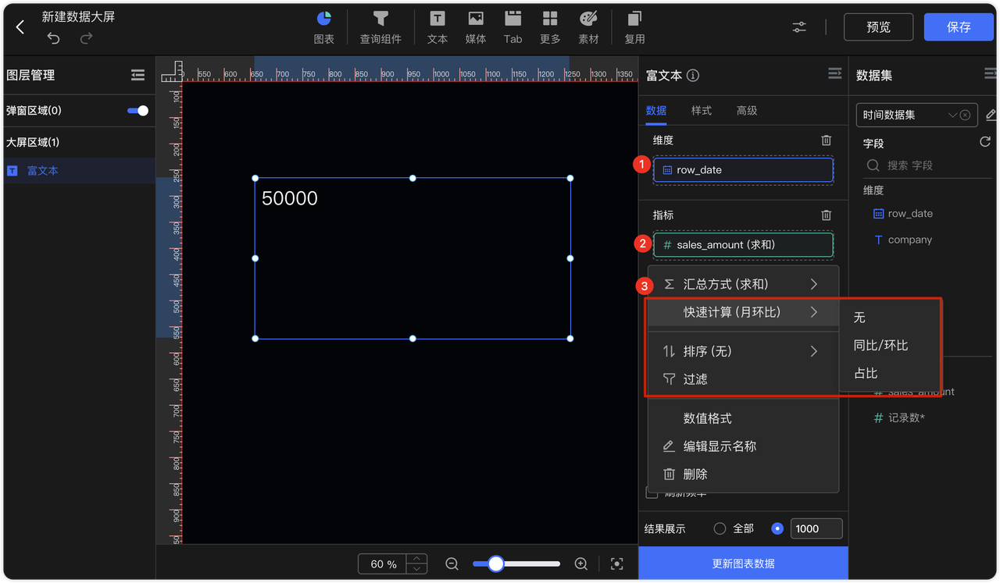{ width="900px" }


## 2 数据准备

### 2.1 计算字段编辑页面支持语法校验功能

!!! Abstract ""
    在计算字段编辑页面新增校验按钮，用户可在保存前对计算字段的语法有效性进行校验，确保配置正确。

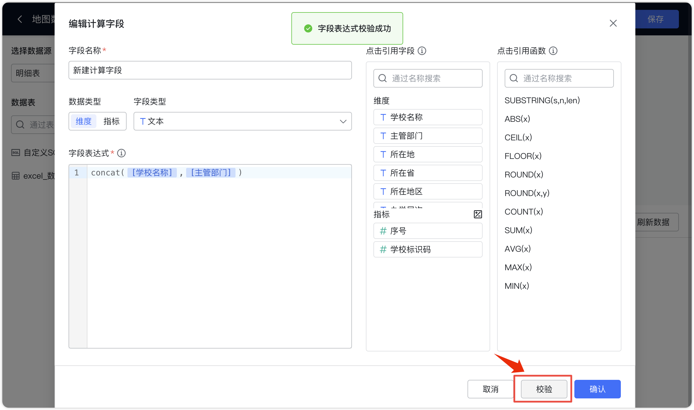{ width="900px" }

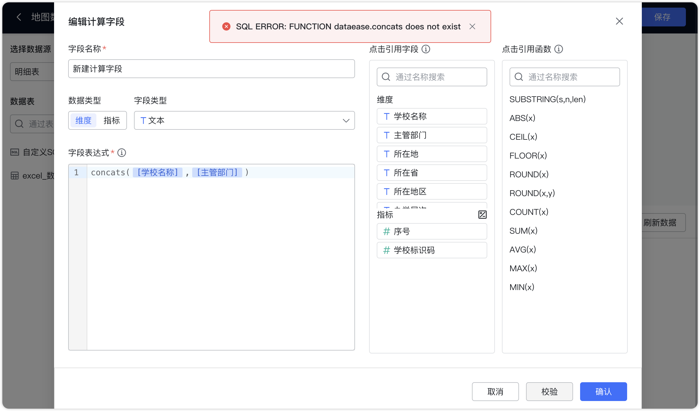{ width="900px" }

### 2.2 PostgreSQL 支持外部表功能
!!! Abstract ""
    PostgreSQL 现已支持外部表功能，允许通过外部数据源访问和查询数据。
    示例外部表结构：

    ````
    CREATE foreign TABLE jinlong.foreign_books
    (
    "_id" varchar(255) NOT NULL,
    author varchar(255) NULL,
    category varchar(255) NULL,
    "createdDate" date NULL,
    "onSale" varchar(255) NULL,
    price float4 NULL,
    title varchar(255) NULL
    )
    SERVER foreign_server_pg
    OPTIONS (schema_name 'public', table_name 'books');
    
    ````
!!! Abstract ""
    支持对外部表数据进行单源查询及跨源查询，同时支持外部表数据的图形化展示。
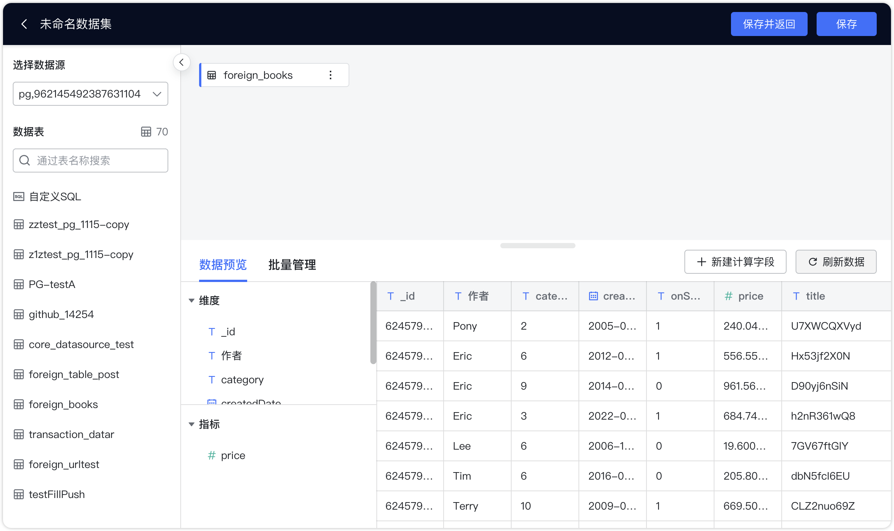{ width="900px" }


### 2.3 数据填表单选和单选框组件支持额外关联字段查询与展示功能（XPack）
!!! Abstract ""
    单选和单选框组件在绑定数据源时，现支持选择添加字段描述。

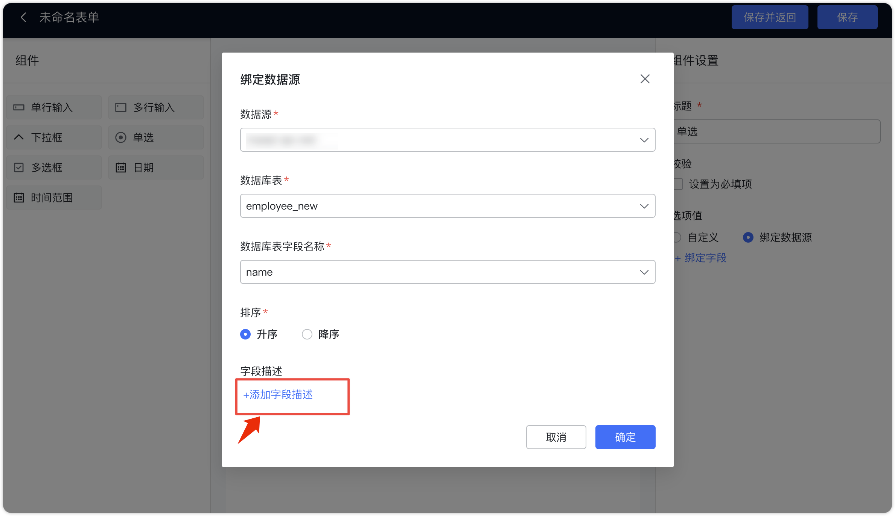{ width="900px" }

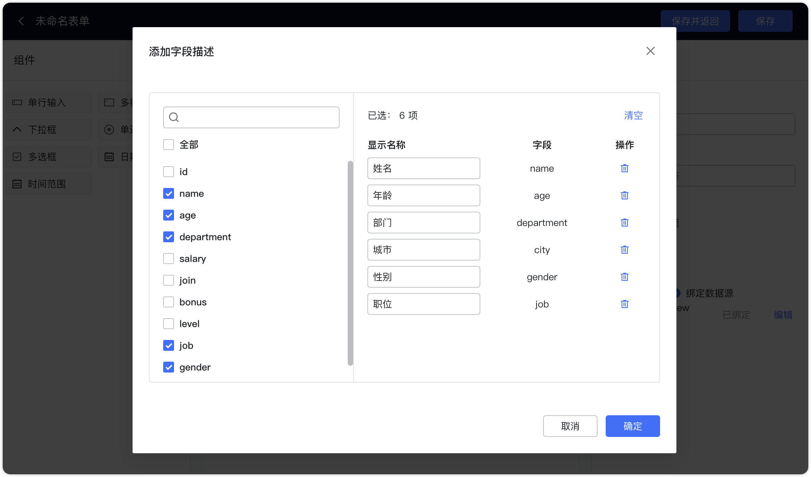{ width="900px" }

!!! Abstract ""
    在单选或下拉框中选择选项后，设置的字段描述将显示在下方。如果描述内容超过 6 个，可以点击【查看更多】以查看完整描述。

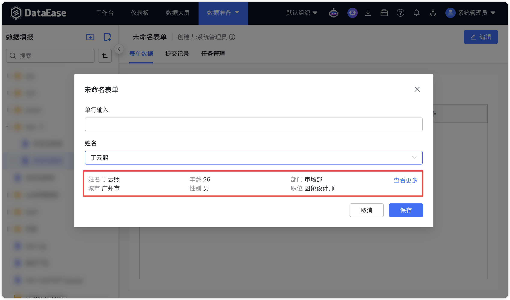{ width="900px" }

## 3 组织管理中心（XPack）
### 3.1 禁止用户将资源移入【迁移资源】目录

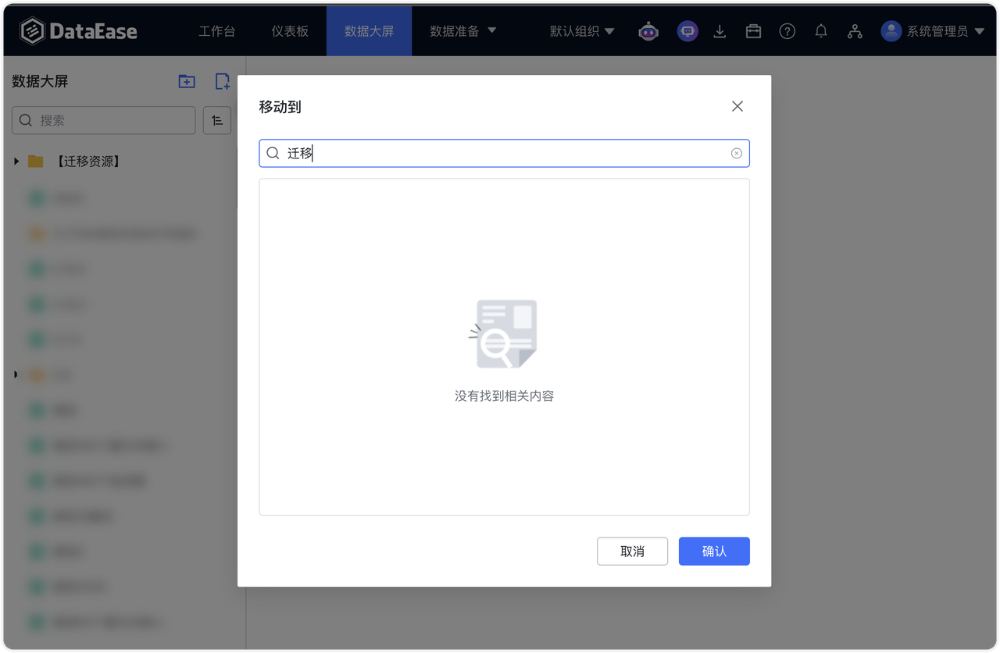{ width="900px" }
