# 更新日志

## 1  仪表板与数据大屏

### 1.1  在线地图支持天地图、腾讯地图
!!! Abstract ""
    在线地图目前支持高德、天地图和腾讯地图。管理员可在系统设置的【地图设置】中选择所需的地图服务，当前页面保存地图服务即为 DataEase 仪表板和数据大屏中使用的地图服务。更改地图服务后，需刷新仪表板或数据大屏以使更改生效。

!!! Abstract ""
    天地图：

    - 创建 Key 的官方文档：[天地图授权指南](http://lbs.tianditu.gov.cn/authorization/authorization.html)。
    - 限制：
        - 不支持去除地图标注。
        - 不支持地图倾斜。

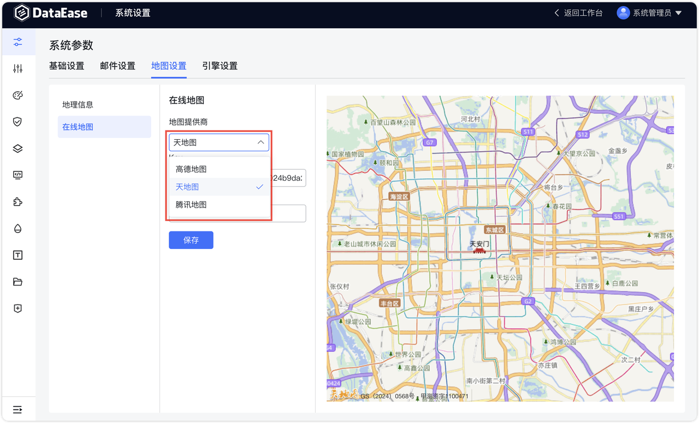{ width="900px" }

!!! Abstract ""
    腾讯地图：

    - 创建 Key 的官方文档：[腾讯地图开发指南](https://lbs.qq.com/mobile/androidMapSDK/developerGuide/getKey)。
    - 主题配置参考：[个性地图](https://lbs.qq.com/dev/console/custom/mapStyle)。

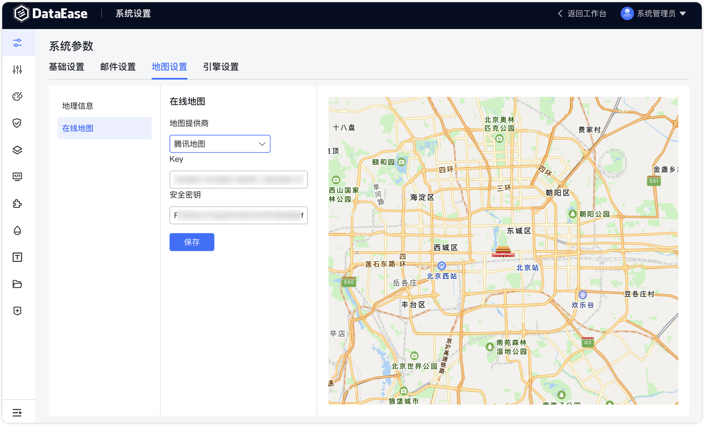{ width="900px" }

### 1.2 数量单位支持英文简称

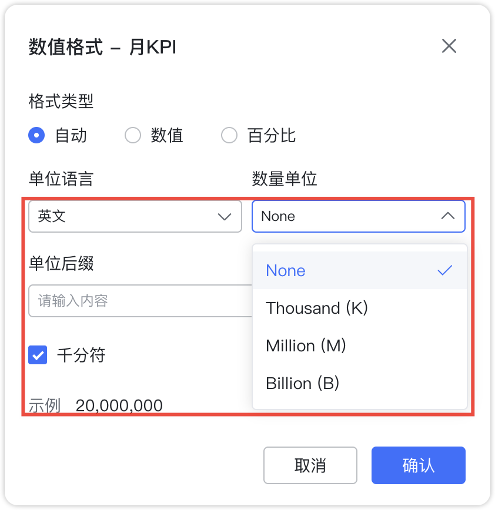{ width="500px" }

### 1.3 公共连接复制链接和密码可以直接访问

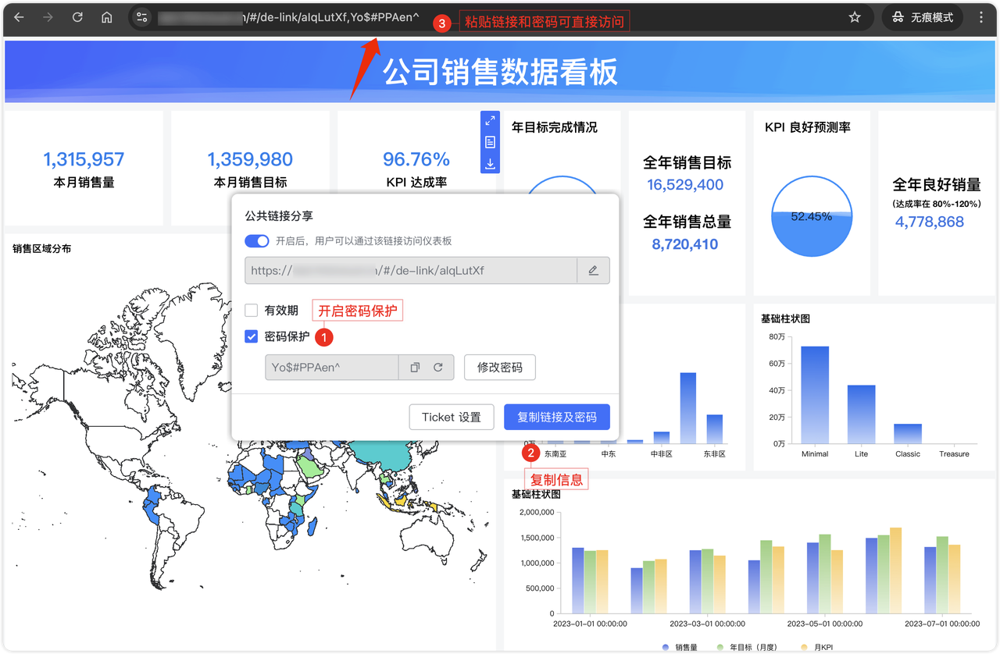{ width="900px" }

### 1.4 仪表板查询组件支持顶部冻结
!!! Abstract ""
    仪表板查询组件新增位置设置，当选择【置顶】时，查询组件在仪表板滚动至其触及画布上边界时会自动固定在顶部。   
    **注意：每个仪表板仅支持一个查询组件置顶，若已有置顶查询组件，再次置顶其他查询组件时，原有组件将自动取消置顶。**
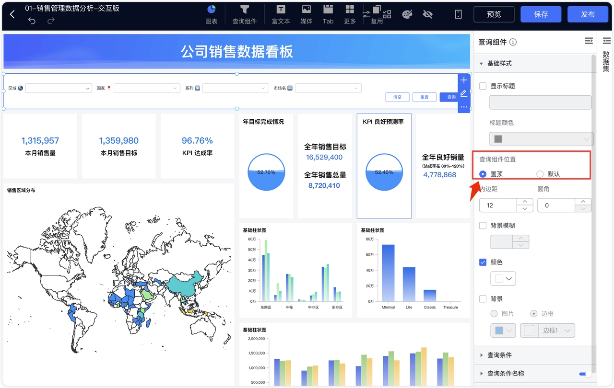{ width="900px" }

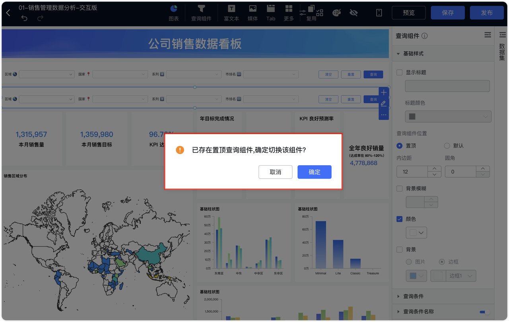{ width="900px" }

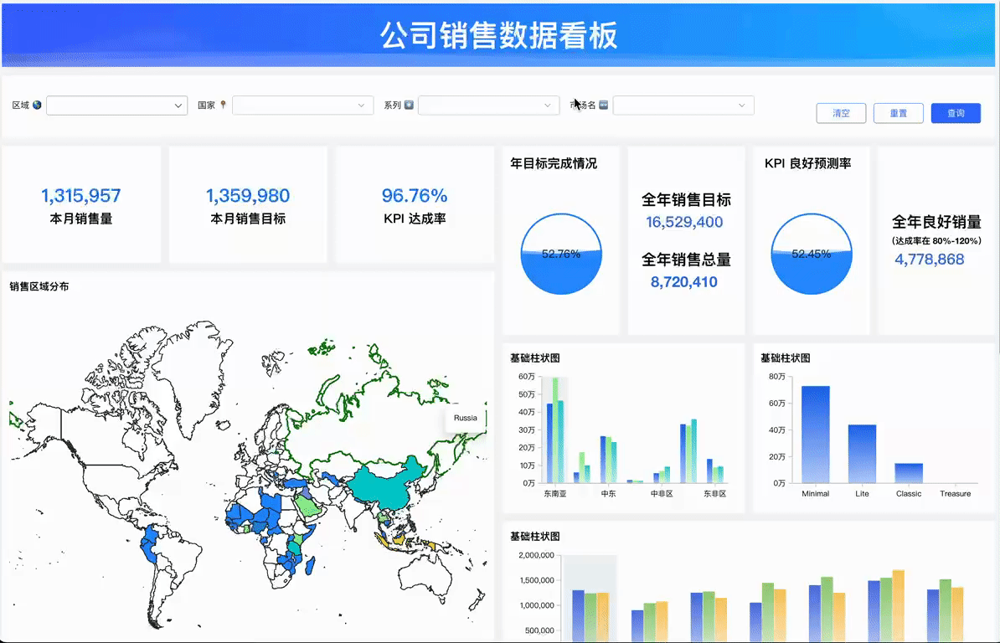{ width="900px" }

### 1.5 仪表板新增间距大小设置，支持自定义组件间距
!!! Abstract ""
    提供大、中、小三种内置间距选项，同时支持自定义间距，范围为 0 到 10。

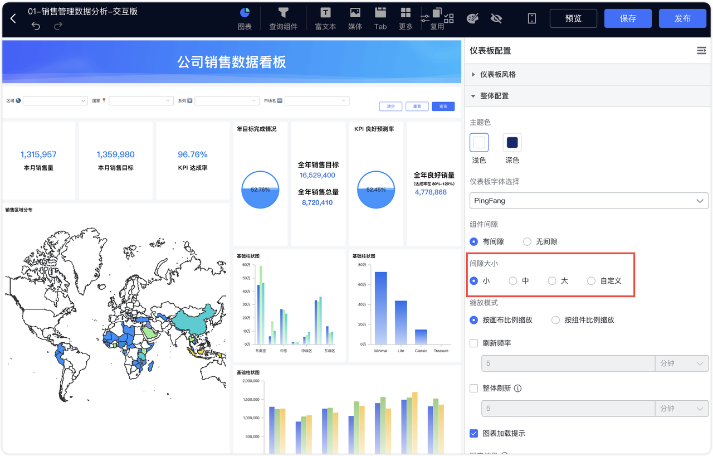{ width="900px" }

{ width="900px" }

### 1.6 仪表板和数据大屏支持发布功能
!!! Abstract ""
    仪表板和数据大屏提供发布版本与草稿版本两种版本，支持保存、发布、取消发布、恢复及预览操作。其中发布与取消发布影响发布版本，而保存和恢复至发布版本则作用于草稿版本。       
    使用示例:

    - 新建仪表板并修改内容，此时仅能【保存】为草稿，不能直接预览或分享。
    - 点击【发布】，草稿版本正式成为发布版本，供用户查看和使用，可以访问、分享和收藏。
    - 点击【取消发布】，则撤销已发布版本，使其变为草稿版本。
    - 若需要调整内容，可修改并【保存】，生成新的草稿版本。点击【恢复到已发布版本】，放弃当前修改，将草稿版本还原至已发布版本。

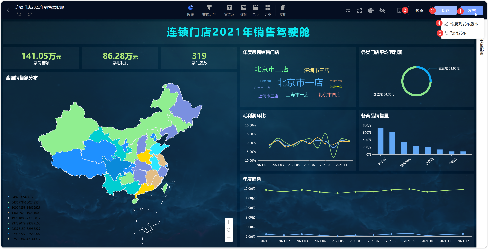{ width="900px" }

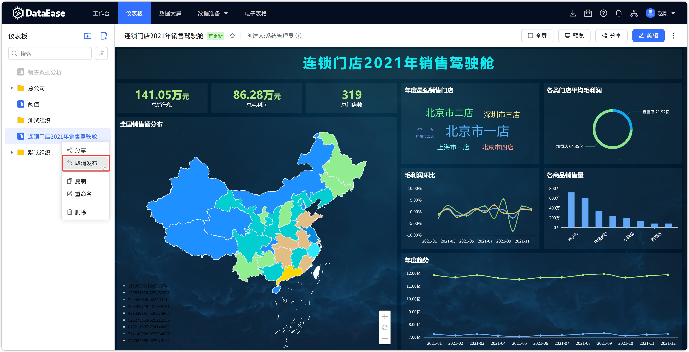{ width="900px" }

!!! Abstract ""
    **功能与逻辑介绍:**

    - **发布与取消发布**
        - 发布逻辑：发布操作用于发布草稿版本，仅当存在草稿版本时可执行发布。
        - 取消发布逻辑：
            - 仅存在已发布版本时，如果取消发布后，已发布版本变为草稿版本；
            - 同时存在草稿版本和已发布版本 ，在取消发布后，已发布版本被放弃，仅保留草稿版本；
            - 无已发布版本时，无法执行取消发布，只能保存草稿版本。

    - **预览和查看**
        - 预览页查看的是已发布的仪表板版本，而非未发布的草稿版本。
        - 若存在已发布版本和草稿版本，则预览显示已发布版本；
        - 若仅存在草稿版本，则无法预览。
        - 预览页的仪表板信息栏新增状态提示，若存在未发布的草稿版本，则显示【有更新】。

    - **列表展示**
        - 取消发布或者仅存在草稿版本在列表中置灰，不可查看、分享、收藏；
        - 已发布过的仪表板和数据大屏若取消发布后（即仅存在草稿版本），原先创建的分享链接和收藏记录不删除。通过分享链接访问时，将提示仪表板未发布，同时在收藏栏中无法点击查看。

{ width="900px" }

{ width="900px" }

### 1.7 联动按钮固定悬浮在页面右上角
!!! Abstract ""
    联动按钮始终固定在页面右上角，不随页面滚动而上移。

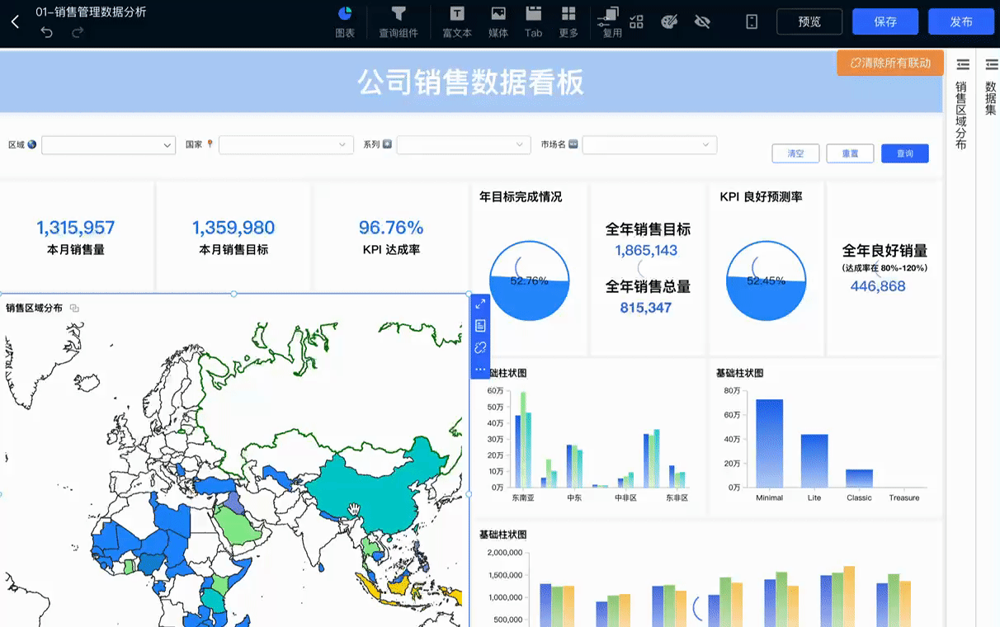{ width="900px" }

### 1.8 排序支持设置优先级
!!! Abstract ""
    排序功能现已支持配置多个字段（维度和指标）的排序优先级，系统将根据设置的优先级顺序依次进行排序。

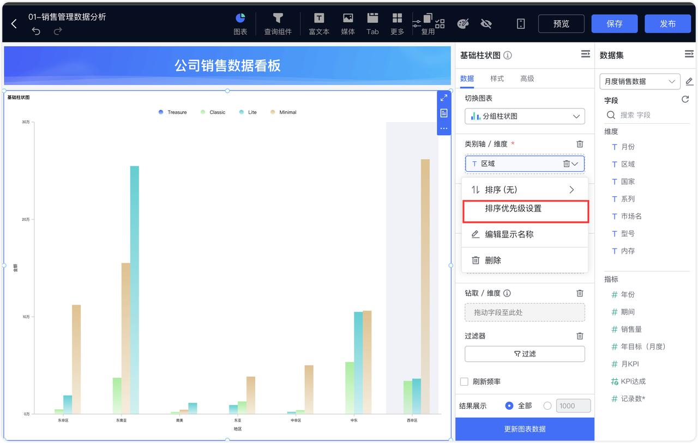{ width="900px" }

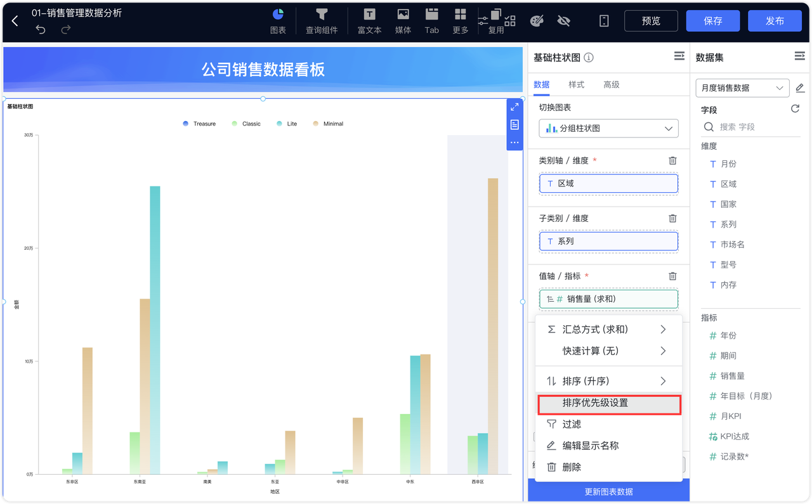{ width="900px" }

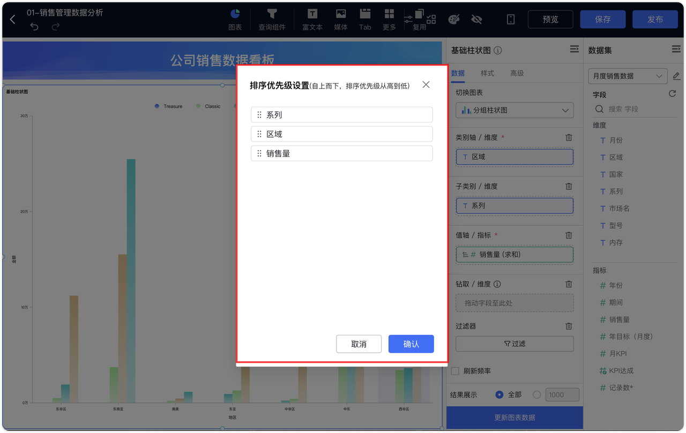{ width="900px" }

### 1.9 分组柱状图支持组内按指标排序
!!! Abstract ""
    排序结果受排序优先级设置影响，按照配置的优先级顺序进行排列。

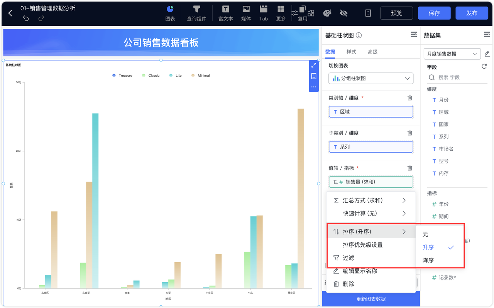{ width="900px" }

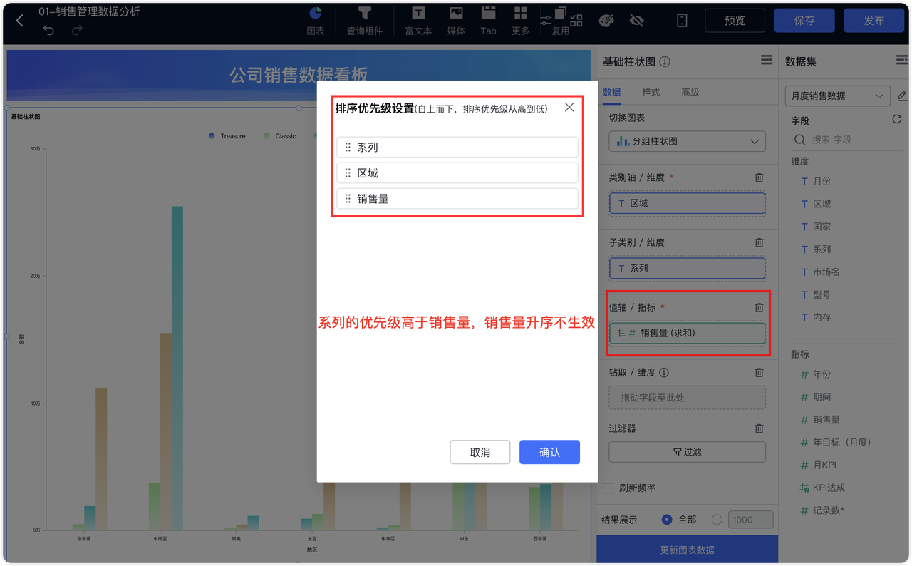{ width="900px" }

### 1.10 折线图图例支持排序

{ width="900px" }

### 1.11 明细表合并单元格支持显示图片

{ width="900px" }

### 1.12 图表支持配置提示信息轮播功能

!!! Abstract ""
    柱状图、组合图、饼图等图表现已支持启用提示信息轮播功能，支持设置提示的轮播停留时长与间隔，便于在无需鼠标悬停的情况下自动轮播展示各数据项的详情。  
    支持的图表类型包括：

    - 饼图 / 环形图
    - 基础折线图 / 面积图
    - 基础柱状图
    - 双轴图（全部类型）

{ width="900px" }

{ width="900px" }

### 1.13 汇总表总计支持数值字段汇总方式配置

!!! Abstract ""
    可根据字段需求选择求和、平均值、最大值、最小值等进行汇总展示。

{ width="900px" }

### 1.14 汇总表支持分页展示

!!! Abstract ""
    注意：该功能存在兼容性变化，历史汇总表默认将启用分页显示，如需恢复为不分页模式，可在配置中手动关闭分页选项。

{ width="900px" }

### 1.15 组合图副轴支持同环比显示

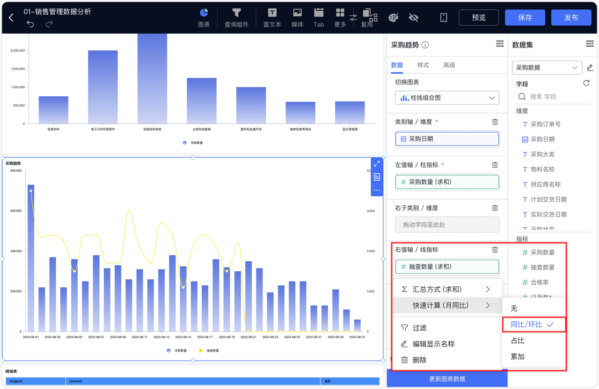{ width="900px" }

### 1.16 辅助线新增【最后一项】选项

!!! Abstract ""
    适用图表类型：线面图、双轴图、柱条图（瀑布图、百分比柱条图、区间条形图、对称条形图、子弹图除外）。  
    **注意：为确保【最后一项】值（即尾值）的稳定性，需要设置字段排序，从而有稳定的排序规则。**

{ width="900px" }

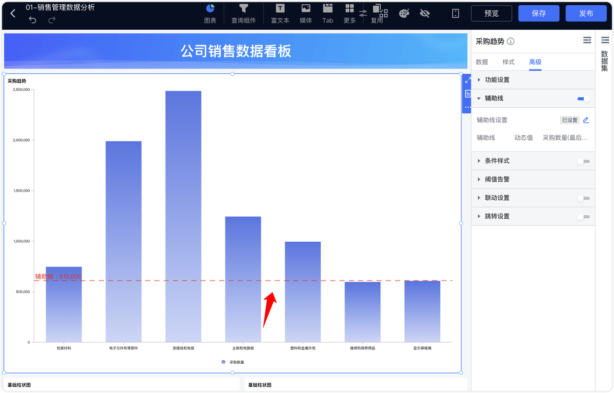{ width="900px" }

### 1.17 透视表支持配置指标总计的显示名称

!!! Abstract ""
    透视表汇总别名配置项，同时支持为总计项及字段项设置别名。

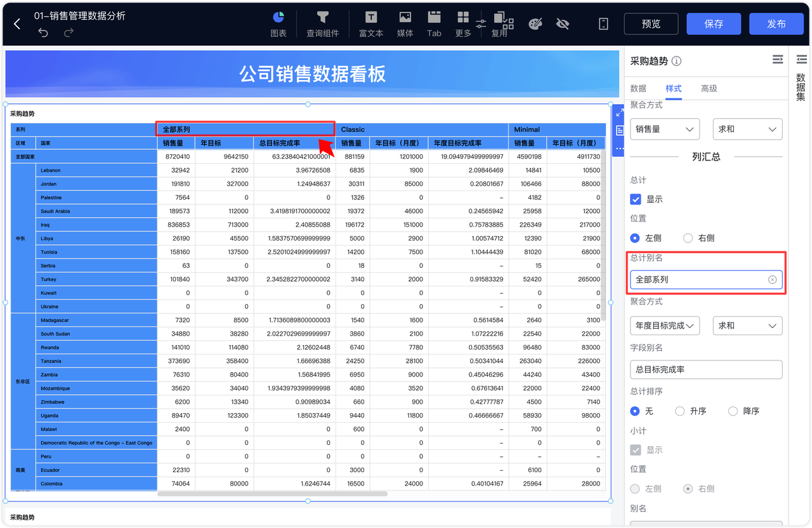{ width="900px" }

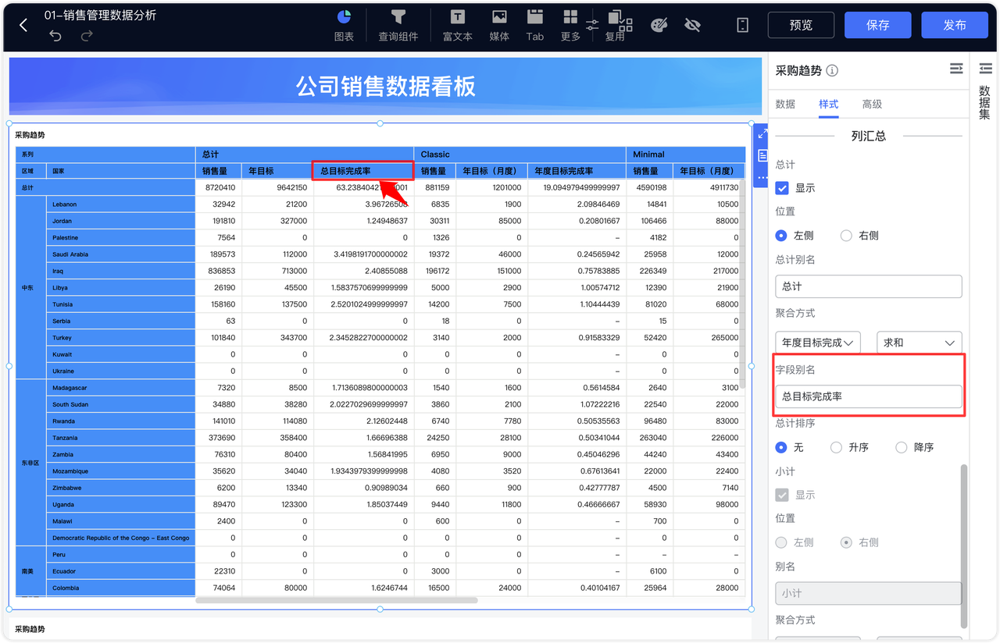{ width="900px" }

### 1.18 数据大屏时间组件支持显示星期

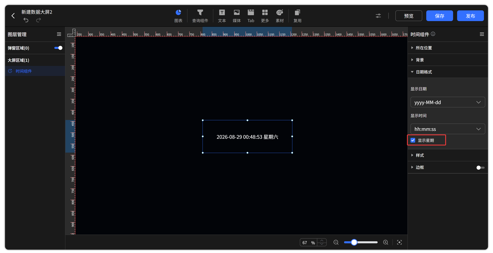{ width="900px" }

### 1.19 时间范围组件的默认值支持设置更多常用时间范围

!!! Abstract ""
    默认值设置中新增常用时间范围选项，如“本周”、“本季度”等常用时间范围。  

    - 当时间粒度为【年月】时，默认值的可选项新增：“本季度”。
    - 当时间粒度为【年月日】或【年月日时分秒】时，默认值的可选项新增：“本周”（默认采用自然周，周一至周日）。

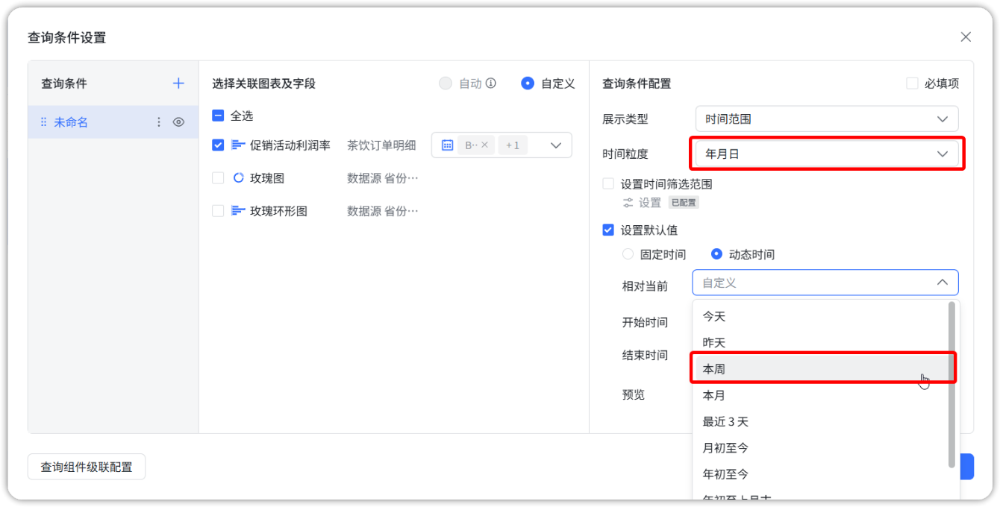{ width="900px" }

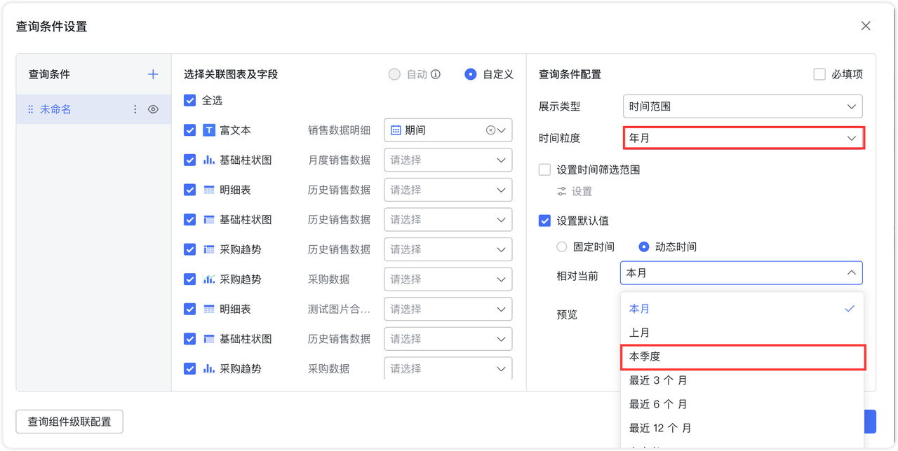{ width="900px" }

### 1.20  查询组件下拉树支持选择数据集并配置图表关联

!!! Abstract ""
    查询组件的下拉树现已支持选择数据集。在添加下拉树层级时，系统将自动关联同一数据集下图表的对应字段。  

    - 点击【关联图表】或左侧层级字段，可进一步配置各层级与图表字段的关联关系。
    - 支持按需为图表组件仅关联某一特定层级。例如，下图中“明细表-不同数据集”图表仅在第二层级（区域）关联了“地区”字段。  
    **注意：切换下拉树类型时，已配置的层级信息将被清空，请谨慎操作。**

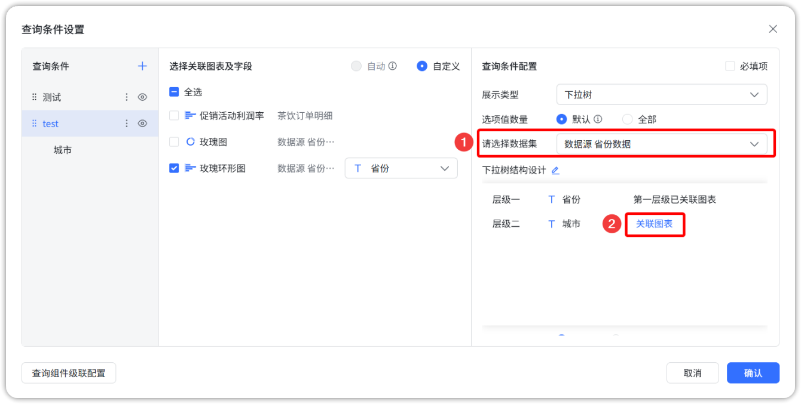{ width="900px" }

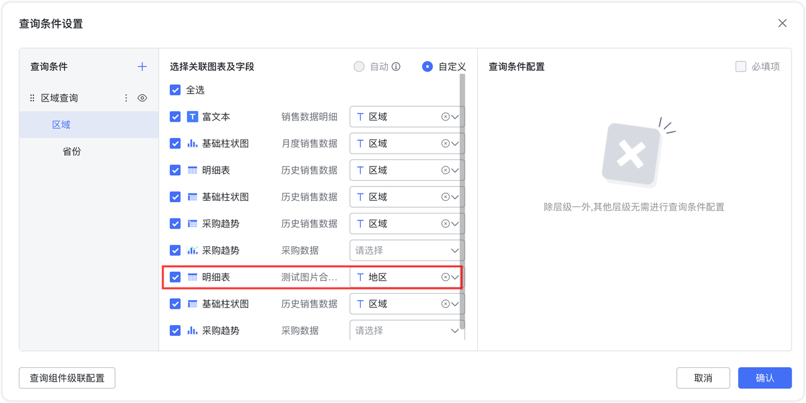{ width="900px" }

### 1.21 新增子弹图

!!! Abstract ""
    子弹图支持在同一图形中展示实际值、目标值与参考值，用于衡量业务完成情况，常用于 KPI 监控等场景。 配置说明：  

    - 实际值/指标：代表当前实际完成情况（如销售量）。
    - 目标值/指标：表示目标任务（如月 KPI）。
    - 参考值/指标：可选项，用于展示上级目标或基准线（如年目标）。

{ width="900px" }

### 1.22 透视表新增行列转置功能

!!! Abstract ""
    支持指标展示支持选择按行头或列头展示，灵活调整展示方式。

{ width="900px" }

### 1.23 移动端支持收藏仪表板

!!! Abstract ""

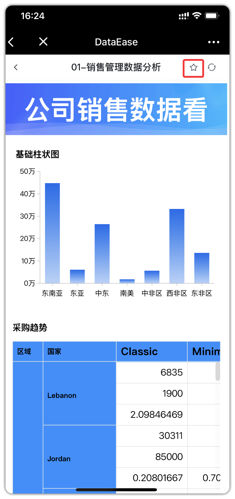{ width="450px" }    { width="450px" }

## 2 数据准备

### 2.1 Excel 数据源支持上传后修改字段类型功能

!!! Abstract ""
    包括本地 Excel/CSV 和远程 Excel/CSV，上传后可在字段选择中设置字段类型以及字段长度。

{ width="900px" }

### 2.2 移动端支持展示数据填报，并支持移动端填报数据（XPack）

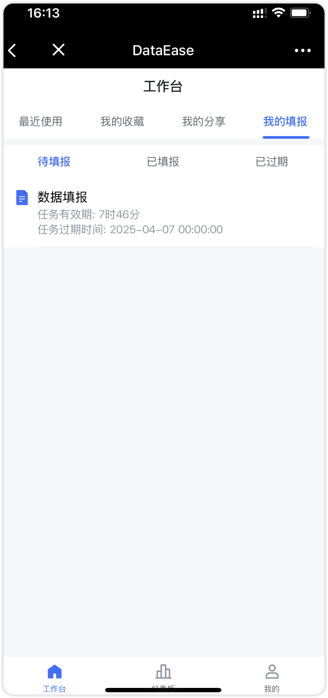{ width="450px" }  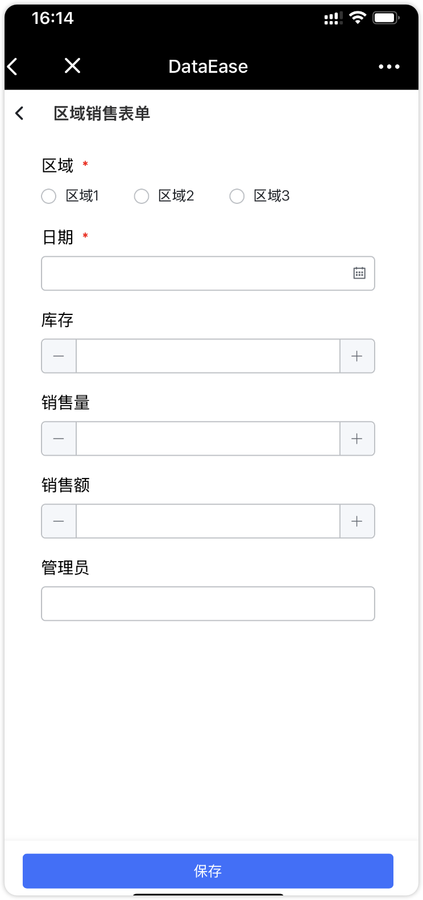{ width="450px" }

### 2.3 数据填报的提交记录日志支持清理（XPack）

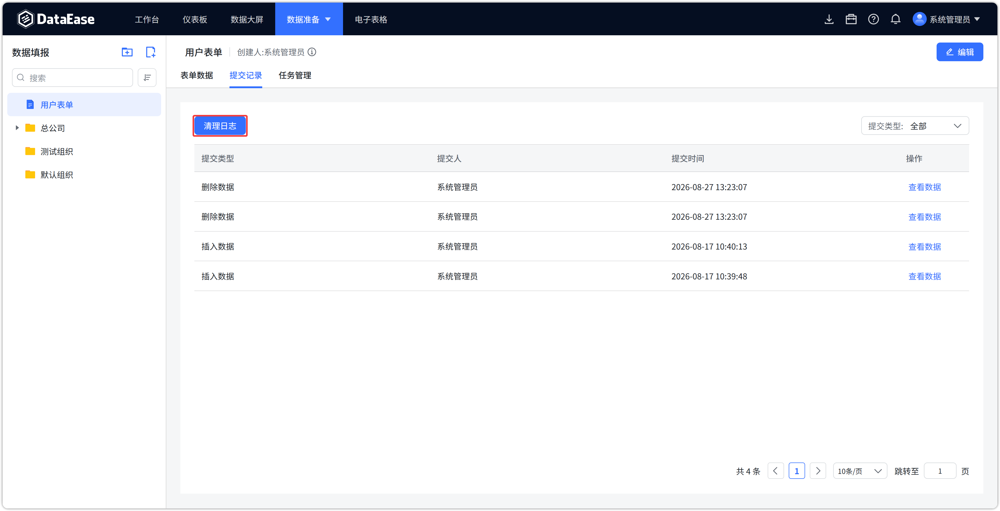{ width="900px" }

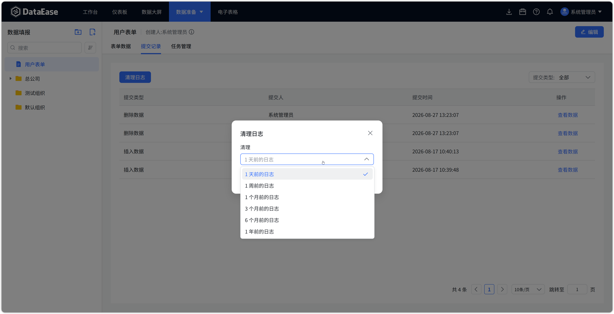{ width="900px" }

## 3 嵌入式（XPack）

### 3.1 模板管理页面支持嵌入

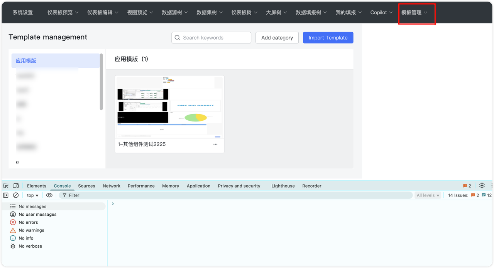{ width="900px" }

