# 更新日志

## 1  仪表板与数据大屏

### 1.1 Tab 组件支持轮播
{ width="900px" }
!!! Abstract ""
    Tab 组件的轮播在编辑状态下不生效，在预览模式下才会生效。

{ width="900px" }

### 1.2 图片、富文本、指标卡、图形、图标组件支持事件设置
!!! Abstract ""
    **仪表板中支持的事件：**

    - 跳转：跳转到指定 URL
    - 刷新：刷新整个仪表板

    **数据大屏中支持的事件：**

    - 跳转：跳转到指定 URL
    - 刷新：刷新整个数据大屏
    - 弹窗区域：控制弹窗区显示

    **注意：事件绑定需退出编辑模式后生效，富文本开启绑定事件则内部点击事件失效。**

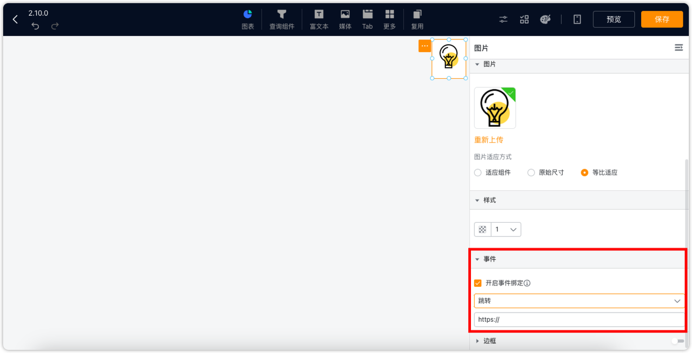{ width="900px" }

### 1.3 支持原始明细数据导出

{ width="900px" }

### 1.4 支持设置组件边框

{ width="900px" }

### 1.5 支持地图、气泡地图、符号地图的提示轮播展示
!!! Abstract ""
    地图和气泡地图按照地图映射顺序轮播，符号地图按照数据顺序轮播。

{ width="900px" }

{ width="900px" }

### 1.6 堆叠组合图支持根据堆叠项进行排序

{ width="900px" }

### 1.7 明细表支持显示图片
!!! Abstract ""
    数据集字段类型新增“URL”类型。

{ width="900px" }

!!! Abstract ""
    目前 URL 字段被自动展示为图片，后续会支持细分扩展，如 URL 图片、URL 链接等。

{ width="900px" }

!!! Abstract ""
    图片展示高度根据所设置单元格行高自适应。

{ width="900px" }

!!! Abstract ""
    鼠标悬浮在单元格上，会出现图片原始链接。

{ width="900px" }

!!! Abstract ""
    鼠标点击单元格图片，图片会放大展示。  

{ width="900px" }

### 1.8 图表过滤器支持动态日期
!!! Abstract ""
    当图表需要依赖动态日期展示内容时，不再完全依赖筛选组件，而可以通过在图表自己的过滤器中配置来 实现。

{ width="900px" }

{ width="900px" }

### 1.9  指标卡支持显示同环比数据
!!! Abstract ""
    **注意：**

    - 指标卡的同环比同其他图表组件的同环比规则，可支持查询组件过滤，但不支持图表过滤器过滤；
    - 在同环比的情况下，先进行同环比计算，再加入查询组件的查询限制；
    - 而图表过滤器的查询在同环比计算之前，在同时使用图表过滤器时，会存在数据不符合预期的情况。

{ width="900px" }
{ width="900px" }

### 1.10  漏斗图支持展示转化率

{ width="900px" }

### 1.11 词云图支持轴值设置
!!! Abstract ""
    词云图中的轴值可作为指标值的过滤条件，仅显示轴值范围内的数据。

{ width="900px" }

### 1.12 弹窗区查询按钮支持显示控制
!!! Abstract ""
    打开预览时弹窗区域的控制按钮，则支持用户预览数据大屏时动态调整弹窗区域的显隐。
{ width="900px" }
    
{ width="900px" }

!!! Abstract ""
    关闭预览时弹窗区域的控制按钮，则弹窗区域被完全隐藏，且用户无法在预览界面手动调出弹窗区域。

{ width="900px" }

{ width="900px" }

### 1.13 数据大屏支持 Tab 组件
!!! Abstract ""
    同仪表板 Tab 组件功能，且同时支持轮播。
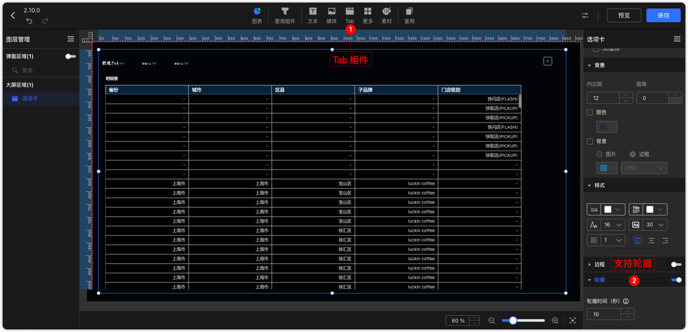{ width="900px" }

### 1.14 数据大屏支持缩放方式设置
!!! Abstract ""
    数据大屏新增三种缩放方式选择：宽度优先、高度优先、铺满全屏。

{ width="900px" }

!!! Abstract ""
    宽度优先：以画布宽度完整显示为前提，等比缩放高度显示。

{ width="900px" }

!!! Abstract ""
    高度优先：以画布高度完整显示为前提，等比缩放宽度显示。

{ width="900px" }

!!! Abstract ""
    铺满全屏：按屏幕尺寸缩放画布，会出现组件比例变形的情况。

{ width="900px" }

### 1.15 数据大屏组件支持 3D 设置
!!! Abstract ""
    数据大屏中所有组件均支持 3D 设置，且支持组件组合后进行 3D 设置。
{ width="900px" }

### 1.16 查询组件中的日期范围组件支持常用区间值选择
!!! Abstract ""
    在使用日期范围类型且选择动态时间时，下拉选项提供了更多常用区间值。
{ width="900px" }

### 1.17 气泡地图事件触发区域改为气泡触发
!!! Abstract ""
    气泡地图的事件改为点击到气泡才触发。
{ width="900px" }

### 1.18 新增热力图

{ width="900px" }

### 1.19 外部传参支持绑定数据集变量
!!! Abstract ""
    之前版本里，参数关联查询组件时，不需要选择关联条件，一般使用场景中，一个关联条件应该对应一个参数。之前版本中若查询组件存在多个关联条件，且与外部参数做了关联的话，在新版本中会删除该查询组件的所有关联，需要重新添加。 仅存在一个关联关系的查询组件不受影响。

{ width="900px" }

!!! Abstract ""
    之前版本中，外部参数关联组件时，是直接将所有组件列出，让用户一一选择组件及联动字段。  

{ width="900px" }

!!! Abstract ""
    新版本中，对关联组件做了分类，分为查询组件和图表两类。查询组件的关联需要选择关联条件。图表关联则可以通过数据集批量关联，减少重复操作。且图表的关联支持直接选择与数据集参数进行关联。  
    **注意：外部传参同时关联查询组件与图表时，以查询组件的优先级优先。**

{ width="900px" }

### 1.20 富文本支持空值处理
!!! Abstract ""
    富文本空值默认置为 "-"，也可以自定义为任意内容，比如 0。

{ width="900px" }

### 1.21  K 线图支持设置图例

{ width="900px" }

## 2 数据准备

### 2.1 API 数据源支持时间函数
!!! Abstract ""
    API 数据源在请求参数的请求头、QUERY 参数、请求体（form-data、x-www-form-urlencoded）均增加时间函数支持。目前内置的时间函数有当天（yyyy-MM-DD）、当天（yyyy/MM/DD）。

{ width="900px" }

### 2.2 支持数据集数据导出

{ width="900px" }

### 2.3 SQL 片段支持注释

{ width="900px" }

### 2.4 新增数据填报（XPack）
!!! Abstract ""
    新增【数据填报】模块。可以管理填报表单并下发填报任务。

{ width="900px" }

!!! Abstract ""
    创建填报表单，配置表单字段。

{ width="900px" }

!!! Abstract ""
    保存表单时选择一个具体的数据源（也可以选择内建数据库，即 DataEase 系统数据库），并设置对应表名及表单各个字段对应的数据库表字段名称。后续所填写的表单数据将会被保存至该数据源的库表下。

{ width="900px" }

!!! Abstract "" 
    表单创建完成后所具备的基础功能如下：

{ width="900px" }

!!! Abstract ""
    在【工作台-我的填报】里可以查看和用户相关的填报任务，可以填写和修改表单数据。

{ width="900px" }

## 3 组织管理这些
### 3.1 新增血缘分析（XPack）
!!! Abstract ""
    【组织管理中心】新增【血缘分析】，可以通过列表、脑图两种形式查看资源的关联关系。

{ width="900px" }

{ width="900px" }

!!! Abstract ""
    脑图形式查看时，点击资源节点，可以查看该节点的详情，以及该资源节点相关的资源依赖。

{ width="900px" }

!!! Abstract ""
    通过【新页面打开】功能，可以直接跳转到该资源的预览页。血缘分析中可以看到所有关联的资源，比如可以看到基于指定数据集所创建的所有仪表板。但是通过【新页面打开】功能访问这些仪表板时，若当前用户无权限，会提示权限错误而无法访问。

{ width="900px" }

!!! Abstract ""
    删除数据源或数据集资源时，若存在基于该资源创建的内容，系统会给出相关提示，用户可通过点击【查看血缘关系】按钮查看关联资源。

{ width="900px" }

{ width="900px" }

### 3.2 新增告警管理（XPack）
!!! Abstract ""
    待补充。

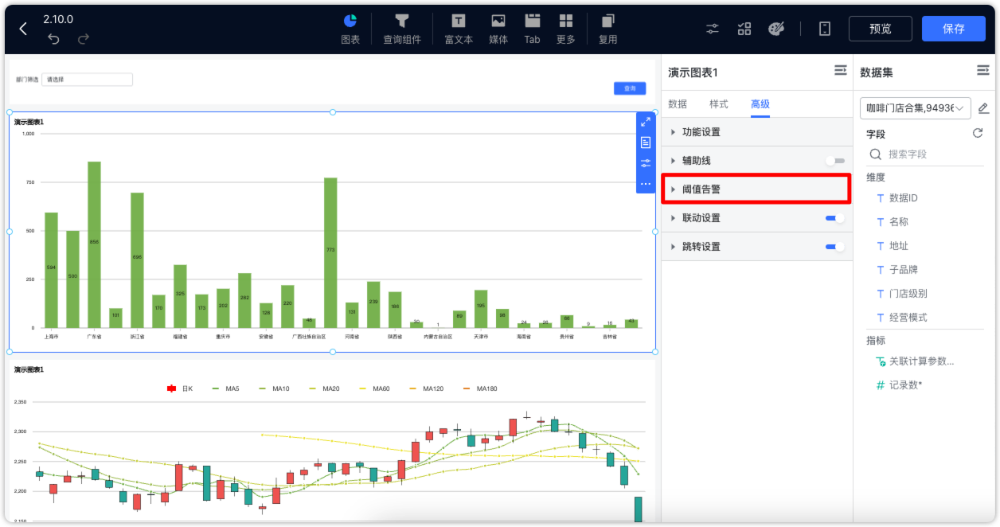{ width="900px" }

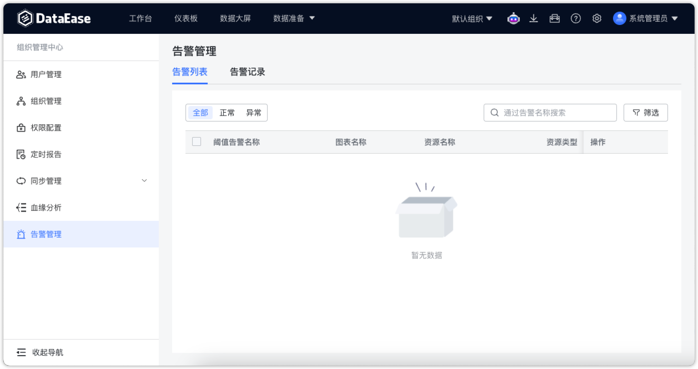{ width="900px" }

## 4 系统设置
### 4.1 新增字体管理
!!! Abstract ""
    新增字体管理，字体类型分为系统内置和自定义两类。系统内置字体不可删除，且不带字库文件，但用户可自行上传字库文件。

{ width="900px" }

!!! Abstract ""
    支持用户添加新的字体，添加新字体时可选择是否同时上传字库文件。已创建的字体名称不允许修改且新建字体名称不允许重复。

{ width="900px" }

!!! Abstract ""
    可以给还没有字库文件的字体类型上传字库文件，或是给已经存在字库文件的字体替换字库文件。

{ width="900px" }

!!! Abstract ""
    可将自己上传的字体设置为系统默认字体，默认字体将影响系统字体显示。

{ width="900px" }

!!! Abstract ""
    在【字体管理】中的所有字体，均可用于仪表板和数据大屏中能够设置字体的选项中。

{ width="900px" }

### 4.2 支持配置移动端登录界面（XPack）
!!! Abstract ""
    外观配置支持设置移动端登录 Logo 及背景图。

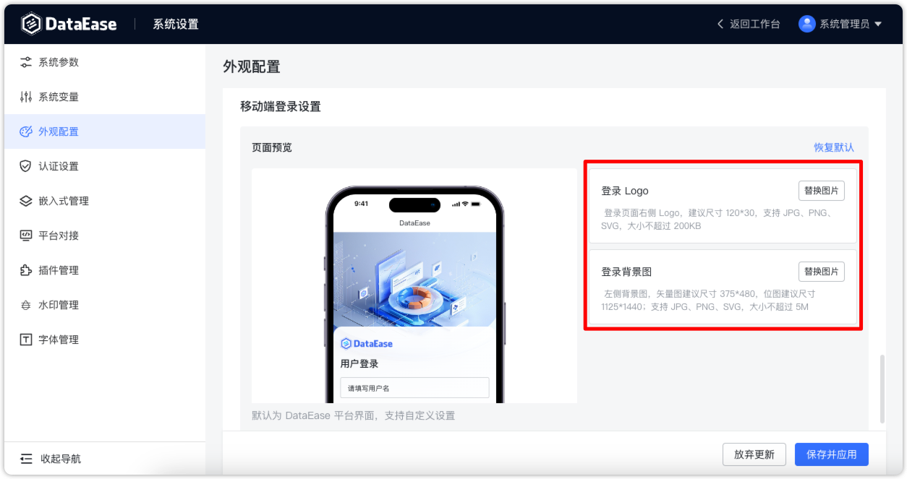{ width="900px" }

### 4.3 新增达梦数据源插件（XPack）
!!! Abstract ""
    对接测试版本为 DM8（dm8_20240715_rev232765_x86_rh6_64）

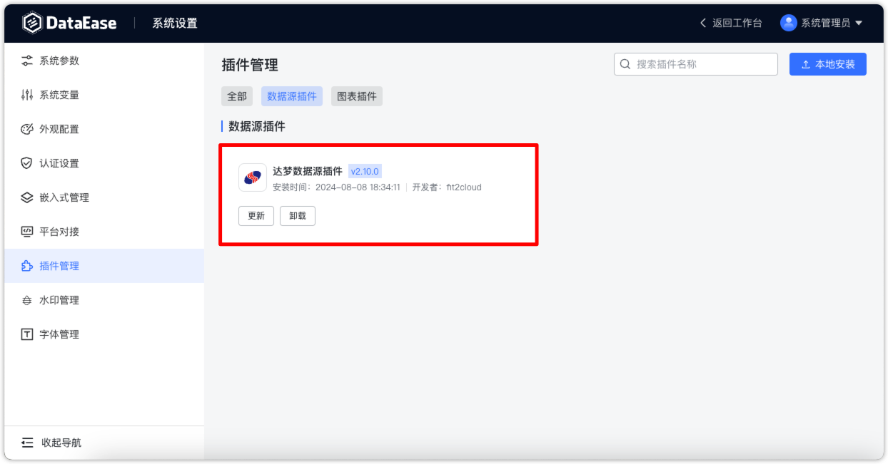{ width="900px" }

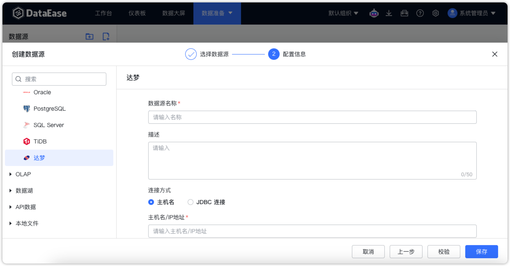{ width="900px" }

## 5 其他
### 5.1 新增应用功能
!!! Abstract ""
    支持将仪表板和数据大屏以应用的形式进行导出。  
    在 DataEase v2 中，应用作为模板的其中一种形式，和模板同时放在【模板管理】中管理。关于模板文件与应用文件的区别可参考：https://kb.fit2cloud.com/?p=211。  
    可将自己的仪表板/数据大屏导出为【应用】。

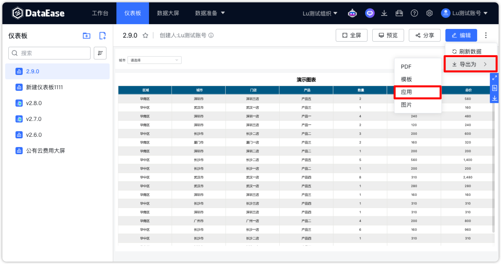{ width="900px" }

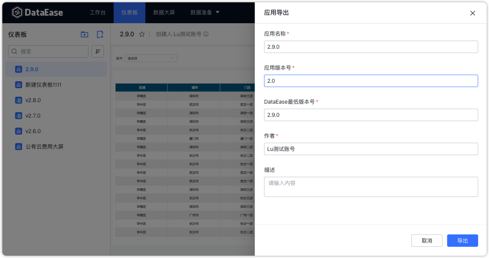{ width="900px" }
!!! Abstract ""
    可在【模板管理】中上传应用。
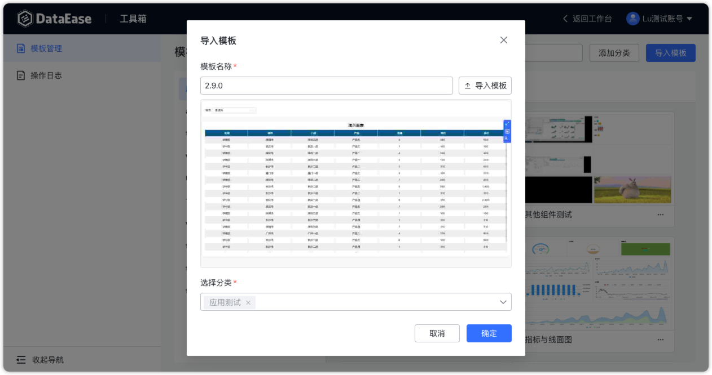{ width="900px" }
!!! Abstract ""
    使用模板新建仪表板或数据大屏时可选择使用存在的应用文件。

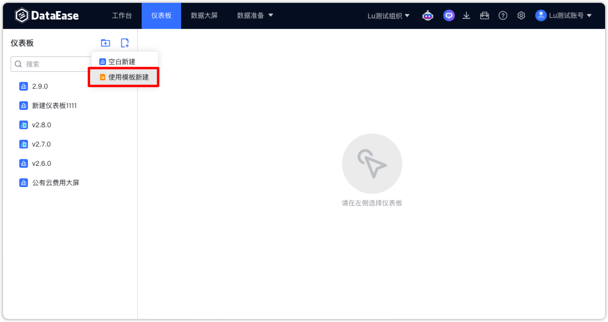{ width="900px" }

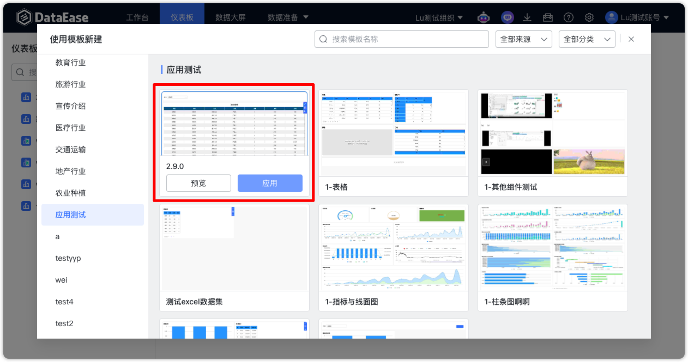{ width="900px" }
!!! Abstract ""
    使用应用创建的资源，会自动弹出相关配置项，需要用户进一步填写。

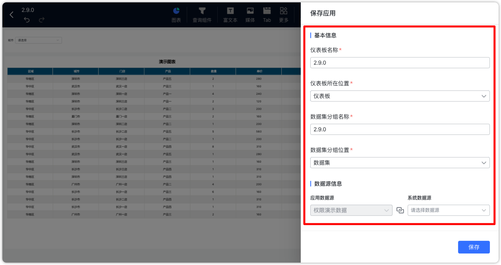{ width="900px" }
### 5.2 新增 Copilot 对话分析功能
!!! Abstract "" 
    用户可以先选择一个数据集，并围绕该数据集的相关信息与 Copilot 进行对话。Copilot 将通过表格、折线图等形式展示相关的分析数据。  
    上下文关联与历史记录：用户当前数据集的所有对话都存在上下文关系，并且所有对话历史记录都会保存在数据库中。当用户从其他页面返回到 Copilot 对话分析页面时，系统会自动恢复之前针对该数据集的所有对话历史。需要注意的是，由于会话历史数据的增加，会影响 Copilot 的响应速度，所以在以后版本中这里可能会调整。  
    会话切换：在用户切换数据集或组织时，会自动开启一个全新的会话，以确保不同数据集和组织之间的对话互不干扰。  
    数据源类型支持：目前，Copilot 支持以下数据源类型，需要注意的是，MySQL 和 PostgreSQL 有更好的支持效果，其他类型数据库的支持目前会差一些。  

    - MySQL
    - PostgreSQL
    - Oracle
    - SQLServer
{ width="900px" }

{ width="900px" }

