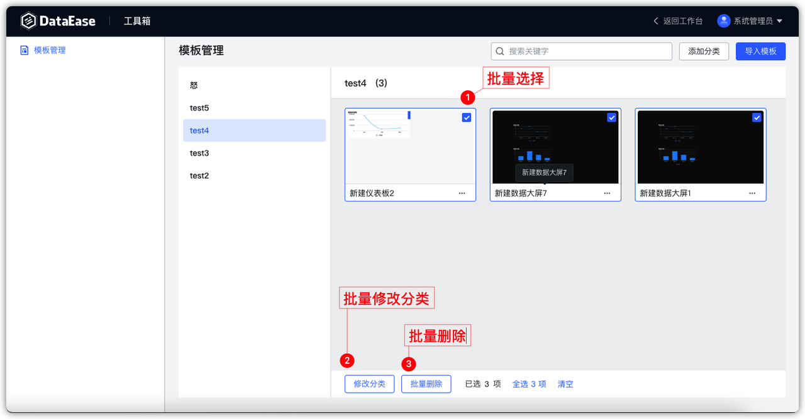
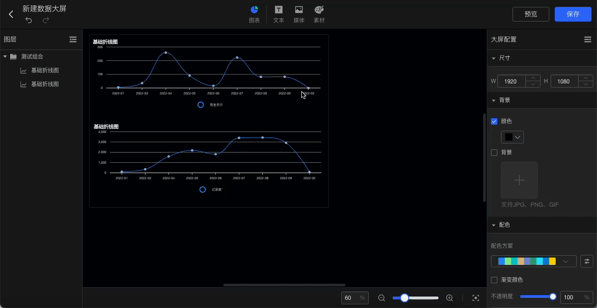
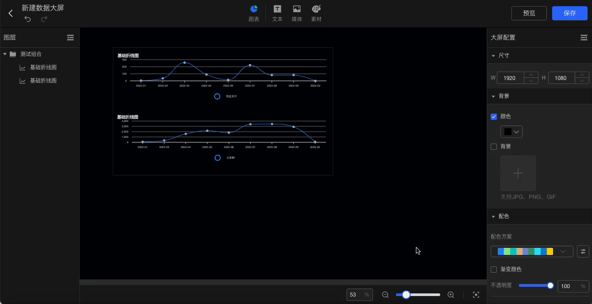

# 更新日志

## 1 模板中心

### 1.1 模板管理支持批量操作
!!! Abstract ""
    - 支持批量修改模板分类
    - 支持批量删除模板
{ width="900px" }

### 1.2 优化 DataEase 环境无法访问在线模板市场时的模板中心与使用模板创建页面

!!! Abstract ""
    只显示 DataEase 系统内模板管理中的模板。
{ width="900px" }

## 2 数据准备
### 2.1 数据集编辑界面支持下拉框搜索
{ width="900px" }

### 2.2 继续创建数据源时保持上一次的默认文件夹
!!! Abstract ""
    在具体数据源文件夹下点击创建数据源。
{ width="900px" }
!!! Abstract ""
    保存时的默认文件夹为创建时所选择的。

{ width="900px" }

!!! Abstract ""
    此时点击继续创建，则下一个数据源保存时的默认文件夹与本次自动保持一致。
{ width="900px" }

## 3 仪表板与数据大屏
### 3.1  查询组件支持下拉选项设置为必填
{ width="900px" }
{ width="900px" }
### 3.2 组件组合后，在图层管理中可以按照分组查看组件列表
{ width="900px" }
### 3.3 支持分组内部移动定位操作
!!! Abstract ""
    多个组件创建分组后，可以作为分组整体移动，如果需要单独调整分组内组件的位置，可以通过双击该组件，然后移动该组件的所在位置。
{ width="900px" }
### 3.4 放大缩小组合时其内部组件同比放大缩小 
{ width="900px" }
### 3.5 画布放大缩小其图表支持同比放大缩小
{ width="900px" }

## 4 其他
### 4.1 允许社区版修改 admin 账号的密码
{ width="900px" }
{ width="900px" }
### 4.2 优化版本切换脚本
!!! Abstract ""
    v2.2.0 开始，修改 .env 文件的 DE_INSTALL_MODE 后，可以通过以下三种方式使配置生效，推荐 dectl reload。

    - 重新执行 install.sh
    - dectl reload
    - dectl restart