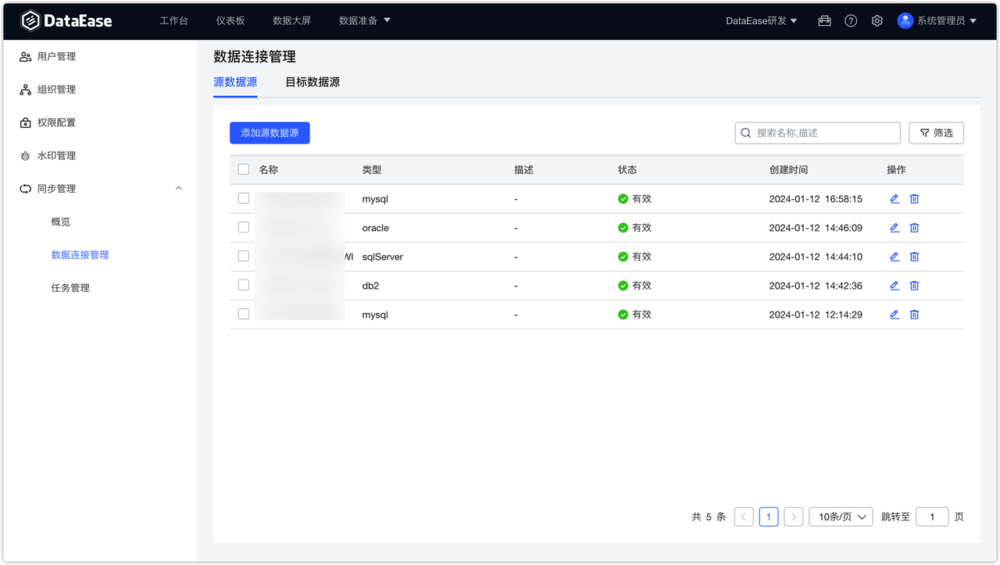
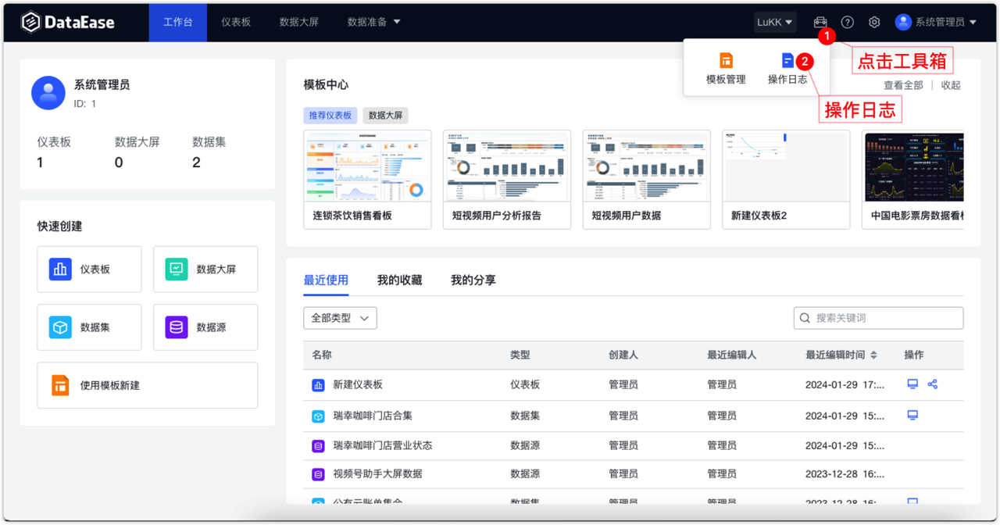

# 更新日志

## 1 数据准备

### 1.1 支持 Db2 数据源
!!! Abstract ""
    支持 Db2 11 及以上版本。
{ width="900px" }

### 1.2 数据源与数据集列表树过滤支持大小写

{ width="900px" }
{ width="900px" }

## 2. 仪表板与数据大屏
### 2.1 仪表板：新建组件自动横向占位
!!! Abstract ""
    新添加组件的时候，会优先向右侧布局，位置不够的时候，才会自动换行添加。
{ width="900px" }
{ width="900px" }

### 2.2 仪表板：新增年月时间范围支持
!!! Abstract ""
{ width="900px" }

### 2.3 数据大屏：支持多个组件上下左右快速对齐
!!! Abstract ""
    选择多个组件后，可以快速对齐，支持左对齐、右对齐、上对齐、下对齐、水平居中、垂直居中。
{ width="900px" }

### 2.4 数据大屏：屏幕尺寸上限调整
!!! Abstract ""
    调整数据大屏宽高上限为 50000。
{ width="900px" }

### 2.5 新增透视表
!!! Abstract ""
    仪表板与数据大屏均增加透视表组件。
{ width="900px" }
### 2.6 新增指标卡
!!! Abstract ""
    仪表板与数据大屏均增加指标卡组件。
{ width="900px" }

### 2.7 社区版支持公共链接功能
{ width="900px" }

## 3 组织管理中心
### 3.1 增加同步管理模块（XPack）
!!! Abstract ""
    支持将用户自己数据库里的数据同步到如 Apache Doris 等高性能实时的分析型数据库中。
   
    - 当前支持同步的源数据库：Db2、MySQL、Oracle、SQL Server
    - 当前支持的目标数据库：Apache Doris（v1.2 及以上版本）
{ width="900px" }
{ width="900px" }
{ width="900px" }
### 3.2 支持水印设置（XPack）
{ width="900px" }

## 4 工具箱
### 4.1 增加操作日志模块（XPack）
!!! Abstract ""
    系统管理员可以查看所有日志，包括组织管理员在内的其他用户只能查看自己的所有日志，包括该用户所在的所有组织下的操作日志。
{ width="900px" }
!!! Abstract ""
    可根据操作类型、操作用户、所属组织、操作时间等查询系统操作日志。
{ width="900px"}

## 5 其他

### 5.1 支持 API 文档（XPack）
!!! Abstract ""
    API Key 页面新增【查看API】功能，可以通过点击该按钮跳转到 API 文档页面查看相关调用文档，并在线调试。
{ width="900px"}

{ width="900px"}

### 5.2 嵌入式支持增强（XPack）
!!! Abstract ""
    嵌入式支持嵌入仪表板、数据大屏、数据源、数据集页面（带左侧的树形菜单）。   
    以下是嵌入式示例工程运行后的效果，顶部菜单的右侧 4 个菜单对应的即为仪表板、数据大屏、数据源、数据集页面（带左侧的树形菜单）。
{ width="900px"}

### 5.3 dectl 脚本支持查询最新版本信息
!!! Abstract ""
    dectl version 命令在历史版本中只会获取当前 DataEase 的版本信息，本次新增从 GitHub 检测最新版本号。


    ```
    dectl version
    current version is v2.2.0
    检测 github.com …… ok
    latest version is v2.2.0
    ```