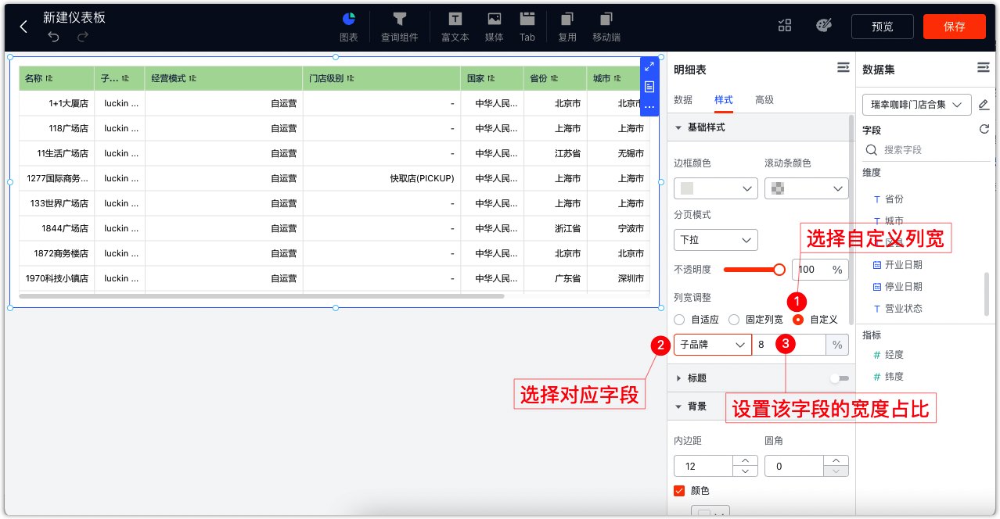
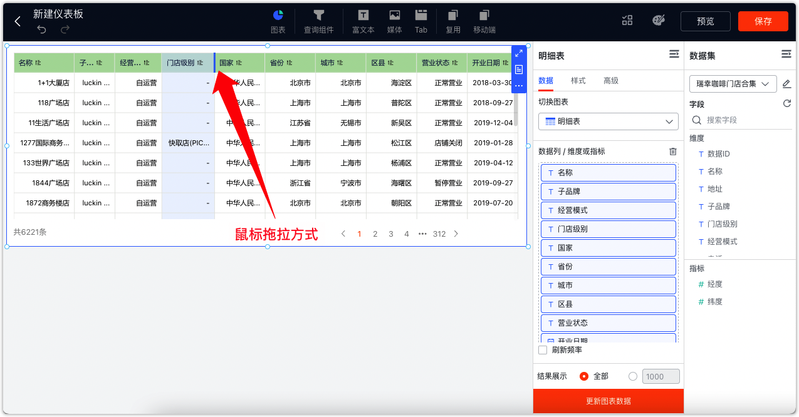
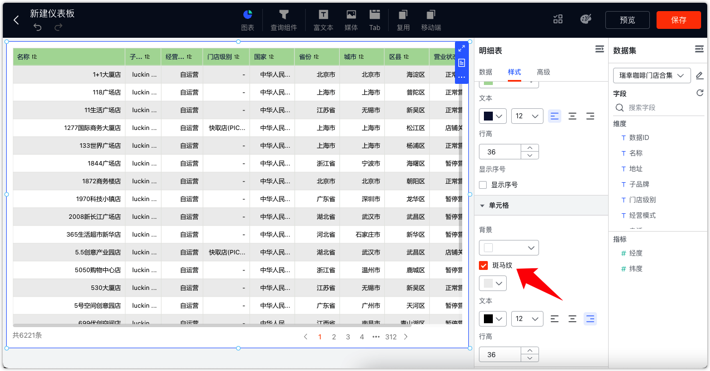
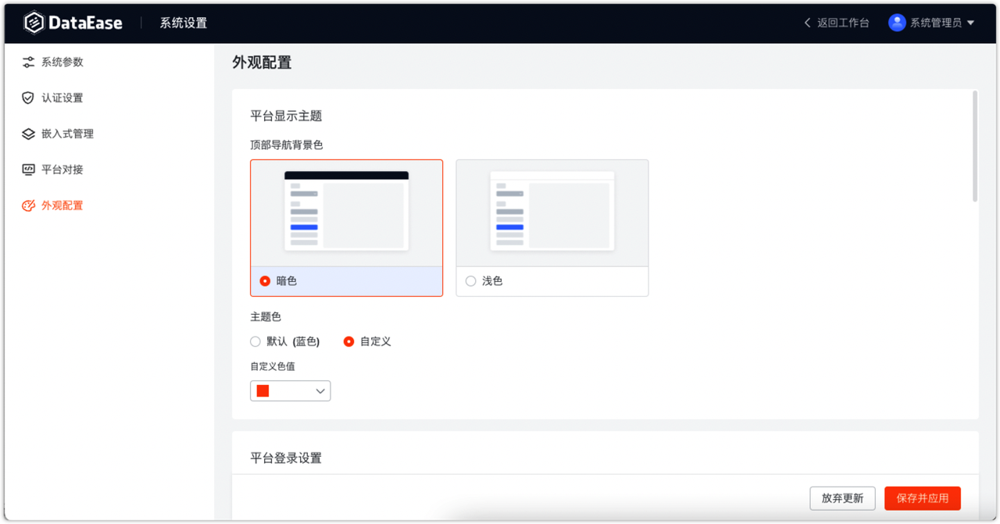
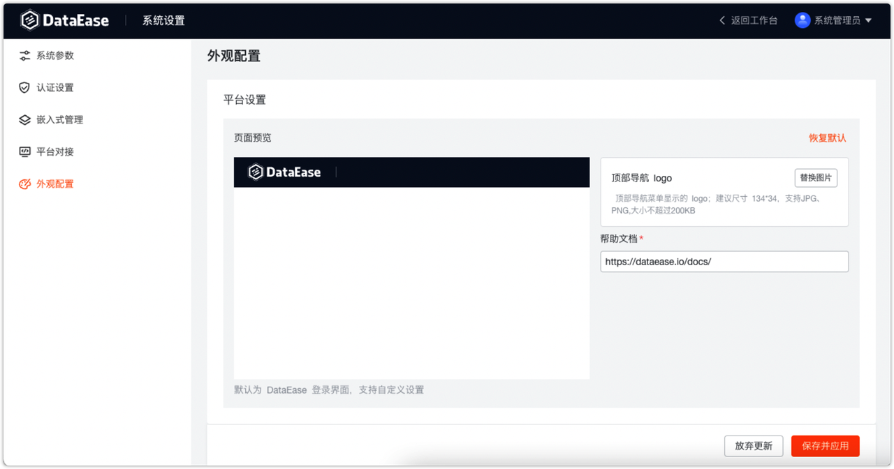
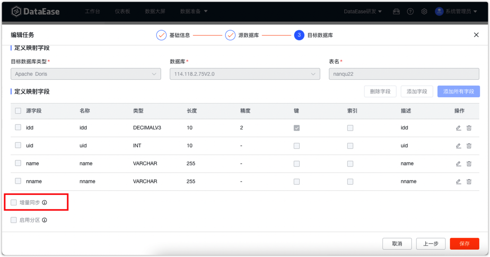
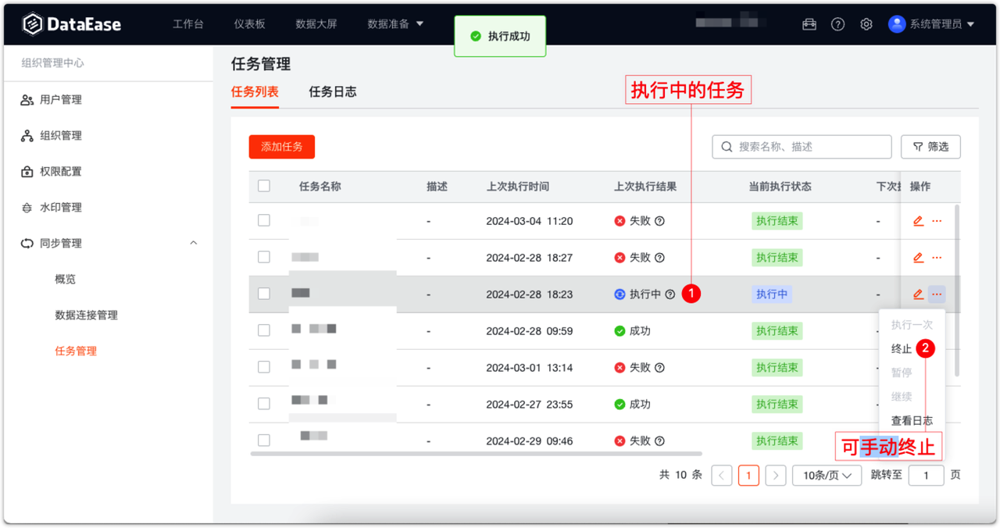

# 更新日志

## 1 通用功能

### 1.1 树列表侧边栏支持展开与收起
!!! Abstract ""
    数据源、数据集、数据大屏、仪表板界面均支持展开或收起左侧树形菜单栏。
{ width="900px" }
{ width="900px" }

## 2 移动端 仪表板与数据大屏

### 2.1 数据大屏新增图形素材

{ width="900px" }
{ width="900px" }

### 2.2 富文本组件支持撤销操作
!!! Abstract ""
    使用组件自带的按键或键盘快捷键均可。
{ width="900px" }
### 2.3 明细表/汇总表支持按列设置宽度
!!! Abstract ""
    方式一：手动针对各个字段配置所占表格宽度的百分比。
{ width="900px" }
!!! Abstract ""
    方式二：手动拖拉。
{ width="900px" }
!!! Abstract ""
    请注意，在预览界面与编辑界面均支持手动拖拉表格宽度，但只有编辑界面下拖拉完成保存后生效，在预览界面拖拉仅用于临时使用，刷新页面后将还原。
{ width="900px" }
### 2.4 表格支持斑马纹
{ width="900px" }
### 2.5 表格支持右键复制单元格内容
!!! Abstract ""
    鼠标悬浮到某一单元格上，点击右键，即可复制当前单元格内容。（注意，这里不会另外弹出复制按钮，右键之后就已经完成了复制）
{ width="900px" }

## 3 移动端

### 3.1 新增移动端支持
!!! Abstract ""
    功能说明：

    - 移动端共有“工作台”、“仪表板”和“我的”三个 Tab 栏；
    - 工作台类似 PC 端工作台场景，可以查看“最近使用”、“我的收藏”、“我的分享”；
    - 移动端仅支持查看仪表板资源（数据大屏由于使用场景和分辨率问题，不考虑在移动端支持）；
    - 支持在“我的”中切换当前组织。
!!! Abstract ""
    配置仪表板移动端：

{ width="900px" }
{ width="900px" }

!!! Abstract ""
    移动端界面：
{ width="900px" }

## 4 系统设置
### 4.1 平台对接支持企业微信、钉钉、Lark（XPack）
!!! Abstract ""
    可通过企业微信、钉钉、Lark扫码方式登录 DataEase。
.png){ width="900px" }

### 4.2 新增外观配置（XPack）
!!! Abstract ""
    外观配置包括平台显示主题、平台登录设置与平台设置三类。
{ width="900px" }
{ width="900px" }
{ width="900px" }
### 4.3 支持引擎设置
!!! Abstract ""
    可将 Excel 数据及 API 数据同步至该引擎数据库中，仅支持 MySQL。
{ width="900px" }

## 5 组织管理中心（XPack）
### 5.1 同步管理功能优化
!!! Abstract ""
    同步任务支持设置增量同步

    - 全量：全量覆盖同步
    - 增量：根据增量字段增量同步，增量字段必须是整型或时间类型
{ width="900px" }

!!! Abstract ""
    支持手动终止执行中的任务
{ width="900px" }

## 6 工作台
### 6.1 支持在我的收藏页取消收藏操作
{ width="900px" }

## 7 服务运维
### 7.1 dectl 增加备份与恢复操作
!!! Abstract ""
    dectl 命令新增 backup 和 restore 功能：

    - 备份操作：dectl backup
    - 恢复操作：dectl restore DataEase备份文件.tar.gz  

    dectl backup 命令将 DataEase 排除日志目录以外的运行目录（如 /opt/dataease2.0）进行备份压缩，生成备份文件 DataEase备份文件.tar.gz。在安装了同样版本的 DataEase 服务器上，用户可以通过执行 dectl restore DataEase备份文件.tar.gz 将 DataEase 还原为备份的内容。   
    **请注意：备份文件中并不包含完整的镜像文件，所以备份和还原操作只能在同版本的情况下执行。**
