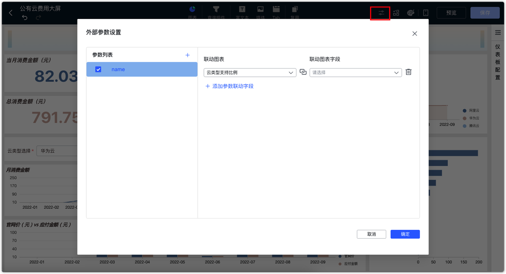

# 更新日志

## 1  仪表板与数据大屏

### 1.1 仪表板、数据大屏等页面的资源树支持排序
!!! Abstract ""
    仪表板、数据大屏、数据集、数据源模块的资源树，支持按照资源的创建时间、名称进行升序和降序排列。
{ width="900px" }

### 1.2 仪表板支持外部参数功能

{ width="900px" }


### 1.3 数据大屏增加时钟组件

{ width="900px" }

### 1.4 数据大屏支持多个组件批量移动
!!! Abstract ""
    数据大屏支持选择多个组件后批量移动。
{ width="900px" }

### 1.5 日期查询组件可设置查询的起止日期
!!! Abstract ""
    区间类型支持以下设置：开始于、结束于、时间区间、动态查询时间窗口（单次查询最多 N 天）。
{ width="900px" }
!!! Abstract ""
    开始于：【开始于】日期前的日期无法被选择，支持设置【固定时间】与【动态时间】。比如，以下设置【开始于】日期为 2024-03-29，则 2024-03-29 前的日期无法再被选择。
{ width="900px" }
{ width="900px" }
!!! Abstract ""
    结束于：【结束于】日期后的日期无法被选择，支持设置【固定时间】与【动态时间】。比如，以下设置【结束于】日期为 2024-03-29，则 2024-03-29 后的日期无法再被选择。
{ width="900px" }
{ width="900px" }
!!! Abstract ""
    时间区间：只能选择该区间内的日期进行查询，支持设置【固定时间】与【动态时间】。比如如下设置了一个月的动态时间，则查询组件只能选今天起前一个月内的日期。
{ width="900px" }
{ width="900px" }
!!! Abstract ""
    动态查询窗口：一次最多只能查询 N 天的日期范围，如下所示，设置单次查询时间最多 5 天，则在使用日期范围组件时，无法一次性选择大于 5 天的时间范围。
{ width="900px" }
{ width="900px" }

### 1.6 新增气泡地图
{ width="900px" }

### 1.7 增加配置：开启移动端
!!! Abstract ""
    可在移动端的编辑界面设置是否【开启移动端】。
{ width="900px" }

## 2 数据准备

### 2.1 支持获取数据源数据表以及数据集字段的描述信息

{ width="900px" }
{ width="900px" }

### 2.2 计算字段支持被二次引用

{ width="900px" }


## 3 系统设置
### 3.1 支持从个人信息处绑定第三方平台账号
!!! Abstract ""
    支持从个人信息处绑定第三方平台账号，前提是已经在系统设置的平台对接中对接了第三方平台。
{ width="900px" }

## 4 其他
### 4.1 支持配置是否启用 HTML 缓存
!!! Abstract ""
    支持在 /opt/dataease2.0/conf/application.yml 配置文件中，通过设置参数 dataease.http.cache 来控制是否启用 html 缓存，默认情况下关闭 html 缓存。
    
    ```
    server:
    tomcat:
    connection-timeout: 70000
    spring:
    servlet:
    multipart:
    max-file-size: 500MB
    max-request-size: 500MB
    datasource:
    url: jdbc:mysql://mysql-de:3306/dataease?
    username: root
    password: Password123@mysql
    dataease:
    http:
    cache: true

    ```
### 4.2 集成 MaxKB，新增 DataEaseAI 小助手
{ width="900px" }

