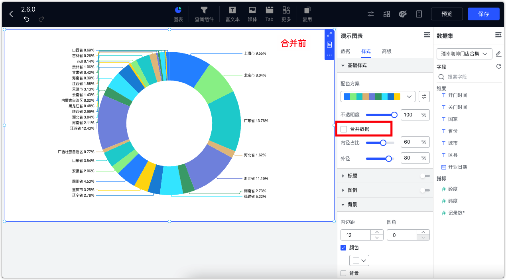

# 更新日志

## 1  仪表板与数据大屏

### 1.1 新增象限图

{ width="900px" }

### 1.2 新增组合图

{ width="900px" }

### 1.3 地图组件支持地名映射配置

{ width="900px" }

### 1.4 地图支持缩放
{ width="900px" }

### 1.5 指标卡支持设置名称和值的间距

{ width="900px" }

### 1.6 表格支持悬停展示表头和表格内容
!!! Abstract ""
    当单元格内容过多，没有显示完全时，可开启此功能，鼠标悬浮在表头或单元格上，自动显示其完整内容。
{ width="900px" }

### 1.7 词云图支持配置字号大小区间和文字间距
{ width="900px" }

### 1.8 透视表支持树形展示
!!! Abstract ""
    透视表支持在样式中设置【平铺展示】或【树形展示】，树形展示支持手动点击将下级字段聚合或展开。
!!! Abstract ""
    平铺展示示例：
{ width="900px" }
!!! Abstract ""
    树形展示示例：
{ width="900px" }

### 1.9 饼图/环形图支持合并数据为其他
!!! Abstract ""
    饼图和环形图均支持 TopN 设置，即显示 TopN，其余的可以合并为其他。
{ width="900px" }
{ width="900px" }

### 1.10 下钻和联动支持配置同时触发
!!! Abstract ""
    当一个图表同时配置了【下钻】与【联动】时，可以选择单独触发，如下图所示，根据提示选择当前执行下钻还是联动。
{ width="900px" }

!!! Abstract ""
    也可以选择在配置联动设置时，选择“同时触发联动和下钻”，这样当点击该图表时将同时执行下钻与联动动作。
{ width="900px" }

{ width="900px" }

### 1.11 制作图表时支持批量选择与拖动字段
!!! Abstract ""
    通过 shift 多选或通过 cmd 多次选择后，可将已选择的多个字段批量拖入维度/指标中。
{ width="900px" }

### 1.12 查询组件支持设置文本搜索
!!! Abstract ""

    - 条件类型：单条件、与条件、或条件
    - 搜索模式：精确匹配、模糊匹配
{ width="900px" }
{ width="900px" }

### 1.13 文本下拉和数字下拉查询组件支持设置显示字段和排序字段
!!! Abstract ""

    - 前提条件：选项值来源选择【选择数据集】。
    - 查询字段：用作后台查询条件。
    - 显示字段：用作前端显示内容。
    - 排序字段：影响前段展示的排序顺序。
{ width="900px" }

### 1.14 外部参数支持关联查询组件
!!! Abstract ""
    外部参数支持传参到仪表板的查询组件中。
{ width="900px" }

### 1.15 跳转设置支持选择目标仪表板中的查询组件
!!! Abstract ""
    跳转设置可选择传参到目标仪表板的查询组件中。
{ width="900px" }

### 1.16 新增网页组件
!!! Abstract ""
    在仪表板编辑界面的顶部菜单栏，点击【更多】->【网页】即可引入网页组件。在配置网站地址时请注意：部分网站可能设置不允许嵌入而无法显示。
{ width="900px" }

### 1.18 数据大屏多选组件后，可在没有组合的情况下整体变更组件大小
!!! Abstract ""
    可通过鼠标框选或按住 Ctrl 点选的方式完成多选，选中后可整体调整组件大小。
{ width="900px" }

### 1.19 仪表板矩阵密度调整
!!! Abstract ""
    仪表板矩阵密度细化为之前密度的 2 倍，可以更精细化调整组件的位置及大小。
{ width="900px" }

### 1.20 优化鼠标和触控板方向探测逻辑，触控板的内外伸缩可以直接控制大屏缩放，鼠标滚轮只控制滚动条

### 1.21 支持自定义公共链接后缀
{ width="500px" }
{ width="500px" }
{ width="900px" }

### 1.22 公共链接支持自定义密码
{ width="500px" }

### 1.23 Pad 端访问公共链接，以 PC 端布局展示

## 2 数据准备

### 2.1 单源数据集写 SQL 时使用对应数据库的 JDBC 语法

### 2.2 创建数据集时，同一个数据表可被多次引用

{ width="900px" }

## 3 平台对接（XPack）
### 3.1 第三方平台支持免密登录
!!! Abstract ""
    支持从个人信息处绑定第三方平台账号，前提是已经在系统设置的平台对接中对接了第三方平台。
{ width="900px" }

{ width="900px" }

{ width="900px" }

## 4 其他
### 4.1 增加 AI 助手的首次指引

{ width="900px" }

