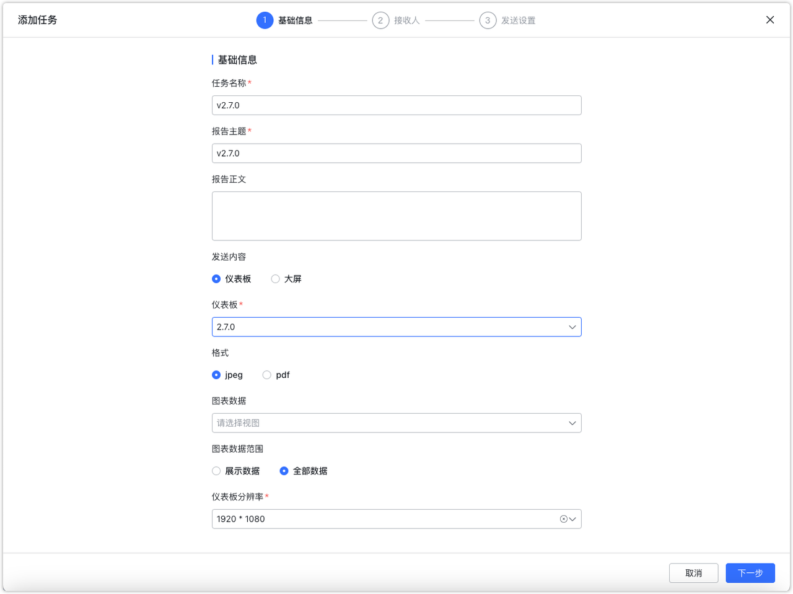
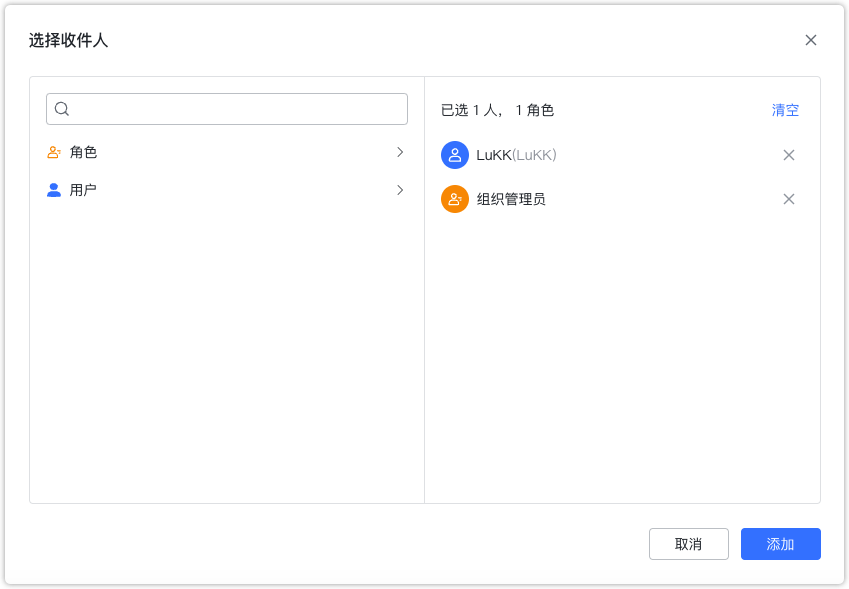
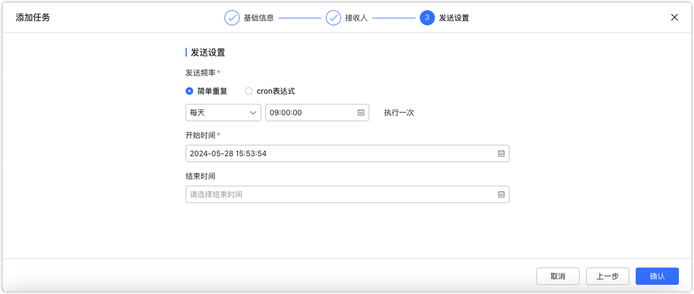

# 更新日志

## 1  仪表板与数据大屏

### 1.1 增加高级样式设置
!!! Abstract ""
    仪表板与数据大屏均增加高级样式设置，包括分页器配色，联动、钻取、跳转的图标颜色，钻取层级展示颜色。

{ width="900px" }
{ width="900px" }

### 1.2 图表过滤器支持复杂的与或条件设置
!!! Abstract ""
    过滤器配置方式有调整，直接点击配置，而非之前的拖动字段配置，即目前的配置方式与 v1 统一。
{ width="900px" }

### 1.3 富文本组件增加字间距配置项

{ width="900px" }

### 1.4 导出图片时支持选择尺寸
{ width="900px" }

### 1.5 数据大屏支持查询组件
!!! Abstract ""
    数据大屏新增支持查询组件，与仪表板查询组件一致。
{ width="900px" }

### 1.6 图表、查询组件等可以直接在右侧编辑区修改标题
!!! Abstract ""
    双击右侧编辑区的标题即可修改标题。
{ width="900px" }

### 1.7 指标卡阈值支持设置背景色
{ width="900px" }

### 1.8 水波图支持设置阈值
{ width="900px" }

### 1.9 表格阈值支持非指标字段
{ width="900px" }

### 1.10 新增桑基图
{ width="900px" }

### 1.11 新增流向地图
{ width="900px" }

### 1.12 新增进度条图
!!! Abstract ""
    通过实际值与目标值自动计算当前完成比例。
{ width="900px" }

### 1.13 新增对称条形图
{ width="900px" }

### 1.14 新增区间条形图
{ width="900px" }

### 1.15 新增流媒体组件
!!! Abstract ""
    流媒体只支持 flv 格式，如果需要使用 rtsp 格式，可参考知识库文章：https://kb.fit2cloud.com/?p=182 。
{ width="900px" }

### 1.16 新增视频组件
!!! Abstract ""
    不能上传本地视频，需要填写视频链接信息。如果需要搭建视频服务器可参考知识库：https://kb.fit2cloud.com/?p=0e763f1d-a175-49e0-ac69-af8d39fb789b、https://kb.fit2cloud.com/?p=15 。
{ width="900px" }

### 1.17 象限图恒线支持设置小数及负数
{ width="900px" }

### 1.18 数据大屏新增跑马灯组件
!!! Abstract ""
    数据大屏新增跑马灯组件，实现文字的循环滚动。支持设置文字颜色、字间距、字体大小、透明度、播放速度等选项。
{ width="900px" }

### 1.19 查询组件下拉列表选项优化
!!! Abstract ""

    - 如果未设置显示和排序字段，或者这两个字段与查询字段相同，则获取 1000 个选项进行过滤，而不是获取 1000 条数据。
    - 在上述条件下，支持类似 v1 版本的动态过滤功能，允许在下拉选择框中输入查询内容，实时从数据库中查询最多 1000 个选项。
    - 当显示和排序字段与查询字段不同时，无论是默认下拉选项还是动态查询选项，都获取 1000 条数据进行过滤。

### 1.20 查询组件绑定参数的方式优化
!!! Abstract ""
    参数绑定的操作前置到字段选择。
    当绑定参数时，选项值来源不能为自动，否则选项值为空。因此当绑定了图表的参数时，将选项值来源的「自动」选项置灰，为不可用状态
{ width="900px" }
{ width="900px" }

### 1.23 Pad 端访问公共链接，以 PC 端布局展示

## 2 数据准备

### 2.1 数据源支持直接输入 jdbc url 字符串进行数据连接
{ width="900px" }

## 3 组织管理中心（XPack）
### 3.1 支持定时报告
!!! Abstract ""
    第一步：基础信息配置
{ width="900px" }
!!! Abstract ""
    第二步：接收人配置
    目前只支持邮件和飞书接收通知。
{ width="900px" }
!!! Abstract ""
    选择内部收件人可以按照角色或用户维度多选。
{ width="900px" }
!!! Abstract ""
    需要发送给外部邮箱可以通过【邮件通知】输入框输入，输入完邮箱后点击回车即可。
{ width="900px" }
!!! Abstract ""
    第三步：配置发送设置
{ width="900px" }

## 4 系统设置(XPack）
### 4.1 外观配置优化
!!! Abstract ""
    支持设置 AI 助手按钮、文档按钮、关于按钮的【显示】、【隐藏】或【Iframe中隐藏】。

    - 显示 - 在各种模式下均显示
    - 隐藏 - 在各种模式下均隐藏
    - Iframe 中隐藏 - 主要用在嵌入式场景中，平台访问均显示，Iframe 嵌入的场景中会不显示
{ width="900px" }
{ width="900px" }
### 4.2 支持禁用初始密码及配置密码有效期
{ width="900px" }

### 4.3 支持第三方平台移动端免密登录

### 4.4 支持在系统设置中配置认证对接信息
!!! Abstract ""
    以前版本设置过 CAS、OIDC 的这里不用再设置，会自动添加到 DataEase 的控制台参数中。
{ width="900px" }

### 4.5 支持设置系统变量
!!! Abstract ""
    系统管理员可以使用【系统变量】模块，在该模块中为全局添加自定义变量。变量分为三种类型：

    - 文本
    - 数值
    - 日期
{ width="900px" }
!!! Abstract ""
    系统管理员可以为文本型变量添加可选值，为数值和日期类型变量设置范围值。
{ width="900px" }
!!! Abstract ""
    系统管理员设置好系统变量后，组织管理员可以为组织内成员配置这些系统变量。
{ width="900px" }
!!! Abstract ""
    在配置数据集的行权限时，除了系统内置的变量外，可以使用这些自定义的系统变量。
{ width="900px" }

## 5 嵌入式（XPack）
### 5.1 Iframe、div 方式嵌入仪表板、数据大屏、图表时支持外部参数
!!! Abstract ""
    其配置方式与使用方法与公共链接一致。

## 6 其他
### 6.1 新增数据导出中心
!!! Abstract ""
    图表的 Excel 数据导出功能已进行优化升级。原本版本直接生成 Excel 文件进行导出的机制，现改进为引入一个全新的数据导出中心，以便统一管理所有导出任务。  
    该导出中心默认支持 10 个并发导出任务，并会自动将生成的数据文件导出至 DataEase 服务器。导出任务完成后，用户将会接收到通知，随时可前往导出中心下载文件。
{ width="900px" }
{ width="900px" }