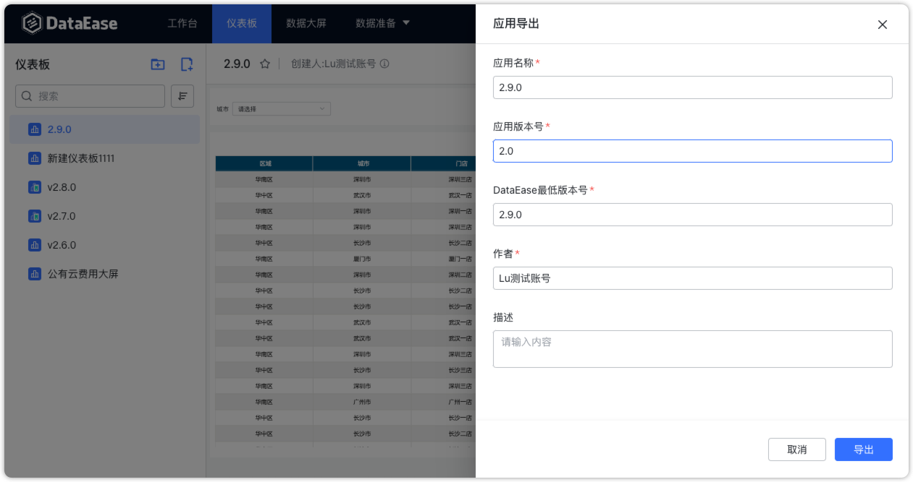
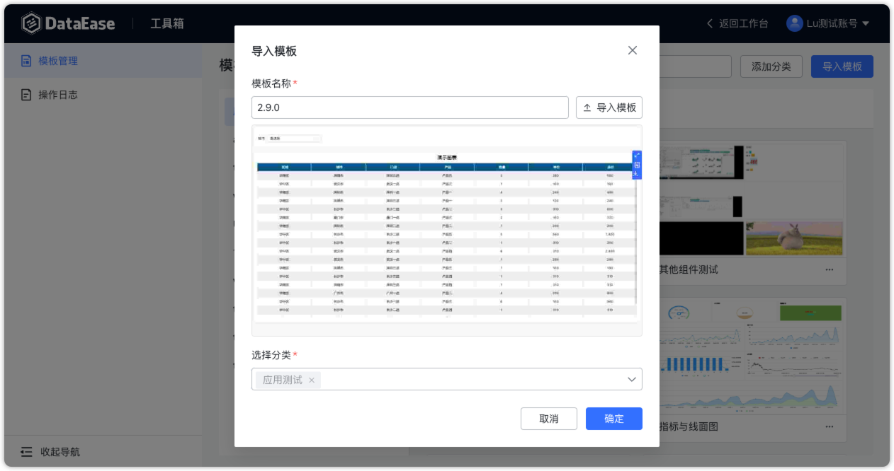
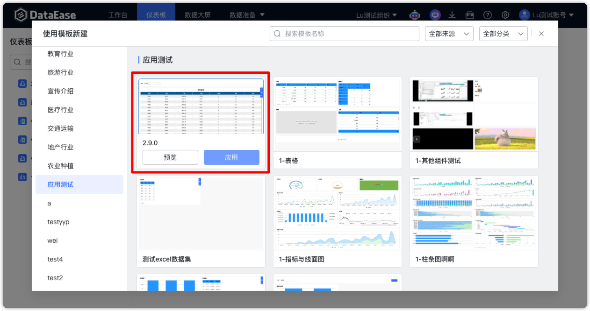
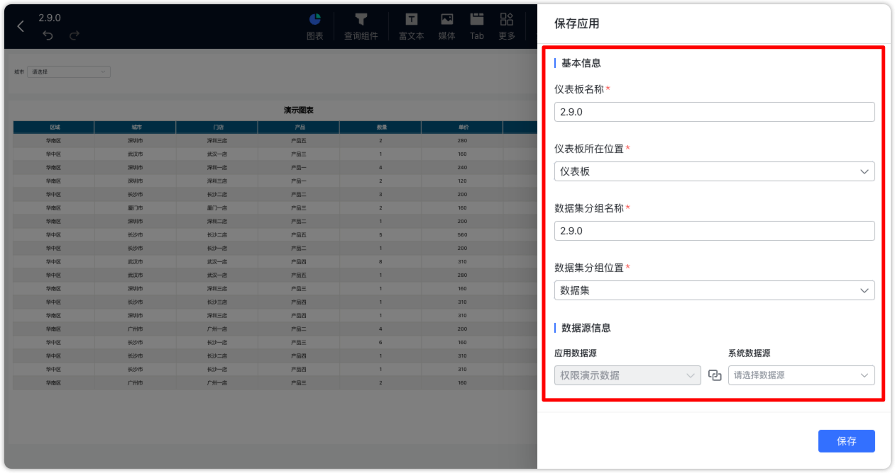

# 更新日志

## 1  仪表板与数据大屏

### 1.1 图片组件支持不同的适应方式
!!! Abstract ""

    - 适应组件：长宽均跟随组件变化而变化；
    - 原始尺寸：图片原始大小，不跟随组件大小改变而改变；
    - 等比适应：跟随组件大小改变而改变，但是图片原始比例不跟随改变。

{ width="900px" }

### 1.2 地图、气泡地图提示信息增强
!!! Abstract ""
    支持在提示信息中选择显示未参与图表制作的其他指标字段。

{ width="900px" }

{ width="900px" }

### 1.3 线面图与柱条图类型支持最值显示
!!! Abstract ""
    线/面图和柱/条图类型的图表中，不包含子类别和堆叠项的情况下，可以设置显示最值。开启【显示最值】后，图中的最大值和最小值的标签会以专属的样式呈现。

{ width="900px" }

{ width="900px" }

### 1.4 支持按图例设置颜色
!!! Abstract ""
    分布图、关系图、柱/条图、线/面图支持在基础样式中通过自定义颜色，为图例设置不同的颜色。

{ width="900px" }

### 1.5 数据大屏新增弹窗区支持
!!! Abstract ""
    打开弹窗区域。

{ width="900px" }

!!! Abstract ""
    在弹窗区域中添加查询组件。

{ width="900px" }

!!! Abstract ""
    在全屏或预览的界面下，当设置了弹窗区时，数据大屏右下侧会出现查询按钮，点击可唤出弹窗区。弹窗区的查询组件功能同普通查询组件，同时也支持外部传参。

{ width="900px" }

### 1.6 查询组件中的文本下拉选项支持全部和默认两种选择
!!! Abstract ""
    历史版本的选项值默认为 1000 条，新版本提供【全部】的选项。

    - 默认：如果未设置显示和排序字段，或者这两个字段与查询字段相同，则获取 1000 个选项进行过滤；当显示和排序字段与查询字段不同时，无论是默认下拉选项还是动态查询选项，都获取 1000 条数据进行过滤。
    - 全部：对所有数据进行查询并返回，在数据量大的情况下，可能会存在性能问题，如等待时间长，加载慢，甚至浏览器内存不足，故使用时需注意。

{ width="900px" }

### 1.7 查询组件支持无查询按钮直接查询
!!! Abstract ""
    支持在【展示按钮】处去掉【查询】的勾选，在不展示【查询】按钮的情况下，选择完下拉选项后会立即触发数据查询。

{ width="900px" }

### 1.8 汇总表支持显示总计

{ width="900px" }

### 1.9 数据大屏支持切换图表类型
!!! Abstract ""
    支持在数据大屏中，将已存在图表切换成其他图表类型。

{ width="900px" }

### 1.10 气泡地图添加水波纹动画配置

{ width="900px" }

### 1.11 流向地图支持配置起止点名称及更多动效
!!! Abstract ""
    支持配置起点名称、终点名称、线条粗细。
{ width="900px" }

!!! Abstract ""
    支持通过【标注】功能，设置起始位置文字样式及标注点样式。

{ width="900px" }

!!! Abstract ""
    支持配置气泡动效：进入【高级】并打开【气泡动效】开关。。
{ width="900px" }

### 1.12 表格的表头/单元格/斑马纹均支持单独设置透明度

{ width="900px" }

### 1.13 表格字体支持设置加粗和斜体

{ width="900px" }

### 1.14 表格支持单独控制表头和单元格的横纵边框显隐

{ width="900px" }

### 1.15 数据大屏支持批量设置样式

{ width="900px" }

## 2 数据准备

### 2.1 数据源支持 ssh 隧道
!!! Abstract ""
    支持 ssh 隧道方式，通过跳板机连接其他网络环境中的数据源。支持密码和密钥两种方式。
{ width="900px" }

### 2.2 API 数据源支持自定义参数前后缀
!!! Abstract ""
    功能背景可参考：https://github.com/dataease/dataease/issues/11010 。
{ width="900px" }

### 2.3 数据源支持复制
!!! Abstract ""
    除 Excel 数据源外，其他数据源支持复制功能。
{ width="900px" }

## 3 系统设置（XPack）
### 3.1 支持 LDAP 认证
!!! Abstract ""
    注意：LDAP 实现方式与 APISIX 无关，特别注意 LDAP 属性映射里的字段名。

{ width="900px" }

### 3.2 支持配置默认登录方式
!!! Abstract ""
    在已配置其他登录方式（LDAP、CAS、OIDC）的情况下，并将其配置为默认登录方式，则在访问 DataEase 时，登录页面会自动跳转到相应登录页面。在配置了其他默认登录方式的情况下，如果需要使用 DataEase 原有登录方式，可以访问 URL：http(s)://de_server_ip:de_port/#/admin-login，可支持所有用户的普通登录。

{ width="900px" }

{ width="900px" }

### 3.3 OIDC 配置项 Realm 优化为非必填项

{ width="900px" }

### 3.4 增加导出仪表板或数据大屏图片的接口

{ width="900px" }

## 4 组织管理中心（XPack）
### 4.1 定时报告增加出错重试设置
!!! Abstract ""
    当定时报告发送失败后自动按照重试设置进行重发尝试。

{ width="900px" }

### 4.2 支持通过 Excel 批量导入第三方平台用户
!!! Abstract ""
    导入模板新增【外部用户唯一标识】字段，用于填写第三方平台的用户 ID。     
    用户来源支持的选项同【用户管理】中的【用户来源】字段：LOCAL、企业微信、钉钉、飞书、国际飞书、CAS、OIDC、LDAP。

{ width="900px" }

{ width="500px" }

{ width="900px" }

{ width="900px" }

### 4.3 支持多条行权限配置取并集
!!! Abstract ""
    用户如果适用数据集的多条行权限规则，则会取所有规则的并集（历史版本中是取交集）。

{ width="900px" }

## 5 其他
### 5.1 新增应用功能
!!! Abstract ""
    支持将仪表板和数据大屏以应用的形式进行导出。  
    在 DataEase v2 中，应用作为模板的其中一种形式，和模板同时放在【模板管理】中管理。关于模板文件与应用文件的区别可参考：https://kb.fit2cloud.com/?p=211。  
    可将自己的仪表板/数据大屏导出为【应用】。

{ width="900px" }

{ width="900px" }
!!! Abstract ""
    可在【模板管理】中上传应用。
{ width="900px" }
!!! Abstract ""
    使用模板新建仪表板或数据大屏时可选择使用存在的应用文件。

{ width="900px" }

{ width="900px" }
!!! Abstract ""
    使用应用创建的资源，会自动弹出相关配置项，需要用户进一步填写。

{ width="900px" }
### 5.2 新增 Copilot 对话分析功能
!!! Abstract "" 
    用户可以先选择一个数据集，并围绕该数据集的相关信息与 Copilot 进行对话。Copilot 将通过表格、折线图等形式展示相关的分析数据。  
    上下文关联与历史记录：用户当前数据集的所有对话都存在上下文关系，并且所有对话历史记录都会保存在数据库中。当用户从其他页面返回到 Copilot 对话分析页面时，系统会自动恢复之前针对该数据集的所有对话历史。需要注意的是，由于会话历史数据的增加，会影响 Copilot 的响应速度，所以在以后版本中这里可能会调整。  
    会话切换：在用户切换数据集或组织时，会自动开启一个全新的会话，以确保不同数据集和组织之间的对话互不干扰。  
    数据源类型支持：目前，Copilot 支持以下数据源类型，需要注意的是，MySQL 和 PostgreSQL 有更好的支持效果，其他类型数据库的支持目前会差一些。  

    - MySQL
    - PostgreSQL
    - Oracle
    - SQLServer
{ width="900px" }

{ width="900px" }

