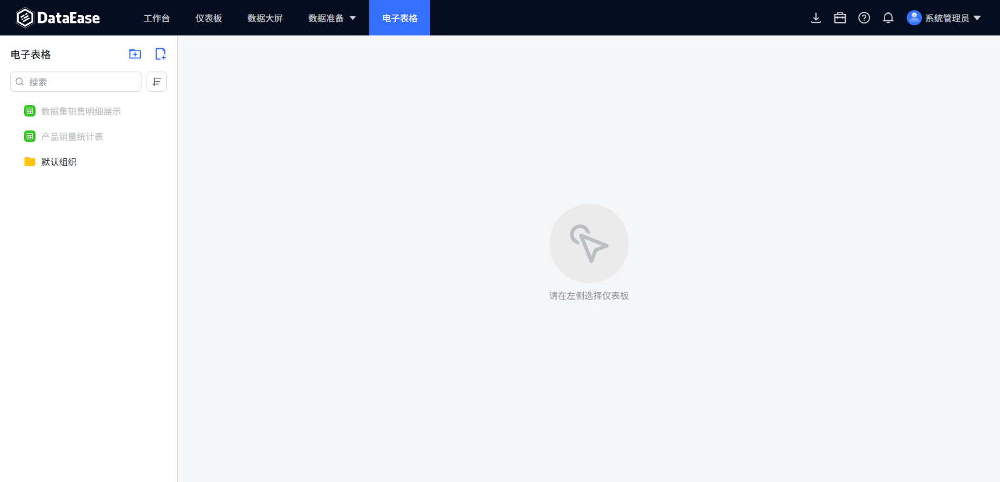

# 更新日志

## 1 功能架构升级

### 1.1 后端持久层框架升级（MyBatis-Plus → JPA/Hibernate）
!!! Abstract ""
    v3.0.0 对后端数据访问层进行了全面重构，由 MyBatis-Plus 切换为 Spring Data JPA + Hibernate：

    - 删除全部 Mapper 接口，改用 Repository 仓储模式；
    - 统一使用 Hibernate 方言管理数据库差异；
    - 简化数据访问代码，提升跨数据库兼容性与可维护性。

### 1.2 支持 7 种部署数据库
!!! Abstract ""
    v3.0.0 起，DataEase 支持将系统元数据库部署到以下 7 种数据库：

    - **MySQL**
    - **GreatSQL**
    - **达梦（DM）**
    - **KingbaseES**
    - **Oracle**
    - **PostgreSQL**
    - **SQL Server**

    部署时选择对应的 `application-standalone-*.yml` 配置文件即可，系统将自动适配相应的数据库方言。

### 1.3 定时任务框架升级
!!! Abstract ""
    定时任务调度升级为 Quartz JDBC JobStore 模式，支持在多种部署数据库上持久化调度状态。

## 2 新增功能

### 2.1 新增 Kingbase 数据源
!!! Abstract ""
    v3.0.0 新增 KingbaseES 数据源支持，数据源类型总数由 19 种增至 20 种。

    - 驱动：`com.kingbase8.Driver`
    - 连接地址：`jdbc:kingbase8://主机:端口/数据库`
    - 支持 Schema 选择

### 2.2 新增电子表格（X-Pack 企业版）
!!! Abstract ""
    X-Pack 新增【电子表格】功能模块，支持在线创建、编辑、发布电子表格：

    - 支持文件夹分类管理、资源树展示；
    - 支持明细表、透视表两种表格类型；
    - 支持发布 / 下线 / 恢复发布等状态管理；
    - 数据来源支持连接各类已配置数据源。

{ width="900px" }

## 3 功能调整

### 3.1 移除游离资源管理
!!! Abstract ""
    v3.0.0 起，系统设置中的【游离资源管理】功能已移除，资源归属管理统一由组织管理中心负责。

### 3.2 权限模型优化
!!! Abstract ""
    统一资源权限管理模型，资源创建、编辑、移动、授权操作规范化为统一的权限配置方式。

## 4 其他说明

!!! info "升级注意"
    从 v2.x 升级至 v3.0.0 时，请先备份系统元数据库与数据导出目录，并参考《升级指南》完成升级操作。v3.0.0 支持全新部署于 7 种数据库，已部署用户可按需迁移元数据库。
