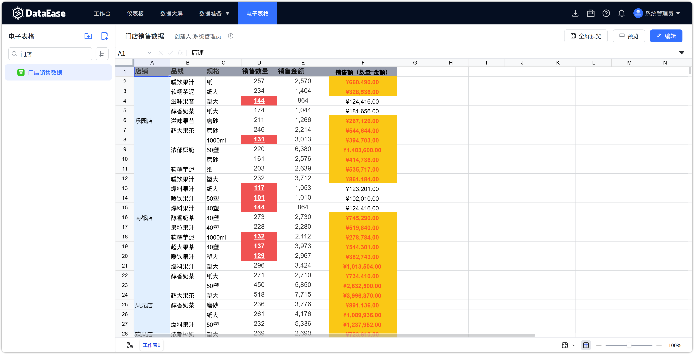

# 更新日志

## 1 功能架构升级

### 1.1 后端持久层框架升级（MyBatis-Plus → JPA/Hibernate）
!!! Abstract ""
    v3.0.0 对后端数据访问层进行了全面重构，由 MyBatis-Plus 切换为 Spring Data JPA + Hibernate：

    - 删除全部 Mapper 接口，改用 Repository 仓储模式；
    - 统一使用 Hibernate 方言管理数据库差异；
    - 简化数据访问代码，提升跨数据库兼容性与可维护性。

### 1.2 支持 7 种部署数据库
!!! Abstract ""
    v3.0.0 起，DataEase 支持将系统元数据库部署到以下 7 种数据库：

    - **MySQL**
    - **GreatSQL**
    - **达梦（DM）**
    - **KingbaseES**
    - **Oracle**
    - **PostgreSQL**
    - **SQL Server**

    安装器默认仍拉起内置 MySQL 8.4.5。需要改用其他库时，详见 [外部数据库部署](installation/multi_database_deployment.md)。

### 1.3 定时任务框架升级
!!! Abstract ""
    定时任务调度升级为 Quartz JDBC JobStore 模式，支持在多种部署数据库上持久化调度状态。

## 2 新增功能

### 2.1 新增 Kingbase 数据源
!!! Abstract ""
    v3.0.0 新增 KingbaseES 数据源支持。

    - 驱动：`com.kingbase8.Driver`
    - 连接地址：`jdbc:kingbase8://主机:端口/数据库`

### 2.2 新增电子表格（X-Pack）
!!! Abstract ""
    X-Pack 新增【电子表格】功能模块，支持在线创建、编辑、发布电子表格：

    - 支持文件夹分类管理、资源树展示；
    - 支持明细表、透视表等表格类型；
    - 支持发布 / 下线 / 恢复发布等状态管理；
    - 数据来源支持连接各类已配置数据源。

{ width="900px" }

## 3 功能调整

### 3.1 移除游离资源管理（X-Pack）
!!! Abstract ""
    v3.0.0 起，系统设置中的【游离资源管理】功能已移除，资源归属管理统一由组织管理中心负责。

### 3.2 组织角色管理结构变动
!!! Abstract ""
    本次版本对组织角色管理体系做了分层重构，拆分系统级与组织级管控边界。

    **系统管理员（admin）侧**

    - 在「系统设置」中新增「人员管理」与「组织管理」模块；
    - 负责全局人员与组织架构管控：新建组织（空间）、维护全量人员、将人员分配至组织，并可指定组织管理员；
    - 系统仅内置三类默认角色：组织管理员、数据分析师、成员；仅支持调整这三类角色的权限并分配给人员；
    - 菜单权限仅支持分配给个人。

    **组织管理员侧**

    - 通过「组织管理中心」的「成员管理」与「权限配置」开展权限管理；
    - 支持创建自定义角色，并可配置自定义角色的权限范围；
    - 菜单权限仅支持分配给角色；
    - 无人员管控权限：不能增删或调整组织内人员，人员名单由系统管理员统一维护。

