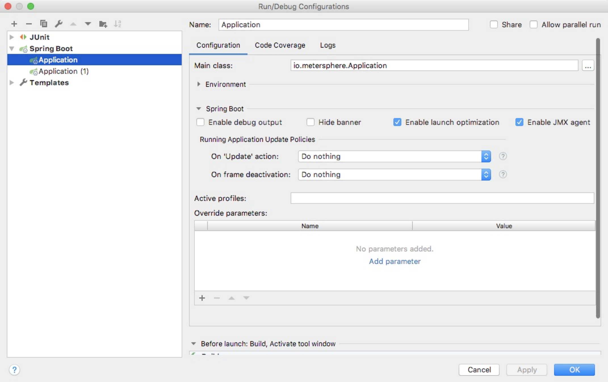

## 项目结构

```
.
├── Dockerfile                                      # 构建容器镜像使用的 dockerfile
├── LICENSE
├── README.md
├── ROADMAP.md
├── backend                                         # 后端项目主目录
│   ├── backend.iml
│   ├── pom.xml                                     # 后端 maven 项目使用的 pom 文件
│   └── src                                         # 后端代码目录
├── frontend                                        # 前端项目主目录
│   ├── babel.config.js
│   ├── frontend.iml
│   ├── node
│   ├── node_modules
│   ├── package-lock.json
│   ├── package.json
│   ├── pom.xml                                     # 前端 maven 项目使用的 pom 文件
│   ├── public
│   └── src                                         # 前端代码目录
├── metersphere-server.iml
└── pom.xml                                         # 整体 maven 项目使用的 pom 文件
```

## 配置开发环境

### 后端
MeterSphere 后端使用了 Java 语言的 Spring Boot 框架，并使用 Maven 作为项目管理工具。开发者需要先在开发环境中安装 JDK 1.8 及 Maven。

#### 初始化配置

##### 数据库初始化

!!! info "注意"
    MeterSphere 使用 MySQL 数据库，推荐使用 MySQL 5.7 版本。同时 MeterSphere 对数据库部分配置项有要求，请参考下附的数据库配置，修改开发环境中的数据库配置文件

```
[mysqld]
default-storage-engine=INNODB
lower_case_table_names=1
table_open_cache=128
max_connections=2000
max_connect_errors=6000
innodb_file_per_table=1
innodb_buffer_pool_size=1G
max_allowed_packet=64M
transaction_isolation=READ-COMMITTED
innodb_flush_method=O_DIRECT
innodb_lock_wait_timeout=1800
innodb_flush_log_at_trx_commit=0
sync_binlog=0
sql_mode=STRICT_TRANS_TABLES,NO_ZERO_IN_DATE,NO_ZERO_DATE,ERROR_FOR_DIVISION_BY_ZERO,NO_AUTO_CREATE_USER,NO_ENGINE_SUBSTITUTION
skip-name-resolve
```

请参考文档中的建库语句创建 MeterSphere 使用的数据库，metersphere-server 服务启动时会自动在配置的库中创建所需的表结构及初始化数据。
```mysql
CREATE DATABASE `metersphere_dev` /*!40100 DEFAULT CHARACTER SET utf8mb4 */
```

##### MeterSphere 配置文件
MeterSphere 会默认加载该路径下的配置文件 /opt/metersphere/conf/metersphere.properties，请参考下列配置创建对应目录及配置文件

```
# 数据库配置
spring.datasource.url=jdbc:mysql://localhost:3306/metersphere_dev?autoReconnect=false&useUnicode=true&characterEncoding=UTF-8&characterSetResults=UTF-8&zeroDateTimeBehavior=convertToNull&useSSL=false
spring.datasource.username=root
spring.datasource.password=root

# kafka 配置，node-controller 以及 data-streaming 服务需要使用 kafka 进行测试结果的收集和处理
kafka.partitions=1
kafka.replicas=1
kafka.topic=JMETER_METRICS
kafka.test.topic=JMETER_TESTS
kafka.bootstrap-servers={KAFKA_IP}:19092
kafka.log.topic=JMETER_LOGS

# node-controller 所使用的 jmeter 镜像版本 
jmeter.image=registry.fit2cloud.com/metersphere/jmeter-master:0.0.6

# 启动模式，lcoal 表示以本地开发模式启动
run.mode=local
```

##### JMeter 配置文件

metersphere-server 服务依赖的 Jmeter 核心类库需要加载 jmeter 配置文件，默认加载 /opt/jmeter 下的配置文件

开发者需要先创建好对应文件夹，并将工程目录中 backend/src/main/resources/jmeter/bin 目录下的配置文件拷贝到 /opt/jmeter/bin 目录


#### 运行后端服务

在启动配置中添加 Spring Boot 启动项，直接启动 Spring Boot 项目即可



### 前端
MeterSphere 前端使用了 Vue.js 作为前端框架，ElementUI 作为 UI 框架，并使用 npm 作为包管理工具。开发者请先下载 Node.js 作为运行环境，IDEA 用户建议安装 Vue.js 插件，便于开发

#### 初始化配置
进入 metersphere-server/frontend/ 目录，执行以下命令安装相关前端组件
```
npm install
```

#### 运行前端服务
进入到 metersphere-server/frontend/ 目录，执行以下命令启动前端服务
```
npm run serve
```
