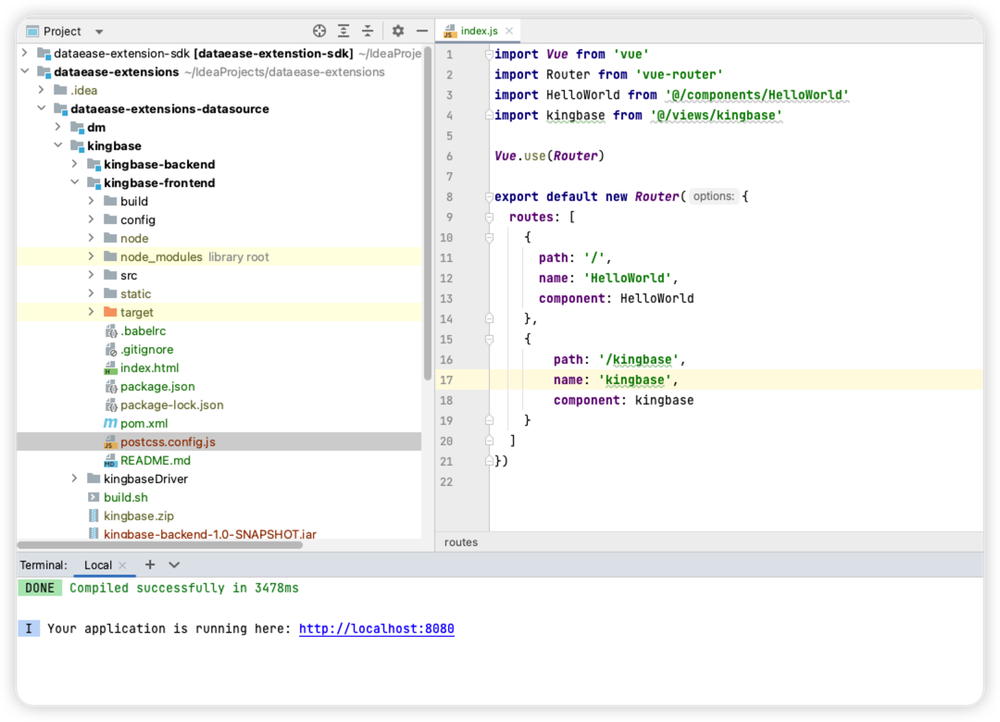
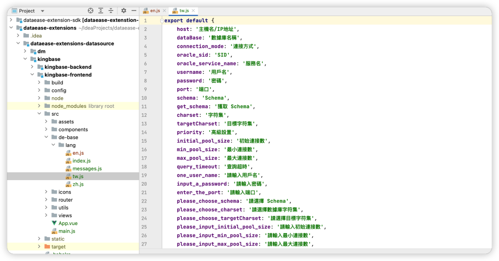
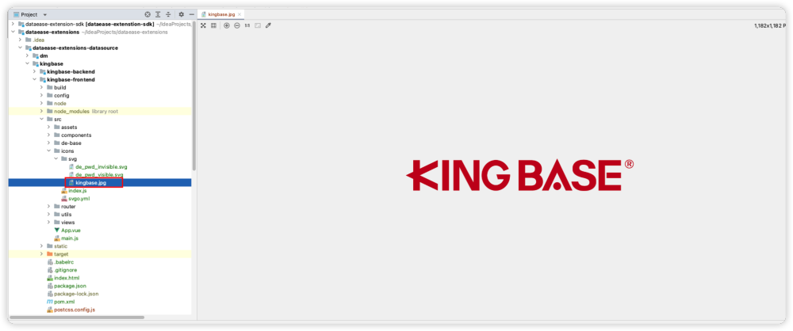
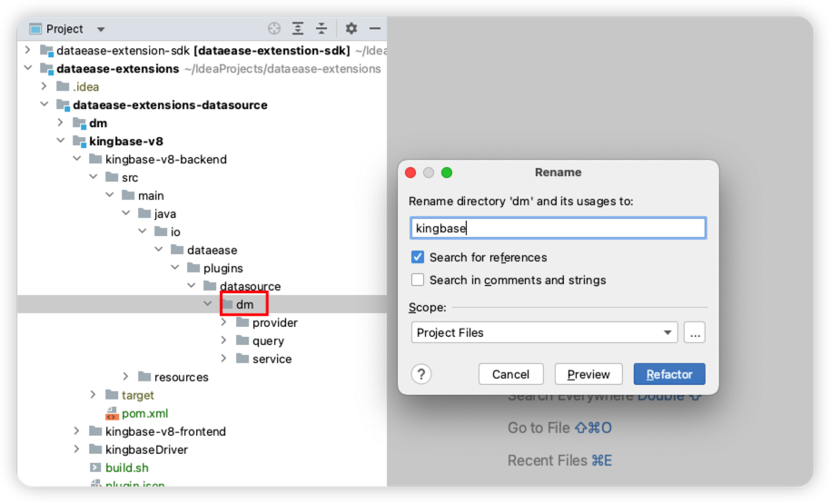
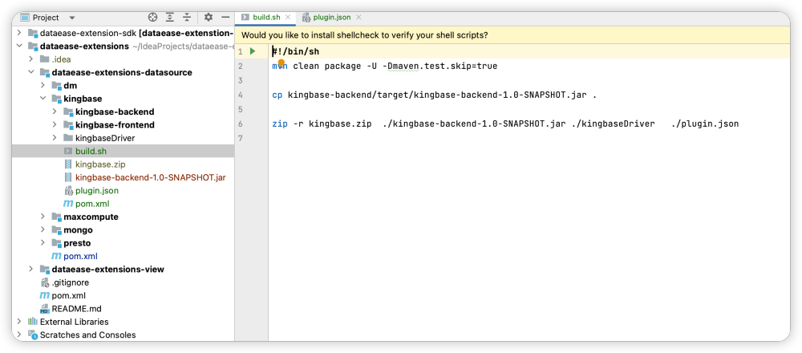
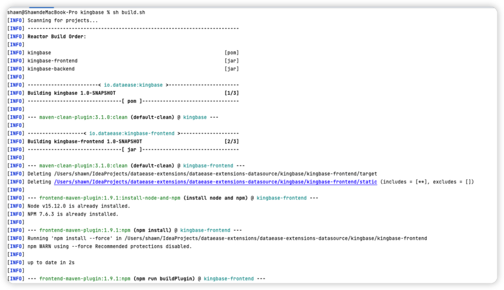
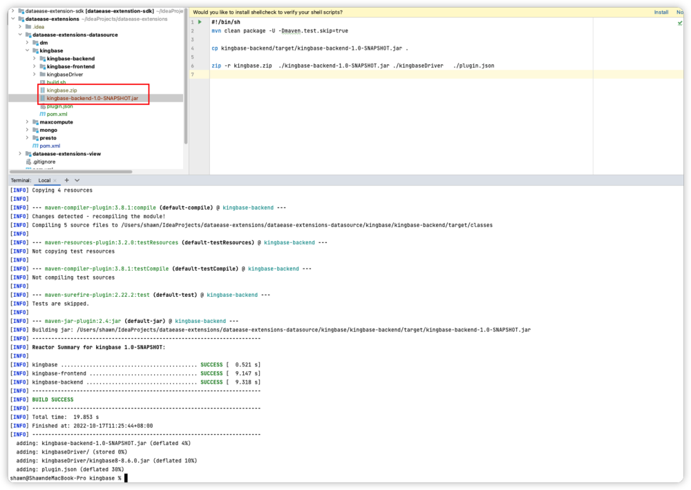

!!! Abstract ""
    DataEase 支持引入数据源插件机制以提高系统可扩展性，本文介绍如何从零开始开发一个 DataEase 视图插件。  
    **注意：** 插件开发面向程序员，涉及到的技术有 Java 、Vue。

## 1 插件框架

### 1.1 获取框架

!!! Abstract ""
    进入 GitHub 下载源码：https://github.com/dataease/dataease-extensions 。

### 1.2 安装依赖

!!! Abstract ""
    如果能正常安装所有依赖则跳过此步骤，否则继续：  
    插件框架依赖 dataease-extension-sdk，如果提示缺少这部分依赖，需要下载 sdk 源码手动安装；  
    sdk 源码地址：https://github.com/dataease/dataease-extension-sdk 。  
    下载完成在根目录下执行：
    ```shell
    mvn clean install
    ```
    完成后请再刷新插件框架 Maven 依赖。


### 1.3 运行测试

!!! Abstract ""
    在插件框架根目录 dataease-extensions 下执行：  
    ```shell
    cd dataease-extensions-view/kingbase/kingbase-frontend
    npm i
    npm run dev（打包指令：npm run buildPlugin）
    ```
    如下图所示，能正常运行说明框架没有问题。

{ width="900px" }

## 2 插件 demo

!!! Abstract ""
    下面以 Kingbase V8 数据库为例，详细描述如何使用插件框架开发一个数据源插件。

### 2.1 创建 demo 工程

!!! Abstract ""
    使用 IDEA 创建 Maven 工程名为 kingbase，删除 src，修改 pom.xml 并增加如下配置。  
    **提示： 创建的 demo 工程可以是独立的，不是一定要在框架源码中创建。**

{ width="900px" }

!!! Abstract ""
    **前端代码：**  
    如下示例图，在前面下载的插件框架中找到插件前端 demo ，整个文件夹复制到上步创建好的 kingbase 工程下，并重命名为 kingbase-frontend 。

{ width="900px" }

!!! Abstract ""
    **修改 kingbase-frontend 目录下的 pom.xml 。**

{ width="900px" }

!!! Abstract ""
    **把修改完成的 pom 加载为 Maven 模块。**

{ width="900px" }

!!! Abstract ""
    **修改 kingbase/pom.xml 建立父子级关系，注意一定是 frontend 在前。**

{ width="900px" }

!!! Abstract ""
    **提示：后端代码同上操作。**

### 2.2 前端实现

!!! Abstract ""
    将 dm.vue 重命名为 kingbase.vue，然后写入前端代码，包括金仓数据源连接信息录入样式以及对应的逻辑。

{ width="900px" }

!!! Abstract ""
    修改对应的多语言文件(zh.js/tw.js/en.js)。

{ width="900px" }  
{ width="900px" }
{ width="900px" }

!!! Abstract ""
    代码修改完成后需要配置 webpack 插件打包，此配置可分别打包 Vue 成单独的 js 文件。

{ width="900" }

!!! Abstract ""
    图片文件调整，如下图所示。

{ width="900px" }

### 2.3 后台实现

!!! Abstract ""
    首先将 dm 文件夹重命名为 kingbase，以及其他相关的后台逻辑文件重命名为 kingbaseXXX。

{ width="900px" }

!!! Abstract ""
    在 KingbaseConfig.java 文件中写入驱动信息。

{ width="900px" }

!!! Abstract ""
    在 KingbaseDsProvider.java 文件中写入数据库信息获取逻辑。

{ width="900px" }

!!! Abstract ""
    在 KingbaseConstants.java 文件中写入基本的数据库关键字。

{ width="900px" }

!!! Abstract ""
    在 KingbaseQueryProvider.java 文件中写入查询逻辑。

{ width="900px" }

!!! Abstract ""
    在 KingbaseService.java 文件中写入连接数据源的一些基础信息。

{ width="900px" }

!!! Abstract ""
    在 kingbase 目录下创建文件夹 kingbaseDriver，并将数据库驱动文件放入此文件夹中。

{ width="900px" }

### 2.4 打包测试

!!! Abstract ""
    **在根目录下执行：**
    ```shell
    mvn clean package
    ```

{ width="900px" }

!!! Abstract ""
    如下示例图，在前面下载的插件框架中找到 demo 中的 plugin.json 文件以及 build.sh 文件，将文件复制到上步创建好的 kingbase 工程下。

{ width="900px" }

!!! Abstract ""
    将 build.sh 和 plugin.json 文件进行修改，如下图所示。

{ width="900px" }

{ width="900px" }


<table>
    <tr>
        <td>
            name
        <td>
            插件名称（保证唯一）
    </tr>
    <tr>
        <td>
            store
        <td>
            来源
    </tr>
    <tr>
        <td>
            free
        <td>
            是否免费
    </tr>
    <tr>
        <td>
            cost
        <td>
            多少钱
    </tr>
    <tr>
        <td>
            category
        <td>
            插件类别
    </tr>
    <tr>
        <td>
            descript
        <td>
            描述
    </tr>
    <tr>
        <td>
            version
        <td>
            版本对应的后台工程版本
    </tr>
    <tr>
        <td>
            creator
        <td>
            作者
    </tr>
    <tr>
        <td>
            moduleName
        <td>
            模块名称对应后台工程模块名称
    </tr>
    <tr>
        <td>
            require
        <td>
            要求 DataEase 最低版本
    </tr>
    <tr>
        <td>
            dsType
        <td>
            数据来源类型
    </tr>
</table>

!!! Abstract ""
    在 kingbase 目录下执行：
    ```shell
    sh bulid.sh
    ```

{ width="900px" }

{ width="900px" }


### 2.5 安装插件

!!! Abstract ""
    **在【系统管理】插件管理安装插件，上传已打包的 kingbase.zip 文件。**

{ width="900px" }

!!! Abstract ""
    安装成功后，在插件管理列表多一条记录，同时新建插件的类型选项也会多出一种类型。  
    **提示：** 如果页面没显示新的数据源插件类型，请清除浏览器缓存重新登录。

{ width="900px" }

