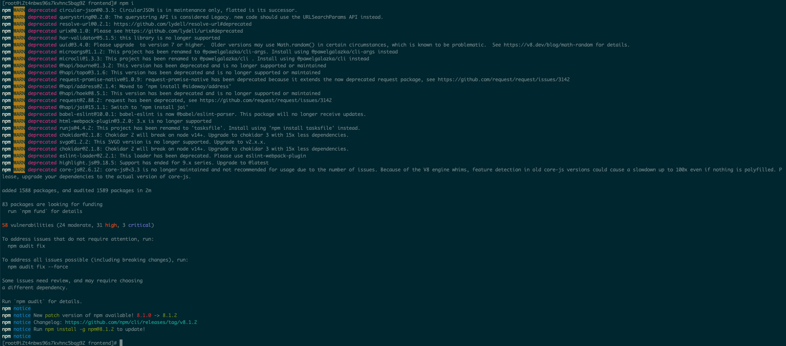
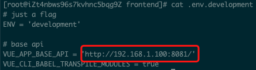
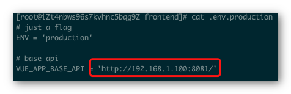
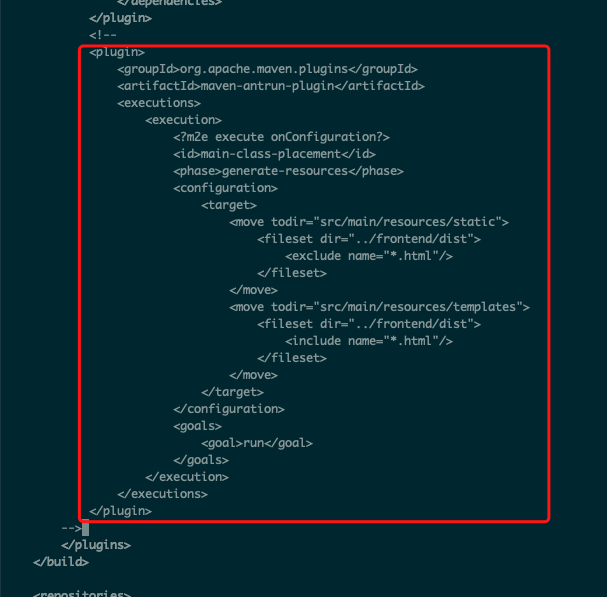

## 1 编译运行（v1.8.0 及以后）

### 1.1 源码编译打包

!!! Abstract ""
	**v1.8.0 及以后分支，请执行以下步骤进行编译打包。**  
	**打包 backend：**  
	在 backend 目录下，执行下面命令。

	```shell
	mvn clean package -Pstage
	```

	**注意:**  

    1. 在 backend 目录下，不是 dataease 目录；
	2. 命令一定要加 -Pstage；
	3. 运行文件为 target/backend-1.8.0.jar。

	**运行 backend：**
	```shell
	nohup java -jar backend-1.8.0.jar &
	```

	**编译打包 frontend：**  
	在 frontend 目录下，执行下面命令，此处构建测试环境，注意命令后缀（带 stage）。

	```shell
	npm i
	npm run build:stage
	```

	**编译打包 mobile：**  
	在 mobile 目录下，执行下面命令，此处构建测试环境，注意命令后缀（带 stage）。
	
	```shell
	npm i
	npm run build:stage
	```

### 1.2 Nginx 配置

!!! Abstract ""
	**假设各个文件分别按如下路径放置：**

	- frontend 编译后文件存放目录
  	/opt/dataease/frontend/dist
	- mobile 编译后文件存放目录
  	/opt/dataease/mobile/dist
	- nginx 配置文件路径
  	/usr/local/etc/nginx/nginx.conf

	**在dataease工程目录下执行：**
	```shell
	mkdir -p /opt/dataease/frontend/dist
	cp -r frontend/dist/* /opt/dataease/frontend/dist
	
	mkdir -p /opt/dataease/mobile/dist
	cp -r mobile/dist/* /opt/dataease/mobile/dist
	mv /opt/dataease/mobile/dist/index.html /opt/dataease/mobile/dist/app.html
	```

	**修改 nginx.conf 配置：**
	```
	server {
    	listen      8000;
    	server_name localhost;

    	location / {
        	root    /opt/dataease/frontend/dist/;
        	index   index.html;
    	}

    	location /app.html {
        	root    /opt/dataease/mobile/dist/;
    	}

    	location /de-app/ {
        	alias   /opt/dataease/mobile/dist/;
    	}

    	location /de-api/ {
        	proxy_pass http://localhost:8081/de-api/;
        	proxy_set_header X-Real-IP $remote_addr;
        	proxy_set_header Host $host:8000;
        	server_name_in_redirect on;
    	}
	}
	```

### 1.3 运行测试

!!! Abstract ""
	访问 http://localhost:8000。

## 2 编译运行（v1.7.0 及以前）

### 2.1 编译前端

!!! Abstract ""
	```shell
	cd frontend
	npm i
	```
	**注意：国内使用 npm 时经常会遇到网络问题，可以考虑将 npm 源替换为国内的源。**  
	可以参考文档 https://segmentfault.com/a/1190000023314583。

{width="900px"}

### 2.2 运行前端

!!! Abstract ""
	**前端运行有两种方式：**

    - npm 运行（适用于开发场景）
    - nginx 运行（适用于稳定运行场景）

!!! Abstract ""
	**方式一 npm 运行：**  
	进入前端目录 frontend，修改 .env.development 文件中的 VUE_APP_BASE_API，将 IP 地址设置为本机 IP，后端默认运行端口为 8081:

{width="900px"}

!!! Abstract ""
	**修改后执行命令运行：**
	```shell
	npm run serve
	```
	**注意：** 以 npm 方式运行前端，默认会运行在本地的 9528 端口上，通过浏览器访问 http://ip:9528 即可。

!!! Abstract ""
	**方式二 Nginx 运行：**  
	以 Nginx、Apache 等运行前端，则修改 .env.production 文件中的 VUE_APP_BASE_API，将 IP 地址设置为本机 IP，后端默认运行端口为 8081，如下示例配置 Nginx 运行。

{width="900px"}

!!! Abstract ""
	**修改后执行命令进行编辑，生成 dist 目录：**
	```shell
	npm run build
	# 将 dist 目录放置到 /opt/dataease/frontend/dist
	mkdir -p /opt/dataease/frontend
	cp -r dist /opt/dataease/frontend/dist
	```
    **配置 nginx：**    
	此处假设 DataEase 前端运行在 8000 端口，后端运行在 8081，且 DataEase 前端编译后生成的 dist 目录存放到路径为 /opt/dataease/frontend/dist，相应的 nginx 配置如下：
	```conf
	server {
		listen      8000;
		server_name localhost;
		location / {
			root    /opt/dataease/frontend/dist;
			index   index.html index.htm;
		}
	
		# 此处为公共链接请求转发，8081 为后端运行端口
		location /link/ {
			proxy_pass http://$host:8081;
			proxy_set_header X-Real-IP $remote_addr;
			proxy_set_header Host $http_host;
			proxy_set_header X-Forwarded-For $proxy_add_x_forwarded_for;
		}

        # 注意配置域名代理访问的时候，注释下面这个代理配置，否则导致分享仪表板公共链接无法访问
        # location /link/ {
            # proxy_pass http://$host:8081;
            # porxy_pass https://dataease;
            # proxy_set_header X-Real-IP $remote_addr;
            # proxy_set_header Host $http_host;
            # proxy_set_header X-Forwarded-For $proxy_add_x_forwarded_for;
        # }
	
	}
	```
	**注意：** nginx 默认以 nobody 用户身份运行，可能会遇到 403 的错误。可以授予 dist 目录访问权限，或者将 nginx 设置为 root 用户运行。

### 2.3 编译后端

!!! Abstract ""
	**进入后端代码目录 backend，修改 pom.xml，去掉默认的打包前端代码的部分：**

{width="900px"}

!!! Abstract ""
	**执行编译命令：**
	```shell
	mvn clean package
	```
	**注意：** 在编译后端代码时如遇到依赖无法下载的问题，可以在百度网盘上下载一下最小化的 dataease 依赖包。链接: https://pan.baidu.com/s/1fWv_ze-QKUew3ND4NAdt8Q 提取码: rpzi

### 2.4 运行后端

!!! Abstract ""
	**后端代码编译完成后，会在 backend/target 目录下生成一个 backend-1.4.0.jar，可以通过命令运行后端：**
	```shell
	nohup java -jar backend-1.4.0.jar &
	```