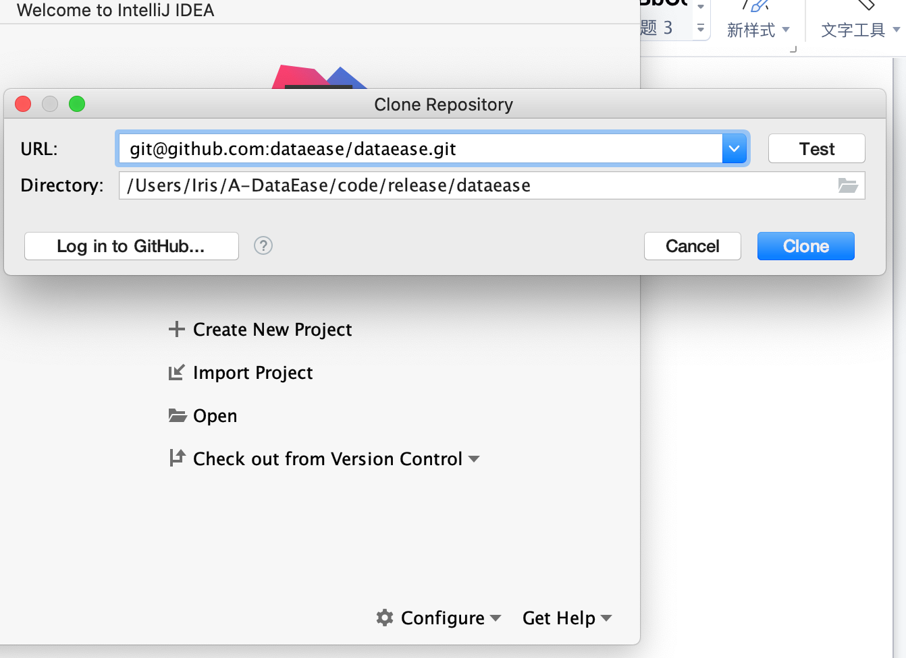
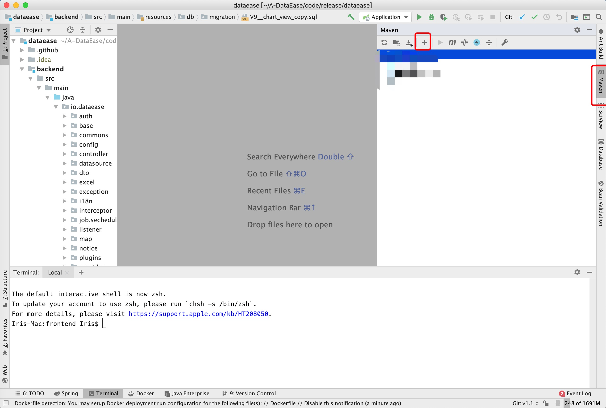
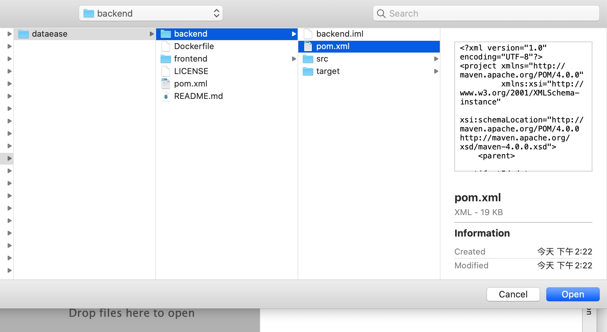
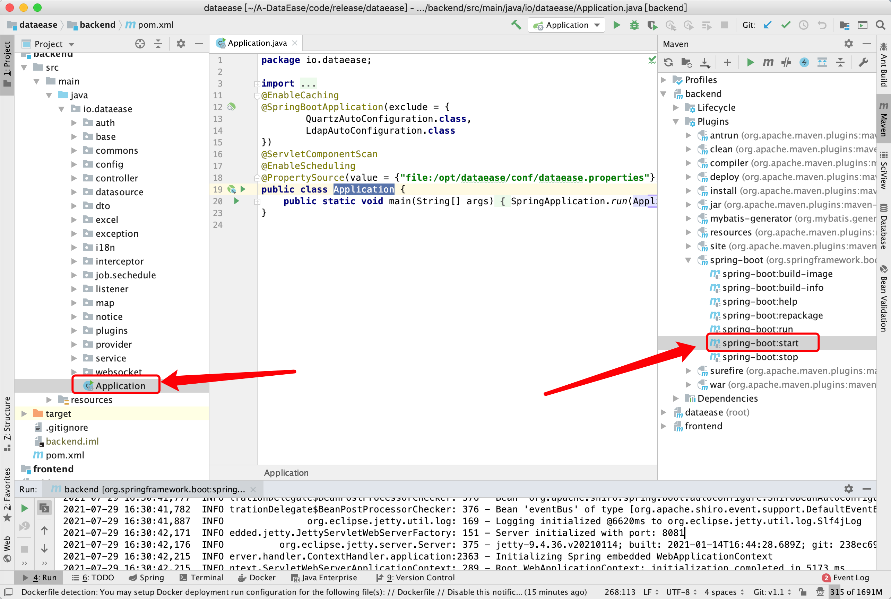
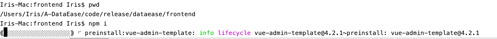

## 项目结构

```
.
├── Dockerfile                                      # 构建容器镜像使用的 dockerfile
├── LICENSE                                         # License 申明
├── README.md                                       
├── backend                                         # 后端项目主目录
├── frontend                                        # 前端项目主目录
└── pom.xml                                         # 整体 maven 项目使用的 pom 文件
```

## 配置开发环境

### 后端
DataEase 后端使用了 Java 语言的 Spring Boot 框架，并使用 Maven 作为项目管理工具。开发者需要先在开发环境中安装 JDK 1.8 及 Maven。

### 前端
DataEase 前端使用了 Vue.js 作为前端框架，ElementUI 作为 UI 框架，并使用 npm 作为包管理工具。开发者请先下载 Node.js 作为运行环境，IDEA 用户建议安装 Vue.js 插件，便于开发

#### 安装 npm
进入网站 https://nodejs.org/en/download/， 选择相应的安装包进行安装即可

### 初始化配置

#### 数据库初始化

!!! info "注意"
    DataEase 使用 MySQL 数据库，推荐使用 MySQL 5.7 版本。同时 DataEase 对数据库部分配置项有要求，请参考下附的数据库配置，修改开发环境中的数据库配置文件（以下配置有部分参数可能并不适用 MySQL 8.x 版本）

```
[mysqld]
datadir=/var/lib/mysql
default-storage-engine=INNODB
character_set_server=utf8
lower_case_table_names=1
table_open_cache=128
max_connections=2000
max_connect_errors=6000
innodb_file_per_table=1
innodb_buffer_pool_size=1G
max_allowed_packet=64M
transaction_isolation=READ-COMMITTED
innodb_flush_method=O_DIRECT
innodb_lock_wait_timeout=1800
innodb_flush_log_at_trx_commit=0
sync_binlog=0
group_concat_max_len=1024000
sql_mode=STRICT_TRANS_TABLES,NO_ZERO_IN_DATE,NO_ZERO_DATE,ERROR_FOR_DIVISION_BY_ZERO,NO_AUTO_CREATE_USER,NO_ENGINE_SUBSTITUTION
skip-name-resolve
```

请参考文档中的建库语句创建 DataEase 使用的数据库，DataEase 后端服务启动时会自动在配置的库中创建所需的表结构及初始化数据。
```mysql
CREATE DATABASE `dataease` /*!40100 DEFAULT CHARACTER SET utf8mb4 */
```

#### DataEase 配置文件
DataEase 会默认加载该路径下的配置文件 /opt/dataease/conf/dataease.properties，请参考下列配置创建对应目录及配置文件

```properties
# 数据库配置
spring.datasource.url=jdbc:mysql://mysql:3306/dataease?autoReconnect=false&useUnicode=true&characterEncoding=UTF-8&characterSetResults=UTF-8&zeroDateTimeBehavior=convertToNull&useSSL=false
spring.datasource.username=root
spring.datasource.password=Password123@mysql

carte.host=kettle
carte.port=18080
carte.user=cluster
carte.passwd=cluster

doris.db=dataease
doris.user=root
doris.password=Password123@doris
doris.host=doris-fe
doris.port=9030
doris.httpPort=8030

#新建用户初始密码
dataease.init_password=DataEase123456
#登录超时时间单位min  如果不设置 默认8小时也就是480
dataease.login_timeout=480

logger.level=INFO
```

## 本地 jar 包方式运行

### 编译工程

下载 DataEase 工程源码（工程地址：https://github.com/dataease/dataease.git) 。

进入工程目录后，执行 mvn clean package 进行编译。

编译完成后，在工程目录的 backend/target 目录下，会生成一个 backend-x.y.z.jar （xyz代表版本号，xyz具体值视具体版本而定） 的可运行 jar 包。可以通过 java -jar backend-x.y.z.jar 来运行 DataEase。

服务完全启动后，可以在本地浏览器访问 http://localhost:8081 来访问 DataEase 服务。

## IDEA 方式运行

### 运行后端服务

新建一个 git 项目 输入主工程 git 地址: git@github.com:dataease/dataease.git



配置 maven 并引入 pom.xml




启动后端。两种启动方式：

- 可以使用 io.dataease.Application 入口方法直接启动
- 可以使用 maven 插件中的 backend>spring-boot>spring-boot:start 启动



### 运行前端服务

进入工程目录下的子目录 frontend, 用npm i 安装前端依赖包



安装完成后，使用 npm run serve 命名启动前端,前端启动后即可通过 http://localhost:9528/ 地址访问
