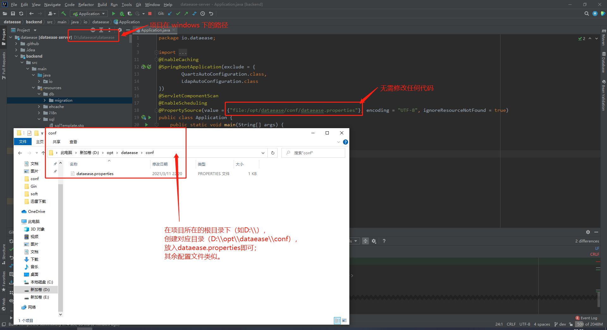
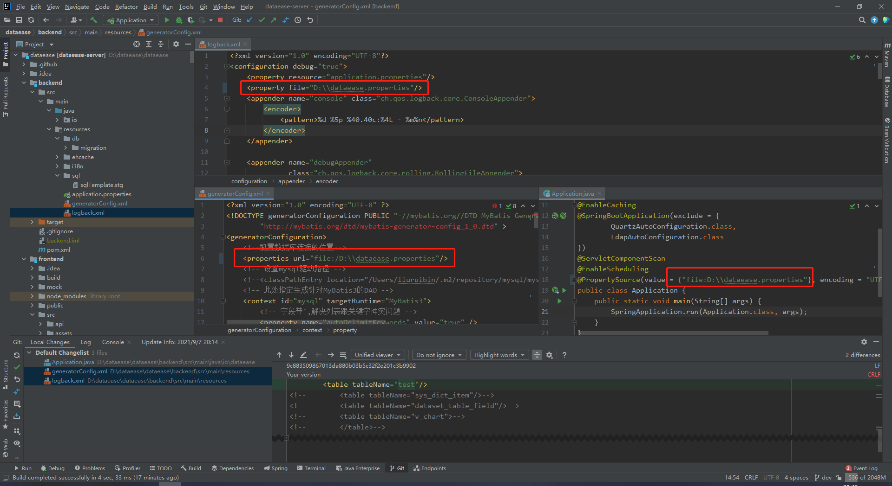

## 1 项目结构

```
.
├── Dockerfile                                      # 构建容器镜像使用的 dockerfile
├── LICENSE                                         # License 申明
├── README.md                                       
├── backend                                         # 后端项目主目录
├── frontend                                        # 前端项目主目录
├── mobile                                          # 移动端项目主目录
└── pom.xml                                         # 整体 maven 项目使用的 pom 文件
```

## 2 配置开发环境
### 2.1 环境准备


!!! Abstract ""
    **后端：**  
    DataEase 后端使用了 Java 语言的 Spring Boot 框架，并使用 Maven 作为项目管理工具。开发者需要先在开发环境中安装 JDK 1.8 及 Maven。  
    **前端：**  
    DataEase 前端使用了 Vue.js 作为前端框架，ElementUI 作为 UI 框架，并使用 npm 作为包管理工具。开发者请先下载 Node.js 作为运行环境，IDEA 用户建议安装 Vue.js 插件，便于开发。  
    **安装 npm:**  
    进入网站 https://nodejs.org/en/download/， 选择相应的安装包进行安装即可。

### 2.2 初始化配置

!!! Abstract ""
    **数据库初始化：**  
    DataEase 使用 MySQL 数据库，推荐使用 MySQL 5.7 版本。同时 DataEase 对数据库部分配置项有要求，请参考下附的数据库配置，修改开发环境中的数据库配置文件（以下配置有部分参数可能并不适用 MySQL 8.x 版本）

    ```
    [mysqld]
    datadir=/var/lib/mysql
    default-storage-engine=INNODB
    character_set_server=utf8
    lower_case_table_names=1
    table_open_cache=128
    max_connections=2000
    max_connect_errors=6000
    innodb_file_per_table=1
    innodb_buffer_pool_size=1G
    max_allowed_packet=64M
    transaction_isolation=READ-COMMITTED
    innodb_flush_method=O_DIRECT
    innodb_lock_wait_timeout=1800
    innodb_flush_log_at_trx_commit=0
    sync_binlog=0
    group_concat_max_len=1024000
    sql_mode=STRICT_TRANS_TABLES,NO_ZERO_IN_DATE,NO_ZERO_DATE,ERROR_FOR_DIVISION_BY_ZERO,NO_AUTO_CREATE_USER,NO_ENGINE_SUBSTITUTION
    skip-name-resolve
    ```

    请参考文档中的建库语句创建 DataEase 使用的数据库，**DataEase 后端服务启动时会自动在配置的库中创建所需的表结构及初始化数据。**
    ```mysql
    CREATE DATABASE `dataease` DEFAULT CHARACTER SET utf8mb4 COLLATE utf8mb4_general_ci;
    ```

!!! Abstract ""
    **配置文件：**  
    DataEase 会默认加载该路径下的配置文件 /opt/dataease/conf/dataease.properties，**请参考下面配置创建对应目录及配置文件**。  
    **提示：** 请自行将 MYSQL_HOST 配置为自己的 MySQL 地址。

    ```properties
    # 数据库配置
    spring.datasource.url=jdbc:mysql://MYSQL_HOST:3306/dataease?autoReconnect=false&useUnicode=true&characterEncoding=UTF-8&characterSetResults=UTF-8&zeroDateTimeBehavior=convertToNull&useSSL=false
    spring.datasource.username=root
    spring.datasource.password=Password123@mysql
    
    carte.host=kettle
    carte.port=18080
    carte.user=cluster
    carte.passwd=cluster
    
    doris.db=dataease
    doris.user=root
    doris.password=Password123@doris
    doris.host=doris-fe
    doris.port=9030
    doris.httpPort=8030
    
    #新建用户初始密码
    dataease.init_password=DataEase123456
    #登录超时时间单位min  如果不设置 默认8小时也就是480
    dataease.login_timeout=480
    
    logger.level=INFO

    #DE运行模式，可选值有 local、simple、cluster，分别对应本地模式、精简模式、集群模式
    engine_mode=simple
    ```
    **地图文件：**  
    DataEase 从 1.2 版本开始支持地图组件。在 DataEase 源码工程的目录下有一个地图文件目录 mapFiles/full，需要将该目录下的文件放置到 /opt/dataease/data/feature/full 目录下。如果是 Windows 的话，可以在工程目录所在盘的根目录下，创建 opt/dataease/data/feature/full 目录。

    **插件文件：**  
    DataEase 从 1.9 版本开始支持以插件的形式导入组件与数据源，可以下载 dataease-extensions 工程源码，在本地打包下，需要将打包后生成的 jar 包放置到 /opt/dataease/plugins/default 目录下。如果是 Windows 的话，可以在工程所在盘的根目录下，创建 /opt/dataease/plugins/default 目录，如下示例图。

{ width="900px" }

## 3 代码运行

### 3.1 IDEA 方式运行

!!! Abstract ""
    **Windows 下环境配置（可选）：**  
    在 Windows 环境下对配置文件的路径会有所要求，一般可以采用下面两种配置方案里的一种，非 Windows 环境以下方案可跳过。  
    **方案一(推荐)：**  
    将配置文件放置到工程源码的所在盘的指定路径下，以 dataease.properties 配置文件举例，如源码工程在 D 盘下，则配置文件存放路径为 d:\opt\dataease\conf\dataease.properties。其他配置文件类似。  
    此方案中不需要对 DataEase 的源码进行任何修改。
{width="900px"}  

!!! Abstract ""
    **方案二：**  
    配置文件可以随意放置在任意路径下，但需要修改工程源码中配置文件的路径信息。以 dataease.properties 配置文件举例，如该配置文件存放在 D 盘根目录下，则需要按下图修改三个地方的配置路径：
{width="900px"}

!!! Abstract ""
    **运行后端服务：**  
    新建一个 git 项目 输入主工程 git 地址: git@github.com:dataease/dataease.git

{width="900px"}  

!!! Abstract ""
    **配置 maven 并引入 pom.xml：**

{width="900px"}

{width="900px"}  

!!! Abstract ""
    **启动后端，两种启动方式：**  

    - 可以使用 io.dataease.Application 入口方法直接启动
    - 可以使用 maven 插件中的 backend>spring-boot>spring-boot:start 启动  

{width="900px"}

!!! Abstract ""
    **运行前端：**  
    进入工程目录下的子目录 frontend, 用 npm i 安装前端依赖包  
    安装完成后，使用 npm run serve 命名启动前端,前端启动后即可通过 http://localhost:9528/ 地址访问

{width="900px"}

### 3.2 本地 jar 包方式运行

!!! Abstract ""

    1.下载 DataEase 工程源码（工程地址：https://github.com/dataease/dataease.git) ；  
    2.进入工程目录后，执行 mvn clean package 进行编译；  
    3.编译完成后，在工程目录的 backend/target 目录下，会生成一个 backend-x.y.z.jar （xyz代表版本号，xyz具体值视具体版本而定） 的可运行 jar 包。可以通过 java -jar backend-x.y.z.jar 来运行 DataEase；  
    4.服务完全启动后，可以在本地浏览器访问 http://localhost:8081 来访问 DataEase 服务。

## 4 本地运行 Kettle 和 Doris (可选)

!!! Abstract ""
    **注意：** 若需要调试 Excel 和定时同步模式数据集的话，需要此支持；  
    **提示：** 进行以下步骤前需提前准备 Docker 与 Docker-Compose 环境。

### 4.1 准备运行环境

!!! Abstract ""
    **下载 installer 工程：**
    ```shell
    git clone https://github.com/dataease/installer.git
    ```
    **初始化目录：**
    ```shell
    mkdir -p /opt/dataease/conf
    mkdir -p /opt/dataease/data/kettle
    mkdir -p /opt/dataease/data/fe
    mkdir -p /opt/dataease/data/be
    mkdir -p /opt/dataease/logs
    ```
    **准备配置文件：**
    ```shell
    cd installer/dataease/templates && cp -rp fe.conf be.conf dataease.properties .kettle /opt/dataease/conf && cd -
    
    # v1.4.0 及以前版本执行以下命令
    cd installer/dataease && cp docker-compose-kettle-doris.yml /opt/dataease/ && cd -
    
    # v1.5.0 及以后版本可以手动把 installer/dataease 目录下的 docker-compose-kettle.yml docker-compose-doris.yml 内容合并起来（去掉重复的 version 和 services 定义），命名为 docker-compose-kettle-doris.yml，放置到 /opt/dataease 目录下
    ```
    **按实际情况修改配置文件：
    fe.conf、be.conf、.kettle 一般情况下不需要修改，其他配置文件的修改可以参考下面示例：
    修改 dataease.properties 文件，设置 MySQL、Kettle 和 Doris 的连接信息，以本机 IP（192.168.1.9）为例:**
    ```properties
    # 数据库配置
    spring.datasource.url=jdbc:mysql://192.168.1.9:3306/dataease?autoReconnect=false&useUnicode=true&characterEncoding=UTF-8&characterSetResults=UTF-8&zeroDateTimeBehavior=convertToNull&useSSL=false
    spring.datasource.username=root
    spring.datasource.password=Password123@mysql

    carte.host=192.168.1.9
    carte.port=18080
    carte.user=cluster
    carte.passwd=cluster

    doris.db=dataease
    doris.user=root
    doris.password=Password123@doris
    doris.host=192.168.1.9
    doris.port=9030
    doris.httpPort=8030

    #新建用户初始密码
    dataease.init_password=DataEase123456
    #登录超时时间单位min  如果不设置 默认8小时也就是480
    dataease.login_timeout=480

    logger.level=INFO
    ```

    **修改 docker-compose-kettle-doris.yml，将 ${DE_BASE} 替换为 /opt，将 doris-fe 和 kettle 的运行端口暴露出来，增加网络定义部分：**
    ```yml
    version: '2.1'
    services:

      doris-fe:
        image: registry.cn-qingdao.aliyuncs.com/dataease/doris:0.15
        container_name: doris-fe
        ports:
          - 8030:8030
          - 9030:9030
        environment:
          - DORIS_ROLE=fe-leader
        volumes:
          - /opt/dataease/data/fe:/opt/doris/fe/doris-meta
          - /opt/dataease/logs/fe:/opt/doris/fe/log
          - /opt/dataease/conf/fe.conf:/opt/doris/fe/conf/fe.conf
        networks:
          dataease-network :
            ipv4_address: 172.19.0.198
        restart: always

      doris-be:
        image: registry.cn-qingdao.aliyuncs.com/dataease/doris:0.15
        container_name: doris-be
        environment:
          - DORIS_ROLE=be
        volumes:
          - /opt/dataease/data/be:/opt/doris/be/storage
          - /opt/dataease/logs/be:/opt/doris/be/log
          - /opt/dataease/conf/be.conf:/opt/doris/be/conf/be.conf
        networks:
          dataease-network :
            ipv4_address: 172.19.0.199
        restart: always

      kettle:
        image: registry.cn-qingdao.aliyuncs.com/dataease/kettle:8.3-v1.2
        container_name: kettle
        ports:
          - 18080:18080
        volumes:
          - /opt/dataease/conf/:/opt/dataease/conf
          - /opt/dataease/data/kettle:/opt/dataease/data/kettle
        networks:
          - dataease-network
        restart: always

    networks:
      dataease-network:
        driver: bridge
        ipam:
          driver: default
          config:
            - subnet: 172.19.0.0/16
              gateway: 172.19.0.1
    ```

### 4.2 运行 Kettle 和 Doris 组件

!!! Abstract ""
    **执行命令运行组件：**
    ```shell
    cd /opt/dataease
    docker-compose -f docker-compose-kettle-doris.yml up -d
    ```

## 5 其他注意事项

!!! Abstract ""
    内置示例数据以 flyway 的形式在 DataEase 启动时自动插入到了 MySQL 数据库中，在源码运行的情况下，需要登录到 DataEase 控制台，进入到【数据源】页面，选择 "demo" 数据源，将 "demo" 数据源的相关连接信息修改正确，保存后即可正常使用内置示例数据。

{width="900px"}
