!!! Abstract ""
    DataEase 支持引入视图插件机制以提高系统可扩展性，本文介绍如何从零开始开发一个 DataEase 视图插件。  
    **注意：** 插件开发面向程序员，涉及到的技术有 Java 、Vue。

## 1 插件框架

### 1.1 获取框架

!!! Abstract ""
    进入 GitHub 下载源码：https://github.com/dataease/dataease-extensions 。

### 1.2 安装依赖

!!! Abstract ""
    如果能正常安装所有依赖则跳过此步骤，否则继续：  
    插件框架依赖 dataease-extension-sdk，如果提示缺少这部分依赖，需要下载 sdk 源码手动安装。  
    sdk 源码地址：https://github.com/dataease/dataease-extension-sdk 。  
    下载完成在根目录下执行：
    ```shell
    mvn clean install
    ```
    完成后请再刷新插件框架 Maven 依赖。


### 1.3 运行测试

!!! Abstract ""
    在插件框架根目录 dataease-extensions 下执行：  
    ```shell
    cd dataease-extensions-view/view-bubblemap/view-bubblemap-frontend
    npm i
    npm run dev
    ```
    如下图所示，能正常运行说明框架没有问题。

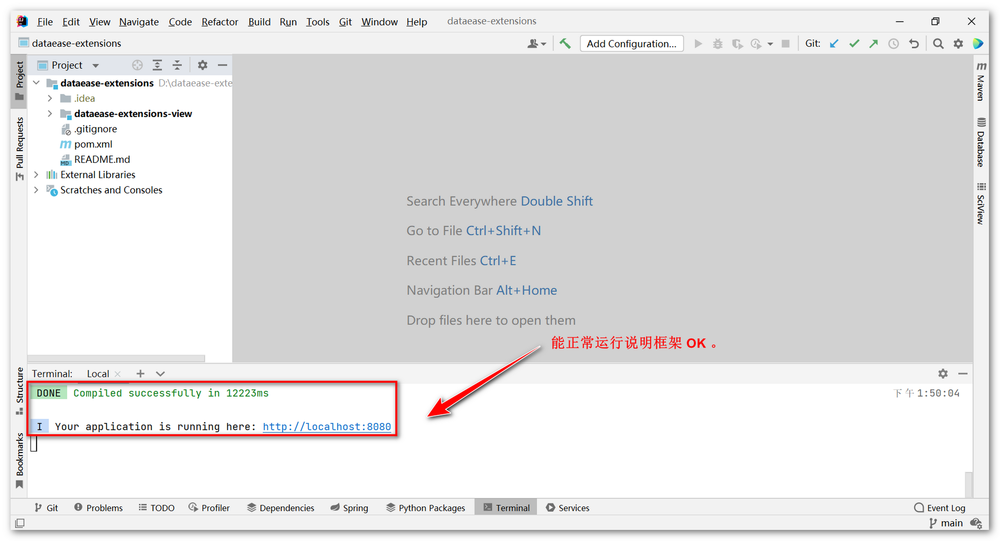{ width="900px" }

## 2 插件 demo

!!! Abstract ""
    下面以 HighCharts 中 3D 饼图为例，详细描述如何使用插件框架开发一个 3D 饼图。

### 2.1 创建 demo 工程

!!! Abstract ""
    使用 IDEA 创建 Maven 工程名为 view-3dpie，删除 src，修改 pom.xml 并增加如下配置。  
    **提示： 创建的 demo 工程可以是独立的，不是一定要在框架源码中创建。**

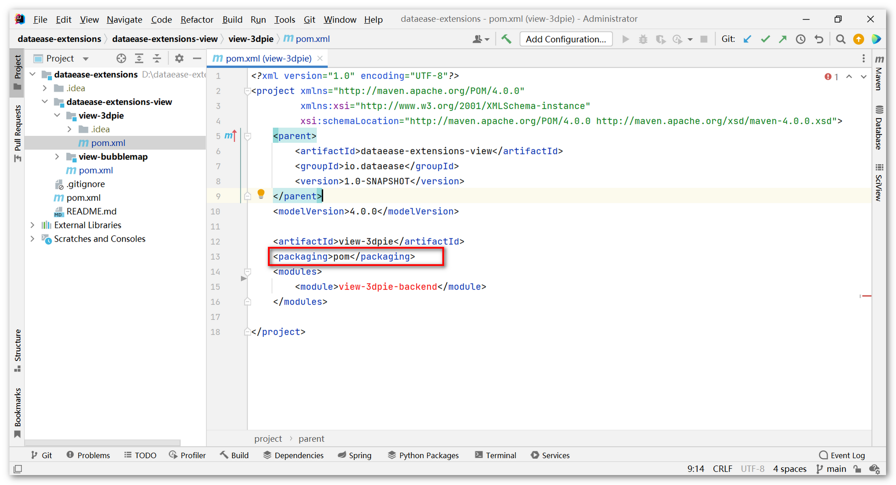{ width="900px" }

!!! Abstract ""
    **前端代码：**  
    如下示例图，在前面下载的插件框架中找到插件前端 demo ，整个文件夹复制到上步创建好的 view-3dpie 工程下，并重命名为 view-3dpie-frontend 。

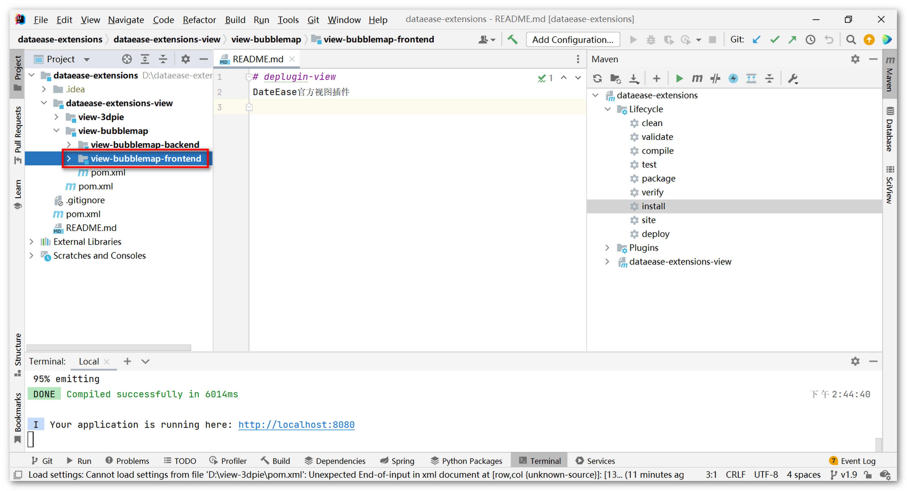{ width="900px" }

!!! Abstract ""
    **修改 view-3dpie-frontend 目录下的 pom.xml 。**

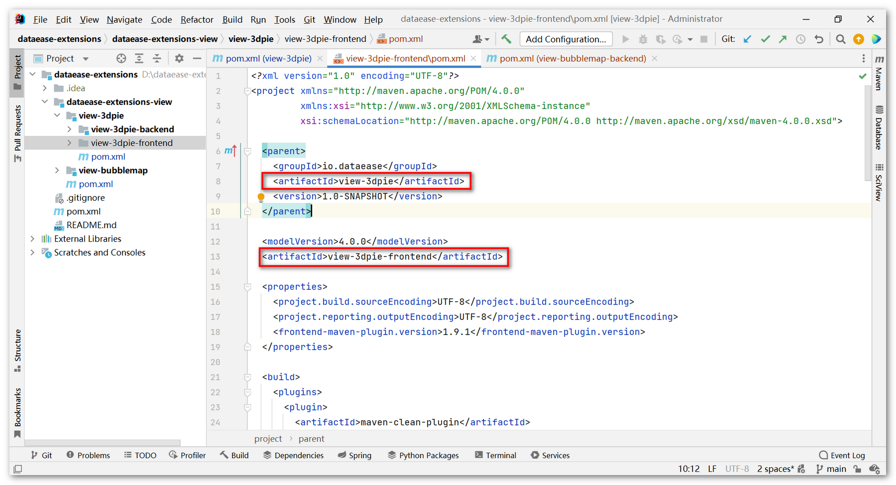{ width="900px" }

!!! Abstract ""
    **把修改完成的 pom 加载为 Maven 模块。**

{ width="900px" }

!!! Abstract ""
    **修改 view-3dpie/pom.xml 建立父子级关系，注意一定是 frontend 在前。**

{ width="900px" }

### 2.2 前端实现

!!! Abstract ""
    **图表类型：**  
    在 src/view/ 新建 highcharts/3dpie 目录，在 3dpie/ 新建 type.vue，type 内容对应视图编辑界面中图表类型内容。

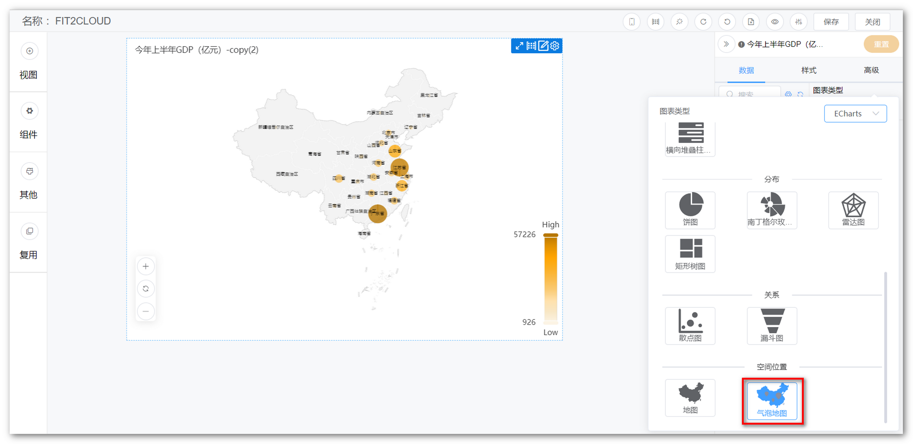{ width="900px" }

!!! Abstract ""
    type.vue 的内容可以直接复制视图插件框架中对应的气泡地图中的内容，修改下面内容，请注意这里的 value 和 label 。

{ width="900px" }  
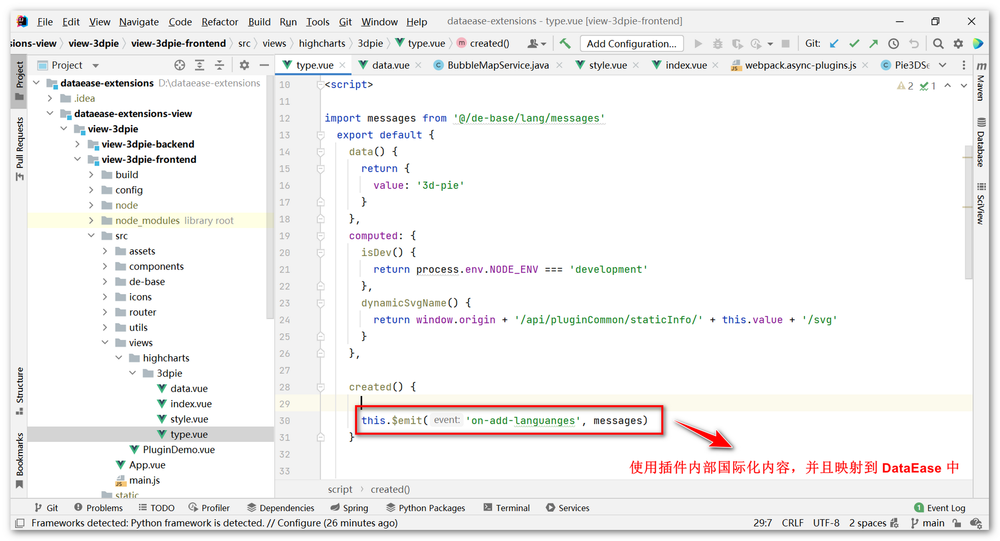{ width="900px" }

!!! Abstract ""
    **图表字段：**  
    在 3dpie/ 新建 data.vue ，对应的图表字段选择。

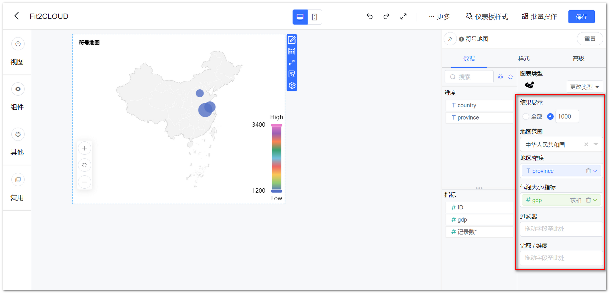{ width="900" }

!!! Abstract ""
    data.vue 内容也可从气泡图复制过来再修改，一般的图表类型，如下示例图中的字段就可满足。  
    **注意：** 少数特殊类型的图表需自定义。

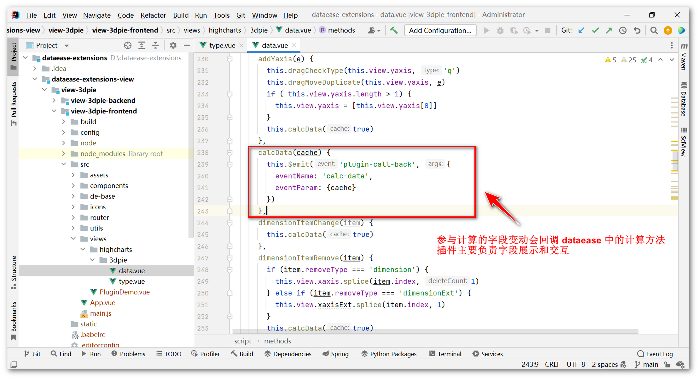{ width="900px" }

!!! Abstract ""
    **图表样式：**  
    在 3dpie/ 新建 style.vue，对应视图编辑界面中图表样式内容。

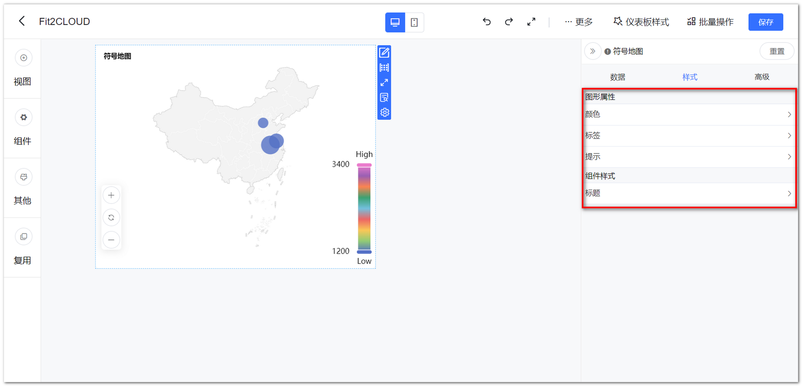{ width="900" }

!!! Abstract ""
    DataEase 主工程中使用了两种图库，分别是 ECharts 和 AntV ,当前插件使用的是 HighCharts 图库。所以很多样式属性并不通用，这里需要插件内部自定义。

{ width="900px" }

!!! Abstract ""
    **图表内容：**  
    在 3dpie/ 新建 index.vue，这里为图表内容，具体实现参考代码。  
    **注意：** 在填充图表属性的过程中一定要把 DataEase 属性转换为对应图表属性。

{ width="900px" }  
{ width="900px" }

!!! Abstract ""
    代码完成后需要配置 webpack 插件打包，此配置可分别打包 Vue 成单独的 js 文件。

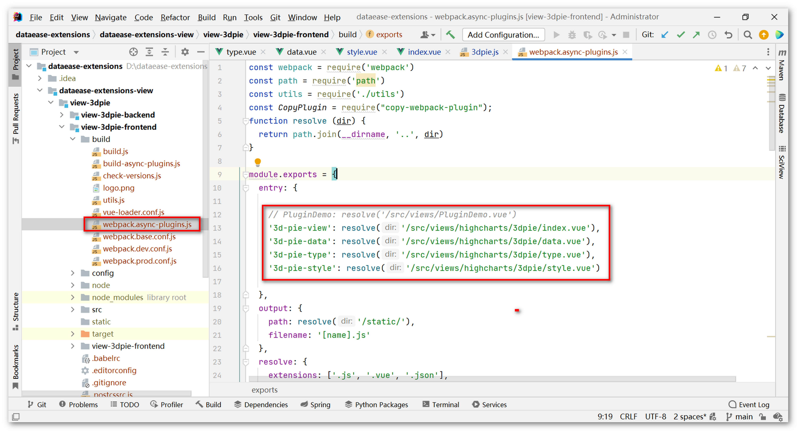{ width="900px" }

### 2.3 后台实现

{ width="900px" }

!!! Abstract ""
    图表类型关系到下图内容：

{ width="900px" }

{ width="900px" }  
{ width="900px" }


!!! Abstract ""
    后台这里有两个方法可重写以覆盖父类的默认实现（一般的图表类型无需重写）。

{ width="900px" }

!!! Abstract ""
    父类的默认实现在 dataease-extensions-sdk 工程，可在 GitHub 搜索，分别是生成 sql 语句的实现、处理结果集的实现。

{ width="900px" }

### 2.4 打包测试

!!! Abstract ""
    **在根目录下执行：**
    ```shell
    mvn clean package
    ```
    得到 view-3dpie-backend-1.0-SNAPSHOT.jar 与插件描述文件（plugin.json）一起打包成 zip 格式。

{ width="900px" }

!!! Abstract ""
    **插件描述文件格式如下，保存文件并命名为 plugin.json ：**
    ```json
    {
        "name": "xxxx 视图插件",
        "store": "xxxx 公司",
        "free": 0,
        "cost": 0,
        "category": "view",
        "descript": "xxxx 插件，物超所值",
        "version": "1.0-SNAPSHOT",
        "creator": "your name",
        "loadMybatis": 0,
        "moduleName": "view-3dpie-backend",
        "require": "1.9.0"
    }
    ```

<table>
    <tr>
        <td>
            name
        <td>
            插件名称（保证唯一）
    </tr>
    <tr>
        <td>
            store
        <td>
            您的公司名称
    </tr>
    <tr>
        <td>
            free
        <td>
            是否免费
    </tr>
    <tr>
        <td>
            cost
        <td>
            多少钱
    </tr>
    <tr>
        <td>
            category
        <td>
            插件类别
    </tr>
    <tr>
        <td>
            descript
        <td>
            描述
    </tr>
    <tr>
        <td>
            version
        <td>
            版本对应的后台工程版本
    </tr>
    <tr>
        <td>
            creator
        <td>
            作者
    </tr>
    <tr>
        <td>
            loadMybatis
        </td>
        <td>
            是否使用 Mybatis
        </td>
    </tr>
    <tr>
        <td>
            moduleName
        <td>
            模块名称对应后台工程模块名称
    </tr>
    <tr>
        <td>
            require
        <td>
            要求 DataEase 最低版本
    </tr>
</table>

### 2.5 安装插件

!!! Abstract ""
    **在【系统管理】插件管理安装插件，上传已打包的 plugin.zip 文件。**

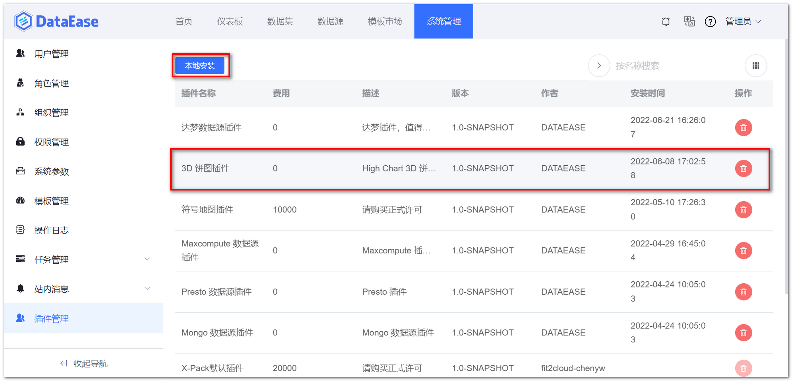{ width="900px" }

!!! Abstract ""
    安装成功后，在插件管理列表多一条记录，同时新建插件的类型选项也会多出一种类型。  
    **提示：** 如果页面没显示新的图表类型，请清除浏览器缓存重新登录。

{ width="900px" }

## 3 注意事项

!!! Abstract ""
    **图表库：**  
    DataEase 内置了 ECharts 和 AntV 两种图库，如果您使用这两种图库作为视图插件扩展，无需额外引用图表库，可以直接使用，具体可参考气泡地图实现代码。

!!! Abstract ""
    **国际化：**  
    在插件内部增加国际化内容如何映射到 DataEase 主工程中？可参考下图。

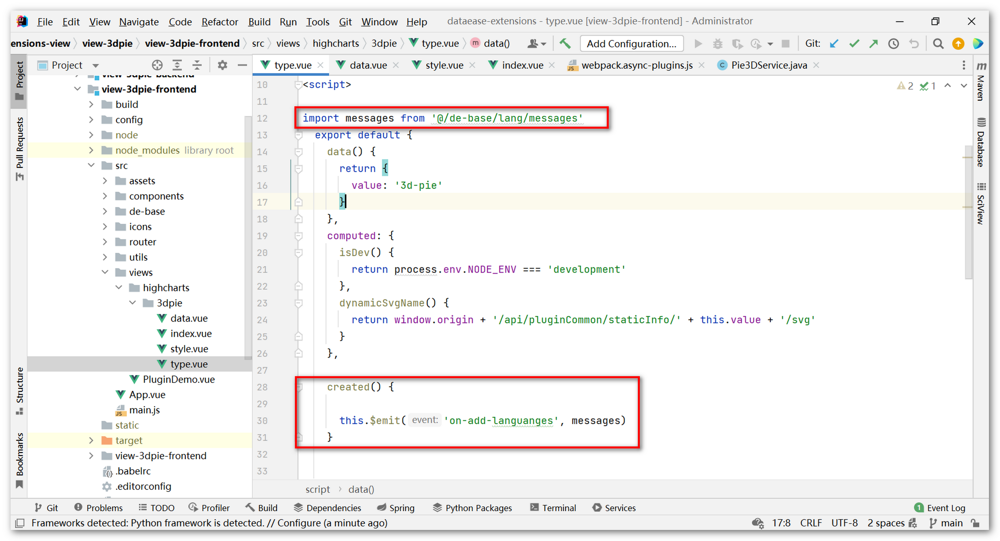{ width="900px" }

!!! Abstract ""
    **类型图标：**  
    在插件内部增加了图表类型的 icon 如何映射到 DataEase 主工程中?可参考下图。

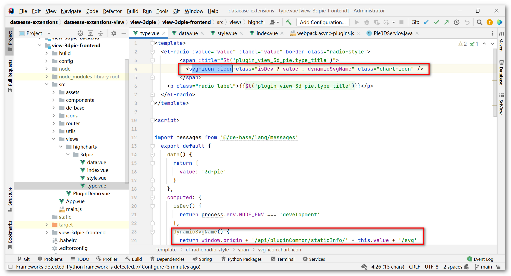{ width="900px" }