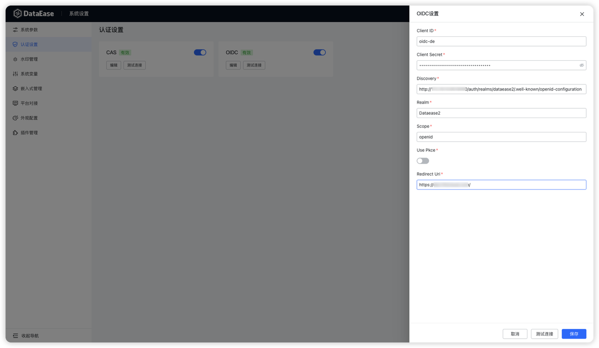
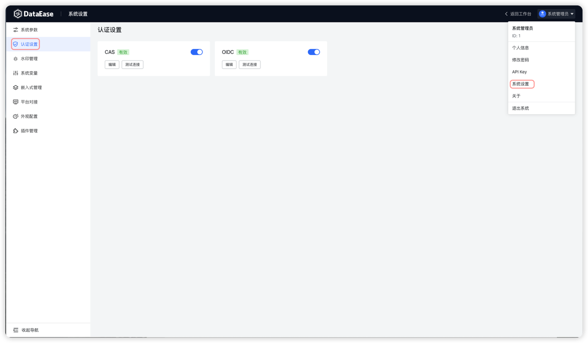
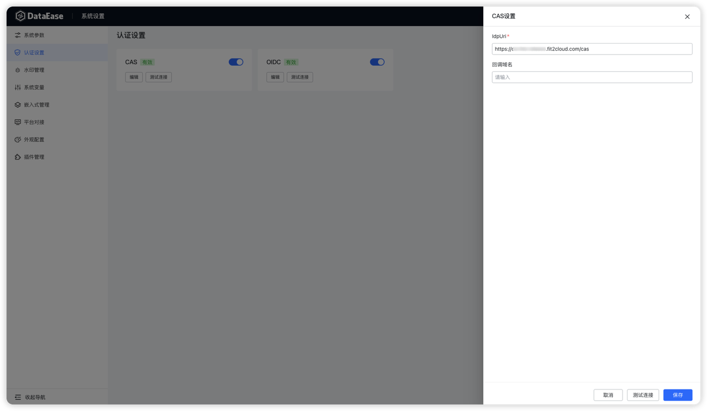
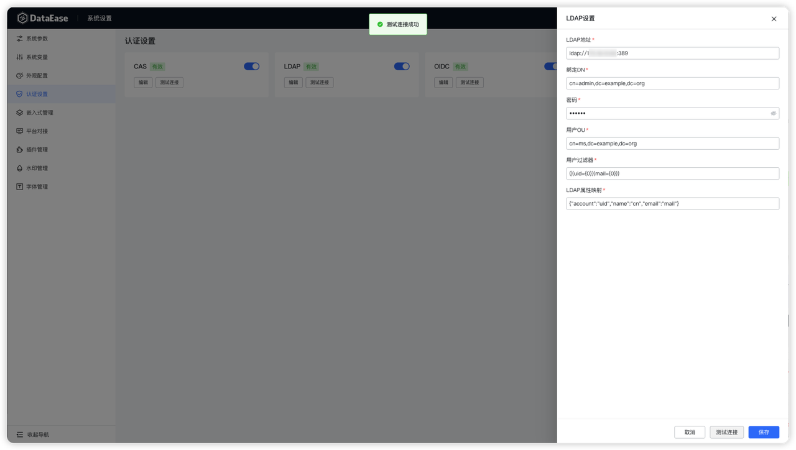
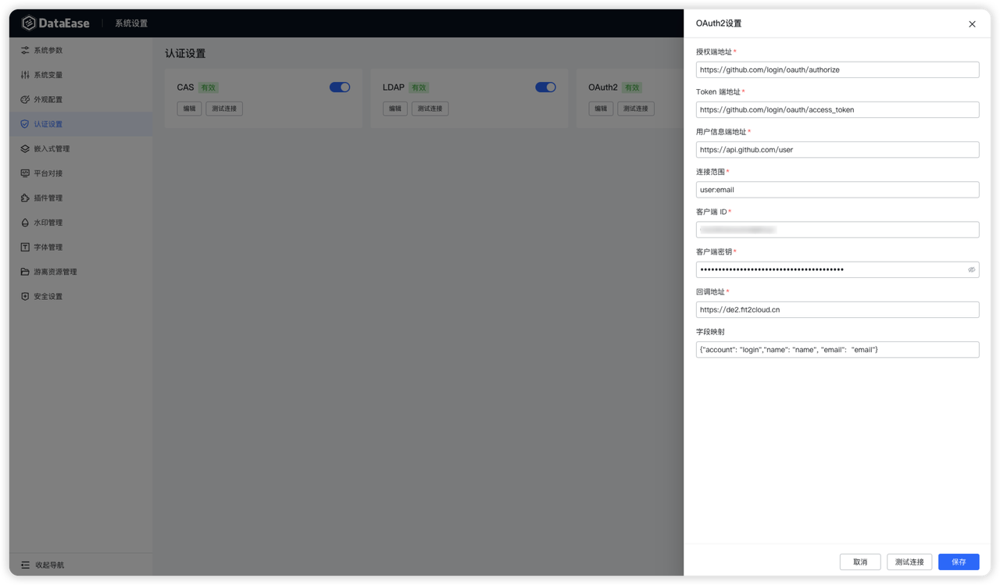

!!! Abstract ""
    本嵌入式文档，环境要求 DataEase >= v2.10.10 ，嵌入式能力企业版、专业版、嵌入式版均支持。文中所使用代码为 DataEase 项目组官方嵌入式代码示例，主要步骤均注释说明。如有问题，请联系客户成功人员咨询。

## 1 DataEase 嵌入式概述
!!! Abstract ""
    DataEase v2 嵌入式提供了丰富的嵌入式功能，实现多种业务场景嵌入式需求，可根据业务需要选择对应的可视化资源或模块进行嵌入，DataEase 提供了完整的流程以及方法，对接 DataEase 封装好的方法及模块即可实现嵌入式。
### 1.1 嵌入模块说明
!!! Abstract ""
    DataEase 提供了丰富的嵌入式功能，包括可视化看板单独嵌入，系统模块嵌入等，DataEase 提供封装好的方法及模块，用户在代码中参考官方示例即可完成嵌入操作。
{ width="900px" }

!!! Abstract ""
    DataEase 嵌入式支持 DIV 和 Iframe 两种嵌入方式，支持按照单个可视化资源，以及现有数据集、数据源、数据大屏、仪表板等完整模块的嵌入。可根据需要自行选择对应方式进行丰富的嵌入需求。

    DataEase 同时提供了丰富的 API 接口，包括仪表板管理、数据大屏管理，数据集管理、权限管理、用户管理等模块，可根据实际的业务需求调用 DataEase 的接口完成业务要求，API 说明入口位于 【系统设置】->【API Key】->【查看 API】。
{ width="900px" }
{ width="900px" }
### 1.2 嵌入式场景效果预览
!!! Abstract ""
    官方演示环境，嵌入式官方体验环境，可查看嵌入式效果。

    官方demo 代码， Layui 框架代码 ，Vue3 代码 。
!!! Abstract ""
    - 数据大屏及数据大屏设计器嵌入。
{ width="900px" }
{ width="900px" }

!!! Abstract ""
    - 仪表板及仪表板设计器嵌入。
{ width="900px" }
{ width="900px" }

!!! Abstract ""
    - 模块嵌入。
{ width="900px" }

## 2 DataEase 嵌入式流程
!!! Abstract ""
    DataEase 支持使用 Iframe 以及 DIV 进行嵌入，两种方法的流程如下。

    **注意：嵌入需要在 DataEase 的配置文件 /opt/dataease2.0/conf/application.yml 里增加 origin-list 配置，并重启服务。详细见常见问题 4.2。**
!!! Abstract ""
    DIV 嵌入式流程

    在 DataEase 中创建嵌入式应用后，首先获取其 APP ID 和 APP Secret，同时获取 DataEase 用户账号。使用这些信息生成 token，并利用生成的 token 进行认证。引入 DataEase 提供的嵌入式 js 文件后，使用指定参数创建 DataEaseBi 对象，并渲染 DIV 容器即可实现嵌入式应用的集成与展示。
{ width="900px" }

!!! Abstract ""
    Iframe 嵌入式流程

    在 DataEase 中创建嵌入式应用后，首先获取其 APP ID 和 APP Secret，同时获取 DataEase 用户账号。使用这些信息生成 token，并利用生成的 token 进行认证。使用 postMessage 通信并传入相应参数，即可实现嵌入式应用的集成与展示。
{ width="900px" }

### 2.1 DataEase 端口说明
!!! Abstract ""
    **注意：企业版（嵌入式版）使用端口为 9080，需要开放此端口访问。**

| 端口   |    作用    |       说明        |
|------|:--------:|:---------------:|
| 9080 | Apisix 服务 | 企业版、专业版、嵌入式版使用 apisix 的 9080 端口进行嵌入及访问 |

### 2.2 嵌入式 APP 创建
!!! Abstract ""
    点击【系统设置】，进入【嵌入式管理】页面创建嵌入式应用。

    **注意：嵌入式 License 最多可创建 5 个嵌入式应用，其它版本无此限制。**

    嵌入式应用创建后，可以获取 APP ID、APP Secret。

    APP ID：嵌入式获取 JWT token 需要填写的 ID。

    APP Secret ：嵌入式获取 JWT token 需要填写的 Secret。
{ width="900px" }
{ width="900px" }
{ width="900px" }

!!! Abstract ""
    - 应用名称：嵌入式应用名称，可自定义。
    - 跨域设置：嵌入系统的访问地址。

    提示：跨域指两个域名不同的网页之间进行通信，填写嵌入系统的访问地址，跨域限制是由浏览器的同源策略（Same-Origin Policy）决定的。这是一种安全机制，旨在防止恶意网站读取其他网站的敏感数据。

### 2.2.1 跨域说明

!!! Abstract ""
    浏览器的同源策略（Same-Origin Policy）规定，只有当协议（protocol）、域名（domain）和端口（port）完全相同的情况下，网页才能自由访问另一个源的资源。如果请求的资源与当前网页的源不同，为跨域请求。具体如下：

    1. 不同的协议
    ```
    示例：从 http://example.com 请求 https://example.com。
    原因：即使主机名和端口相同，协议不同也算跨域。
    ```

    2. 不同的端口
    ```
    示例：从 http://example.com:3000 请求 http://example.com:4000。
    原因：端口不同，即使协议和主机名相同。
    ```

    3. 不同的顶级域名
    ```
    示例：从 http://example.com 请求 http://anotherexample.com。
    原因：顶级域名不同。
    ```

    4. 子域名和顶级域名
    ```
    示例：从 http://sub.example.com 请求 http://example.com。
    原因：子域名和顶级域名不同，也算跨域。
    ```

    5. 子域名和子域名
    ```
    示例：从 http://sub1.example.com 请求 http://sub2.example.com。
    原因：子域名和子域名不同，也算跨域。
    ```
###  2.3 ID 获取
!!! Abstract ""
    - 数据大屏 ID（编辑或预览界面均可获取） 及图表 ID 获取。
{ width="900px" }
{ width="900px" }

!!! Abstract ""
    - 仪表板 ID（编辑或预览界面均可获取）以及图表ID  获取。
{ width="900px" }
{ width="900px" }

##  3. DataEase 嵌入式示例
!!! Abstract ""
    **注意：本文档所使用代码均为嵌入式官方 demo 代码。并在此基础上进行代码的修改进行演示。**

###  3.1 嵌入式 Token 
!!! Abstract ""
    采用 JWT 认证 ，官方嵌入式代码生成 token 方式如下，需要获取 DataEase 嵌入式应用的 APP ID、APP Secret，以及 DataEase 中的用户账号。

    2.10.0 版本开始，支持设置 token 有效时间。 Token 可根据实际情况使用其它类型语言生成，代码实现方式不唯一。
   
    ```
    @RestController
    public class IndexController {

        # 嵌入式 appId
        private static String appId = "";
        
        # 嵌入式 appSecret
        private static String appSecret = "";
        
        #DataEase 用户名
        private static String account = "";
        
        #
        ## 获取 DataEase 嵌入式 Token
        ## DataEase 嵌入式 Token 使用的是 JWT 认证，由 appId、appSecret 以及 DataEase 用户名生成。
        ## Java 程序可直接引用 java-jwt (https://mvnrepository.com/artifact/com.auth0/java-jwt) 依赖，其它后端语言可自行百度加密代码。
        ## 注意，嵌入式 Token 的过期时间默认为 480 分钟，可通过修改 application.yml 进行调整
        ## 配置参数名称为 dataease.embedded-exp
        
        @GetMapping("/api/token")
        public String generateToken () {
        
            String user = "小王";
            List<String> users = Arrays.asList("小王","小李");
            String status = "ASSIGNED";
            
            Algorithm algorithm = Algorithm.HMAC256(appSecret);
            JWTCreator.Builder builder = JWT.create();
            builder.withClaim("account", account).withClaim("appId", appId);
            builder.withIssuedAt(new Date());
            ## 只过滤 user = 小王
            ## builder.withClaim("user", user);
            ## 过滤 user = 小王 或者 小李的数据
            ## builder.withClaim("user", JSONObject.toJSONString(users));
            ## 过滤 user = 小王 或者 小李 以及 设备状态等于 ASSIGNED 的数据
            ## 参数可根据业务需要选择设置或者不设置
            ## user 、设备状态 为仪表板参数设置里面的参数名
            ## builder.withClaim("user", JSONObject.toJSONString(users)).withClaim("设备状态", status);
            return builder.sign(algorithm);
        }
     }
    ```
!!! Abstract ""
    account 获取方式，见下图，可以使用任意符合业务需求的账号，不仅限于 admin 账户，也不推荐使用 admin 账户进行嵌入。
{ width="900px" }

###  3.2 DataEase 嵌入式 JS  
!!! Abstract ""
    当使用 DIV 嵌入时，需引入 DataEase 提供内置的 js 模块，如下 。

    引入 js 后，即可使用 js 模块提供好的类及方法完成 DIV 的嵌入。

    **注意：需要将 js 引入到页面的 head 中，保证依赖的正确加载。**

    ```
    ## {domain}js/div_import_0.0.0-dataease.js DataEase 提供好的 js 模版，
    ## 访问地址为 http://ip:9080/js/div_import_0.0.0-dataease.js
    <script crossorigin  type="module" th:src="@{{domain}/js/div_import_0.0.0-dataease.js(domain=${vo.domain})}"></script>
    ```

###  3.3 外部参数
!!! Abstract ""
    嵌入式支持外部参数传递，可以使用该功能根据第三方系统传递的参数在 DataEase 中进行数据的过滤，或者 DataEase 向第三方系统传递参数，外部参数可根据业务需求选择使用或者不使用。
!!! Abstract ""
    目前支持参数及场景如下，使用参数需在仪表板或者数据大屏首先做好参数设置。

### 3.3.1 外部参数传递支持场景
!!! Abstract ""
    - Iframe 嵌入图表、仪表板、数据大屏。
    - DIV 嵌入图表、仪表板 、数据大屏。

### 3.3.2 外部参数设置
!!! Abstract ""
    使用外部参数，需要先在 DataEase 系统中设置好数据大屏或者仪表板外部参数，具体设置可见操作手册。
{ width="900px" }

### 3.3.3 嵌入式参数以及外部参数说明
!!! Abstract ""
    以下列出两种嵌入方式所有的参数以及外部参数设置示例。
    Iframe 嵌入式参数以及外部参数示例。

    ```
    ## 嵌入式参数
    const params = {
        busiFlag: busiFlag,         ## 业务标识 仪表板 dashboard / 数据大屏 dataV
        type:type                   ## 类型
        dvId: dvId,                 ## 看板id
        "de-embedded" : true        ## 嵌入式标志
        chartId: chartId,           ## 图表 id
        embeddedToken: token,       ## 嵌入式 token
        outerParams: JSON.stringify(initParams)  ## 外部参数
    }
    ## 外部参数
    const initParams = {
        callBackFlag: "yes",        ## 打开 DataEase 往外部系统传参数开关
        attachParams: {             ## json 拼接外部参数，如有多个外部参数，则拼接多个 json key
        name: "name1"
        }
    }
    ```

    DIV 嵌入式参数以及外部参数示例。

    ```
    ## 嵌入式参数
    const dataease = new DataEaseBi('ViewWrapper', {
        baseUrl: domain,                         ## baseUrl：DataEase 企业版访问地址。
        token: token,                            ## 嵌入式 token
        dvId: dvId,                              ## 看板id
        opt:opt,                                 ## 固定写法，设计器嵌入需要，默认为 create
        chartId: chartId,                        ## 图表id
        busiFlag: busiFlag,                      ## 业务标识 仪表板 dashboard / 数据大屏 dataV
        outerParams: JSON.stringify(initParams)  ## 外部参数，json 格式
    })
    ## 外部参数
    const initParams = {
        callBackFlag: "yes",                     ## 打开 DataEase 往外部系统传参数开关
        attachParams: {                          ## json 拼接外部参数，如有多个外部参数，则拼接多个 json key
        name: "name1"
        }
    }
    ```
###  3.4 DIV 嵌入
!!! Abstract ""
    DIV 嵌入支持嵌入单个数据大屏、仪表板，图表资源。也支持数据集、数据源，仪表板，数据大屏等模块嵌入，提供一个模块的完整能力，可根据实际需要进行选择。

    DIV 嵌入需引入 DataEase 嵌入式 JS。

    DIV 嵌入的初始化图表不依赖监听触发，DIV 嵌入需要定义好容器的大小 。

    **注意：嵌入需要在 DataEase 的配置文件 /opt/dataease2.0/conf/application.yml 里增加 origin-list 配置，并重启服务。详细见常见问题 4.2。**

### 3.4.1 仪表板嵌入
!!! Abstract ""
    仪表板嵌入支持嵌入单个仪表板，并可浏览嵌入的仪表板。仪表板嵌入还支持外部参数设置。
    
    ```
    #
    1、DIV 嵌入需要引用嵌入式 JS，一般可以在 index.html 里进行引用.
    2、定义一个 DIV 容器，并且设置好宽高。
    3、调用嵌入式 Token 生成接口，获取嵌入式 Token。
    4、获取仪表板 ID。
    5、创建 DataEaseBi 对象，传入相应参数，渲染 DIV 容器，完成嵌入。

    双向传参应用场景：
    一、第三方系统向 DataEase 传参，依赖于 DataEase 仪表板/数据大屏外部参数实现。
      1、初始化看板时，由第三方系统向 DataEase 传参过滤数据。
       a) 前端传参
       b) 后端传参
      2、查看看板时，可点击第三方系统的查询组件等，过滤 DataEase 的看板数据。
    二、DataEase 向第三方系统传参
      1、查看看板时，可点击 DataEase 里的各个组件，向第三方系统传递当前点击的内容。
    #
    <template>
        <div class="card content-box">
         <div style="width: 100%; height: 100%" id="div-dashboard-view"></div>
        </div>
    </template>
    <script setup lang="ts" name="dashboard">

    import {getToken} from "@/api/common";
    # 仪表板 ID
    let dvId = "";
    # DataEase 企业版访问地址
    let baseUrl = "";

    getToken().then(result => {
        # Dashboard：仪表板数据大屏嵌入固定写法。
        const dataease = new DataEaseBi("Dashboard", {
    
        baseUrl: baseUrl,
        #  token: JWT token 认证。
        token: result,
        dvId: dvId,
        # 固定写法：dashboard 仪表板、dataV 数据大屏
        busiFlag: "dashboard"
    });

        dataease.initialize({container: "#div-dashboard-view"});

    })
    </script>
    <style scoped lang="scss">
    @import "index";
    </style>
    @/api/hook
    ```

#### 3.4.1.1 仪表板双向参数传递

!!! Abstract ""
    使用仪表板、数据大屏、图表嵌入，可以通过嵌入式外部参数进行系统的数据交互，具体使用如下，代码采用 Vue3 代码 ，仪表板、数据大屏、图表双向参数传递等场景参考示例代码中相应部分。

    使用外部参数，需要在仪表板或者数据大屏设置好外部参数，具体见外部参数设置。
双向传参应用场景：</br>

第三方系统向 DataEase 传参，依赖于 DataEase 仪表板/数据大屏外部参数实现。
!!! Abstract ""

    1.初始化看板时，由第三方系统向 DataEase 传参过滤数据。

    a) 前端传参
    在仪表板嵌入的基础上，加入外部参数即可。
    ```

    #
    1、DIV 嵌入需要引用嵌入式 JS，一般可以在 index.html 里进行引用.
    2、定义一个 DIV 容器，并且设置好宽高。
    3、调用嵌入式 Token 生成接口，获取嵌入式 Token。
    4、获取仪表板 ID。
    5、创建 DataEaseBi 对象，传入相应参数，渲染 DIV 容器，完成嵌入。
    #
    <script setup lang="ts" name="dashboard">
    
    import {getToken} from "@/api/common";
    
    # 外部参数
    const initParams = {
      attachParams: {
        参数名1: ["参数值1","参数值2"],
        参数名2: "参数值"
      }
    }
    
    # 仪表板 ID
    let dvId = "";
    //DataEase 访问地址
    let baseUrl = "";
    
    getToken().then(result => {
    
      const dataease = new DataEaseBi("Dashboard", {
        baseUrl: baseUrl,
        token: result,
        dvId: dvId,
        # 默认写法
        busiFlag: "dashboard",
        # 外部参数
        outerParams: JSON.stringify(initParams)
      });
    
      dataease.initialize({container: "#div-dashboard-view"});
    
    })
    </script>
    ```

    b) 后端传参
    DataEase 支持后端 token 加密传参。
    ```
    @RestController
    public class TokenApi {
    #
    ## 获取 DataEase 嵌入式 Token
    ## DataEase 嵌入式 Token 使用的是 JWT 认证，由 appId、appSecret 以及 DataEase 用户名生成。
    ## Java 程序可直接引用 java-jwt (https://mvnrepository.com/artifact/com.auth0/java-jwt) 依赖，其它后端语言可自行百度加密代码。
    ## 注意，嵌入式 Token 的过期时间默认为 480 分钟，可通过修改 application.yml 进行调整
    ## 配置参数名称为 dataease.embedded-exp
    #

    @GetMapping("/token/{account}")
    public String generate(@PathVariable("account") String account) throws JsonProcessingException {
            SettingVO vo = SettingUtils.read();
            # vo.getAppSecret() 实际为创建的嵌入式应用的 APP Secret 。
            Algorithm algorithm = Algorithm.HMAC256(vo.getAppSecret());
            JWTCreator.Builder builder = JWT.create();
            List<String> ipList = new ArrayList<>();
            ipList.add("192.168.1.10");
            ipList.add("192.168.1.20");
            ObjectMapper objectMapper = new ObjectMapper();
            String json = objectMapper.writeValueAsString(ipList);
            # vo.getAppId(): 实际为创建的嵌入式应用的 APP ID。account 用户账号。
            # arg 参数，参数值多个使用 json 格式
            builder.withClaim("account", account).withClaim("appId", vo.getAppId()).withClaim("arg1", "参数值1").withClaim("arg2", json);
            #设置令牌生成时间，
            builder.withIssuedAt(new Date());
            # 返回 token
            return builder.sign(algorithm);
        }
    }
    ```
    2. 查看看板时，可点击第三方系统的查询组件等，过滤 DataEase 的看板数据。
    ```
    <template>
      <div class="card content-box">
        <div style="float: right; cursor: pointer; margin-top: 0.5vh">
          <el-dropdown trigger="click" @command="changeUser">
                <span class="el-dropdown-link">
                  点我切换参数
                </span>
            <template #dropdown>
              <el-dropdown-menu>
                <el-dropdown-item command="参数1">参数1</el-dropdown-item>
                <el-dropdown-item command="参数2">参数2</el-dropdown-item>
                <el-dropdown-item command="参数3">参数3</el-dropdown-item>
              </el-dropdown-menu>
            </template>
          </el-dropdown>
        </div>
        <div style="width: 100%; height: 100%" id="div-dashboard-view"></div>
      </div>
    </template>
    <script setup lang="ts" name="dashboard">
    
    import {getToken} from "@/api/common";
    
    const changeUser = function (command: String) {
    postMsg(command);
    }
    
    ## 仪表板 ID
    let dvId = "";
    ## DataEase 访问地址
    let baseUrl = "";
    
    const postMsg = function (user: String) {
        const param = {
            type: "attachParams",
            targetSourceId: dvId,
            params: {
              参数名: 参数值
            }
        }
        window.postMessage( JSON.parse(JSON.stringify(param)) , "*" );
    }
    
    getToken().then(result => {
        const dataease = new DataEaseBi("Dashboard", {
            baseUrl: baseUrl,
            token: result,
            dvId: dvId,
            busiFlag: "dashboard"
        });
        dataease.initialize({container: "#div-dashboard-view"});
    })
    </script>
    ```
DataEase 向第三方系统传参
!!! Abstract ""
    1.查看看板时，可点击 DataEase 里的各个组件，向第三方系统传递当前点击的内容，具体内容可通过解析传递的 message，获取相应的信息。

    以下为 DataEase 传递内部消息的解析后得到的参数例子，这些参数均可以在 DataEase 获取数据大屏的接口详情里得到。
   
    ```
    1.完整 data json 如下。
    {
        "msgOrigin": "de-fit2cloud",
        "type": "dataease-embedded-interactive",
        "eventName": "de_inner_params",
        "args": {
                "sourceDvId": "1029081671057674240",
                "sourceViewId": "7237349581229395968",
                "message":               
    "eyJvcHRpb24iOiJwb2ludENsaWNrIiwibmFtZSI6IjE3MTQwOTczMjY2OTQiLCJ2aWV3SWQiOiI3MjM3MzQ5NTgxMjI5Mzk1OTY4IiwiZGltZW5zaW9uTGlzdCI6W3siaWQiOiIxNzE0MDk3MzI2NjkzIiwidmFsdWUiOjB9LHsiaWQiOiIxNzE0MDk3MzI2Njk0IiwidmFsdWUiOiJCb2IifV0sInF1b3RhTGlzdCI6W119"
                }
    }

    2.message base64解码 json 如下。
    {
        "option": "pointClick",
        "name": "1714097326694",
        "viewId": "7237349581229395968",
        "dimensionList": [
            {
                "id": "1714097326693",
                "value": 0
            },
            {
                 "id": "1714097326694",
                 "value": "Bob"}
    ],
    "quotaList": [ ]}
    ```

    ```
    #
    1、DIV 嵌入需要引用嵌入式 JS，一般可以在 index.html 里进行引用.
    2、定义一个 DIV 容器，并且设置好宽高。
    3、调用嵌入式 Token 生成接口，获取嵌入式 Token。
    4、获取仪表板 ID。
    5、创建 DataEaseBi 对象，传入相应参数，渲染 DIV 容器，完成嵌入。
    #

    <script setup lang="ts" name="dashboard">
    
    import {getToken} from "@/api/common";
    import { onMounted , onUnmounted } from "vue";
    import { Base64 } from "js-base64";
    
    onMounted(() => {
      window.addEventListener("message" , onMessage , false);
    })
    
    onUnmounted( () => {
      window.removeEventListener("message" , onMessage , false);
    })
    
    const initParams = {
      attachParams: {
        user: "参数值"
      },
      # DataEase 向外部传惨开关
      callBackFlag: "yes"
    }
    
    # 仪表板 ID
    let dvId = "";
    # DataEase 访问地址
    let baseUrl = "";
    
    getToken().then(result => {
      const dataease = new DataEaseBi("Dashboard", {
        baseUrl: baseUrl,
        token: result,
        dvId: dvId,
        busiFlag: "dashboard",
        outerParams: JSON.stringify(initParams)
      });
    
      dataease.initialize({container: "#div-dashboard-view"});
    
    })
    # 解析传递消息，若为 de_inner_params，则获取对应信息，并解析 message，base64 编码
    const onMessage = function (event: any) {
      if (event.data?.eventName === "de_inner_params") {
        const dvId = event.data.args.sourceDvId;
        const viewId = event.data.args.sourceViewId;
        const message = event.data.args.message;
        const messageDecode = Base64.decode(message);
        alert("仪表板ID : "+ dvId + " ; 图表ID : " + viewId + " ; 点击详情 : " + messageDecode);
      }
    }
    
    </script>
    ```
### 3.4.2 仪表板设计器嵌入
!!! Abstract ""
    仪表板编辑嵌入，嵌入整个仪表板设计器界面，可浏览嵌入仪表板也可编辑该仪表板。

    ```
    #
       1、DIV 嵌入需要引用嵌入式 JS，一般可以在 index.html 里进行引用.
       2、定义一个 DIV 容器，并且设置好宽高。
       3、调用嵌入式 Token 生成接口，获取嵌入式 Token。
       4、获取仪表板 ID。
       5、创建 DataEaseBi 对象，传入相应参数，渲染 DIV 容器，完成嵌入。
    #
    <template>
      <div class="card content-box">
        <div style="width: 100%; height: 100%" id="div-dashboard-designer-view"></div>
      </div>
    </template>
    <script setup lang="ts" name="dashboardDesigner">
    
    import {getToken} from "@/api/common";
    # 仪表板 ID
    let dvId = "";
    # DataEase 企业版访问地址
    let baseUrl = "";
    
    getToken().then(result => {
        # DashboardEditor：仪表板设计器嵌入固定写法。
      const dataease = new DataEaseBi("DashboardEditor", {
         baseUrl: baseUrl,
         token: result,
         resourceId: dvId,
         # 固定写法
         opt: "create"
        });
    
        dataease.initialize({container: "#div-dashboard-designer-view"});
    
    })
    </script>
    <style scoped lang="scss">
    @import "index";
    </style>
    @/api/hook
    ```
### 3.4.3 数据大屏嵌入
!!! Abstract ""
    数据大屏嵌入支持嵌入单个数据大屏，并可浏览嵌入的数据大屏。数据大屏嵌入还支持外部参数设置。

    ```
    #
       1、DIV 嵌入需要引用嵌入式 JS，一般可以在 index.html 里进行引用.
       2、定义一个 DIV 容器，并且设置好宽高。
       3、调用嵌入式 Token 生成接口，获取嵌入式 Token。
       4、获取数据大屏 ID。
       5、创建 DataEaseBi 对象，传入相应参数，渲染 DIV 容器，完成嵌入。
    
       双向传参应用场景：
       一、第三方系统向 DataEase 传参，依赖于 DataEase 仪表板/数据大屏外部参数实现。
         1、初始化看板时，由第三方系统向 DataEase 传参过滤数据。
          a) 前端传参
          b) 后端传参
         2、查看看板时，可点击第三方系统的查询组件等，过滤 DataEase 的看板数据。
       二、DataEase 向第三方系统传参
         1、查看看板时，可点击 DataEase 里的各个组件，向第三方系统传递当前点击的内容。
    #
    <template>
      <div class="card content-box">
        <div style="width: 100%; height: 100%" id="div-dataV-view"></div>
      </div>
    </template>
    <script setup lang="ts" name="dashboard">
    
    import {getToken} from "@/api/common";
    # 数据大屏 ID
    let dvId = "";
    # DataEase 企业版访问地址
    let baseUrl = "";
    getToken().then(result => {
        # Dashboard：仪表板数据大屏嵌入固定写法。
        const dataease = new DataEaseBi("Dashboard", {
            baseUrl: baseUrl,
            # token: JWT token 认证。
            token: result,
            dvId: dvId,
            # 固定写法：dashboard 仪表板、dataV 数据大屏
            busiFlag: "dataV"
        });
    
        dataease.initialize({container: "#div-dataV-view"});
    
    })
    </script>
    <style scoped lang="scss">
    @import "index";
    </style>
    @/api/hook
    ```
3.4.3.1 数据大屏双向参数传递
!!! Abstract ""
    参考 DIV 仪表板双向参数传递以及 DIV 数据大屏嵌入，将相应 busiFlag 修改对应。
### 3.4.4 数据大屏设计器嵌入
!!! Abstract ""
    数据大屏设计器嵌入，嵌入整个数据大屏设计器界面，可浏览嵌入数据大屏也可编辑该数据大屏。

    ```
    #
       1、DIV 嵌入需要引用嵌入式 JS，一般可以在 index.html 里进行引用.
       2、定义一个 DIV 容器，并且设置好宽高。
       3、调用嵌入式 Token 生成接口，获取嵌入式 Token。
       4、获取数据大屏 ID。
       5、创建 DataEaseBi 对象，传入相应参数，渲染 DIV 容器，完成嵌入。
    #
    <template>
      <div class="card content-box">
        <div style="width: 100%; height: 100%" id="div-dataV-editor-view"></div>
      </div>
    </template>
    <script setup lang="ts" name="dataVEditor">
    
    import {getToken} from "@/api/common";
    # 数据大屏 ID
    let dvId = "";
    # DataEase 企业版访问地址
    let baseUrl = "";
    
    getToken().then(result => {
    # VisualizationEditor：仪表板设计器嵌入固定写法。
        const dataease = new DataEaseBi("VisualizationEditor", {
            baseUrl: baseUrl,
            token: result,
            dvId: dvId,
            # 固定写法
            opt: "create"
        });
    
        dataease.initialize({container: "#div-dataV-editor-view"});
    
    })
    </script>
    <style scoped lang="scss">
    @import "index";
    </style>
    @/api/hook
    ```
### 3.4.5 图表嵌入
!!! Abstract ""
    图表嵌入支持嵌入单个图表，并可浏览嵌入的图表。图表嵌入还支持外部参数设置。

    ```
    #
       1、DIV 嵌入需要引用嵌入式 JS，一般可以在 index.html 里进行引用.
       2、定义一个 DIV 容器，并且设置好宽高。
       3、调用嵌入式 Token 生成接口，获取嵌入式 Token。
       4、获取仪表板/数据大屏 ID以及图表 ID。
       5、创建 DataEaseBi 对象，传入相应参数，渲染 DIV 容器，完成嵌入。
    
       双向传参应用场景：
       一、第三方系统向 DataEase 传参，依赖于 DataEase 仪表板/数据大屏外部参数实现。
         1、初始化看板时，由第三方系统向 DataEase 传参过滤数据。
          a) 前端传参
          b) 后端传参
         2、查看看板时，可点击第三方系统的查询组件等，过滤 DataEase 的看板数据。
       二、DataEase 向第三方系统传参
         1、查看看板时，可点击 DataEase 里的各个组件，向第三方系统传递当前点击的内容。
    #
    <template>
      <div class="card content-box">
        <div style="width: 100%; height: 100%" id="div-view"></div>
      </div>
    </template>
    <script setup lang="ts" name="view">
    
    import {getToken} from "@/api/common";
    # 仪表板 ID / 数据大屏 ID
    let dvId = "";
    # 图表 ID
    let chartId = "";
    # DataEase 企业版访问地址
    let baseUrl = "";
    
    
    getToken().then(result => {
        # Dashboard：仪表板数据大屏嵌入固定写法。
        const dataease = new DataEaseBi("ViewWrapper", {
            baseUrl: baseUrl,
            # token: JWT token 认证。
            token: result,
            dvId: dvId,
            chartId: chartId,
            # 固定写法：dashboard 仪表板、dataV 数据大屏
            busiFlag: "dashboard"
        });
    
        dataease.initialize({container: "#div-view"});
    
    })
    </script>
    <style scoped lang="scss">
    @import "index";
    </style>
    @/api/hook
    ```
3.4.5.1 图表双向参数传递
!!! Abstract ""
    参考 DIV 仪表板双向参数传递以及 DIV 图表嵌入。

### 3.4.6 我的填报嵌入
!!! Abstract ""
    支持我的填报的嵌入，查看填报信息。

    ```
    #
       1、DIV 嵌入需要引用嵌入式 JS，一般可以在 index.html 里进行引用.
       2、定义一个 DIV 容器，并且设置好宽高。
       3、调用嵌入式 Token 生成接口，获取嵌入式 Token。
       5、创建 DataEaseBi 对象，传入相应参数，渲染 DIV 容器，完成嵌入。
    #
    <template>
      <div class="card content-box">
        <div style="width: 100%; height: 100%" id="div-datafillinghandler-view"></div>
      </div>
    </template>
    <script setup lang="ts" name="datafillinghandler">
    
    import {getToken} from "@/api/common";
    
    # DataEase 访问地址
    let baseUrl = "";
    
    getToken().then(result => {
        const dataease = new DataEaseBi("DataFillingHandler", {
            baseUrl: baseUrl,
            token: result
        });
    
        dataease.initialize({container: "#div-datafillinghandler-view"});
    
    })
    </script>
    <style scoped lang="scss">
    @import "index";
    </style>
    ```

###  3.4.7 模块嵌入
!!! Abstract ""
    DataEase 现有模块，数据源、数据集、数据大屏、仪表板等模块均可实现嵌入式。

3.4.7.1 仪表板模块
!!! Abstract ""
    嵌入整个仪表板模块，嵌入后可实现仪表板模块的整体使用，包括新建仪表板，编辑仪表板、删除仪表板。

    ```
    <template>
        <div class="card content-box">
            <div style="width: 100%; height: 100%" id="div-dashboard-module-view"></div>
        </div>
    </template>
    <script setup lang="ts" name="dashboardModule">
    
    import {getToken} from "@/api/common";
    
    # DataEase 企业版访问地址
    let baseUrl = "";
    
    getToken().then(result => {
        # DashboardPanel：仪表板模块嵌入固定写法。
            const dataease = new DataEaseBi("DashboardPanel", {
                # baseUrl：DataEase 企业版访问地址。
                baseUrl: baseUrl,
                # token: JWT token 认证。
                token: result
            });
        
            dataease.initialize({container: "#div-dashboard-module-view"});
    
    })
    </script>
    <style scoped lang="scss">
    @import "index";
    </style>
    @/api/hook
    ```

3.4.7.2 数据大屏模块
!!! Abstract ""
    嵌入整个数据大屏模块，嵌入后可实现数据大屏模块的整体使用，包括新建数据大屏，编辑数据大屏，删除数大屏。

    ```
    #
       1、DIV 嵌入需要引用嵌入式 JS，一般可以在 index.html 里进行引用.
       2、定义一个 DIV 容器，并且设置好宽高。
       3、调用嵌入式 Token 生成接口，获取嵌入式 Token。
       4、创建 DataEaseBi 对象，传入相应参数，渲染 DIV 容器，完成嵌入。
    #
    <template>
        <div class="card content-box">
            <div style="width: 100%; height: 100%" id="div-dataV-module-view"></div>
        </div>
    </template>
    <script setup lang="ts" name="dataVModule">
    
    import {getToken} from "@/api/common";
    
    # DataEase 访问地址
    let baseUrl = "";
    
    getToken().then(result => {
        # ScreenPanel：数据大屏模块嵌入固定写法。
        const dataease = new DataEaseBi("ScreenPanel", {
            baseUrl: baseUrl,
            # token: JWT token 认证
            token: result
        });
    
        dataease.initialize({container: "#div-dataV-module-view"});
    
    })
    </script>
    <style scoped lang="scss">
    @import "index";
    </style>
    ```
3.4.7.3 数据集模块
!!! Abstract ""
    嵌入整个数据集模块，嵌入后可实现数据集模块的整体使用，包括新建数据集，编辑数据集，删除数集。

    ```
    #
       1、DIV 嵌入需要引用嵌入式 JS，一般可以在 index.html 里进行引用.
       2、定义一个 DIV 容器，并且设置好宽高。
       3、调用嵌入式 Token 生成接口，获取嵌入式 Token。
       4、创建 DataEaseBi 对象，传入相应参数，渲染 DIV 容器，完成嵌入。
    #

    <template>
      <div class="card content-box">
        <div style="width: 100%; height: 100%" id="div-dataset-module-view"></div>
      </div>
    </template>
    <script setup lang="ts" name="datasetModule">
    
    import {getToken} from "@/api/common";
    # DataEase 访问地址
    let baseUrl = "";
    
    getToken().then(result => {
        # Dataset：数据集模块嵌入固定写法。
            const dataease = new DataEaseBi("Dataset", {
                baseUrl: baseUrl,
                # token: JWT token 认证
                token: result
            });
    
        dataease.initialize({container: "#div-dataset-module-view"});
    
    })
    </script>
    <style scoped lang="scss">
    @import "index";
    </style>
    @/api/hook
    ```

3.4.7.4 数据源模块
!!! Abstract ""
    嵌入整个数据源，嵌入后可实现数据源模块的整体使用，包括新建数据源，编辑数据源，删除数源。
    
    ```
    #
    1、DIV 嵌入需要引用嵌入式 JS，一般可以在 index.html 里进行引用.
    2、定义一个 DIV 容器，并且设置好宽高。
    3、调用嵌入式 Token 生成接口，获取嵌入式 Token。
    4、创建 DataEaseBi 对象，传入相应参数，渲染 DIV 容器，完成嵌入。
    #

    <template>
        <div class="card content-box">
            <div style="width: 100%; height: 100%" id="div-datasource-module-view"></div>
        </div>
    </template>
    <script setup lang="ts" name="datasourceModule">
    
    import {getToken} from "@/api/common";
    
    # DataEase 访问地址
    let baseUrl = "";
    
    getToken().then(result => {
        # Datasource：数据源模块嵌入固定写法。
        const dataease = new DataEaseBi("Datasource", {
            baseUrl: baseUrl,
            # token: JWT token 认证
            token: result
        });
        
        dataease.initialize({container: "#div-datasource-module-view"});
    
    })
    </script>
    <style scoped lang="scss">
    @import "index";
    </style>
    @/api/hook
    ```
3.4.7.5 数据填报模块
!!! Abstract ""
    嵌入整个数据源，嵌入后可实现数据源模块的整体使用，包括新建数据源，编辑数据源，删除数源。

    ```
    <template>
      <div class="card content-box">
        <div style="width: 100%; height: 100%" id="div-datafilling-module-view"></div>
      </div>
    </template>
    <script setup lang="ts" name="datafillingModule">
    
    import {getToken} from "@/api/common";
    
    # DataEase 访问地址
    let baseUrl = "";
    
    getToken().then(result => {
    # DataFilling：数据填报模块嵌入固定写法。
        const dataease = new DataEaseBi("DataFilling", {
            baseUrl: baseUrl,
            # token: JWT token 认证
            token: result
        });
        
        dataease.initialize({container: "#div-datafilling-module-view"});
    
    })
    </script>
    <style scoped lang="scss">
    @import "index";
    </style>
    @/api/hook
    ```

3.4.7.6 Copilot 模块
!!! Abstract ""
    嵌入 Copilot 模块。

    ```
    <template>
      <div class="card content-box">
        <div style="width: 100%; height: 100%" id="div-copilot-module-view"></div>
      </div>
    </template>
    <script setup lang="ts" name="copilotmodule">
    
    import {getToken} from "@/api/common";
    
    # DataEase 访问地址
    let baseUrl = "";
    
    getToken().then(result => {
        # Copilot： Copilot 模块嵌入固定写法。
        const dataease = new DataEaseBi("Copilot", {
            baseUrl: baseUrl,
            // token: JWT token 认证
            token: result
        });
    
        dataease.initialize({container: "#div-copilot-module-view"});
    
    })
    </script>
    <style scoped lang="scss">
    @import "index";
    </style>
    @/api/hook
    ```
3.4.7.7 模版管理模块
!!! Abstract ""

    ```
    <template>
      <div class="card content-box">
        <div style="width: 100%; height: 100%" id="div-templatemanage-module-view"></div>
      </div>
    </template>
    <script setup lang="ts" name="templatemanage">
    
    import {getToken} from "@/api/common";
    
    # DataEase 访问地址
    let baseUrl = "";
    let opt = "create"
    getToken().then(result => {
        # TemplateManage：模版管理模块嵌入固定写法。
        const dataease = new DataEaseBi("TemplateManage", {
            baseUrl: baseUrl,
            #  token: JWT token 认证
            token: result
            opt: opt
        });
    
        dataease.initialize({container: "#div-templatemanage-module-view"});
    
    })
    </script>
    <style scoped lang="scss">
    @import "index";
    </style>
    @/api/hook
    ```
###  3.5 Iframe 嵌入
!!! Abstract ""
    Iframe 嵌入支持嵌入单个数据大屏、仪表板，图表资源。也支持数据集、数据源，仪表板，数据大屏等模块嵌入，提供一个模块的完整能力，可根据实际需要进行选择。

    使用 postMessage 方式实现 DataEase 和嵌入系统的页面信息交互。

    （postMessage 是挂载在 window下的一个方法，用于不同域名下的两个页面的信息交互，父子页面通过  postMessage（）发送消息，再通过监听 message 事件接收信息。）Iframe 嵌入必须在监听触发后，再初始化图表。

    **注意：嵌入需要在 DataEase 的配置文件 /opt/dataease2.0/conf/application.yml 里增加 origin-list 配置，并重启服务。详细见常见问题 4.2。**

###  3.5.1 仪表板嵌入
!!! Abstract ""
    仪表板嵌入支持嵌入单个仪表板，并可浏览嵌入的仪表板。仪表板嵌入还支持外部参数设置。

    ```
    #
       一、公共链接嵌入（数据不敏感或内网环境可用，使用 ticket 的方式会较为安全）。
       1、获取仪表板公共链接
       2、定义一个 iframe 容器，并且设置好宽高。
       3、设置 iframe 容器的 src 为仪表板公共链接。
    
       二、DataEase 嵌入式推荐的 iframe 嵌入
       1、iframe 嵌入需要先在 application.yml 里添加 origin-list
       2、定义一个 iframe 容器，并且设置好宽高。
       3、调用嵌入式 Token 生成接口，获取嵌入式 Token。
       4、获取仪表板 ID。
       5、构建初始化参数。
       6、监听来自 DataEase 事件的 msgOrigin ，如果 msgOrigin 为 de-fit2cloud ，则通过 postMessage 发送初始化参数，渲染看板。
    
       双向传参应用场景：
       一、第三方系统向 DataEase 传参，依赖于 DataEase 仪表板/数据大屏外部参数实现。
         1、初始化看板时，由第三方系统向 DataEase 传参过滤数据。
          a) 公共链接拼接 attachParams 过滤数据。
          b) 公共链接使用 ticket 设置参数过滤数据。
          b) DataEase 推荐的 iframe 嵌入方式前端传参过滤数据。
          b) DataEase 推荐的 iframe 嵌入方式后端传参过滤数据。
         2、查看看板时，可点击第三方系统的查询组件等，过滤 DataEase 的看板数据。
       二、DataEase 向第三方系统传参
         1、查看看板时，可点击 DataEase 里的各个组件，向第三方系统传递当前点击的内容。
    #

    <template>
      <div class="card-iframe content-box">
          <iframe style="height: 100%; width: 100%; border: 0" src=""  id="iframe-dashboard-view" ></iframe>
      </div>
    </template>
    <script setup lang="ts" name="dashboard">
    import {getToken} from "@/api/common";
    import {nextTick , onUnmounted} from "vue";
    
    # 仪表板 ID
    let dvId = "";
    # 固定写法，如 https://embedded-bi-inner.dataease.cn/#/chart-view
    let url = "";
    
    const params = {
        # 固定写法：dashboard 仪表板、dataV 数据大屏
        busiFlag: "dashboard",
        dvId: dvId,
        # 固定写法
        type: "Dashboard",
        #  JWT token 认证。
        embeddedToken: "",
        # 固定写法
        "de-embedded": true
    }
    
    let iframe = null;
    
    onUnmounted(()=>{
        window.removeEventListener("message",onMessage,false);
    })
    
    nextTick(()=>{
        iframe = document.getElementById("iframe-dashboard-view");
        
        getToken().then(result => {
            params.embeddedToken = result;
            iframe.src = url;
        
            window.addEventListener("message" , onMessage , false);
        })
    })
    
    const onMessage = function (event: any){
        if (event.data?.msgOrigin === "de-fit2cloud") {
            const contentWindow = iframe.contentWindow;
            contentWindow.postMessage(params , "*")
        }
    }
    
    </script>
    <style scoped lang="scss">
    @import "index";
    </style>
    ```
3.5.1.1 仪表板双向参数传递
!!! Abstract ""
    使用仪表板、数据大屏、图表嵌入，可以通过嵌入式外部参数进行系统的数据交互，具体使用如下，代码采用 Vue3 代码 ，仪表板、数据大屏、图表双向参数传递等场景参考示例代码中相应部分。

    使用外部参数，需要在仪表板或者数据大屏设置好外部参数，具体见外部参数设置。

双向传参应用场景： </br>

第三方系统向 DataEase 传参，依赖于 DataEase 仪表板/数据大屏外部参数实现。

!!! Abstract ""
    1.初始化看板时，由第三方系统向 DataEase 传参过滤数据。

    a) 公共链接拼接 attachParams 过滤数据。

    ```
    #
    一、公共链接嵌入（数据不敏感或内网环境可用，使用 ticket 的方式会较为安全）。
    1、获取仪表板公共链接
    2、定义一个 iframe 容器，并且设置好宽高。
    3、设置 iframe 容器的 src 为仪表板公共链接。
    #

    <script setup lang="ts" name="dashboard">
    import {Base64} from "js-base64";
    import {nextTick} from "vue";
    
    nextTick(()=>{
    
      const params = {
        参数名1: ["参数值1" , "参数值2"],
        参数名2: "参数值2"
      }
    # 公共链接拼接 attachParams
      let url = "https://embedded-bi-inner.dataease.cn/#/de-link/uY6HGgCD?attachParams="+Base64.encodeURL(JSON.stringify(params));
    
      document.getElementById("iframe-dashboard-view").src = url;
    })
    
    </script>
    ```
    b) 公共链接使用 ticket 设置参数过滤数据。
    ```
    # 
    一、公共链接嵌入（数据不敏感或内网环境可用，使用 ticket 的方式会较为安全）。
    1、获取仪表板公共链接
    2、定义一个 iframe 容器，并且设置好宽高。
    3、设置 iframe 容器的 src 为仪表板公共链接。
    # 
    <script setup lang="ts" name="dashboard">
    import {Base64} from "js-base64";
    import {nextTick} from "vue";
    
    nextTick(()=>{
    
      const params = {
        参数名1: ["参数值1" , "参数值2"],
        参数名2: "参数值2"
      }
    
    # 公共链接使用 ticket 设置参数
     let url = "https://embedded-bi-inner.dataease.cn/#/de-link/uY6HGgCD?ticket=rGD7gNBN"
      document.getElementById("iframe-dashboard-view").src = url;
    })
    
    </script>
    ```
    c) DataEase 推荐的 iframe 嵌入方式前端传参过滤数据。
    ```
    #
    二、DataEase 嵌入式推荐的 iframe 嵌入
    1、iframe 嵌入需要先在 application.yml 里添加 origin-list
    2、定义一个 iframe 容器，并且设置好宽高。
    3、调用嵌入式 Token 生成接口，获取嵌入式 Token。
    4、获取仪表板 ID。
    5、构建初始化参数。
    6、监听来自 DataEase 事件的 msgOrigin ，如果 msgOrigin 为 de-fit2cloud ，则通过 postMessage 发送初始化参数，渲染看板。
    #
    
    <script setup lang="ts" name="dashboard">
    import {getToken} from "@/api/common";
    import {nextTick , onUnmounted} from "vue";
    
    # 仪表板 ID
    let dvId = "";
    # 固定写法，如 https://embedded-bi-inner.dataease.cn/#/chart-view
    let url = "";
    
    # 外部参数
    const initParams = {
      attachParams: {
        "参数名":"参数值"
      }
    }
    
    # 嵌入式参数
    const params = {
      busiFlag: "dashboard",
      dvId: dvId,
      type: "Dashboard",
      embeddedToken: "",
      "de-embedded": true,
      outerParams: JSON.stringify(initParams)
    }

    let iframe = null;
    
    onUnmounted(()=>{
      window.removeEventListener("message",onMessage,false);
    })
    
    nextTick(()=>{
      iframe = document.getElementById("iframe-dashboard-view");
    
      getToken().then(result => {
        params.embeddedToken = result;
        iframe.src = url;
    
        window.addEventListener("message" , onMessage , false);
      })
    })
    
    const onMessage = function (event: any){
      if (event.data?.msgOrigin === "de-fit2cloud") {
        const contentWindow = iframe.contentWindow;
        contentWindow.postMessage(params , "*")
      }
    }
    ```
    d) DataEase 推荐的 iframe 嵌入方式后端传参过滤数据。
    ```
    @RestController
    public class TokenApi {
    #
    ## 获取 DataEase 嵌入式 Token
    ## DataEase 嵌入式 Token 使用的是 JWT 认证，由 appId、appSecret 以及 DataEase 用户名生成。
    ## Java 程序可直接引用 java-jwt (https://mvnrepository.com/artifact/com.auth0/java-jwt) 依赖，其它后端语言可自行百度加密代码。
    ## 注意，嵌入式 Token 的过期时间默认为 480 分钟，可通过修改 application.yml 进行调整
    ## 配置参数名称为 dataease.embedded-exp
    #

        @GetMapping("/token/{account}")
        public String generate(@PathVariable("account") String account) throws JsonProcessingException {
            SettingVO vo = SettingUtils.read();
            # vo.getAppSecret() 实际为创建的嵌入式应用的 APP Secret 。
            Algorithm algorithm = Algorithm.HMAC256(vo.getAppSecret());
            JWTCreator.Builder builder = JWT.create();
            List<String> ipList = new ArrayList<>();
            ipList.add("192.168.1.10");
            ipList.add("192.168.1.20");
            ObjectMapper objectMapper = new ObjectMapper();
            String json = objectMapper.writeValueAsString(ipList);
            # vo.getAppId(): 实际为创建的嵌入式应用的 APP ID。account 用户账号。
            # arg 参数，参数值多个使用 json 格式
            builder.withClaim("account", account).withClaim("appId", vo.getAppId()).withClaim("arg1", "参数值1").withClaim("arg2", json);
            # 设置令牌生成时间，
            builder.withIssuedAt(new Date());
            # 返回 token
            return builder.sign(algorithm);
        }
    }
    ```
!!! Abstract ""
    2、查看看板时，可点击第三方系统的查询组件等，过滤 DataEase 的看板数据。

    ```
    #
    二、DataEase 嵌入式推荐的 iframe 嵌入
    1、iframe 嵌入需要先在 application.yml 里添加 origin-list
    2、定义一个 iframe 容器，并且设置好宽高。
    3、调用嵌入式 Token 生成接口，获取嵌入式 Token。
    4、获取仪表板 ID。
    5、构建初始化参数。
    6、监听来自 DataEase 事件的 msgOrigin ，如果 msgOrigin 为 de-fit2cloud ，则通过 postMessage 发送初始化参数，渲染看板。
    #
    
    <template>
      <div class="card-iframe content-box">
        <div style="float: right; cursor: pointer; margin-top: 0.5vh">
          <el-dropdown trigger="click" @command="changeUser">
                <span class="el-dropdown-link">
                  点我切换参数
                </span>
            <template #dropdown>
              <el-dropdown-menu>
                <el-dropdown-item command="参数1">参数1</el-dropdown-item>
                <el-dropdown-item command="参数2">参数2</el-dropdown-item>
                <el-dropdown-item command="参数3">参数3</el-dropdown-item>
              </el-dropdown-menu>
            </template>
          </el-dropdown>
        </div>
          <iframe style="height: 100%; width: 100%; border: 0" src=""  id="iframe-dashboard-view" ></iframe>
      </div>
    </template>
    <script setup lang="ts" name="dashboard">
    import {getToken} from "@/api/common";
    import {nextTick , onUnmounted} from "vue";
    
    # 仪表板 ID
    let dvId = "";
    # 固定写法，如 https://embedded-bi-inner.dataease.cn/#/chart-view
    let url = "";
    
    const params = {
        busiFlag: "dashboard",
        dvId: dvId,
        type: "Dashboard",
        embeddedToken: "",
        "de-embedded": true
    }
    
    let iframe = null;
    
    onUnmounted(()=>{
        window.removeEventListener("message",onMessage,false);
    })
    
    nextTick(()=>{
        iframe = document.getElementById("iframe-dashboard-view");
    
        getToken().then(result => {
            params.embeddedToken = result;
            iframe.src = url;
    
         window.addEventListener("message" , onMessage , false);
        })
    })
    
    const onMessage = function (event: any){
        if (event.data?.msgOrigin === "de-fit2cloud") {
            const contentWindow = iframe.contentWindow;
            contentWindow.postMessage(params , "*")
        }
    }
    
    const changeUser = function (command: String) {
        postMsg(command);
    }
    
    const postMsg = function (user: String) {
        const param = {
            type: "attachParams",
            targetSourceId: dvId,
            params: {
            参数名: 参数值
            }
        }
        const contentWindow = iframe.contentWindow;
        contentWindow.postMessage( JSON.parse(JSON.stringify(param)) , "*" );
    }
    
    </script>
    ```
DataEase 向第三方系统传参
!!! Abstract ""
    查看看板时，可点击 DataEase 里的各个组件，向第三方系统传递当前点击的内容，具体内容可通过解析传递的 message，获取相应的信息。

    以下为 DataEase 传递内部消息的解析后得到的参数例子，这些参数均可以在 DataEase 获取数据大屏的接口详情里得到。

    ```
    1.完整 data json 如下。
    {
        "msgOrigin": "de-fit2cloud",
        "type": "dataease-embedded-interactive",
        "eventName": "de_inner_params",
        "args": {
                "sourceDvId": "1029081671057674240",
                "sourceViewId": "7237349581229395968",
                "message":               
    "eyJvcHRpb24iOiJwb2ludENsaWNrIiwibmFtZSI6IjE3MTQwOTczMjY2OTQiLCJ2aWV3SWQiOiI3MjM3MzQ5NTgxMjI5Mzk1OTY4IiwiZGltZW5zaW9uTGlzdCI6W3siaWQiOiIxNzE0MDk3MzI2NjkzIiwidmFsdWUiOjB9LHsiaWQiOiIxNzE0MDk3MzI2Njk0IiwidmFsdWUiOiJCb2IifV0sInF1b3RhTGlzdCI6W119"
                }
    }
    
    2.message base64解码 json 如下。
    {
        "option": "pointClick",
        "name": "1714097326694",
        "viewId": "7237349581229395968",
        "dimensionList": [
            {
                "id": "1714097326693",
                "value": 0
            },
            {
                "id": "1714097326694",
                "value": "Bob"}
        ],
        "quotaList": [ ]}
    ```

    ```
    #
    二、DataEase 嵌入式推荐的 iframe 嵌入
    1、iframe 嵌入需要先在 application.yml 里添加 origin-list
    2、定义一个 iframe 容器，并且设置好宽高。
    3、调用嵌入式 Token 生成接口，获取嵌入式 Token。
    4、获取仪表板 ID。
    5、构建初始化参数。
    6、监听来自 DataEase 事件的 msgOrigin ，如果 msgOrigin 为 de-fit2cloud ，则通过 postMessage 发送初始化参数，渲染看板。
    #
    
    <script setup lang="ts" name="dashboard">
    import {getToken} from "@/api/common";
    import {nextTick , onUnmounted} from "vue";
    import {Base64} from "js-base64";
    
    # 仪表板 ID
    let dvId = "";
    # 固定写法，如 https://embedded-bi-inner.dataease.cn/#/chart-view
    let url = "";
    
    const initParams = {
      callBackFlag: "yes"
    }
    
    const params = {
      busiFlag: "dashboard",
      dvId: dvId,
      type: "Dashboard",
      embeddedToken: "",
      "de-embedded": true,
      outerParams: JSON.stringify(initParams)
    }
    
    let iframe = null;
    
    onUnmounted(()=>{
      window.removeEventListener("message",onMessage,false);
    })
    
    nextTick(()=>{
      iframe = document.getElementById("iframe-dashboard-view");
    
      getToken().then(result => {
        params.embeddedToken = result;
        iframe.src = url;
    
        window.addEventListener("message" , onMessage , false);
      })
    })
    
    const onMessage = function (event: any){
      if (event.data?.eventName === "de_inner_params") {
        const dvId = event.data.args.sourceDvId;
        const viewId = event.data.args.sourceViewId;
        const message = event.data.args.message;
        const messageDecode = Base64.decode(message);
        alert("仪表板ID : "+ dvId + " ; 图表ID : " + viewId + " ; 点击详情 : " + messageDecode);
      }
      if (event.data?.msgOrigin === "de-fit2cloud") {
        const contentWindow = iframe.contentWindow;
        contentWindow.postMessage(params , "*")
      }
    }
    
    </script>
    ```
###  3.5.2 仪表板设计器嵌入
!!! Abstract ""
    仪表板编辑嵌入支持嵌入整个仪表板设计器界面，用户不仅可以浏览嵌入的仪表板，还可以对其进行编辑：

    ```
    #
       一、DataEase 嵌入式推荐的 iframe 嵌入
       1、iframe 嵌入需要先在 application.yml 里添加 origin-list
       2、定义一个 iframe 容器，并且设置好宽高。
       3、调用嵌入式 Token 生成接口，获取嵌入式 Token。
       4、获取仪表板 ID。
       5、构建初始化参数。
       6、监听来自 DataEase 事件的 msgOrigin ，如果 msgOrigin 为 de-fit2cloud ，则通过 postMessage 发送初始化参数，渲染看板。
    #

    <template>
      <div class="card-iframe content-box">
          <iframe style="height: 100%; width: 100%; border: 0" src=""  id="iframe-dashboard-view" ></iframe>
      </div>
    </template>
    <script setup lang="ts" name="dashboard">
    import {getToken} from "@/api/common";
    import {nextTick , onUnmounted} from "vue";
    
    # 仪表板 ID
    let dvId = "";
    # 固定写法，如 https://embedded-bi-inner.dataease.cn/#/chart-view
    let url = "";
    
    const params = {
        # 固定写法：dashboard 仪表板、dataV 数据大屏
        busiFlag: "dashboard",
        resourceId: dvId,
        # 固定写法
        type: "DashboardEditor",
        embeddedToken: "",
        # 固定写法
        "de-embedded": true
    }
    
    let iframe = null;
    
    onUnmounted(()=>{
        window.removeEventListener("message",onMessage,false);
    })
    
    nextTick(()=>{
        iframe = document.getElementById("iframe-dashboard-view");
    
        getToken().then(result => {
            params.embeddedToken = result;
            iframe.src = url;
    
            window.addEventListener("message" , onMessage , false);
     })
    })
    
    const onMessage = function (event: any){
        if (event.data?.msgOrigin === "de-fit2cloud") {
            const contentWindow = iframe.contentWindow;
            contentWindow.postMessage(params , "*")
        }
    }
    
    </script>
    ```

###  3.5.3 数据大屏嵌入
!!! Abstract ""
    数据大屏嵌入支持嵌入整个数据大屏，用户可以浏览嵌入的数据大屏，数据大屏嵌入还支持外部参数设置。

    ```
    #
       一、公共链接嵌入（数据不敏感或内网环境可用，使用 ticket 的方式会较为安全）。
       1、获取数据大屏公共链接
       2、定义一个 iframe 容器，并且设置好宽高。
       3、设置 iframe 容器的 src 为数据大屏公共链接。
    
       二、DataEase 嵌入式推荐的 iframe 嵌入
       1、iframe 嵌入需要先在 application.yml 里添加 origin-list
       2、定义一个 iframe 容器，并且设置好宽高。
       3、调用嵌入式 Token 生成接口，获取嵌入式 Token。
       4、获取数据大屏 ID。
       5、构建初始化参数。
       6、监听来自 DataEase 事件的 msgOrigin ，如果 msgOrigin 为 de-fit2cloud ，则通过 postMessage 发送初始化参数，渲染看板。
    
       双向传参应用场景：
       一、第三方系统向 DataEase 传参，依赖于 DataEase 仪表板/数据大屏外部参数实现。
         1、初始化看板时，由第三方系统向 DataEase 传参过滤数据。
          a) 公共链接拼接 attachParams 过滤数据。
          b) 公共链接使用 ticket 设置参数过滤数据。
          b) DataEase 推荐的 iframe 嵌入方式前端传参过滤数据。
          b) DataEase 推荐的 iframe 嵌入方式后端传参过滤数据。
         2、查看看板时，可点击第三方系统的查询组件等，过滤 DataEase 的看板数据。
       二、DataEase 向第三方系统传参
         1、查看看板时，可点击 DataEase 里的各个组件，向第三方系统传递当前点击的内容。
    #

    <template>
      <div class="card-iframe content-box">
          <iframe style="height: 100%; width: 100%; border: 0" src=""  id="iframe-dashboard-view" ></iframe>
      </div>
    </template>
    <script setup lang="ts" name="dashboard">
    import {getToken} from "@/api/common";
    import {nextTick , onUnmounted} from "vue";
    
    # 数据大屏 ID
    let dvId = "";
    # 固定写法，如 https://embedded-bi-inner.dataease.cn/#/chart-view
    let url = "";
    
    const params = {
        # 固定写法：dashboard 仪表板、dataV 数据大屏
        busiFlag: "dataV",
        dvId: dvId,
        # 固定写法
        type: "Dashboard",
        #  JWT token 认证。
        embeddedToken: "",
        # 固定写法
        "de-embedded": true
    }
    
    let iframe = null;
    
    onUnmounted(()=>{
        window.removeEventListener("message",onMessage,false);
    })
    
    nextTick(()=>{
        iframe = document.getElementById("iframe-dashboard-view");
        
        getToken().then(result => {
            params.embeddedToken = result;
            iframe.src = url;
    
            window.addEventListener("message" , onMessage , false);
        })
    })
    
    const onMessage = function (event: any){
        if (event.data?.msgOrigin === "de-fit2cloud") {
            const contentWindow = iframe.contentWindow;
            contentWindow.postMessage(params , "*")
        }
    }
    
    </script>
    <style scoped lang="scss">
    @import "index";
    </style>
    ```
3.5.3.1 数据大屏双向参数传递
!!! Abstract ""
    参考 Ifram 仪表板双向参数传递以及 Iframe 数据大屏嵌入，将相应 busiFlag 修改对应。

###  3.5.4 数据大屏设计器嵌入
!!! Abstract ""
    数据大屏设计器嵌入支持嵌入整个数据大屏设计器界面，用户不仅可以浏览嵌入的数据大屏，还可以对其进行编辑：

    ```
    #
       一、DataEase 嵌入式推荐的 iframe 嵌入
       1、iframe 嵌入需要先在 application.yml 里添加 origin-list
       2、定义一个 iframe 容器，并且设置好宽高。
       3、调用嵌入式 Token 生成接口，获取嵌入式 Token。
       4、获取仪表板 ID。
       5、构建初始化参数。
       6、监听来自 DataEase 事件的 msgOrigin ，如果 msgOrigin 为 de-fit2cloud ，则通过 postMessage 发送初始化参数，渲染看板。
    #

    <template>
      <div class="card-iframe content-box">
          <iframe style="height: 100%; width: 100%; border: 0" src=""  id="iframe-dashboard-view" ></iframe>
      </div>
    </template>
    <script setup lang="ts" name="dashboard">
    import {getToken} from "@/api/common";
    import {nextTick , onUnmounted} from "vue";
    
    let dvId = "967564651451781120";
    # 固定写法，如 https://embedded-bi-inner.dataease.cn/#/chart-view
    let url = "https://embedded-bi-inner.dataease.cn/#/chart-view";
    
    const params = {
        # 固定写法：dashboard 仪表板、dataV 数据大屏
        busiFlag: "dataV",
        dvId: dvId,
        # 固定写法
        type: "VisualizationEditor",
        #  JWT token 认证。
        embeddedToken: "",
        # 固定写法
        "de-embedded": true
    }
    
    let iframe = null;
    
    onUnmounted(()=>{
        window.removeEventListener("message",onMessage,false);
    })
    
    nextTick(()=>{
        iframe = document.getElementById("iframe-dashboard-view");
        
        getToken().then(result => {
            params.embeddedToken = result;
            iframe.src = url;
    
            window.addEventListener("message" , onMessage , false);
        })
    })
    
    const onMessage = function (event: any){
    if (event.data?.msgOrigin === "de-fit2cloud") {
    const contentWindow = iframe.contentWindow;
    contentWindow.postMessage(params , "*")
    }
    }
    
    </script>
    <style scoped lang="scss">
    @import "index";
    </style>
    ```

### 3.5.5 图表嵌入
!!! Abstract ""
    图表嵌入支持嵌入单个图表，并可浏览嵌入的图表。图表嵌入还支持外部参数设置。

    ```
    #
       一、、DataEase 嵌入式推荐的 iframe 嵌入
       1、iframe 嵌入需要先在 application.yml 里添加 origin-list
       2、定义一个 iframe 容器，并且设置好宽高。
       3、调用嵌入式 Token 生成接口，获取嵌入式 Token。
       4、获取仪表板/数据大屏 ID 以及图表 ID。
       5、构建初始化参数。
       6、监听来自 DataEase 事件的 msgOrigin ，如果 msgOrigin 为 de-fit2cloud ，则通过 postMessage 发送初始化参数，渲染看板。
    
       双向传参应用场景：
       一、第三方系统向 DataEase 传参，依赖于 DataEase 仪表板/数据大屏外部参数实现。
         1、初始化看板时，由第三方系统向 DataEase 传参过滤数据。
          a) DataEase 推荐的 iframe 嵌入方式前端传参过滤数据。
          b) DataEase 推荐的 iframe 嵌入方式后端传参过滤数据。
         2、查看看板时，可点击第三方系统的查询组件等，过滤 DataEase 的看板数据。
       二、DataEase 向第三方系统传参
         1、查看看板时，可点击 DataEase 里的各个组件，向第三方系统传递当前点击的内容。
    #

    <template>
      <div class="card-iframe content-box">
          <iframe style="height: 100%; width: 100%; border: 0" src=""  id="iframe-dashboard-view" ></iframe>
      </div>
    </template>
    <script setup lang="ts" name="dashboard">
    import {getToken} from "@/api/common";
    import {nextTick , onUnmounted} from "vue";
    
    # 仪表板 ID / 数据大屏 ID
    let dvId = "";
    # 图表 ID
    let chartId = "";
    # 固定写法，如 https://embedded-bi-inner.dataease.cn/#/chart-view
    let url = "";
    
    #
    ## 仪表板图表 busiFlag：dashboard
    ## 数据大屏图表 busiFlag：dataV

      const params = {
        # 固定写法：dashboard 仪表板、dataV 数据大屏
        busiFlag: "dashboard",
        dvId: dvId,
        chartId: chartId,
        #  JWT token 认证
        embeddedToken: "",
        # 固定写法
        "de-embedded": true
      }
    
    let iframe = null;
    
    onUnmounted(()=>{
        window.removeEventListener("message",onMessage,false);
    })

    nextTick(()=>{
        iframe = document.getElementById("iframe-dashboard-view");
    
        getToken().then(result => {
            params.embeddedToken = result;
            iframe.src = url;
    
            window.addEventListener("message" , onMessage , false);
        })
    })
    
    const onMessage = function (event: any){
        if (event.data?.msgOrigin === "de-fit2cloud") {
            const contentWindow = iframe.contentWindow;
            contentWindow.postMessage(params , "*")
        }
    }
    
    </script>
    <style scoped lang="scss">
    @import "index";
    </style>
    ```
3.5.5.1 图表双向参数传递
!!! Abstract ""
    参考 Iframe 仪表板双向参数传递以及 iframe 图表嵌入。

### 3.5.6 我的填报嵌入
!!! Abstract ""
    支持我的填报嵌入，填报模块信息。

    ```
    #
       DataEase 嵌入式推荐的 iframe 嵌入
       1、iframe 嵌入需要先在 application.yml 里添加 origin-list
       2、定义一个 iframe 容器，并且设置好宽高。
       3、调用嵌入式 Token 生成接口，获取嵌入式 Token。
       4、构建初始化参数。
       5、监听来自 DataEase 事件的 msgOrigin ，如果 msgOrigin 为 de-fit2cloud ，则通过 postMessage 发送初始化参数，渲染看板。
    #

    <template>
      <div class="card-iframe content-box">
          <iframe style="height: 100%; width: 100%; border: 0" src=""  id="iframe-datafillinghandler-view" ></iframe>
      </div>
    </template>
    <script setup lang="ts" name="datafillinghandler">
    import {getToken} from "@/api/common";
    import {nextTick , onUnmounted} from "vue";
    # 固定写法，如 https://embedded-bi-inner.dataease.cn/#/chart-view
    let url = "";
    
    const params = {
        type: "DataFillingHandler",
        embeddedToken: "",
        "de-embedded": true
    }
    
    let iframe = null;
    
    onUnmounted(()=>{
        window.removeEventListener("message",onMessage,false);
    })
    
    nextTick(()=>{
        iframe = document.getElementById("iframe-datafillinghandler-view");
    
        getToken().then(result => {
            params.embeddedToken = result;
            iframe.src = url;
    
             window.addEventListener("message" , onMessage , false);
        })
    })
    
    const onMessage = function (event: any){
        if (event.data?.msgOrigin === "de-fit2cloud" && event.data?.type !== 'dataease-embedded-interactive') {
            const contentWindow = iframe.contentWindow;
            contentWindow.postMessage(params , "*")
        }
    }
    
    </script>
    <style scoped lang="scss">
    @import "index";
    </style>
    ```
### 3.5.7 模块嵌入
3.5.7.1 仪表板模块
!!! Abstract ""
    嵌入整个仪表板模块后，可以实现对仪表板模块的整体使用，包括新建、编辑和删除仪表板：

    ```
    #
       DataEase 嵌入式推荐的 iframe 嵌入
       1、iframe 嵌入需要先在 application.yml 里添加 origin-list
       2、定义一个 iframe 容器，并且设置好宽高。
       3、调用嵌入式 Token 生成接口，获取嵌入式 Token。
       4、构建初始化参数。
       5、监听来自 DataEase 事件的 msgOrigin ，如果 msgOrigin 为 de-fit2cloud ，则通过 postMessage 发送初始化参数，渲染看板。
    #

    <template>
      <div class="card-iframe content-box">
          <iframe style="height: 100%; width: 100%; border: 0" src=""  id="iframe-datafillinghandler-view" ></iframe>
      </div>
    </template>
    <script setup lang="ts" name="datafillinghandler">
    import {getToken} from "@/api/common";
    import {nextTick , onUnmounted} from "vue";
    # 固定写法，如 https://embedded-bi-inner.dataease.cn/#/chart-view
    let url = "";
    
    const params = {
        type: "DataFillingHandler",
        embeddedToken: "",
        "de-embedded": true
    }
    
    let iframe = null;
    
    onUnmounted(()=>{
        window.removeEventListener("message",onMessage,false);
    })
    
    nextTick(()=>{
        iframe = document.getElementById("iframe-datafillinghandler-view");
    
        getToken().then(result => {
            params.embeddedToken = result;
            iframe.src = url;
        
            window.addEventListener("message" , onMessage , false);
        })
    })
    
    const onMessage = function (event: any){
        if (event.data?.msgOrigin === "de-fit2cloud" && event.data?.type !== 'dataease-embedded-interactive') {
            const contentWindow = iframe.contentWindow;
            contentWindow.postMessage(params , "*")
        }
    }
    
    </script>
    <style scoped lang="scss">
    @import "index";
    </style>
    ```
3.5.7.2 数据大屏模块
!!! Abstract ""
    嵌入整个数据大屏模块后，可以实现对数据大屏模块的整体使用，包括新建、编辑和删除数据大屏。

    ```
    #
       一、DataEase 嵌入式推荐的 iframe 嵌入
       1、iframe 嵌入需要先在 application.yml 里添加 origin-list
       2、定义一个 iframe 容器，并且设置好宽高。
       3、调用嵌入式 Token 生成接口，获取嵌入式 Token。
       4、构建初始化参数。
       5、监听来自 DataEase 事件的 msgOrigin ，如果 msgOrigin 为 de-fit2cloud ，则通过 postMessage 发送初始化参数，渲染看板。
    #

    <template>
      <div class="card-iframe content-box">
        <iframe style="height: 100%; width: 100%; border: 0" src=""  id="iframe-dashboard-view" ></iframe>
      </div>
    </template>
    <script setup lang="ts" name="dashboard">
    import {getToken} from "@/api/common";
    import {nextTick , onUnmounted} from "vue";
    
    # 固定写法，如 https://embedded-bi-inner.dataease.cn/#/char-view
    let url = "";
    
    const params = {
        # 固定写法 ScreenPanel 数据大屏模块。
        type: "ScreenPanel",
        #  JWT token 认证
        embeddedToken: "",
        # 固定写法
        "de-embedded": true
    }
    
    let iframe = null;
    
    onUnmounted(()=>{
        window.removeEventListener("message",onMessage,false);
    })
    
    nextTick(()=>{
        iframe = document.getElementById("iframe-dashboard-view");
    
        getToken().then(result => {
            params.embeddedToken = result;
            iframe.src = url;
        
            window.addEventListener("message" , onMessage , false);
        })
    })
    
    const onMessage = function (event: any){
        if (event.data?.msgOrigin === "de-fit2cloud") {
            const contentWindow = iframe.contentWindow;
            contentWindow.postMessage(params , "*")
        }
    }
    
    </script>
    <style scoped lang="scss">
    @import "index";
    </style>
    ```
3.5.7.3 数据集模块
!!! Abstract ""
    嵌入整个数据集模块，嵌入后可实现数据集模块的整体使用，包括新建数据集，编辑数据集，删除数集。

    ```
    #
       一、DataEase 嵌入式推荐的 iframe 嵌入
       1、iframe 嵌入需要先在 application.yml 里添加 origin-list
       2、定义一个 iframe 容器，并且设置好宽高。
       3、调用嵌入式 Token 生成接口，获取嵌入式 Token。
       4、构建初始化参数。
       5、监听来自 DataEase 事件的 msgOrigin ，如果 msgOrigin 为 de-fit2cloud ，则通过 postMessage 发送初始化参数，渲染看板。
    #

    <template>
      <div class="card-iframe content-box">
        <iframe style="height: 100%; width: 100%; border: 0" src=""  id="iframe-dashboard-view" ></iframe>
      </div>
    </template>
    <script setup lang="ts" name="dashboard">
    import {getToken} from "@/api/common";
    import {nextTick , onUnmounted} from "vue";
    
    # 固定写法，如 https://embedded-bi-inner.dataease.cn/#/chart-view
    let url = "";
    
    const params = {
        # 固定写法 Dataset 数据集模块。
        type: "Dataset",
        #  JWT token 认证
        embeddedToken: "",
        #固定写法
        "de-embedded": true
    }
    
    let iframe = null;
    
    onUnmounted(()=>{
        window.removeEventListener("message",onMessage,false);
    })
    
    nextTick(()=>{
        iframe = document.getElementById("iframe-dashboard-view");
    
        getToken().then(result => {
            params.embeddedToken = result;
            iframe.src = url;
    
            window.addEventListener("message" , onMessage , false);
        })
    })
    
    const onMessage = function (event: any){
        if (event.data?.msgOrigin === "de-fit2cloud") {
            const contentWindow = iframe.contentWindow;
            contentWindow.postMessage(params , "*")
        }
    }
    
    </script>
    <style scoped lang="scss">
    @import "index";
    </style>
    ```

3.5.7.4 数据源模块
!!! Abstract ""
    嵌入整个数据源，嵌入后可实现数据源模块的整体使用，包括新建数据源，编辑数据源，删除数源。

    ```
    #
       一、DataEase 嵌入式推荐的 iframe 嵌入
       1、iframe 嵌入需要先在 application.yml 里添加 origin-list
       2、定义一个 iframe 容器，并且设置好宽高。
       3、调用嵌入式 Token 生成接口，获取嵌入式 Token。
       4、构建初始化参数。
       5、监听来自 DataEase 事件的 msgOrigin ，如果 msgOrigin 为 de-fit2cloud ，则通过 postMessage 发送初始化参数，渲染看板。
    #

    <template>
      <div class="card-iframe content-box">
        <iframe style="height: 100%; width: 100%; border: 0" src=""  id="iframe-dashboard-view" ></iframe>
      </div>
    </template>
    <script setup lang="ts" name="dashboard">
    import {getToken} from "@/api/common";
    import {nextTick , onUnmounted} from "vue";
    
    # 固定写法，如 https://embedded-bi-inner.dataease.cn/#/chart-view
    let url = "";
    
    const params = {
        # 固定写法 Datasource 数据集模块。
        type: "Datasource",
        # JWT token 认证
        embeddedToken: "",
        # 固定写法
        "de-embedded": true
    }
    
    let iframe = null;
    
    onUnmounted(()=>{
        window.removeEventListener("message",onMessage,false);
    })
    
    nextTick(()=>{
        iframe = document.getElementById("iframe-dashboard-view");
        
        getToken().then(result => {
            params.embeddedToken = result;
            iframe.src = url;
        
            window.addEventListener("message" , onMessage , false);
        })
    })
    
    const onMessage = function (event: any){
        if (event.data?.msgOrigin === "de-fit2cloud") {
            const contentWindow = iframe.contentWindow;
            contentWindow.postMessage(params , "*")
        }
    }
    
    </script>
    <style scoped lang="scss">
    @import "index";
    </style>
    ```

3.5.7.5 数据填报模块
!!! Abstract ""
    嵌入整个数据填报，嵌入后可实现数据填报模块的整体使用。
    
    ```
    #
       一、DataEase 嵌入式推荐的 iframe 嵌入
       1、iframe 嵌入需要先在 application.yml 里添加 origin-list
       2、定义一个 iframe 容器，并且设置好宽高。
       3、调用嵌入式 Token 生成接口，获取嵌入式 Token。
       4、构建初始化参数。
       5、监听来自 DataEase 事件的 msgOrigin ，如果 msgOrigin 为 de-fit2cloud ，则通过 postMessage 发送初始化参数，渲染看板。
    #

    <template>
      <div class="card-iframe content-box">
        <iframe style="height: 100%; width: 100%; border: 0" src=""  id="iframe-datafilling-view" ></iframe>
      </div>
    </template>
    <script setup lang="ts" name="dataFilling">
    import {getToken} from "@/api/common";
    import {nextTick , onUnmounted} from "vue";
    
    # 固定写法，如 https://embedded-bi-inner.dataease.cn/#/chart-view
    let url = "";
    
    const params = {
        # 固定写法 DataFilling 数据填报模块。
        type: "DataFilling",
        //JWT token 认证
        embeddedToken: "",
        # 固定写法
        "de-embedded": true
    }
    
    let iframe = null;
    
    onUnmounted(()=>{
        window.removeEventListener("message",onMessage,false);
    })
    
    nextTick(()=>{
        iframe = document.getElementById("iframe-datafilling-view");
        
        getToken().then(result => {
            params.embeddedToken = result;
            iframe.src = url;
        
            window.addEventListener("message" , onMessage , false);
        })
    })
    
    const onMessage = function (event: any){
        if (event.data?.msgOrigin === "de-fit2cloud") {
            const contentWindow = iframe.contentWindow;
            contentWindow.postMessage(params , "*")
        }
    }
    
    </script>
    <style scoped lang="scss">
    @import "index";
    </style>
    ```


3.5.7.6 Copilot 模块
!!! Abstract ""
    嵌入 Copilot 模块。

    ```
    #
       一、DataEase 嵌入式推荐的 iframe 嵌入
       1、iframe 嵌入需要先在 application.yml 里添加 origin-list
       2、定义一个 iframe 容器，并且设置好宽高。
       3、调用嵌入式 Token 生成接口，获取嵌入式 Token。
       4、构建初始化参数。
       5、监听来自 DataEase 事件的 msgOrigin ，如果 msgOrigin 为 de-fit2cloud ，则通过 postMessage 发送初始化参数，渲染看板。
    #

    <template>
      <div class="card-iframe content-box">
        <iframe style="height: 100%; width: 100%; border: 0" src=""  id="iframe-copilot-view" ></iframe>
      </div>
    </template>
    <script setup lang="ts" name="copilot">
    import {getToken} from "@/api/common";
    import {nextTick , onUnmounted} from "vue";
    
    # 固定写法，如 https://embedded-bi-inner.dataease.cn/#/chart-view
    let url = "";
    
    const params = {
        # 固定写法 Copilot 模块。
        type: "Copilot",
        # JWT token 认证
        embeddedToken: "",
        # 固定写法
        "de-embedded": true
    }
    
    let iframe = null;
    
    onUnmounted(()=>{
        window.removeEventListener("message",onMessage,false);
    })
    
    nextTick(()=>{
        iframe = document.getElementById("iframe-dashboard-view");
        
        getToken().then(result => {
            params.embeddedToken = result;
            iframe.src = url;
        
            window.addEventListener("message" , onMessage , false);
        })
    })
    
    const onMessage = function (event: any){
        if (event.data?.msgOrigin === "de-fit2cloud") {
            const contentWindow = iframe.contentWindow;
            contentWindow.postMessage(params , "*")
        }
    }
    
    </script>
    <style scoped lang="scss">
    @import "index";
    </style>
    ```

3.5.7.7 模版管理模块
!!! Abstract ""

    ```
    #
       一、DataEase 嵌入式推荐的 iframe 嵌入
       1、iframe 嵌入需要先在 application.yml 里添加 origin-list
       2、定义一个 iframe 容器，并且设置好宽高。
       3、调用嵌入式 Token 生成接口，获取嵌入式 Token。
       4、构建初始化参数。
       5、监听来自 DataEase 事件的 msgOrigin ，如果 msgOrigin 为 de-fit2cloud ，则通过 postMessage 发送初始化参数，渲染看板。
    #

    <template>
      <div class="card-iframe content-box">
        <iframe style="height: 100%; width: 100%; border: 0" src=""  id="iframe-templatemanage-view" ></iframe>
      </div>
    </template>
    <script setup lang="ts" name="templatemanage">
    import {getToken} from "@/api/common";
    import {nextTick , onUnmounted} from "vue";
    
    # 固定写法，如 https://embedded-bi-inner.dataease.cn/#/chart-view
    let url = "";
    
    const params = {
        # 固定写法 模版管理 模块。
        type: "TemplateManage",
        # JWT token 认证
        embeddedToken: "",
        # 固定写法
        "de-embedded": true,
        busiFlag: "dataV"
    }
    
    let iframe = null;
    
    onUnmounted(()=>{
        window.removeEventListener("message",onMessage,false);
    })
    
    nextTick(()=>{
        iframe = document.getElementById("iframe-templatemanage-view");
        
        getToken().then(result => {
            params.embeddedToken = result;
            iframe.src = url;
        
            window.addEventListener("message" , onMessage , false);
        })
    })
    
    const onMessage = function (event: any){
        if (event.data?.msgOrigin === "de-fit2cloud") {
            const contentWindow = iframe.contentWindow;
            contentWindow.postMessage(params , "*")
        }
    }
    
    </script>
    <style scoped lang="scss">
    @import "index";
    </style>
    ```

## 4 嵌入式常见问题

### 4.1 DIV 嵌入后，页面打开空白，浏览器控制台有跨域相关的异常报错
!!! Abstract ""
    如下所示：
{ width="900px" }


!!! Abstract ""
    解决方案：检查嵌入式应用的跨域设置，与提示报错的 origin 是否相同。
{ width="900px" }


### 4.2 Iframe DIV 嵌入后，提示域名匹配错误
!!! Abstract ""
    如下所示：
{ width="900px" }

!!! Abstract ""
    解决方案 1：Iframe DIV 嵌入需要在 DataEase 的配置文件 /opt/dataease2.0/conf/application.yml 里增加 origin-list 配置访问 DataEase 地址，多个地址以逗号隔开并重启 DataEase 服务，如下所示：

    ```
    origin-list: http://localhost:8000，访问 DataEase 地址1（9080）,访问 DataEase 地址2（9080)
    ```

    ```
    #重启 DataEase 服务
    dectl restart
    ```
{ width="900px" }


!!! Abstract ""
    解决方案 2：如果已经填写上述内容后依旧报错，需注意如下
    检查嵌入系统访问域名和嵌入式 APP 里面的跨域设置是否一样，需要保持一致。


### 4.3 DIV 嵌入后，页面打开空白，浏览器控制台提示 DataEaseBi is not defined
!!! Abstract ""
    如下所示：
{ width="900px" }

!!! Abstract ""
    解决方案：

    该问题可能由两种情况导致：

    情况一：DataEase JS 未正确引入，如下所示，打开浏览器控制台，在 Network 页签选择 JS ，搜索 dataease 查看是否存在相关 JS 即可判断。
{ width="900px" }

!!! Abstract ""
    情况二：加载嵌入式页面时，DataEase JS 未加载完成。可通过 window.onload 或 setTimeOut（不建议） 等方式，等待 JS 加载完成后，再初始化 DataEaseBI 。

### 4.4 页面提示 500，查看 DataEase 容器日志提示 token is empty for uri
!!! Abstract ""
    如下所示：
{ width="900px" }
{ width="900px" }

!!! Abstract ""
    解决方案： 该问题为使用社区版的 8100 端口进行嵌入式的调试，将端口修改为 9080 即可。

### 4.5 DIV 嵌入后，页面打开空白，浏览器控制台无任何报错，且 JS 加载等均正常
!!! Abstract ""
    如下所示：
{ width="900px" }

!!! Abstract ""
    解决方案： 该问题是由于未对 DIV 容器设置初始大小导致，手动设置 DIV 容器大小后即可解决。

### 4.6 DIV 嵌入时创建数据源弹框超出 DIV 范围
!!! Abstract ""
    如下所示：
{ width="900px" }

!!! Abstract ""
    解决方案：

    - 方案一：DIV 嵌入特性如此，可以在嵌入的目标系统中通过 CSS 类名 datasource-drawer-fullscreen 来设置样式。
    - 方案二：iFrame 嵌入无此问题，也可使用iFrame 方式嵌入。

### 4.7  DIV 嵌入时点击预览按钮提示域名匹配错误
!!! Abstract ""
    如下所示：
{ width="900px" }

!!! Abstract ""
    解决方案：需要新开标签页访问的的地址都要配置 origin-list，参考 4.2 处理。


### 4.8 DIV 嵌入白屏，网络请求 401，iFrame 嵌入网络请求状态码 400
!!! Abstract ""
    如下所示：

    DIV 嵌入时页面白屏，或列表为空，浏览器控制台查看网络请求状态有 401 状态码
{ width="900px" }

!!! Abstract ""
    iFrame 嵌入时提示 Request failed with status code 400

    网络请求返回异常：Request processing failed: com.auth0.jwt.exceptions.InvalidClaimException: The Token can't be used before Wed Jan 08 13:42:29 CST 2025.
{ width="900px" }

!!! Abstract ""
    解决方案：

    - 保证要嵌入的目标系统和 DataEase 服务器时间保持一致。
    - 嵌入式 Token 生成的时间需要与 DataEase 服务器时间保持一致，根据异常信息可知，Token 生成的时间是 Wed Jan 08 13:42:29 CST 2025，所以如果 DataEase 服务器时间早于此时间就会出现此问题。
### 4.9 嵌入时，切换 id 实例化不同资源，出现白屏
!!! Abstract ""
    解决方法： 切换 id 重新实例化前，先调用一下 destroy 方法，然后再实例化。

## 5. DataEase 嵌入式附加功能

### 5.1 单点登录
!!! Abstract ""
    单点协议支持目前支持 OIDC、CAS ，使用方式如下：

### 5.1.1 OIDC
!!! Abstract ""
    DataEase 企业版支持 OIDC 协议，【系统设置】-> 【认证设置】-> 【OIDC】中进行设置。
    
    点击 OIDC 编辑。即可设置 OIDC，填写完相关信息后，测试连接显示成功，即配置成功。
{ width="900px" }

!!! Abstract ""
    - Client ID：客户端 id。
    - Client Secret：客户端密码。
    - Discovery：OIDC 发现服务。
    - Realm：用于身份验证的领域，此处可自定义。
    - Scope：返回的有关经过身份验证的用户的信息，也称为声明，可通过发现服务获取，多个参数使用英文逗号分开。
    - Use Pkce：访问令牌。设置为 true 时，在请求标头中设置访问令牌。
    - Redirect Uri：重定向回的 URL。
{ width="900px" }

### 5.1.2 CAS
!!! Abstract ""
    DataEase 企业版支持 CAS 协议，【系统设置】-> 【认证设置】-> 【CAS】中进行设置。

    点击 CAS 编辑。即可设置 CAS，填写完相关信息后，测试连接显示成功，即配置成功。
{ width="900px" }

!!! Abstract ""
    - IdpUri：IdP 的 URI。
    - 回调域名：登录或注销后，回调的重定向 uri。
{ width="900px" }

### 5.1.3 LDAP
!!! Abstract ""
    DataEase 企业版支持 LDAP 协议，【系统设置】-> 【认证设置】-> 【LDAP】中进行设置。

    点击 LDAP 编辑，即可设置 LDAP，填写完相关信息后，测试连接显示成功，即配置成功。
{ width="900px" }

!!! Abstract ""
    - DAP地址： LDAP 服务器的地址。
    - 绑定DN：用于认证 LDAP 服务器的身份标识，即登录到 LDAP 服务器时使用的用户身份。
    - 密码：与绑定 DN 配对使用的密码，用于验证绑定 DN 的身份。
    - 用户OU：OU 是组织单元（Organizational Unit）的缩写，用来表示 LDAP 树中存放用户的特定路径（子树或分支）。
    - 用户过滤器：这是一个 LDAP 查询字符串，用于筛选特定的用户对象。可以用来查找满足条件的用户。
    - LDAP属性映射：将 LDAP 服务器中的属性对应到 DataEase 中的字段，account、name、email 为 DataEase 用户信息字段。

### 5.1.4 OAuth2
{ width="900px" }
!!! Abstract ""
    - 授权端地址：用户进行授权时访问的 URL，通常用于获取授权码（Authorization Code）。
    - Token 端地址：交换授权码（Authorization Code）或凭证（Client Credentials）以获取访问令牌（Access Token）。
    - 用户信息获取地址：授权服务器提供的 API 端点，用于在获得访问令牌后获取用户的个人信息（如用户名、邮箱等）。
    - 连接范围（scope）：定义应用程序可以访问的资源范围，如用户信息、电子邮件、角色等。
    - 客户端 ：OAuth2 应用的唯一标识。
    - 客户端密钥：与 Client ID 配合使用，确保应用身份验证的安全性。
    - 回调地址：OAuth2 认证完成后，重定向回应用的地址。
    - 字段映射：将 OAuth2 服务器中的属性对应到 DataEase 中的字段，account、name、email 为 DataEase 用户信息字段。


## 5.2 模拟登录
!!! Abstract ""
    模拟登录指：A 系统后台请求 DataEase 的登录接口，将登录成功的 Token 写入 LocalStorage 中，来模拟用户登录的过程，省去用户自己输入密码登录的过程。

    模拟登录又分同域和跨域两种方式，文章中会详细介绍。

    但有时受限于实际情况，比如没有搭建 SSO 系统，这时则可使用模拟登录方式，需要做一些开发，同样可以实现集成。

### 5.2.1  模拟登录方案介绍
!!! Abstract ""
    DataEase 的认证 token 是放在 LocalStorage 里面的，调用 /de2api/login/localLogin 接口可以拿到 Token 信息。关键问题在于怎么将 DataEase 的认证信息放到 LocalStorage 里面去。根据处理方案的不同，分为同域模拟登陆和跨域模拟登陆。
    
    同域模拟登陆是指 A 系统与 DataEase 在同一域名下。比如DataEase访问地址为：a.fit2cloud.com/dataease，A系统的访问地址为：a.fit2cloud.com/aSystem，它们使用的域名都是 a.fit2cloud.com。这种情况下，A 系统可以将 user.token 信息存放在 a.fit2cloud.com 域名的 Local storage 下，DataEase 也可以获取 a.fit2cloud.com 域名下的 Local storage，以此实现模拟登录认证。

    跨域模拟登陆是指 A 系统与 DataEase 不在同一域名下。这种情况下，A 系统携带 Token 信息访问 DataEase 系统（只是通过特定的路径），Nginx 通过特定路径拦截到请求重定向至自定义的 HTML 页面，然后通过 HTML 页面中的 JS 代码将 Token 信息写入到 LocalStorage 中去，然后再跳转到 DataEase 正常的访问路径，至此完成模拟登录。

### 5.2.2 同域模拟登陆

5.2.2.1 流程描述 </br>
{ width="900px" }
!!! Abstract ""
    1. 用户登录 A 系统
    2. 用户在 A 系统中通过 Iframe 访问 A 系统的模拟登录接口
    3. A 系统根据已登录的用户信息请求 DataEase 的用户查询接口，获取到 DataEase 系统中对应的用户 ID
    4. A 系统根据用户 ID 调用 DataEase 重置用户密码的接口 /user/resetPwd，重置用户密码
    5. A 系统调用 DataEase 的模拟登录接口获取 Token
    6. A 系统将 Token 信息写入当前域名的 LocalStorage 下，然后再跳转到 DataEase 正常的访问路径

5.2.2.2 开发指南
!!! Abstract ""
    此方案需要 A 系统提供一个模拟登录接口，模拟登陆接口中获取用户 Token（如果需要使用动态的用户进行登陆认证，则需要调用获取用户接口和修改用户密码接口来保证模拟登录成功），前端将获取到的token写入当前域名的LocalStorage下，然后再跳转到 DataEase 正常的访问路径，至此完成模拟登录。
   
     参考示例代码：dataease-login-adpter-demo
{ width="900px" }
{ width="900px" }

### 5.2.3  跨域模拟登陆

5.2.3.1  流程描述

{ width="900px" }
!!! Abstract ""
    1. 用户登录 A 系统
    2. 用户在 A 系统中通过 Iframe 访问 A 系统的模拟登录接口
    3. A 系统根据已登录的用户信息请求 DataEase 的用户查询接口，获取到 DataEase 系统中对应的用户 ID
    4. A 系统根据用户 ID 调用 DataEase 重置用户密码的接口 /user/resetPwd，重置用户密码
    5. A 系统调用 DataEase 的模拟登录接口获取 Token
    6. A 系统携带 Token 信息访问 DataEase 系统（只是通过特定的路径）
    7. Nginx 通过特定路径拦截到请求重定向至自定义的 HTML 页面，然后通过 HTML 页面中的 JS 代码将 Token 信息写入到 LocalStorage 中去，然后再跳转到 DataEase 正常的访问路径

5.2.3.2  开发指南
!!! Abstract ""
    此方案需要 A 系统提供一个模拟登录接口，模拟登陆接口中获取用户 Token，并返回重定向地址，重定向地址携带 Token 信息重定向到特定路径（如果需要使用动态的用户进行登陆认证，则需要调用获取用户接口和修改用户密码接口来保证模拟登录成功）。
   
    Nginx 通过特定路径拦截到请求重定向至自定义的 HTML 页面，然后通过 HTML 页面中的 JS 代码将 Token 信息写入到 LocalStorage 中去，然后再跳转到 DataEase 正常的访问路径，至此完成模拟登录。
   
     参考示例代码：dataease-login-adpter-demo
{ width="900px" }
{ width="900px" }

5.2.3.3  Nginx配置
!!! Abstract ""
    Nginx 还需要配置一个静态网页，用于设置 LocalStorage 用。Nginx 配置参考如下：

    ```
    location / {
        proxy_pass <DataEase服务器地址>
        proxy_set_header X-Real-IP $remote_addr;
        proxy_set_header Host $http_host;
        proxy_set_header X-Forwarded-For $proxy_add_x_forwarded_for;
    }

    location /sso {
        # 请将此配置 [./src/main/resources/templates] 修改为 login-template.html 存放路径
        # login-template.html 取自示例代码的 src/main/resources/templates/ 目录
        # 将其与 nginx 放置于同一服务器，然后在 nginx 配置文件中将此配置项填写为 login-template.html 的所在目录;
        alias   ./src/main/resources/templates
        index   login-template.html;
    }
    ```