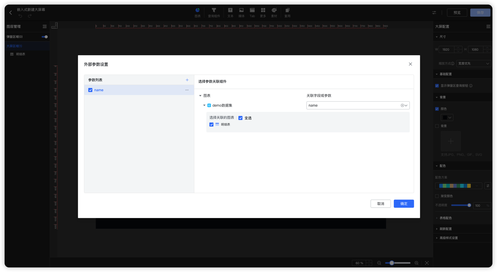

!!! Abstract ""
    嵌入式支持外部参数传递，可以使用该功能根据第三方系统传递的参数在 DataEase 中进行数据的过滤，或者 DataEase 向第三方系统传递参数，外部参数可根据业务需求选择使用或者不使用。
!!! Abstract ""
    目前支持参数及场景如下，使用参数需在仪表板或者数据大屏首先做好参数设置。

## 1 外部参数传递支持场景
!!! Abstract ""
    - Iframe 嵌入图表、仪表板、数据大屏。
    - DIV 嵌入图表、仪表板 、数据大屏。

## 2 外部参数设置
!!! Abstract ""
    使用外部参数，需要先在 DataEase 系统中设置好数据大屏或者仪表板外部参数，具体设置可见[操作手册](https://dataease.cn/docs/v2/user_manual/dashboard_basicfunctions/#6)。
{ width="900px" }

## 3 嵌入式参数以及外部参数说明
!!! Abstract ""
    以下列出两种嵌入方式所有的参数以及外部参数设置示例。
    Iframe 嵌入式参数以及外部参数示例。

    ```
    ## 嵌入式参数
    const params = {
        busiFlag: busiFlag,         ## 业务标识 仪表板 dashboard / 数据大屏 dataV
        type:type                   ## 类型
        dvId: dvId,                 ## 看板id
        "de-embedded" : true        ## 嵌入式标志
        chartId: chartId,           ## 图表 id
        embeddedToken: token,       ## 嵌入式 token
        outerParams: JSON.stringify(initParams)  ## 外部参数
    }
    ## 外部参数
    const initParams = {
        callBackFlag: "yes",        ## 打开 DataEase 往外部系统传参数开关
        attachParams: {             ## json 拼接外部参数，如有多个外部参数，则拼接多个 json key
        name: "name1"
        }
    }
    ```

    DIV 嵌入式参数以及外部参数示例。

    ```
    ## 嵌入式参数
    const dataease = new DataEaseBi('ViewWrapper', {
        baseUrl: domain,                         ## baseUrl：DataEase 企业版访问地址。
        token: token,                            ## 嵌入式 token
        dvId: dvId,                              ## 看板id
        opt:opt,                                 ## 固定写法，设计器嵌入需要，默认为 create
        chartId: chartId,                        ## 图表id
        busiFlag: busiFlag,                      ## 业务标识 仪表板 dashboard / 数据大屏 dataV
        outerParams: JSON.stringify(initParams)  ## 外部参数，json 格式
    })
    ## 外部参数
    const initParams = {
        callBackFlag: "yes",                     ## 打开 DataEase 往外部系统传参数开关
        attachParams: {                          ## json 拼接外部参数，如有多个外部参数，则拼接多个 json key
        name: "name1"
        }
    }
    ```