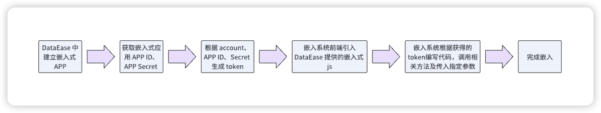
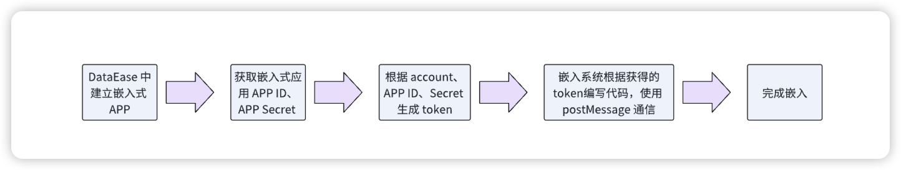
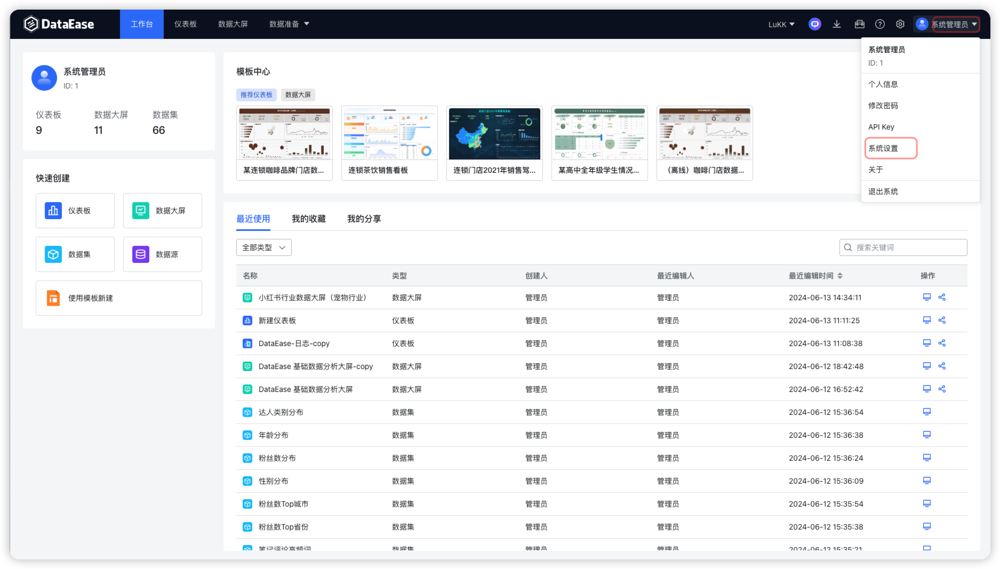
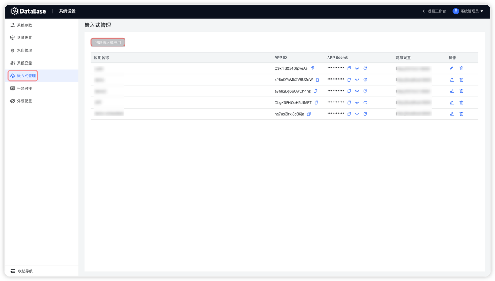
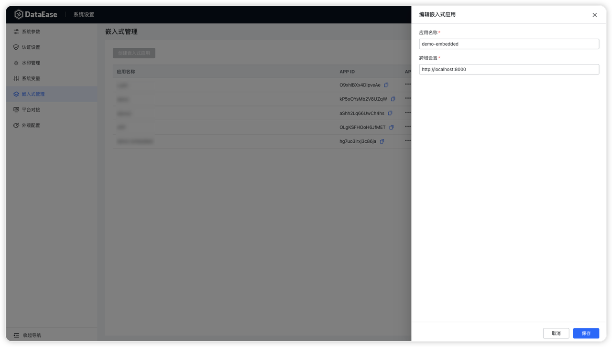
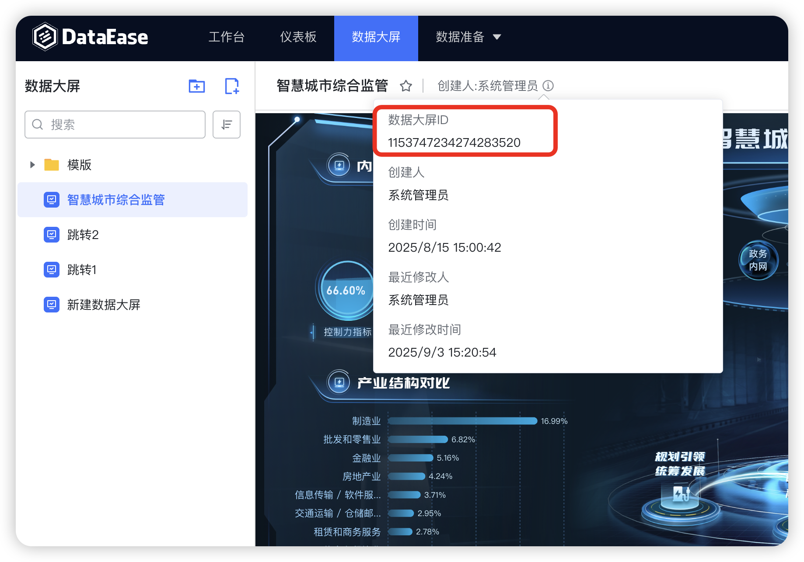
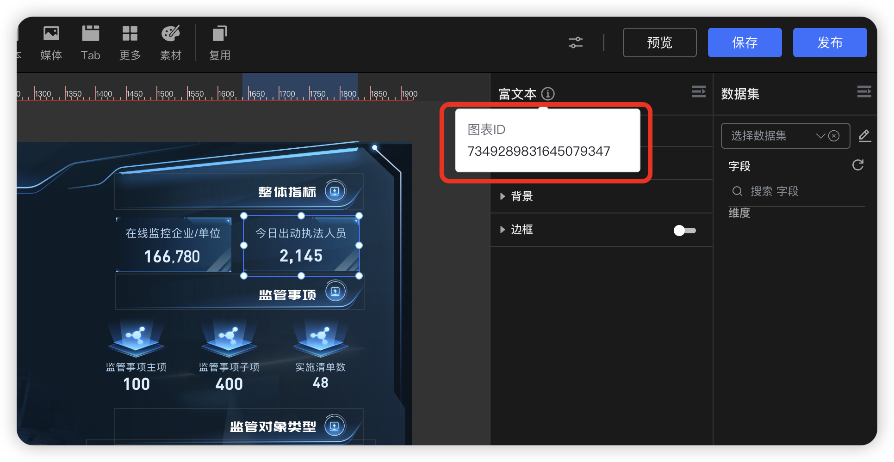
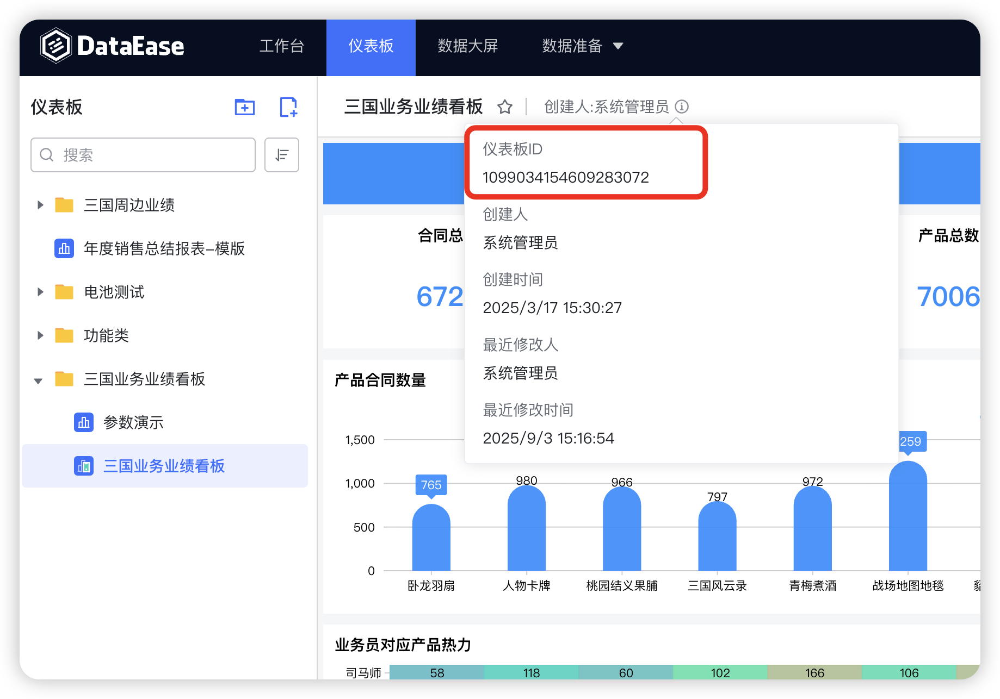
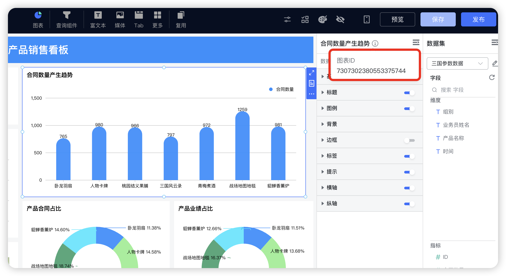

## 1 流程概述
!!! Abstract ""
    DataEase 支持使用 Iframe 以及 DIV 进行嵌入，两种方法的流程如下。

    **注意：嵌入需要在 DataEase 的配置文件 `/opt/dataease3.0/conf/application.yml` 里增加 origin-list 配置，并重启服务。详细见[嵌入式常见问题](question.md)。**
### 1.1 DIV 嵌入式流程

!!! Abstract ""
    在 DataEase 中创建嵌入式应用后，首先获取其 APP ID 和 APP Secret，同时获取 DataEase 用户账号。使用这些信息生成 token，并利用生成的 token 进行认证。引入 DataEase 提供的嵌入式 js 文件后，使用指定参数创建 DataEaseBi 对象，并渲染 DIV 容器即可实现嵌入式应用的集成与展示。
{ width="900px" }

### 1.2 Iframe 嵌入式流程
!!! Abstract ""
    在 DataEase 中创建嵌入式应用后，首先获取其 APP ID 和 APP Secret，同时获取 DataEase 用户账号。使用这些信息生成 token，并利用生成的 token 进行认证。使用 postMessage 通信并传入相应参数，即可实现嵌入式应用的集成与展示。
{ width="900px" }

## 2 端口说明
!!! Abstract ""
    **注意：企业版（嵌入式版）使用端口为 9080，需要开放此端口访问。**

| 端口   |    作用    |       说明        |
|------|:--------:|:---------------:|
| 9080 | Apisix 服务 | 企业版、专业版、嵌入式版使用 apisix 的 9080 端口进行嵌入及访问 |

## 3 APP 创建
!!! Abstract ""
    点击【系统设置】，进入【嵌入式管理】页面创建嵌入式应用。

    **注意：嵌入式 License 最多可创建 5 个嵌入式应用，其它版本无此限制。**

!!! Abstract ""
    嵌入式应用创建后，可以获取 APP ID、APP Secret。

    - APP ID：嵌入式获取 JWT token 需要填写的 ID。

    - APP Secret ：嵌入式获取 JWT token 需要填写的 Secret。
{ width="900px" }
{ width="900px" }
{ width="900px" }

!!! Abstract ""
    - 应用名称：嵌入式应用名称，可自定义。
    - 跨域设置：嵌入系统的访问地址。

    提示：跨域指两个域名不同的网页之间进行通信，填写嵌入系统的访问地址，跨域限制是由浏览器的同源策略（Same-Origin Policy）决定的。这是一种安全机制，旨在防止恶意网站读取其他网站的敏感数据。

### 3.1 跨域说明

!!! Abstract ""
    浏览器的同源策略（Same-Origin Policy）规定，只有当协议（protocol）、域名（domain）和端口（port）完全相同的情况下，网页才能自由访问另一个源的资源。如果请求的资源与当前网页的源不同，为跨域请求。具体如下：

    1. 不同的协议
    ```
    示例：从 http://example.com 请求 https://example.com。
    原因：即使主机名和端口相同，协议不同也算跨域。
    ```

    2. 不同的端口
    ```
    示例：从 http://example.com:3000 请求 http://example.com:4000。
    原因：端口不同，即使协议和主机名相同。
    ```

    3. 不同的顶级域名
    ```
    示例：从 http://example.com 请求 http://anotherexample.com。
    原因：顶级域名不同。
    ```

    4. 子域名和顶级域名
    ```
    示例：从 http://sub.example.com 请求 http://example.com。
    原因：子域名和顶级域名不同，也算跨域。
    ```

    5. 子域名和子域名
    ```
    示例：从 http://sub1.example.com 请求 http://sub2.example.com。
    原因：子域名和子域名不同，也算跨域。
    ```

## 4 ID 获取

!!! Abstract ""
    数据大屏 ID（编辑或预览界面均可获取） 及图表 ID 获取。
{ width="900px" }
{ width="900px" }

!!! Abstract ""
    仪表板 ID（编辑或预览界面均可获取）以及图表ID  获取。
{ width="900px" }
{ width="900px" }