## 1 DIV 嵌入后，页面打开空白，浏览器控制台有跨域相关的异常报错
!!! Abstract ""
    如下所示：
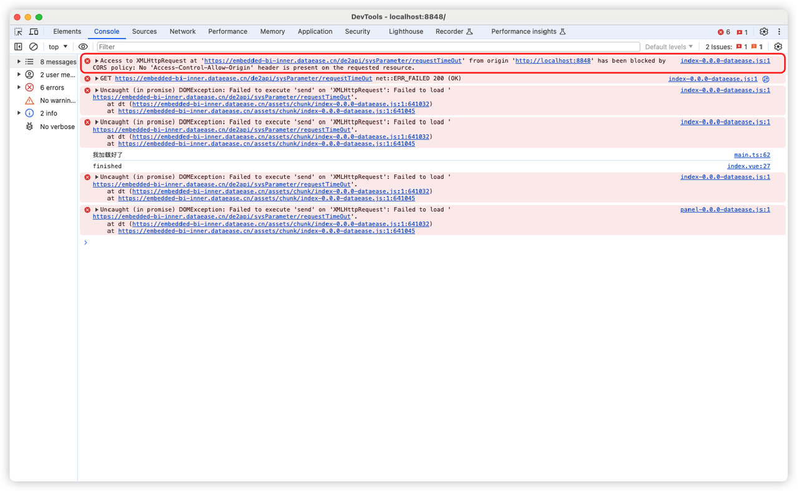{ width="900px" }


!!! Abstract ""
    解决方案：检查嵌入式应用的跨域设置，与提示报错的 origin 是否相同。
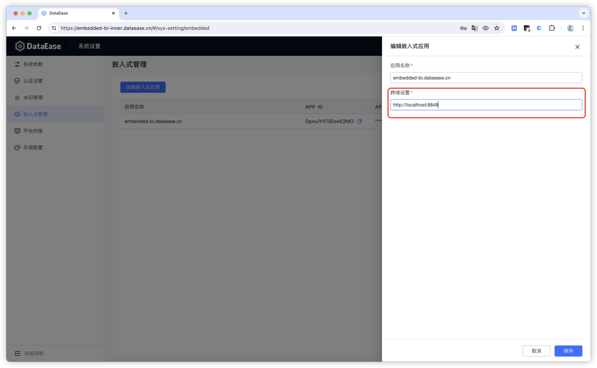{ width="900px" }


## 2 Iframe DIV 嵌入后，提示域名匹配错误
!!! Abstract ""
    如下所示：
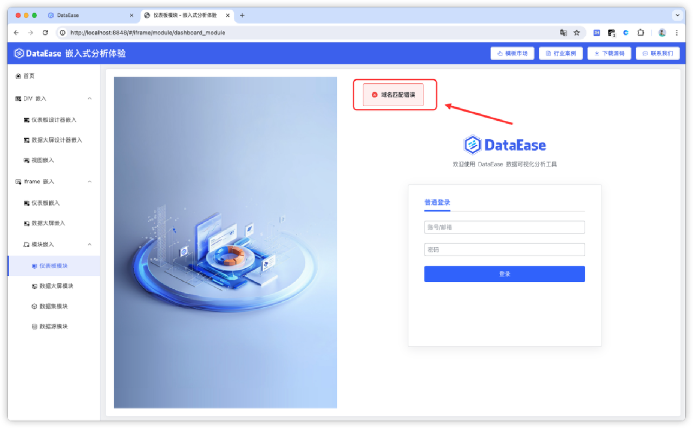{ width="900px" }

!!! Abstract ""
    解决方案 1：Iframe DIV 嵌入需要在 DataEase 的配置文件 /opt/dataease2.0/conf/application.yml 里增加 origin-list 配置访问 DataEase 地址，多个地址以逗号隔开并重启 DataEase 服务，如下所示：

    ```
    origin-list: http://localhost:8000，访问 DataEase 地址1（9080）,访问 DataEase 地址2（9080)
    ```

    ```
    #重启 DataEase 服务
    dectl restart
    ```
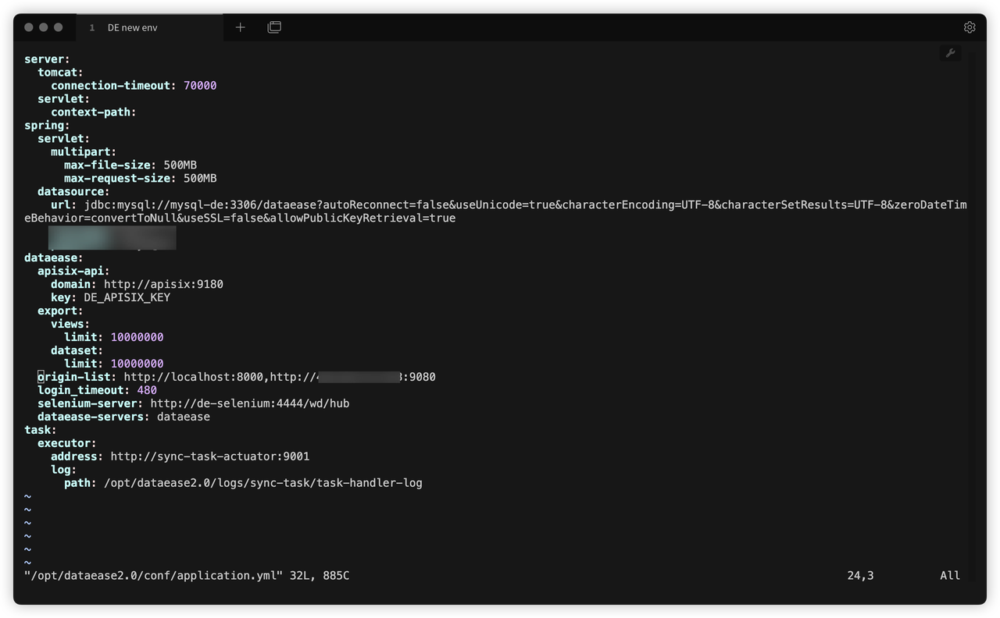{ width="900px" }


!!! Abstract ""
    解决方案 2：如果已经填写上述内容后依旧报错，需注意如下
    检查嵌入系统访问域名和嵌入式 APP 里面的跨域设置是否一样，需要保持一致。


## 3 DIV 嵌入后，页面打开空白，浏览器控制台提示 DataEaseBi is not defined
!!! Abstract ""
    如下所示：
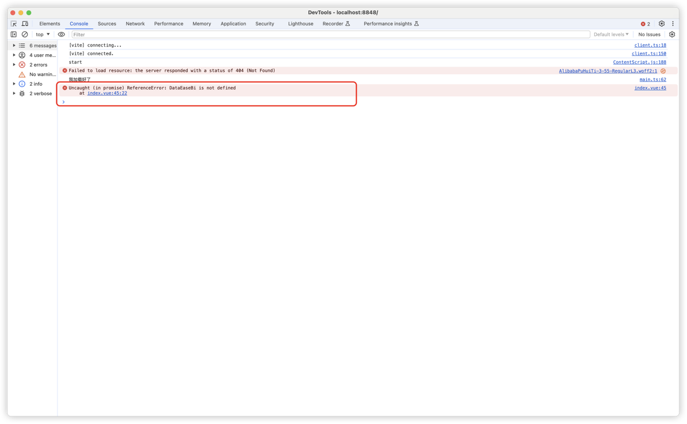{ width="900px" }

!!! Abstract ""
    解决方案：

    该问题可能由两种情况导致：

    情况一：DataEase JS 未正确引入，如下所示，打开浏览器控制台，在 Network 页签选择 JS ，搜索 dataease 查看是否存在相关 JS 即可判断。
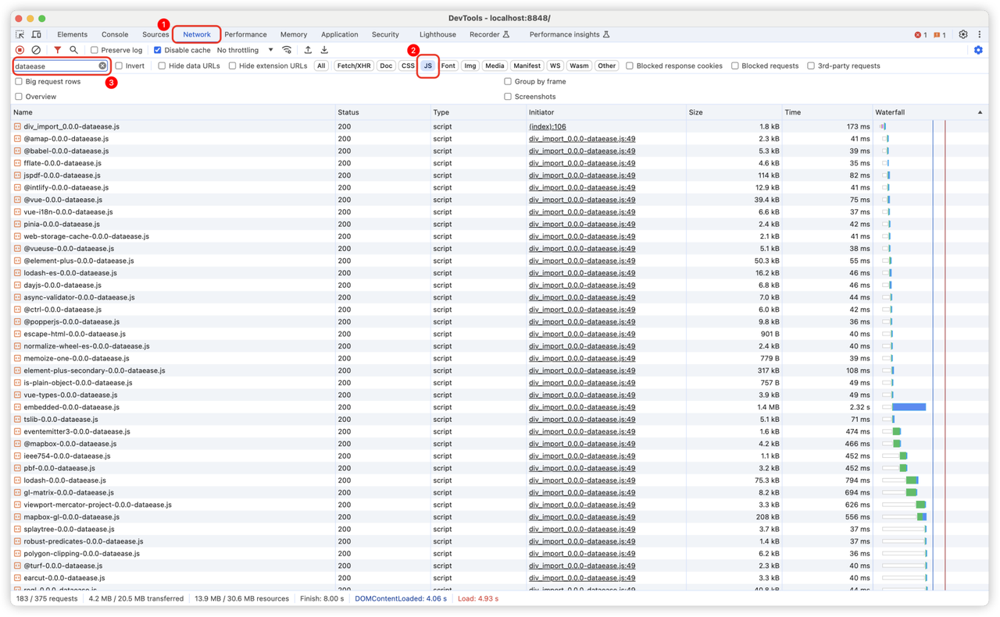{ width="900px" }

!!! Abstract ""
    情况二：加载嵌入式页面时，DataEase JS 未加载完成。可通过 window.onload 或 setTimeOut（不建议） 等方式，等待 JS 加载完成后，再初始化 DataEaseBI 。

## 4 页面提示 500，查看 DataEase 容器日志提示 token is empty for uri
!!! Abstract ""
    如下所示：
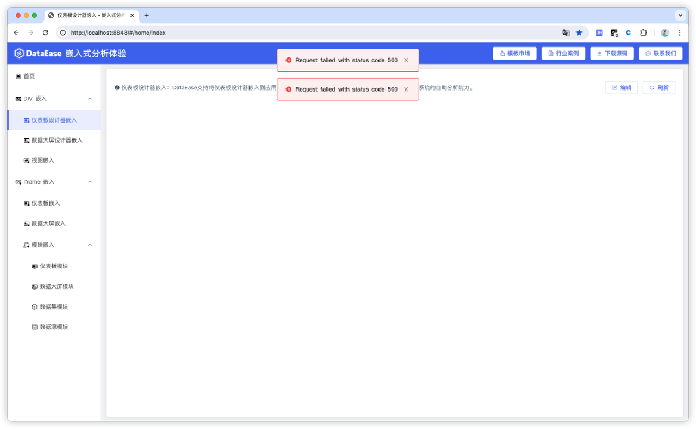{ width="900px" }
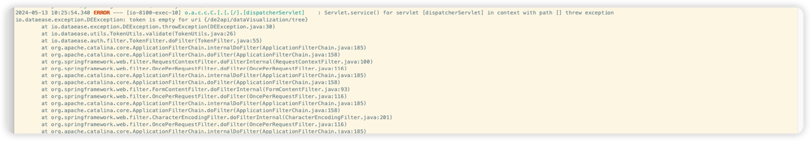{ width="900px" }

!!! Abstract ""
    解决方案： 该问题为使用社区版的 8100 端口进行嵌入式的调试，将端口修改为 9080 即可。

## 5 DIV 嵌入后，页面打开空白，浏览器控制台无任何报错，且 JS 加载等均正常
!!! Abstract ""
    如下所示：
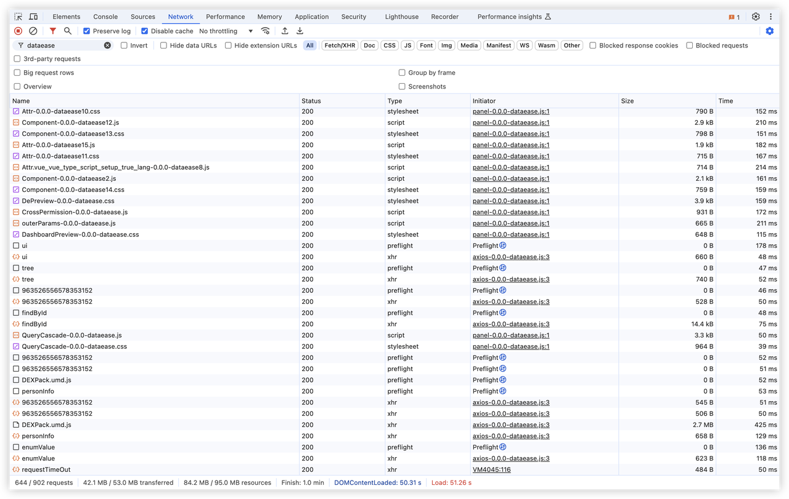{ width="900px" }

!!! Abstract ""
    解决方案： 该问题是由于未对 DIV 容器设置初始大小导致，手动设置 DIV 容器大小后即可解决。

## 6 DIV 嵌入时创建数据源弹框超出 DIV 范围
!!! Abstract ""
    如下所示：
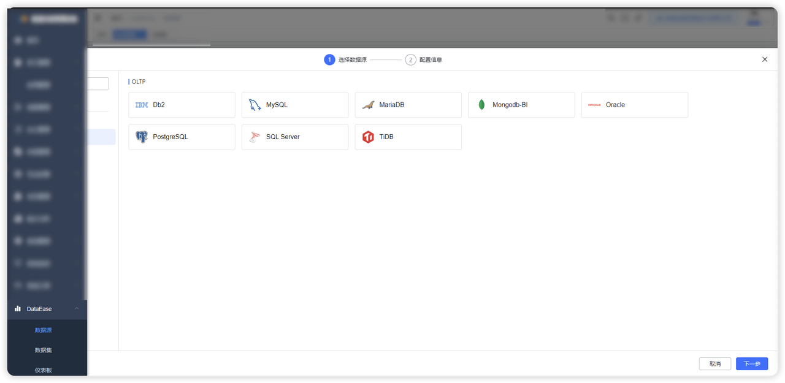{ width="900px" }

!!! Abstract ""
    解决方案：

    - 方案一：DIV 嵌入特性如此，可以在嵌入的目标系统中通过 CSS 类名 datasource-drawer-fullscreen 来设置样式。
    - 方案二：iFrame 嵌入无此问题，也可使用iFrame 方式嵌入。

## 7 DIV 嵌入时点击预览按钮提示域名匹配错误
!!! Abstract ""
    如下所示：
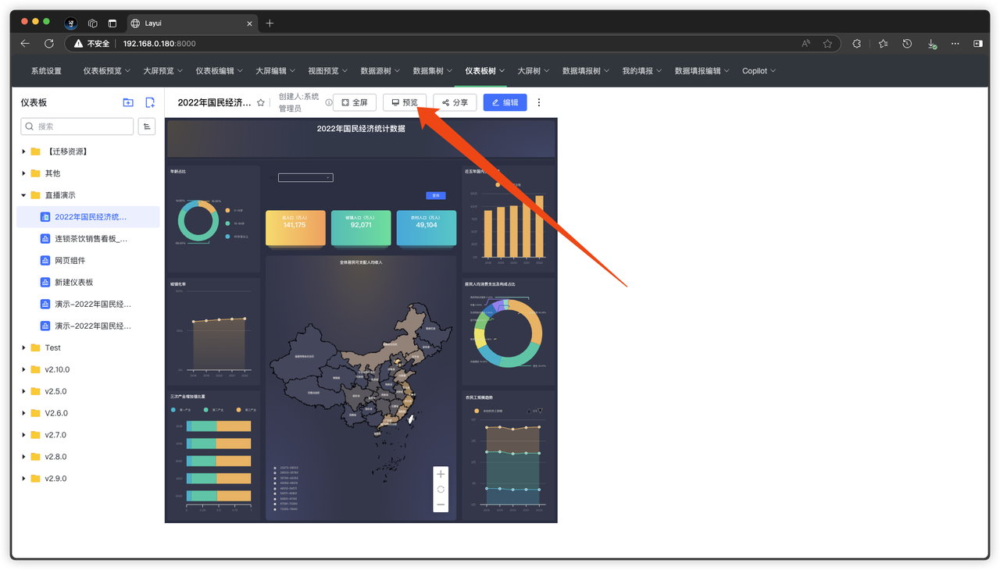{ width="900px" }

!!! Abstract ""
    解决方案：需要新开标签页访问的的地址都要配置 origin-list，参考 4.2 处理。


## 8 DIV 嵌入白屏，网络请求 401，iFrame 嵌入网络请求状态码 400
!!! Abstract ""
    如下所示：

    DIV 嵌入时页面白屏，或列表为空，浏览器控制台查看网络请求状态有 401 状态码
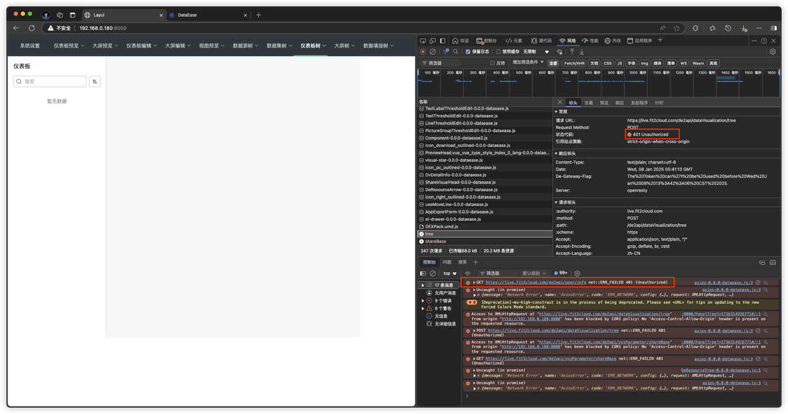{ width="900px" }

!!! Abstract ""
    iFrame 嵌入时提示 Request failed with status code 400

    网络请求返回异常：Request processing failed: com.auth0.jwt.exceptions.InvalidClaimException: The Token can't be used before Wed Jan 08 13:42:29 CST 2025.
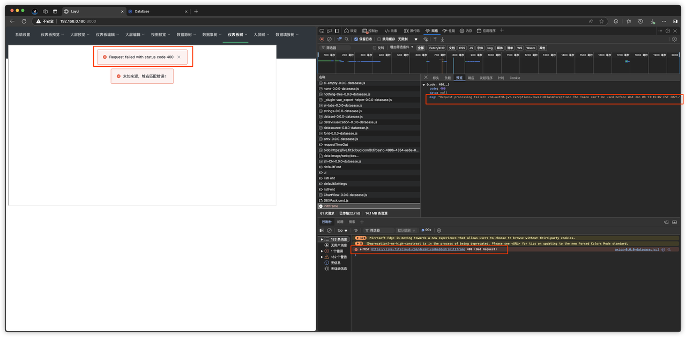{ width="900px" }

!!! Abstract ""
    解决方案：

    - 保证要嵌入的目标系统和 DataEase 服务器时间保持一致。
    - 嵌入式 Token 生成的时间需要与 DataEase 服务器时间保持一致，根据异常信息可知，Token 生成的时间是 Wed Jan 08 13:42:29 CST 2025，所以如果 DataEase 服务器时间早于此时间就会出现此问题。
## 9 嵌入时，切换 id 实例化不同资源，出现白屏
!!! Abstract ""
    解决方法： 切换 id 重新实例化前，先调用一下 destroy 方法，然后再实例化。
