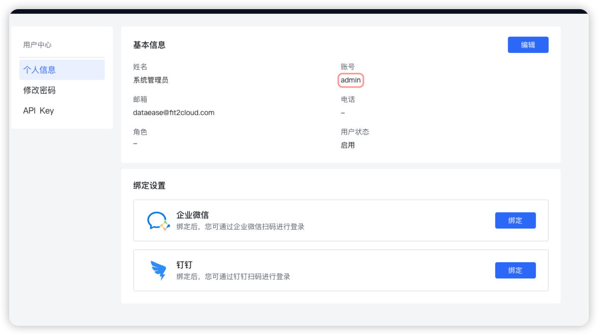

!!! Abstract ""
    注意；本文当所使用代码均为嵌入式官方 [demo 代码](https://github.com/dataease/embedded-demo/tree/isv-embedded-demo)。并在此基础上进行代码的修改进行演示。

## 1 嵌入式 Token
!!! Abstract ""
    采用 JWT 认证 ，官方嵌入式代码生成 token 方式如下，需要获取 DataEase 嵌入式应用的 APP ID、APP Secret，以及 DataEase 中的用户账号。

    2.10.0 版本开始，支持设置 token 有效时间。 Token 可根据实际情况使用其它类型语言生成，代码实现方式不唯一。
   
    ```
    @RestController
    public class IndexController {

        # 嵌入式 appId
        private static String appId = "";
        
        # 嵌入式 appSecret
        private static String appSecret = "";
        
        #DataEase 用户名
        private static String account = "";
        
        #
        ## 获取 DataEase 嵌入式 Token
        ## DataEase 嵌入式 Token 使用的是 JWT 认证，由 appId、appSecret 以及 DataEase 用户名生成。
        ## Java 程序可直接引用 java-jwt (https://mvnrepository.com/artifact/com.auth0/java-jwt) 依赖，其它后端语言可自行百度加密代码。
        ## 注意，嵌入式 Token 的过期时间默认为 480 分钟，可通过修改 application.yml 进行调整
        ## 配置参数名称为 dataease.embedded-exp
        
        @GetMapping("/api/token")
        public String generateToken () {
        
            String user = "小王";
            List<String> users = Arrays.asList("小王","小李");
            String status = "ASSIGNED";
            
            Algorithm algorithm = Algorithm.HMAC256(appSecret);
            JWTCreator.Builder builder = JWT.create();
            builder.withClaim("account", account).withClaim("appId", appId);
            builder.withIssuedAt(new Date());
            ## 只过滤 user = 小王
            ## builder.withClaim("user", user);
            ## 过滤 user = 小王 或者 小李的数据
            ## builder.withClaim("user", JSONObject.toJSONString(users));
            ## 过滤 user = 小王 或者 小李 以及 设备状态等于 ASSIGNED 的数据
            ## 参数可根据业务需要选择设置或者不设置
            ## user 、设备状态 为仪表板参数设置里面的参数名
            ## builder.withClaim("user", JSONObject.toJSONString(users)).withClaim("设备状态", status);
            return builder.sign(algorithm);
        }
     }
    ```
!!! Abstract ""
    account 获取方式，见下图，可以使用任意符合业务需求的账号，不仅限于 admin 账户，也不推荐使用 admin 账户进行嵌入。
{ width="900px" }

##  2 DataEase 嵌入式 JS
!!! Abstract ""
    当使用 DIV 嵌入时，需引入 DataEase 提供内置的 js 模块，如下 。

    引入 js 后，即可使用 js 模块提供好的类及方法完成 DIV 的嵌入。

    **注意：需要将 js 引入到页面的 head 中，保证依赖的正确加载。**

    ```
    ## {domain}js/div_import_0.0.0-dataease.js DataEase 提供好的 js 模版，
    ## 访问地址为 http://ip:9080/js/div_import_0.0.0-dataease.js
    <script crossorigin  type="module" th:src="@{{domain}/js/div_import_0.0.0-dataease.js(domain=${vo.domain})}"></script>
    ```