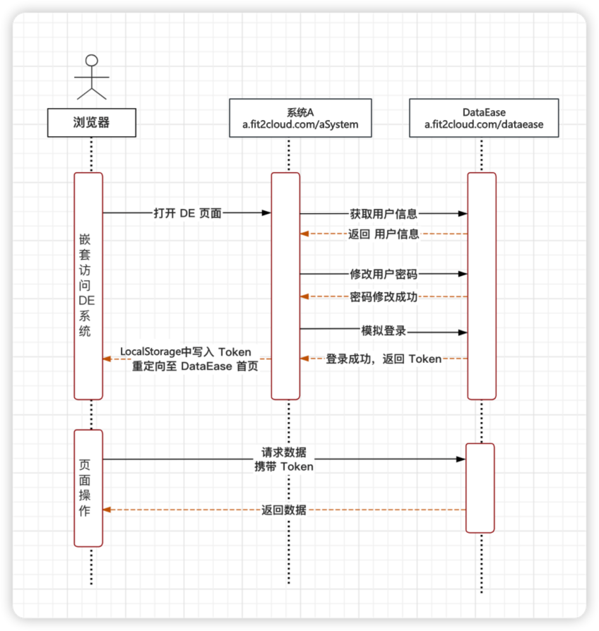
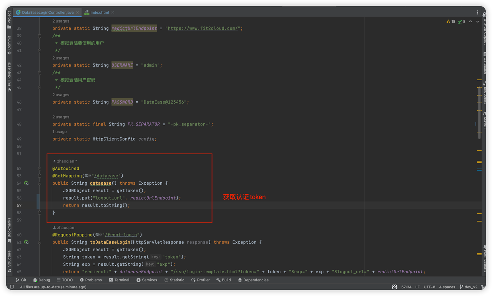
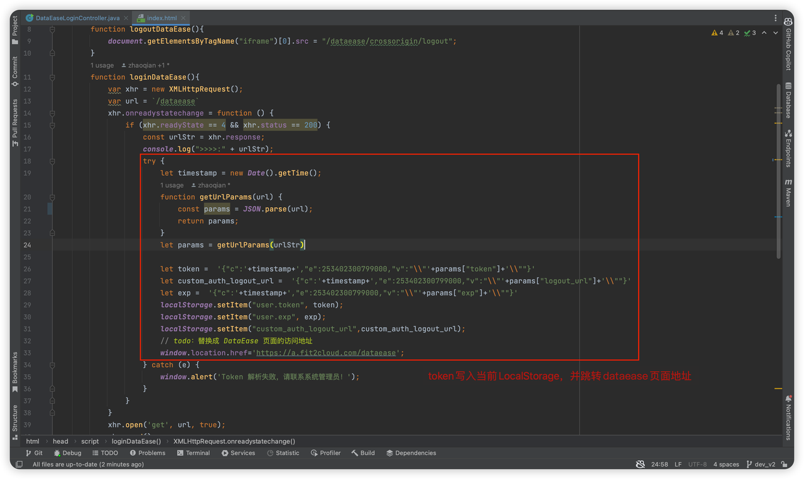
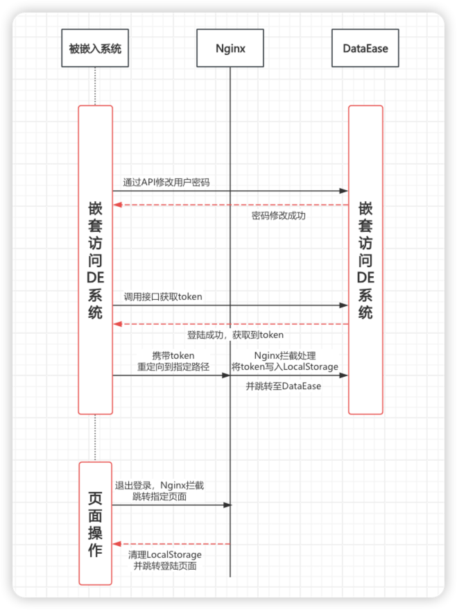
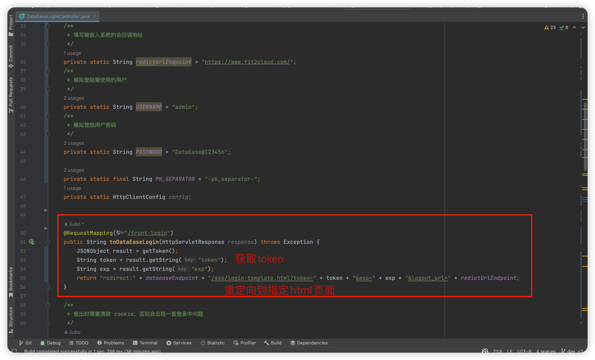
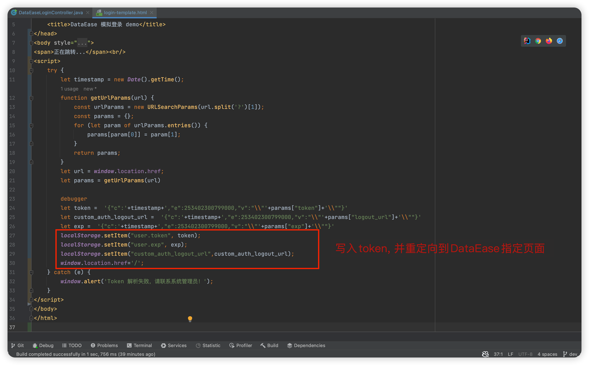

!!! Abstract ""
    模拟登录指：A 系统后台请求 DataEase 的登录接口，将登录成功的 Token 写入 LocalStorage 中，来模拟用户登录的过程，省去用户自己输入密码登录的过程。

    模拟登录又分同域和跨域两种方式，文章中会详细介绍。

    但有时受限于实际情况，比如没有搭建 SSO 系统，这时则可使用模拟登录方式，需要做一些开发，同样可以实现集成。

## 1 模拟登录方案介绍
!!! Abstract ""
    DataEase 的认证 token 是放在 LocalStorage 里面的，调用 /de2api/login/localLogin 接口可以拿到 Token 信息。关键问题在于怎么将 DataEase 的认证信息放到 LocalStorage 里面去。根据处理方案的不同，分为同域模拟登陆和跨域模拟登陆。

    同域模拟登陆是指 A 系统与 DataEase 在同一域名下。比如DataEase访问地址为：a.fit2cloud.com/dataease，A系统的访问地址为：a.fit2cloud.com/aSystem，它们使用的域名都是 a.fit2cloud.com。这种情况下，A 系统可以将 user.token 信息存放在 a.fit2cloud.com 域名的 Local storage 下，DataEase 也可以获取 a.fit2cloud.com 域名下的 Local storage，以此实现模拟登录认证。

    跨域模拟登陆是指 A 系统与 DataEase 不在同一域名下。这种情况下，A 系统携带 Token 信息访问 DataEase 系统（只是通过特定的路径），Nginx 通过特定路径拦截到请求重定向至自定义的 HTML 页面，然后通过 HTML 页面中的 JS 代码将 Token 信息写入到 LocalStorage 中去，然后再跳转到 DataEase 正常的访问路径，至此完成模拟登录。

## 2 同域模拟登陆

### 2.1 流程描述
{ width="900px" }
!!! Abstract ""
    1. 用户登录 A 系统
    2. 用户在 A 系统中通过 Iframe 访问 A 系统的模拟登录接口
    3. A 系统根据已登录的用户信息请求 DataEase 的用户查询接口，获取到 DataEase 系统中对应的用户 ID
    4. A 系统根据用户 ID 调用 DataEase 重置用户密码的接口 /user/resetPwd，重置用户密码
    5. A 系统调用 DataEase 的模拟登录接口获取 Token
    6. A 系统将 Token 信息写入当前域名的 LocalStorage 下，然后再跳转到 DataEase 正常的访问路径

### 2.2 开发指南
!!! Abstract ""
    此方案需要 A 系统提供一个模拟登录接口，模拟登陆接口中获取用户 Token（如果需要使用动态的用户进行登陆认证，则需要调用获取用户接口和修改用户密码接口来保证模拟登录成功），前端将获取到的token写入当前域名的LocalStorage下，然后再跳转到 DataEase 正常的访问路径，至此完成模拟登录。

     参考示例代码：[dataease-login-adpter-demo](https://github.com/liuboF2c/dataease-login-adpter-demo/tree/dev_v2)
{ width="900px" }
{ width="900px" }

## 3  跨域模拟登陆

### 3.1  流程描述

{ width="900px" }
!!! Abstract ""
    1. 用户登录 A 系统
    2. 用户在 A 系统中通过 Iframe 访问 A 系统的模拟登录接口
    3. A 系统根据已登录的用户信息请求 DataEase 的用户查询接口，获取到 DataEase 系统中对应的用户 ID
    4. A 系统根据用户 ID 调用 DataEase 重置用户密码的接口 /user/resetPwd，重置用户密码
    5. A 系统调用 DataEase 的模拟登录接口获取 Token
    6. A 系统携带 Token 信息访问 DataEase 系统（只是通过特定的路径）
    7. Nginx 通过特定路径拦截到请求重定向至自定义的 HTML 页面，然后通过 HTML 页面中的 JS 代码将 Token 信息写入到 LocalStorage 中去，然后再跳转到 DataEase 正常的访问路径

### 3.2  开发指南
!!! Abstract ""
    此方案需要 A 系统提供一个模拟登录接口，模拟登陆接口中获取用户 Token，并返回重定向地址，重定向地址携带 Token 信息重定向到特定路径（如果需要使用动态的用户进行登陆认证，则需要调用获取用户接口和修改用户密码接口来保证模拟登录成功）。

    Nginx 通过特定路径拦截到请求重定向至自定义的 HTML 页面，然后通过 HTML 页面中的 JS 代码将 Token 信息写入到 LocalStorage 中去，然后再跳转到 DataEase 正常的访问路径，至此完成模拟登录。
   
    参考示例代码：[dataease-login-adpter-demo](https://github.com/liuboF2c/dataease-login-adpter-demo/tree/dev_v2)
{ width="900px" }
{ width="900px" }

### 3.3  Nginx配置
!!! Abstract ""
    Nginx 还需要配置一个静态网页，用于设置 LocalStorage 用。Nginx 配置参考如下：

    ```
    location / {
        proxy_pass <DataEase服务器地址>
        proxy_set_header X-Real-IP $remote_addr;
        proxy_set_header Host $http_host;
        proxy_set_header X-Forwarded-For $proxy_add_x_forwarded_for;
    }

    location /sso {
        # 请将此配置 [./src/main/resources/templates] 修改为 login-template.html 存放路径
        # login-template.html 取自示例代码的 src/main/resources/templates/ 目录
        # 将其与 nginx 放置于同一服务器，然后在 nginx 配置文件中将此配置项填写为 login-template.html 的所在目录;
        alias   ./src/main/resources/templates
        index   login-template.html;
    }
    ```