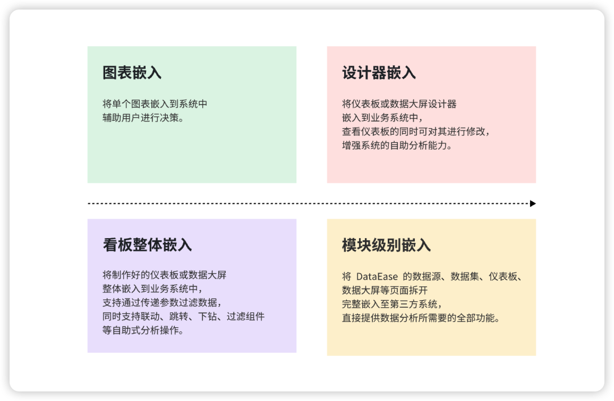
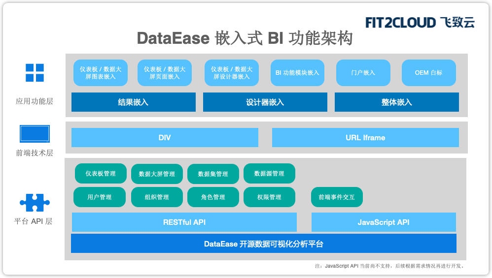
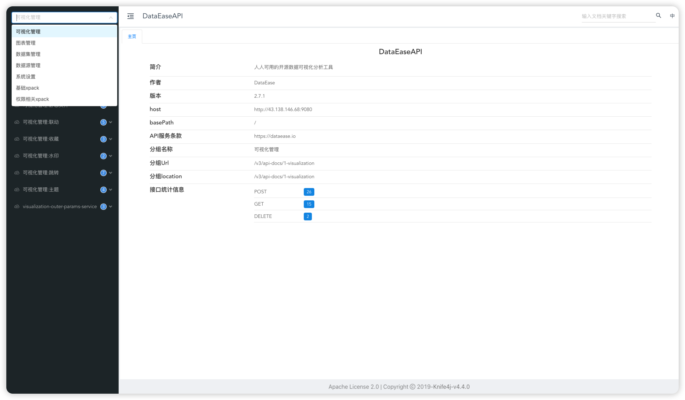
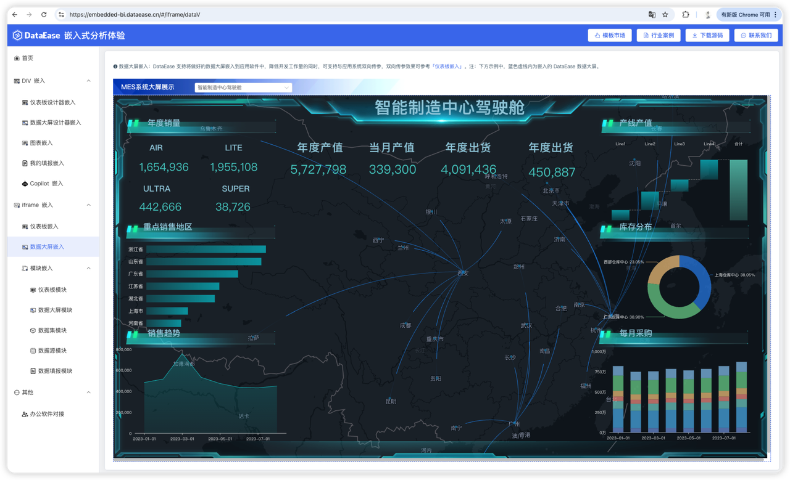
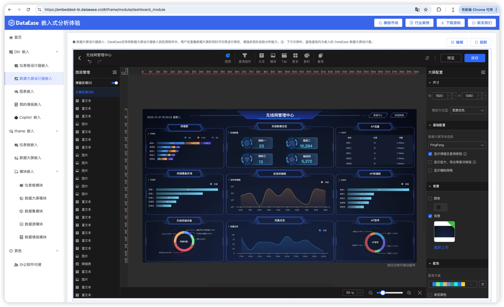
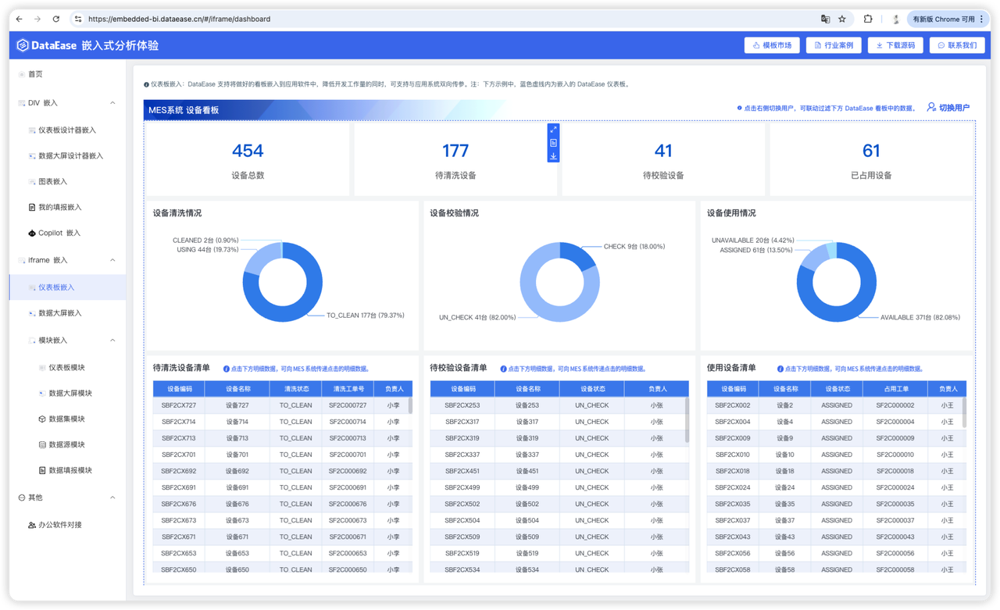
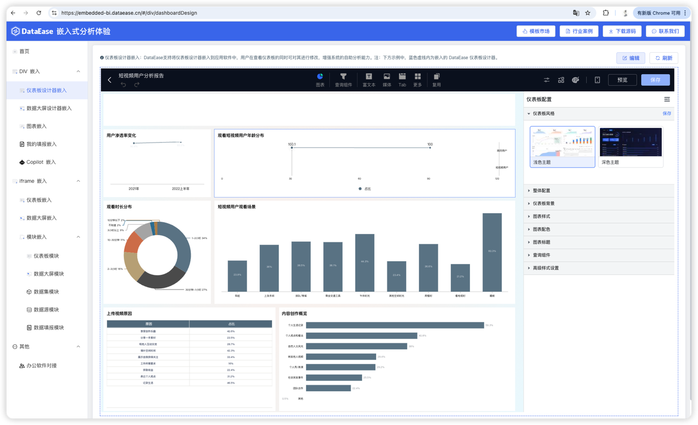
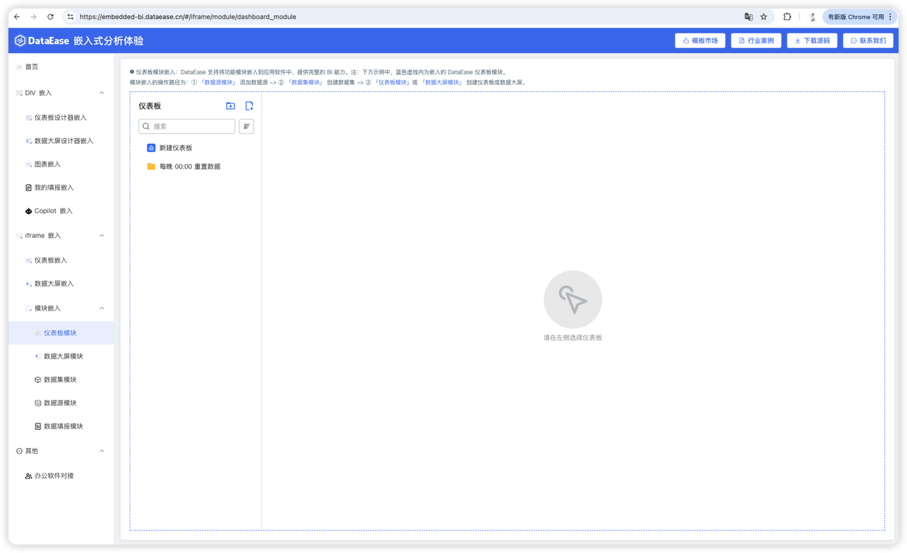

## 1 模块说明

!!! Abstract ""
    DataEase 提供了丰富的嵌入式功能，包括可视化看板单独嵌入，系统模块嵌入等，DataEase 提供封装好的方法及模块，用户在代码中参考官方示例即可完成嵌入操作。
{ width="900px" }

!!! Abstract ""
    DataEase 嵌入式支持 DIV 和 Iframe 两种嵌入方式，支持按照单个可视化资源，以及现有数据集、数据源、数据大屏、仪表板等完整模块的嵌入。可根据需要自行选择对应方式进行嵌入。

    DataEase 同时提供了丰富的 API 接口，包括仪表板管理、数据大屏管理，数据集管理、权限管理、用户管理等模块，可根据实际的业务需求调用 DataEase 的接口完成业务要求，API 说明入口位于 【系统设置】->【API Key】->【查看 API】。
{ width="900px" }
{ width="900px" }

## 2 嵌入式场景效果预览
!!! Abstract ""
    [官方演示环境](https://embedded-bi.dataease.cn/#/home/index)，嵌入式官方体验环境，可查看嵌入式效果。

    官方 demo 代码， [Layui 框架代码](https://github.com/dataease/embedded-demo/tree/main) ，[Vue3 代码](https://github.com/dataease/embedded-demo/tree/isv-embedded-demo) 。
    
    **注意：如果项目的前端使用的是 Vue3 的框架，建议参考 Vue3 的代码进行嵌入；其他前端框架可参考 LayUl 框架的代码进行嵌入。**
!!! Abstract ""
    数据大屏及数据大屏设计器嵌入。
{ width="900px" }
{ width="900px" }

!!! Abstract ""
    仪表板及仪表板设计器嵌入。
{ width="900px" }
{ width="900px" }

!!! Abstract ""
    模块嵌入。
{ width="900px" }