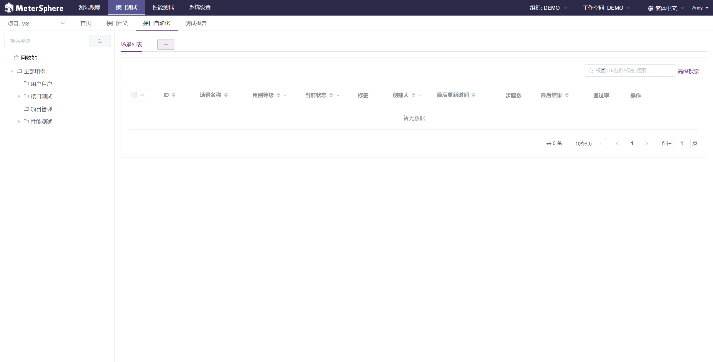
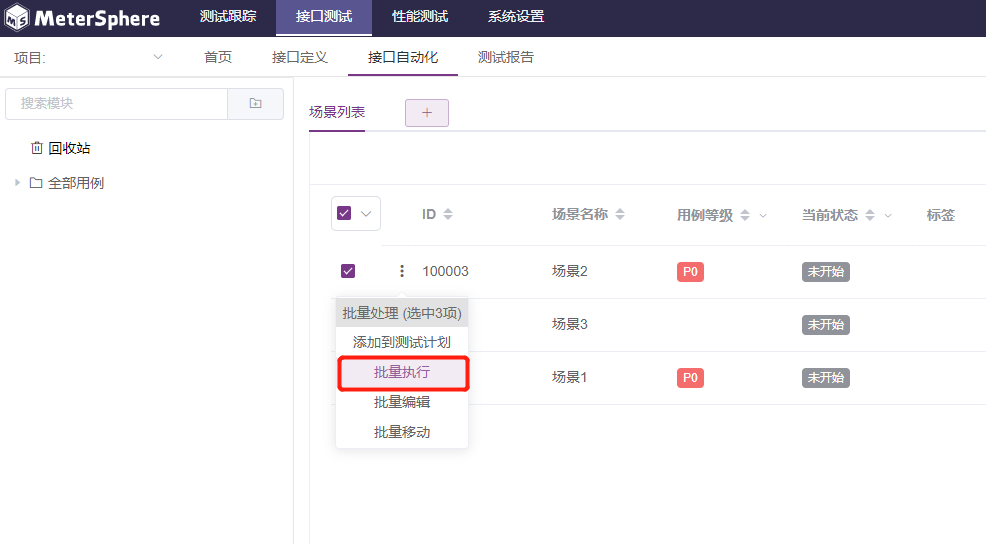
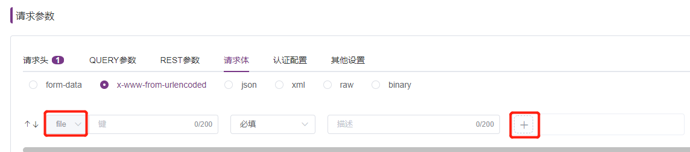

## v1.6.0 之前创建的接口测试，如何转换为新版接口测试？

在 v1.7.0 版本，MeterSphere 提供了数据转换功能。首先点击右上角下拉 `切回旧版` 进入旧版接口测试页面。

在接口测试列表中，选择要转换的接口测试，点击列表上方的 `转场景测试`，即可将其装换成新版本接口自动化中的场景用例。

## 在接口自动化的一个场景里面，个别接口需要使用不同的环境去运行，该怎么实现？

可以通过添加自定义请求的方式实现。

## 传参使用随机数，有内置的方法吗？

参数值可以使用 JMeter 的内置函数或者 Mock.js 的函数生成随机值。

## 接口自动化多场景，是否支持批量运行？

在场景列表选中场景，点击 `···` 弹出下拉框，选择 `批量运行`

## 接口自动化如何生成报告？

手动执行的接口自动化场景不会自动生成测试报告，用户需要点击该场景的最后执行结果手动保存测试报告。请参考[执行指定场景](/user_manual/api_test/api_automation/#_12)

## 接口自动化支持上传文件的接口吗？

支持。根据接口要求的请求体类型，选择 `form-data`、`x-www-form-urlencoded` 格式的请求体，参数类型选择 file，选择要添加的文件。也可以使用 `binary` 格式的请求体，直接选择要添加的文件。

## 接口自动化中模块之间是否支持共享cookie?

不支持模块下共享cookie，建议在同一模块下创建多个场景和子场景，在不同场景之间开启共享cookie。

## 接口测试中，断言期望结果不为空，该如何判断？

可以在期望值中使用匹配任意非空字符的正则表达式 `\S+` 进行判断。

##  SQL协议如何断言？比如SQL请求返回2列数据，该如何取到这些值进行断言？

SQL请求可通过如下方法进行断言：

1. 配置“存储结果”和“按列存储”，存储数据； 
2. 配置SQL脚本，取出需要断言的参数； 
3. 添加脚本断言，判断存储 SQL 结果数据的变量的变量值；

## 全局变量和场景变量里，设置为同一变量，优先级如何判断？

设置同一变量时，后配置的优先。

## 场景中导入接口，参数需要重写才能跑通，引用的接口无法修改参数吗？

接口导入场景有两种方式，第一种方式是复制，复制的接口可以在场景中修改参数；第二种方式是引用，引用的接口只能在接口定义那里进行修改，修改完成后会自动同步到场景里。

## 场景中添加了条件控制器，且匹配失败了，为什么后续的接口还会执行？

后续的接口需要拖入到条件控制器中。