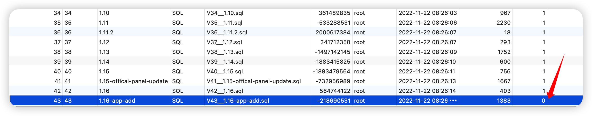

## 1 DataEase 默认的登录信息

!!! Abstract ""
    **DataEase 成功安装后，默认内置了两个用户：**

      - 管理员用户为 admin ，密码为 dataease
      - 体验用户为 demo ，密码为 dataease


## 2 查看 DataEase 相关日志信息

!!! Abstract ""
    在 DataEase 的运行目录下有专门存放组件日志的目录（默认路径 /opt/dataease/logs)，各个组件的日志分别存放在以各自命名的目录下，如 dataease 目录存放的是 dataease 的运行日志，fe 目录存放的是 doris-fe 的运行日志等。可以通过查看相应的运行日志来定位一些使用中遇到的问题。  
    **另外，也可以通过 docker logs 命令来查看容器中的一些日志输出，例如：**
        ```shell
        docker logs -n 30 -f dataease
        ```


## 3 重置 DataEase 安装参数

!!! Abstract ""
    **以下为重置 DataEase 安装参数的通用方法，该方法涉及到重新安装 DataEase 的过程，耗时相对会长一些，如果只是简单的调整安装参数的话，可以参考具体的调整方案：**  

    1. 清除存放原有配置参数的相关文件。
    ```shell
    # dectl - 文件中包含了默认运行目录
    rm -f /usr/bin/dectl
    
    # .env - 文件中包含了运行时参数，在默认运行目录 /opt/dataease 下，如有改动，请在相应的目录下查找
    rm -rf /opt/dataease/.env
    
    # (可选)如果要比较彻底的删除之前创建的相关文件的话，可以删除整个运行目录（默认为 /opt/dataease)
    rm -rf /opt/dataease
    ```
    2. 进入 DataEase 安装包中，修改安装包中的 install.conf 文件，改为最新的配置参数。

    3. 重新执行安装脚本 bash install.sh，等待服务启动即可。


## 4 修改已安装的 DataEase 配置参数

!!! Abstract ""
    第一次安装 DataEase 后，会在运行目录下创建一个 .env 文件(默认路径 /opt/dataease/.env)，install.conf 配置文件中的配置项会记录在此。后续的安装和升级操作，不会去修改 .env 文件；  
    修改运行端口，请参考[80 端口被占用了，如何修改为其他端口？](#5-dataease)；  
    修改运行目录，请参考[如何迁移已有的运行目录到其他路径上？](#6)；  
    修改 MySQL 相关配置，请参考[如何修改内置 MySQL 端口？](../dataease_mysql/#1-mysql) 、[在安装完 DataEase 后如何切换外部 MySQL？](../dataease_mysql/#3-dataease-mysql)、 [如何将 DataEase 数据库由外部 MySQL 切换为 内置 MySQL？](../dataease_mysql/#4-dataease-mysql-mysql)等。


## 5 修改 DataEase 访问端口

!!! Abstract ""
    **当默认的访问端口 80 已被占用，如何修改为其它端口?**

    v1.0.2 及以后的版本，支持配置文件方案管理 DataEase 服务的运行，可以在 DataEase 运行目录下找到 .env 文件（(默认路径 /opt/dataease/.env)，修改文件里的 DE_PORT，保存后执行 dectl reload 即可；

    v1.0.2 以前的版本，可以登录到 DataEase 服务器上，找到 .env 文件(默认路径 /opt/dataease/.env)，把 dataease 的运行端口 80 端口改为其他端口，然后执行 dectl reload 即可。


## 6 <span id="migration">迁移运行目录</span>

!!! Abstract ""
    1. 修改 /usr/bin/dectl，将 DE_BASE 改为新的目标路径，如: /home/test；  
    2. 将原运行目录迁移到新的目标路径下；  
    ```shell
    # 假设源运行目录为 /opt，新目标路径为 /home/test
    mv /opt/dataease /home/test/
    ```
    3. 修改 .env 配置文件。源运行目录迁移到新路径下之后，修改该路径下 dataease/.env 文件，将 DE_BASE 改为新的目标路径，如: /home/test；  
    4. 重启 DataEase 服务。
    ```shell
    service dataease restart
    ```

## 7 <span id="modify-address-space">修改运行环境 Docker 网段</span>

!!! Abstract ""
    **从 v1.4.0 版本开始，DataEase 支持 docker 运行网段的修改：**

    **v1.4.0 之后 v1.10.0 之前的版本，执行以下操作：**

    1. 停止 DataEase 服务： service dataease stop；
    2. 修改运行目录 /opt/dataease 目录下的 docker-compose.yml ，将默认的 172.19.0.0/16 和 172.19.0.1 改为其他网段，如 172.33.0.0/16 和 172.33.0.1；
    3. 修改 /opt/dataease 目录下的 docker-compose-doris.yml，把里面 172.19.0.198 和 172.19.0.199 改为第二步设置的网段的 ip，如 172.33.0.198 和 172.33.0.199；
    4. 重启 DataEase 服务：service dataease restart。

    **v1.10.0 及之后的版本，执行以下操作：**

    1. 停止 DataEase 服务： service dataease stop；
    2. 修改 /opt/dataease/.env 文件，把 DE_DOCKER_SUBNET、DE_DOCKER_GATEWAY 改为其他网段；
    3. 把 DE_DORIS_FE_IP、DE_DORIS_BE_IP 改为第二步设置的网段的 ip；
    4. 重启 DataEase 服务：service dataease restart。


## 8 非 root 用户能否安装 DataEase

!!! Abstract ""
    **可以支持非 root 的 sudoer 用户，在执行安装脚本的时候，加上 sudo 执行即可，例如：**
    ```shell
    sudo bash install.sh
    ```

## 9 如何与 MeterSphere 安装在同一台服务器上？

!!! Abstract ""
    **DataEase 与 MeterSphere 安装在同一台服务器上时，有可能会发生以下冲突：**

    - Docker 网段冲突
    - MySQL 容器名冲突

!!! Abstract ""
    **由于 MeterSphere 在运行时并没有指定运行网段，所以不一定会产生 docker 网段冲突，如没有网段冲突，则可以直接跳到第三步执行：**

    1. 修改 MeterSphere 的网段  
    修改 /opt/metersphere/docker-compose-base.yml，网络部分定义如下：
    ```yml
    networks:
      ms-network:
        driver: bridge
        ipam:
          driver: default
          config:
            - subnet: 172.20.0.0/16
              gateway: 172.20.0.1
    ```

    2. 重启 MeterSphere 服务
    ```shell
    # uninstall 可以在停止 MeterSphere 服务的同时，删除其对应的 docker network
    msctl uninstall
    # reload 会重新启动 MeterSphere 服务，并按照第一步的设置创建新的 docker network
    msctl reload
    ```

    3. 修改 DataEase MySQL 容器相关配置  
    修改 /opt/dataease/docker-compose.yml，将 dataease 的 depends_on 里的 mysql 改为 mysql-de，例如：
    ```yml
      dataease:
        image: registry.cn-qingdao.aliyuncs.com/dataease/dataease:v1.0.0
        container_name: dataease
        ports:
          - 80:8081
        mem_limit: 4096m
        volumes:
          - dataease-conf:/opt/dataease/conf
          - dataease-logs:/opt/dataease/logs
          - dataease-plugins:/opt/dataease/plugins/thirdpart
          - dataease-kettle-data:/opt/dataease/data/kettle
        depends_on:
          mysql-de:
            condition: service_healthy
    ```
    修改 /opt/dataease/docker-compose-mysql.yml，将 mysql 相关的容器名改为 mysql-de，将 mysql 的运行端口改为 53306，例如：
    ```yml
      mysql-de:
        image: registry.cn-qingdao.aliyuncs.com/dataease/mysql:5.7.25
        container_name: mysql-de
        healthcheck:
          test: ["CMD", "mysqladmin" ,"ping", "-h", "localhost"]
          interval: 5s
          timeout: 3s
          retries: 10
        env_file:
          - ./conf/mysql.env
        ports:
          - 53306:3306
        volumes:
          - /opt/dataease/conf/my.cnf:/etc/mysql/conf.d/my.cnf
          - /opt/dataease/bin/mysql:/docker-entrypoint-initdb.d/
          - dataease-mysql-data:/var/lib/mysql
        networks:
          - dataease-network
    ```
    修改 /opt/dataease/conf/dataease.properties，将数据库 URL 信息改为如下：
    ```properties
    spring.datasource.url=jdbc:mysql://mysql-de:3306/dataease?autoReconnect=false&useUnicode=true&characterEncoding=UTF-8&characterSetResults=UTF-8&zeroDateTimeBehavior=convertToNull&useSSL=false
    ```

    4. 修改 DataEase 服务启动端口（可选）  
    修改 /opt/dataease/docker-compose.yml，将 dataease 的运行端口改为如8088（注意，后端容器运行端口8081不能修改)：
    ```yml
      dataease:
        image: registry.cn-qingdao.aliyuncs.com/dataease/dataease:v1.0.0
        container_name: dataease
        ports:
          - 8088:8081
    ```

    5. 启动 DataEase 服务
    ```shell
    dectl reload
    ```

## 10 DataEase 部署成功但无法访问

!!! Abstract ""
    在 CentOS 7.x 环境下一键安装脚本默认会执行相关命令开放防火墙的 DataEase 访问端口，若没有设置公有云安全组，DataEase 部署成功后，dectl status 查看各组件状态均为 healthy ，页面也是无法访问的。  
    **解决方法如下（以 CentOS 7.x）为例：**

!!! Abstract ""
    1.检查防火墙状态：
    ```shell
    systemctl status firewalld.service
    ```
    2.防火墙状态为 active (running)开放 80 端口，重载防火墙，重启 Docker ，重启 DataEase：
    ```shell
    firewall-cmd --zone=public --add-port=80/tcp --permanent && firewall-cmd --reload && service docker restart && service dataease restart
    ```
    3.在公有云部署，私有云、或者虚拟化环境部署，存在安全组，防火墙状态为 inactive (dead) 的情况下，依然访问不到 DataEase。 
    检查安全组是否开放 80 端口。若为 OpenStack 等存在安全组的私有云，第一步仍然是检查安全组是否开放 80 端口。
    
    4.在确认安全组、防火墙均为正确配置后，考虑 Docker 网桥冲突的问题。
    提供一个比较简单的排查思路（只适用于虚拟机除了 Docker 外没有其它网络桥接的情况），执行：
	```shell
    service docker stop && ip addr show
	```
    查看网络信息，若存在冲突情况，则会看到仍然有多余的网桥 br-xxxxx 存在，执行：
	```shell
    brctl delbr <br-xxxxx> && systemclt restart network
	```
    删除该网桥后，重启 Docker，重启 DataEase，执行：
	```shell
    service docker start && service dataease restart
	```
    网桥删除可参考：https://ignorantshr.github.io/person-blog/linux/%E5%88%A0%E9%99%A4%E7%BD%91%E6%A1%A5/

## 11 如何修改 Kettle 容器的 Java 运行时内存

!!! Abstract ""
    若出现 Kettle 内存溢出，可以编辑 opt/dataease/docker-compose-kettle.yml 文件调整 Kettle 容器的 Java 运行时内存，如下示例调整为 8G，再重启服务即可。

    ```shell
    environment:
    - PENTAHO_DI_JAVA_OPTIONS=-Xms1024m -Xmx8192m -XX:MaxPermSize=256m -Dfile.encoding=utf-8
    ```

## 12 安装 DataEase 过程报错 Schema dataease contains a failed migration to version XX

!!! Abstract ""
    1.报错详情  
    安装 DataEase 时，日志报错 “Schema dataease contains a failed migration to version 43 !” 说明有 SQL 执行失败；  
    有可能用户使用了外置 MySQL，没有修改 max_allowed_packet 的值引起的，先确认 my.cnf 的配置与官网文档指定的配置一致；  
    （使用外置MySQL my.cnf 配置：https://dataease.io/docs/installation/offline_installation/#5）  
    **如果安装环境配置均正确，请尝试以下步骤，手动执行产生失败的 SQL。**  
      
    2.下载 SQL  
    访问 GitHub https://github.com/dataease/dataease/tree/dev/backend/src/main/resources/db/migration  
    （如果网络不通畅，可以访问 Gitee https://gitee.com/fit2cloud-feizhiyun/DataEase/tree/dev/backend/src/main/resources/db/migration）  
    查看对应 version 的 flyway sql，比如报错中显示 “ version 43”，则下载 V43 这个 SQL 文件  
    { width="900px" }
      
    3.执行 SQL  
    将此 SQL 文件下载打开，然后重新手动一条条执行下，全部执行成功后修改 dataease_version 表对应版本的 success 值为1，然后 dectl reload 重启服务即可。
    { width="900px" }

## 13 Communication link failed 问题汇总

!!! Abstract ""
    - [Communication link failed 问题汇总](https://kb.fit2cloud.com/?p=104)