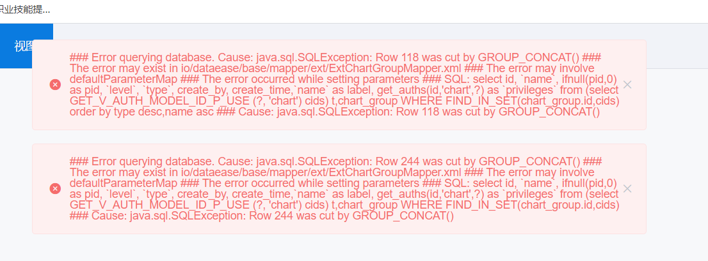
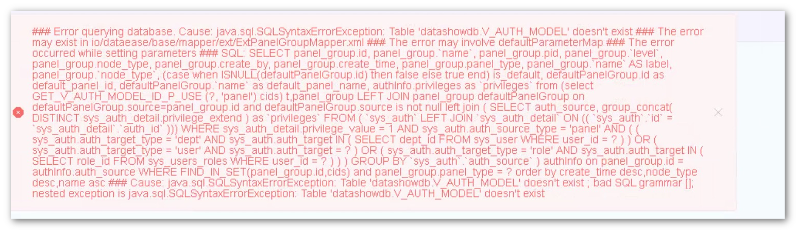
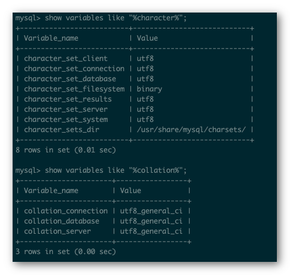
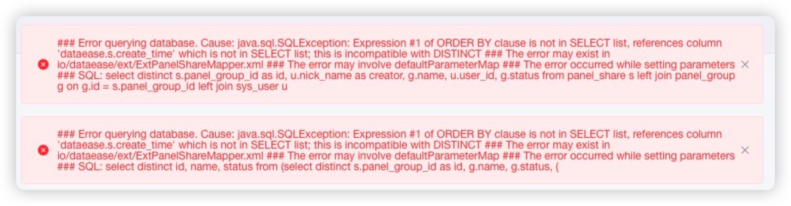

## 1 <span id="mysql-port">如何修改内置 MySQL 端口</span>

!!! Abstract ""
    1. 修改配置文件：  
    修改运行目录下 /opt/dataease/.env 文件，将 DE_MYSQL_PORT 改为新端口，如 3307:
    ```properties
    DE_MYSQL_PORT=3307
    ```
    2. 修改 .env 文件中的端口后要执行 dectl reload 重启 DataEase 服务，端口修改方能生效。

## 2 <span id="mysql-changename">如何修改内置 MySQL 容器名</span>

!!! Abstract ""
    1. 修改运行目录下 /opt/dataease/docker-compose.yml 文件，将 dataease 的 depends_on 里的 mysql 改为 mysql-de，例如：
    ```yml
      dataease:
        image: registry.cn-qingdao.aliyuncs.com/dataease/dataease:v1.0.0
        container_name: dataease
        ports:
          - 80:8081
        mem_limit: 4096m
        volumes:
          - dataease-conf:/opt/dataease/conf
          - dataease-logs:/opt/dataease/logs
          - dataease-plugins:/opt/dataease/plugins/thirdpart
          - dataease-kettle-data:/opt/dataease/data/kettle
        depends_on:
          mysql-de:
            condition: service_healthy
    ```
    2. 修改 /opt/dataease/docker-compose-mysql.yml，将 mysql 相关的容器名改为 mysql-de，例如：
    ```yml
      mysql-de:
        image: registry.cn-qingdao.aliyuncs.com/dataease/mysql:5.7.25
        container_name: mysql-de
        healthcheck:
          test: ["CMD", "mysqladmin" ,"ping", "-h", "localhost"]
          interval: 5s
          timeout: 3s
          retries: 10
        env_file:
          - ./conf/mysql.env
        ports:
          - 53306:3306
        volumes:
          - /opt/dataease/conf/my.cnf:/etc/mysql/conf.d/my.cnf
          - /opt/dataease/bin/mysql:/docker-entrypoint-initdb.d/
          - dataease-mysql-data:/var/lib/mysql
        networks:
          - dataease-network
    ```
    3. 修改 /opt/dataease/conf/dataease.properties，将数据库 URL 信息改为如下：
    ```properties
    spring.datasource.url=jdbc:mysql://mysql-de:3306/dataease?autoReconnect=false&useUnicode=true&characterEncoding=UTF-8&characterSetResults=UTF-8&zeroDateTimeBehavior=convertToNull&useSSL=false
    ```
    4. 重启 DataEase 服务： service dataease restart


## 3 <span id="mysql-switch-ext">修改已安装的 DataEase 链接外部 MySQL</span>


!!! Abstract ""
    **特别注意，使用外部 MySQL 时，需要注意几个地方：**

      - lower_case_table_names=1
      - group_concat_max_len=1024000
      - default-character-set=utf8
      - innodb_large_prefix=on

!!! Abstract ""
    1. 修改运行目录下 .env (默认路径 /opt/dataease/.env) 文件中 MySQL 的相关配置，包括 DE_EXTERNAL_MYSQL、DE_MYSQL_HOST、DE_MYSQL_PORT、DE_MYSQL_DB、DE_MYSQL_USER、DE_MYSQL_PASSWORD，DE_EXTERNAL_MYSQL=true；  
    2. 修改 dataease.properties (默认路径 /opt/dataease/conf/dataease.properties)，将 spring.datasource 开头的几个参数里，MySQL 的配置参数进行相应的修改，包括：数据库地址、数据库端口、数据库库名、数据库用户名、数据库密码；  
    3. 内置 MySQL 切换为外置 MySQL，修改运行目录下 /opt/dataease/docker-compose.yml 文件，将其中 depends_on 相关设置删除：
    ```yml
        depends_on:
          mysql:
            condition: service_healthy
    ```
    4. 重启 DataEase 服务： service dataease restart


## 4 <span id="mysql-switch-inner">DataEase 数据库由外部 MySQL 切换为内置 MySQL</span>

!!! Abstract ""
    1. 修改运行目录下 .env (默认路径 /opt/dataease/.env) 文件中 MySQL 的相关配置，包括 DE_EXTERNAL_MYSQL、DE_MYSQL_HOST、DE_MYSQL_PORT、DE_MYSQL_DB、DE_MYSQL_USER、DE_MYSQL_PASSWORD，DE_EXTERNAL_MYSQL=false；  
    2. 修改 dataease.properties (默认路径 /opt/dataease/conf/dataease.properties)，将 spring.datasource 开头的几个参数里，MySQL 的配置参数进行相应的修改，包括：数据库地址、数据库端口、数据库库名、数据库用户名、数据库密码；  
    3. 修改运行目录下 /opt/dataease/docker-compose.yml 文件，为 dataesae 服务加上 depends_on 相关设置，类似(镜像版本注意按实际情况替换)：  
    ```yml
    version: '2.1'
    services:
    
      dataease:
        image: registry.cn-qingdao.aliyuncs.com/dataease/dataease:v1.3.0
        container_name: dataease
        ports:
          - ${DE_PORT}:8081
        mem_limit: 4096m
        volumes:
          - ${DE_BASE}/dataease/conf:/opt/dataease/conf
          - ${DE_BASE}/dataease/logs:/opt/dataease/logs
          - ${DE_BASE}/dataease/plugins/thirdpart:/opt/dataease/plugins/thirdpart
          - ${DE_BASE}/dataease/data/kettle:/opt/dataease/data/kettle
        depends_on:
          mysql:
            condition: service_healthy
        networks:
          - dataease-network
    
    networks:
      dataease-network:
        driver: bridge
        ipam:
          driver: default
          config:
            - subnet: 172.19.0.0/16
              gateway: 172.19.0.1
    ```
    4. 重启 DataEase 服务： service dataease restart


## 5 使用 DataEase 时提示 "Row 30153 was cut by GROUP_CONCAT()" 的错误

!!! Abstract ""
    **当出现类似下图的错误时，可以通过任选以下方式之一处理：**  

    1. 修改 my.cnf 文件的 group_concat_max_len 参数，如：group_concat_max_len=1024000，然后重启 MySQL 与 DataEase 服务；  
    2. 进入 MySQL，执行 SET GLOBAL group_concat_max_len=1024000; 临时修改该参数的值。

{ width="900px" }


## 6 安装 DataEase 后内置 MySQL 的配置参数未生效

!!! Abstract ""
    **注意：** 出于安全考虑，当 MySQL 配置文件 my.cnf 权限过高时，会被 MySQL 忽略加载。请确认配置文件目录(默认路径 /opt/dataease/conf)下的配置文件的访问权限为 644。

    可以通过命令修改文件权限：
    ```shell
    chmod 644 /opt/dataease/conf/*
    ```

    修改文件属性后，重启 DataEase 服务: service dataease restart


## 7 使用 DataEase 时，出现数据库大小写的问题，提示类似"Table 'datashowdb.V_AUTH_MODEL' doesn't exist" 的错误

!!! Abstract ""
    出现该问题一般是由于 DataEase 使用的外部 MySQL 配置参数 lower_case_table_names 设置为 0 了。  
    需要将该参数设置为 lower_case_table_names=1，重启 MySQL 服务即可。

{ width="900px" }

## 8 <span id="demo-datasource">内置演示数据无效怎么办</span>

!!! Abstract ""
    在使用外部 MySQL，或者修改了内置 MySQL 容器名后，会出现内置演示数据无效的情况，如示例仪表板无法展示等待。可以登录 DataEase 控制台，进入到【数据源】页面，选择 "demo" 数据源，点击下方的编辑按钮，将 demo 数据源的相关连接信息按实际情况进行设置，校验通过后，保存即可。

## 9 使用 DataEase 的时候提示 "illegal mix of collations (latin1_bin implicit) and (utf8_general_ci coercible)" 的错误

!!! Abstract ""
    **该问题是由于字符集编码不同导致，可以参考下图的配置：**  
    1. 更改 MySQL 的 my.cnf，把 client 和 server 的字符集改为 utf8；  
    2. 修改 collation 编码：
    ```mysql
    set collation_database=utf8_general_ci;
    set collation_connection=utf8_general_ci;
    set collation_server=utf8_general_ci;
    ```

{ width="600px" }

## 10 DataEase 启动失败，使用 MySQL 8.x 作为外置数据库

!!! Abstract ""
    DataEase 启动过程中，抛出 Public Key Retrieval is not allowed 的异常。  
    **解决方法：**
    ```shell
    vim /opt/dataease/conf/dataease.properties
    ```
    spring.datasource.url 最后加上 &allowPublicKeyRetrieval=true。

## 11 使用 DataEase 时提示 "ORDER BY clause is not in SELECT list" 的错误

{ width="900px" }
!!! Abstract ""
    MySQL 外置数据库的数据库配置不一致，需要调整下 MySQL 的 sql_mode 配置，建议其它配置也参照调整下，避免因配置导致的其它问题出现。  
    参考配置链接：https://dataease.io/docs/v1/installation/offline_installation/#5


