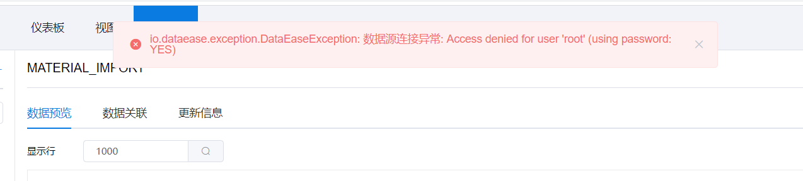

## 创建 Excel 数据集时，对 Excel 文件的格式有什么要求？

>Excel 中如存在合并单元格则无法导入；另外文件的第一行不能为空，第一行是标题行。
可以用格式刷保持格式统一。

## 添加excel数据集，提示"java.sql.SQLSyntaxErrorException: errCode = 2, detailMessage = The size of a row (1048587) exceed the maximal row size: 1000000"

>1. 修改配置文件: /opt/dataease/conf/fe.conf，将参数改为：max_layout_length_per_row=10000000

>2. 重启 doris-fe: docker restart doris-fe


## 创建 Excel 数据集或定时同步类型的数据集时，提示"Access denied for user 'root'(using password:YES)"？
>


>上图的错误是由于 doris 的配置导致的，一般有两种可能：

>1. /opt/dataease/conf/dataease.properties 配置文件中，doris 的连接信息配置错误
>2. doris 初始化时初始密码设置出错

>第一种情况的话，只要把 dataease.properties 配置文件中相关配置信息修改正确后，service dataease restart 即可。

>第二种情况可以通过以下步骤来判断：

>连接 doris-fe，以内置 MySQL 举例：
```shell
# 进入内置 MySQL 容器内
docker exec -it mysql sh

# 连接 doris-fe，如果能访问，则不是登录信息问题；如果不能访问，而删除命令中密码部分可直接访问的话，则确定是第二种情况
mysql -uroot -h doris-fe -P 9030 -pPassword123@doris

```

>第二种情况的话，可以先通过下面的步骤来修复：
```shell
# 停止 DataEase 服务
service dataease stop

# 删除错误的 doris 配置信息
rm -rf /opt/dataease/data/fe/*
rm -rf /opt/dataease/data/be/*

# 启动 DataEase 服务
service dataease start
```