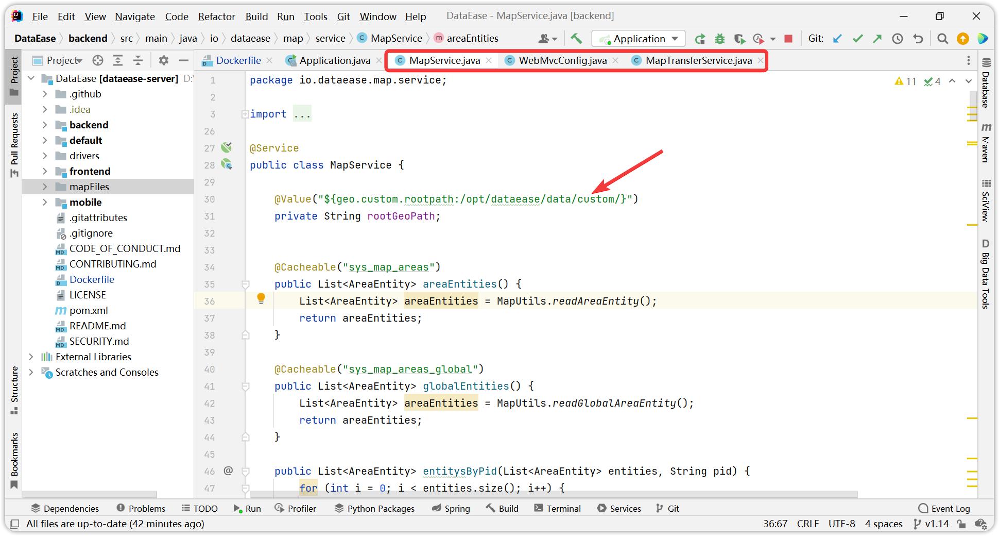

## 1 编译 DataEase 项目源码的时候报错，提示缺少依赖。

!!! Abstract ""
    **注意：** 在以源码方式运行 DataEase 时，推荐大家使用 v1.0、v1.1 等已发布分支的代码，main 和 dev 分支的代码均处于开发阶段，有些使用到的依赖由于没有达到稳定状态，并没有上传到中央仓库。  
    如遇到提示缺少 dataease-plugin-interface 相关依赖的话，可以下载 dataease-plugins 工程源码，在本地编译一下即可：
    ```shell
    git clone git@github.com:dataease/dataease-extension-sdk.git
    cd dataease-extension-sdk/dataease-plugin-interface
    mvn clean install
    ```
    如遇到缺少 kettle 相关依赖的话，可以检查是否使用了 maven 的 mirror，建议去掉 mirror 后重试。如还不行的话，可以在百度网盘上下载一下最小化的 dataease 依赖包。链接: https://pan.baidu.com/s/1cZDfHerGl88mpm0sTGo4hg?pwd=bn4i 提取码: bn4i
    将删除依赖包解压后放置到 ~/.m2/repository 下即可。

{ width="900" }  
{ width="900" }

## 2 使用地图组件时提示 "/geo/100000_full.json not found."

!!! Abstract ""
    **出现上述原因，一般在 v1.13.0 之前版本，是因为没有将地图文件放置到指定位置中:**    
    在 DataEase 源码工程的目录下有一个地图文件目录 mapFiles/full，需要将该目录下的文件放置到 /opt/dataease/data/feature/full 目录下。如果是windows的话，可以在工程目录所在盘的根目录下，创建 opt/dataease/data/feature/full目录。

{ width="900" }

## 3 使用世界地图时提示 "/geo/full/156/1561*****_full.json not found."

!!! Abstract ""
    v1.13.0 及之后版本项目启动时，已手动放置到 /opt/dataease/data/feature/full 目录下的地图文件会被系统解析到 /opt/dataease/data/custom/full 目录下，出现上述原因一般是由于 MapService 、WebMvcConfig 与 MapTransferService 类 geo.custom.rootpath 路径出现更变。

{ width="900" }

{ width="900" }