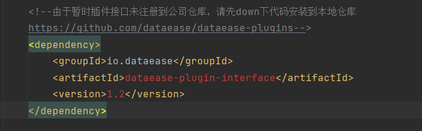
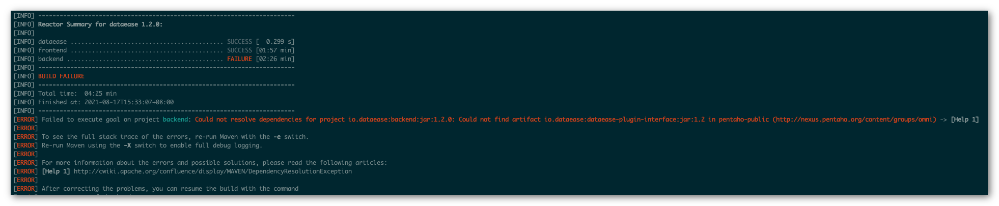

## 编译 DataEase 项目源码的时候报错，提示缺少依赖。

在以源码方式运行 DataEase 时，推荐大家使用 v1.0、v1.1 等已发布分支的代码，main 和 dev 分支的代码均处于开发阶段，有些使用到的依赖由于没有达到稳定状态，并没有上传到中央仓库。




如遇到提示缺少 dataease-plugin-interface 相关依赖的话，可以下载 dataease-plugins 工程源码，在本地编译一下即可：
```shell
git clone git@github.com:dataease/dataease-plugins.git
cd dataease-plugins
mvn clean install
```

如遇到缺少 kettle 相关依赖的话，可以检查是否使用了 maven 的 mirror，建议去掉 mirror 后重试。如还不行的话，可以在百度网盘上下载一下最小化的 dataease 依赖包。链接: https://pan.baidu.com/s/1fWv_ze-QKUew3ND4NAdt8Q 提取码: rpzi

将删除依赖包解压后放置到 ~/.m2/repository 下即可。


## 使用地图组件时提示 "/geo/100000_full.json not found."


出现上述原因，是因为没有将地图文件放置到指定位置中。

在 DataEase 源码工程的目录下有一个地图文件目录 mapFiles/full，需要将该目录下的文件放置到 /opt/dataease/data/feature/full 目录下。如果是windows的话，可以在工程目录所在盘的根目录下，创建 opt/dataease/data/feature/full目录。
