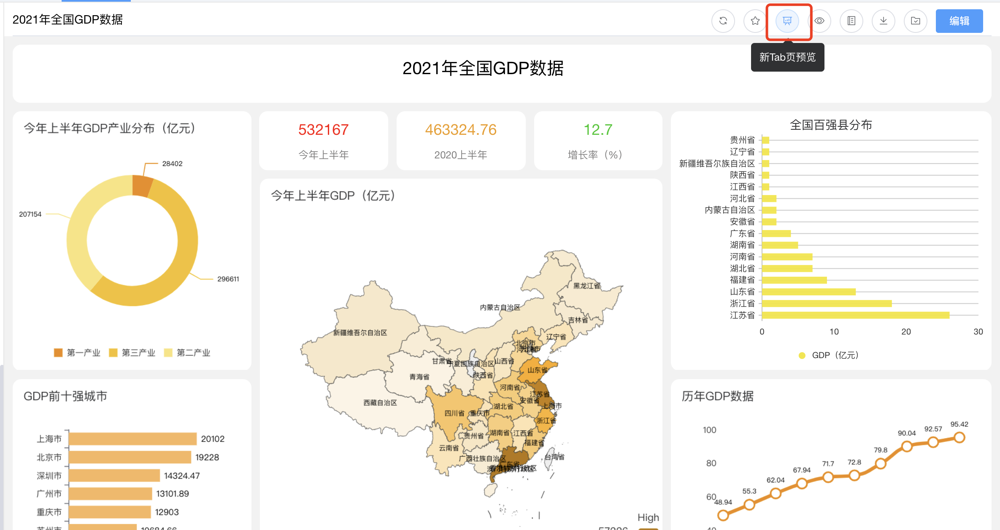
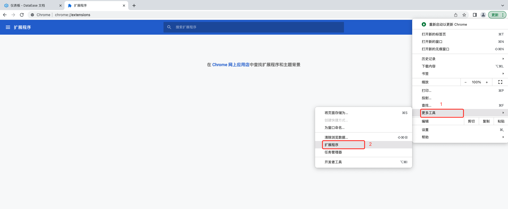
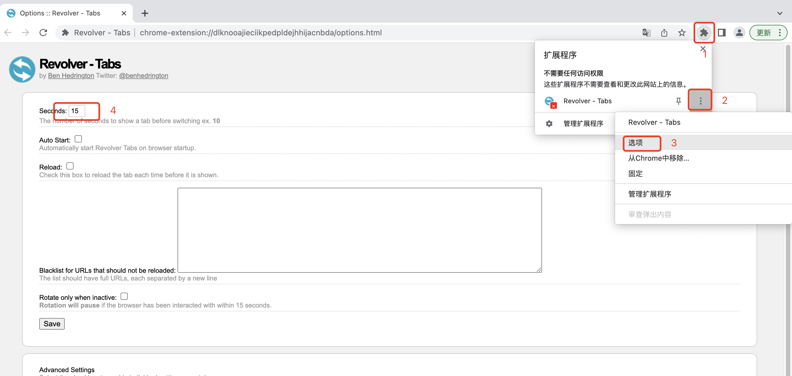

## 无法使用内置的演示示例

!!! Abstract ""
    如果在安装时选择了外部 MySQL，或者安装时修改了内置 MySQL 的相关参数，如 MySQL 容器名、用户名、密码等，在使用内置示例仪表板等演示示例时，会提示数据源连接异常的错误。  

    - 在 v1.2.0 以后的版本中，可以通过点击【数据源】，选择 MySQL 分组下的 demo 数据源，点击【编辑】按钮，将数据源的相关信息修改为新的信息，校验通过后即可使用。  
    - v1.2.0 以前的版本需要联系我们来帮忙处理。

## 浏览器中实现多个仪表板的轮播
!!! Warning "请注意"

    该方式仅适用于chrome浏览器，具体操作步骤如下：
1、在DE上制作多个仪表板大屏

2、将各个仪表板大屏均以 “新Tab页预览”方式打开

3、安装扩展插件：Revolver - Tabs
!!! tip ""
**插件程序：<a href="../Revolver-Tabs.zip" target="_blank">点此下载</a>。**

第一步，先在谷歌浏览器中打开扩展程序

第二步，打开开发者模式，并出现加载扩展程序选项

第三步，加载解压后的扩展程序

4、设置切换间隔

按照如下编号顺序，打开设置项，并配置切换的时间间隔

5、启动轮播

首先，浏览器开启全屏模式；其次，点击下图所示位置，启动轮播，启动后可看到图标上的绿色标记；仪表板的轮播设置全部完成。

