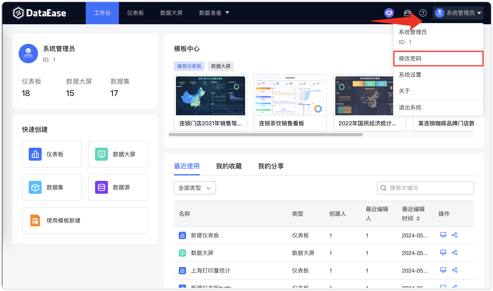
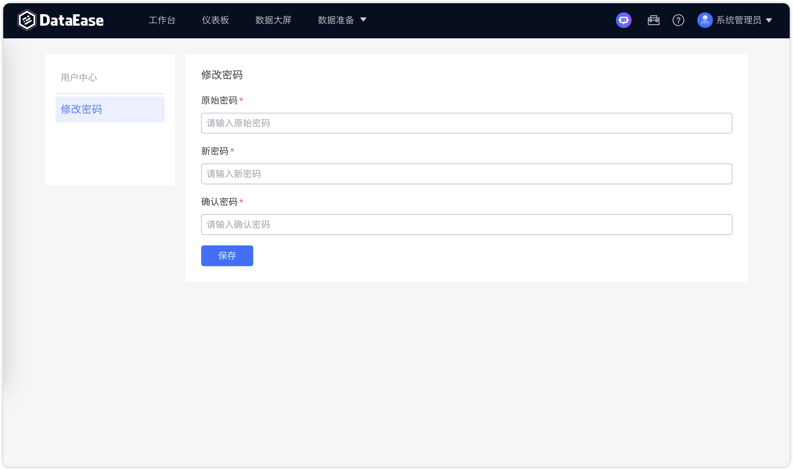
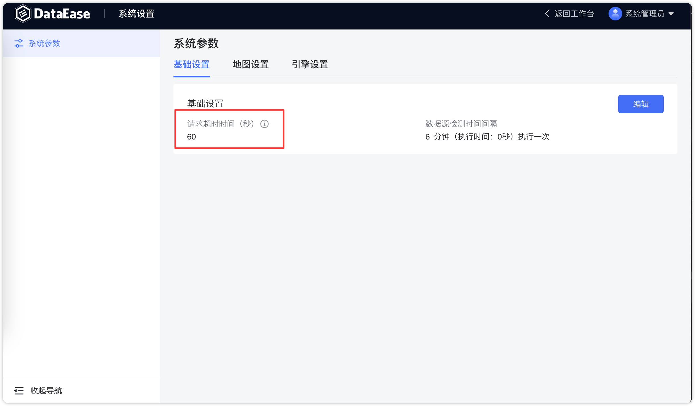
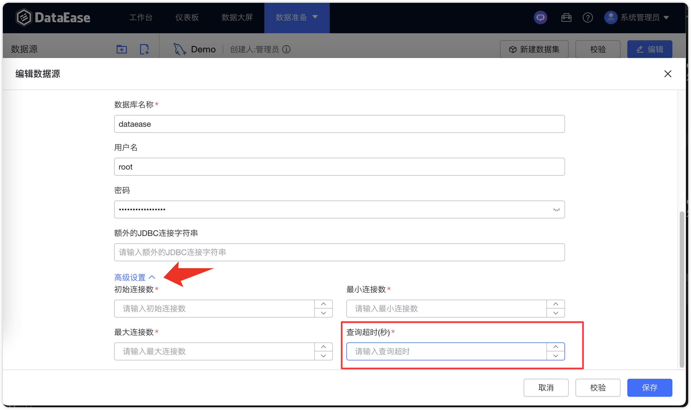

## 1 如何修改密码？

!!! Abstract ""
    登录后，查看界面右上角。 点击用户图标（通常是您的个人头像或一个头像图标）以打开用户菜单，点击【修改密码】选项，系统会将跳转到修改密码页面。  
    **注意：如果忘记原始密码（当前密码），则需要到数据库重置密码**

{ width="900" }

{ width="900" }


## 2 忘记了登录密码如何处理？

!!! Abstract ""
    **当系统管理员忘记密码时，需要通过数据库操作重置密码：**  
    先查看 /opt/dataease2.0/conf/mysql.env 文件，获取当前系统数据库的密码。 使用该数据库密码连接到 DataEase 使用的 MySQL 数据库。  
    执行以下 SQL 语句来重置密码，将 DataEase 的用户信息存放在数据库中的 `per_user` 表中，其中 password 字段为用户密码的 `md5` 值。
    ```sql
    update per_user set pwd='504c8c8dfcbbe5b50d676ad65ef43909' where account='admin';
    ```
    连接到数据库后，执行上面的 SQL 语句可以将用户 `admin` 的密码重置为 `DataEase@123456`。

## 3 遇到系统超时如何处理？

!!! Abstract ""
    **如遇网络不通畅，系统报 ”timeout of xxx exceeded“ 等相关超时错误，则可在【系统管理】【系统参数】的基础设置增大超时时间，同时支持在数据源的【高级设置】修改查询超时时间。**

{ width="900" }

{ width="900" }


## 4 流向地图、符号地图等在线地图添加后白屏、无法使用

!!! Abstract ""
    **流向地图、符号地图等组件使用的是高德在线地图，需能够连接外网高德服务器，如遇组件白屏，可自行申请在线地图 Key 并配置，参考[在线地图 Key 申请](https://dataease.io/docs/v2/user_manual/system_management/param/#31)。**

