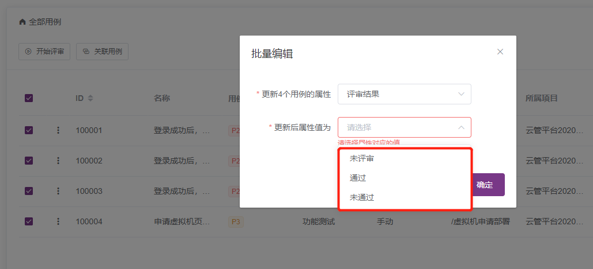
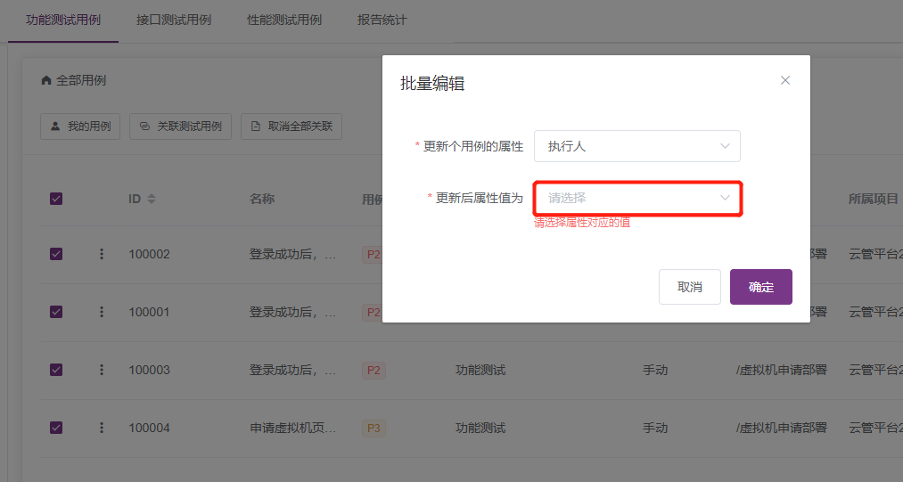

## 测试跟踪模块，用例评审是否支持批量处理？

支持。选中测试评审用例列表中需要批量处理的用例，点击 `···` 弹出下拉框，选择批量编辑，可以批量设置评审结果。

## 测试计划里，是否支持批量分配执行人？

支持。选中测试计划用例列表中需要批量处理的用例，点击 `···` 弹出下拉框，选择批量编辑，可以分配执行人。

## 测试计划执行定时任务，是否会自动触发接口测试和性能测试？定时任务添加后如何删除？

测试计划的定时任务支持关联管理接口测试、性能测试并定时触发；配置定时任务后，关闭SCHEDULER开关取消定时任务。

## 如果集成了JIRA，缺陷状态可以同步更新MeterSphere吗？

暂时只支持从MeterSphere同步到JIRA。