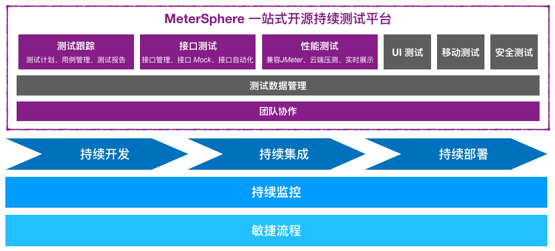
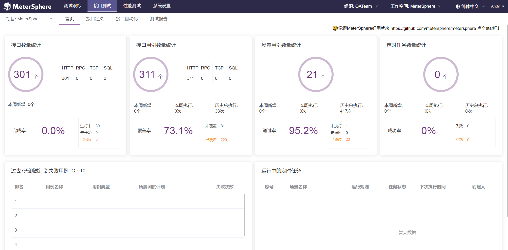

# 项目介绍

欢迎使用 MeterSphere。

MeterSphere 是一站式开源持续测试平台，涵盖测试跟踪、接口测试、性能测试、团队协作等功能，兼容JMeter 等开源标准，有效助力开发和测试团队充分利用云弹性进行高度可扩展的自动化测试，加速高质量软件的交付。

## 界面展示

!!! info "快速体验 MeterSphere"
-    [演示视频](https://www.bilibili.com/video/BV1yp4y1p72C/)
-    [在线体验](https://jinshuju.net/f/WuI6IO)

## 产品优势

-   **开源**：基于开源、兼容开源；按月发布新版本、日均下载安装超过100次、被大量客户验证；
-   **一站式**：一个产品全面涵盖测试跟踪、接口测试、性能测试等功能并形成联动：其中用例管理是底座需求、接口自动化测试是高频需求、性能测试是专家服务为主工具为辅；一个产品全满足从测试计划、测试执行到测试报告分析的全生命周期需求；
-   **持续测试**：能将测试融入持续交付和 DevOps 体系；无缝对接 Bug 管理工具和持续集成工具等；支持团队协作和资产沉淀。

## 主要功能

<!-- 添加截图 -->
-   **测试跟踪**: 远超 TestLink 的使用体验，覆盖从编写用例到生成测试报告的完整流程；
-   **接口测试**: 集 Postman 的易用与 JMeter 的灵活于一体，接口管理、多协议支持、场景自动化，你想要的全都有；
-   **性能测试**: 兼容 JMeter，支持 Kubernetes 和云环境，轻松支持高并发、分布式的性能测试；
-   **团队协作**: 用户管理、租户管理、权限管理、资源管理，无论团队规模如何，总有适合的落地方式。

## 功能列表

  <table> 
   <tr>
    <td>**功能分类**</td>
    <td>**一级功能**</td>
    <td>**具体功能描述**</td>
   </tr>
   <tr>
    <td rowspan="19">测试跟踪</td>
    <td rowspan="8">测试用例管理</td>
    <td>在线编辑用例</td>
   </tr>
   <tr>
    <td>编辑窗口支持上传附件</td>
   </tr>
   <tr>
    <td>查看与编辑窗口显示评审评论</td>
   </tr>
   <tr>
    <td>以树状形式展示项目的模块及其用例</td>
   </tr>
   <tr>
    <td>支持测试用例模块树拖拽排序</td>
   </tr>
   <tr>
    <td>自定义用例等级/用例类型/测试方式</td>
   </tr>
   <tr>
    <td>支持Excel/Xmind格式快速导入用例到系统</td>
   </tr>
   <tr>
    <td>支持Excel格式快速导出用例到本地</td>
   </tr>
   <tr>
    <td rowspan="4">测试用例评审</td>
    <td>基于已有用例发起评审</td>
   </tr>
   <tr>
    <td>支持添加多个评审人</td>
   </tr>
   <tr>
    <td>在线更新评审结果</td>
   </tr>
   <tr>
    <td>支持多人在线添加评审评论</td>
   </tr>
   <tr>
    <td rowspan="7">测试计划跟踪</td>
    <td>基于已有用例发起测试计划</td>
   </tr>
   <tr>
    <td>支持在线更新用例执行结果</td>
   </tr>
   <tr>
    <td>在线生成测试报告，支持自定义测试报告模板</td>
   </tr>
   <tr>
    <td>与平台中的接口测试、性能测试功能联动，自动更新关联用例的结果</td>
   </tr>
   <tr>
    <td>记录测试用例关联的缺陷</td>
   </tr>
   <tr>
    <td>缺陷记录支持关联到 JIRA/TAPD/禅道</td>
   </tr>
   <tr>
    <td>支持PDF格式测试报告导出</td>
   </tr>
   <tr>
    <td rowspan="27">接口测试</td>
    <td rowspan="13">接口定义</td>
    <td>在线编辑接口测试内容</td>
   </tr>
   <tr>
    <td>支持 HTTP/Dubbo/SQL/TCP 类型接口请求</td>
   </tr>
   <tr>
    <td>支持接口快捷调制</td>
   </tr>
   <tr>
    <td>支持接口列表和用例列表切换显示</td>
   </tr>
   <tr>
    <td>支持用例编辑窗口正则/JsonPath/XPath等多种类型的断言规则</td>
   </tr>
   <tr>
    <td>支持用例编辑窗口正则/JsonPath/XPath类型的参数提取</td>
   </tr>
   <tr>
    <td>支持用例编辑窗口前后置 BeanShell/Python 脚本</td>
   </tr>
   <tr>
    <td>测试环境信息管理</td>
   </tr>
   <tr>
    <td>支持单接口测试引用环境信息</td>
   </tr>
   <tr>
    <td>支持通过浏览器插件快速录制测试脚本</td>
   </tr>
   <tr>
    <td>支持Metersphere Json/Postman/Swagger格式快速导入用例到系统</td>
   </tr>
   <tr>
    <td>支持Metersphere Json格式快速导出用例到本地</td>
   </tr>
   <tr>
    <td>支持上传并引用自定义 Jar 包</td>
   </tr>
   <tr>
    <td rowspan="12">接口自动化</td>
    <td>创建多接口的场景化测试</td>
   </tr>
   <tr>
    <td>支持自定义场景标签</td>
   </tr>
   <tr>
    <td>支持多层级场景嵌套结构</td>
   </tr>
   <tr>
    <td>支持接口列表快速导入测试场景</td>
   </tr>
   <tr>
    <td>支持测试场景复用</td>
   </tr>
   <tr>
    <td>支持添加自定义请求/自定义脚本</td>
   </tr>
   <tr>
    <td>支持添加等待时间/条件判断等多类型逻辑控制器</td>
   </tr>
   <tr>
    <td>场景调试支持引用已有环境信息</td>
   </tr>
   <tr>
    <td>支持定时任务</td>
   </tr>
   <tr>
    <td>支持通过 Jenkins 插件触发测试执行</td>
   </tr>
   <tr>
    <td>Jenkins 插件支持 Pipeline 方式调用</td>
   </tr>
   <tr>
    <td>支持一键创建性能测试</td>
   </tr>
   <tr>
    <td rowspan="2">测试报告</td>
    <td>测试执行后自动生成测试报告</td>
   </tr>
   <tr>
    <td>支持PDF格式测试报告导出</td>
   </tr>
   <tr>
    <td rowspan="8">性能测试</td>
    <td rowspan="4">性能测试脚本</td>
    <td>支持上传JMX/CSV/JAR格式文件创建性能测试</td>
   </tr>
   <tr>
    <td>支持分线程组配置压力参数</td>
   </tr>
   <tr>
    <td>支持下载 JTL 文件</td>
   </tr>
   <tr>
    <td>支持通过浏览器插件快速录制测试脚本</td>
   </tr>
   <tr>
    <td rowspan="2">测试执行</td>
    <td>内置定时任务支持</td>
   </tr>
   <tr>
    <td>支持通过 Jenkins 插件触发测试执行</td>
   </tr>
   <tr>
    <td rowspan="2">测试报告</td>
    <td>测试执行后自动生成动态实时测试报告</td>
   </tr>
   <tr>
    <td>支持PDF格式测试报告导出</td>
   </tr>
   <tr>
    <td rowspan="10">系统管理</td>
    <td rowspan="3">用户租户管理</td>
    <td>支持多级租户体系</td>
   </tr>
   <tr>
    <td>支持多种租户角色</td>
   </tr>
   <tr>
    <td>支持LDAP 认证对接</td>
   </tr>
   <tr>
    <td>测试资源管理</td>
    <td>性能测试资源池管理</td>
   </tr>
   <tr>
    <td rowspan="2">消息通知配置</td>
    <td>支持企业微信/钉钉等多种IM 工具通知配置</td>
   </tr>
   <tr>
    <td>支持邮件通知配置</td>
   </tr>
   <tr>
    <td rowspan="3">集成与扩展</td>
    <td>配置API 列表</td>
   </tr>
   <tr>
    <td>支持对接 Jenkins 等持续集成工具</td>
   </tr>
   <tr>
    <td>支持对接 JIRA/TAPD/禅道等缺陷管理工具</td>
   </tr>
   <tr>
    <td>项目管理</td>
    <td>多项目支持，测试用例、测试计划与项目关联</td>
   </tr>
   <tr>
    <td>报表统计</td>
    <td>报表统计</td>
    <td>支持跨项目、多维度统计测试数据，灵活配置报表模版，自动发送报表邮件</td>
   </tr>
  </table>

## 企业版试用

- [申请企业版试用](https://jinshuju.net/f/CzzAOe)

## 参考资料

- [持续测试白皮书 v1.0](https://jinshuju.net/f/KqFUhq)
- [如何构建持续测试平台？](https://metersphere.io/download/how_to_build_a_continous_platform-202101.pdf)
- [揭秘MeterSphere一站式开源持续测试平台](https://live.vhall.com/725359622)
- [MeterSphere 的初心和使命](https://mp.weixin.qq.com/s/DpCt3BNgBTlV3sJ5qtPmZw)
