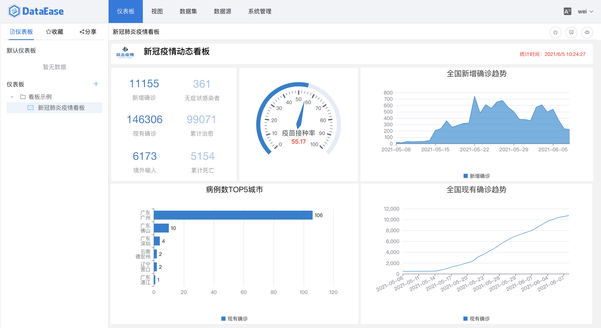

# 产品介绍

欢迎使用 DataEase。

DataEase 是开源的数据可视化分析工具，帮助用户分析数据、改善业务。DataEase 支持丰富的数据源连接，能够通过拖拉拽方式快速制作图表，并可以方便的与他人分享。

## 界面展示

## 产品优势
!!! tip ""
- 开源开放：零门槛，线上快速获取和安装；快速获取用户反馈、按月发布新版本；
- 简单易用：极易上手，通过鼠标点击和拖拽即可完成分析；
- 秒级响应：集成 Apache Doris，超大数据量下秒级查询返回延时；
- 安全分享：支持多种数据分享方式，确保数据安全。

## 主要功能

- 图表展示: 支持 PC 端、移动端及大屏;
- 图表制作: 支持丰富的图表类型(基于 Apache ECharts 实现)、支持拖拉拽方式快速制作仪表板;
- 数据引擎: 支持直连模式、本地模式(基于 Apache Doris / Kettle 实现);
- 数据连接: 支持关系型数据库、Excel 等文件、Hadoop 等大数据平台、NoSQL 等各种数据源。

## 功能列表

<table>
	<tr>
		<td bgcolor="#3779d9" align="middle" style="font-weight:bold;color: white;width: 150px">
			功能模块
		</td>
		<td bgcolor="#3779d9" align="middle" style="font-weight:bold;color: white;width: 170px">
			功能
		</td>
		<td bgcolor="#3779d9" align="middle" style="font-weight:bold;color: white;width: 750px">
			功能描述
		</td>
	</tr>
	<tr>
		<td rowspan="12">
			仪表板
		</td>
		<td rowspan="10">
			仪表板管理
		</td>
		<td>
			在线编辑仪表板
		</td>
	</tr>
	<tr>
		<td>
			仪表板展示内容支持视图/时间组件/文本组件/数字组件/样式组件等
		</td>
	</tr>
	<tr>
		<td>
			支持视图及组件样式的设置
		</td>
	</tr>
	<tr>
		<td>
			支持仪表板主题
		</td>
	</tr>
	<tr>
		<td>
			支持仪表板的全屏预览
		</td>
	</tr>
	<tr>
		<td>
			支持仪表板模板的导出
		</td>
	</tr>
	<tr>
		<td>
			以树状形式展示仪表板分组
		</td>
	</tr>
	<tr>
		<td>
			支持仪表板分组的拖拽排序
		</td>
	</tr>
	<tr>
		<td>
			支持默认仪表板的设置
		</td>
	</tr>
	<tr>
		<td>
			支持仪表板的收藏
		</td>
	</tr>
	<tr>
		<td rowspan="2">
			仪表板分享
		</td>
		<td>
			支持按组织/角色/用户分享
		</td>
	</tr>
	<tr>
		<td>
			支持生成外部可访问的带密码保护的分享链接
		</td>
	</tr>
	<tr>
		<td rowspan="9">
			视图
		</td>
		<td rowspan="9">
			视图管理
		</td>
		<td>
			在线编辑视图
		</td>
	</tr>
	<tr>
		<td>
			支持可视化拖拽进行视图操作
		</td>
	</tr>
	<tr>
		<td>
			支持明细表/指标卡/基础柱状图/堆叠柱状图/横向柱状图/横向堆叠柱状图/基础折线图/堆叠折线图/饼图/南丁格尔玫瑰图/漏斗图/雷达图/仪表盘等多种图表类型
		</td>
	</tr>
	<tr>
		<td>
			支持维度/指标的排序展示
		</td>
	</tr>
	<tr>
		<td>
			支持指标的多种汇总计算方式
		</td>
	</tr>
	<tr>
		<td>
			支持对图表类型的图形属性进行设置
		</td>
	</tr>
	<tr>
		<td>
			支持对图表类型的组件样式进行设置
		</td>
	</tr>
	<tr>
		<td>
			支持过滤条件筛选视图展示的数据
		</td>
	</tr>
	<tr>
		<td>
			支持下载视图图片
		</td>
	</tr>
	<tr>
		<td rowspan="8">
			数据集
		</td>
		<td rowspan="8">
			数据集管理
		</td>
		<td>
			支持数据库数据集/SQL 数据集/Excel 数据集/自定义数据集等多种类型的数据集
		</td>
	</tr>
	<tr>
		<td>
			数据库数据集和 SQL 数据集支持直连和定时同步两种连接方式
		</td>
	</tr>
	<tr>
		<td>
			定时同步类型数据集支持全量更新和增量更新两种方式
		</td>
	</tr>
	<tr>
		<td>
			支持定时更新的频率控制
		</td>
	</tr>
	<tr>
		<td>
			支持定时更新任务的查看
		</td>
	</tr>
	<tr>
		<td>
			支持对数据集的字段类型/字段名/展示字段进行设置
		</td>
	</tr>
	<tr>
		<td>
			支持创建不同类型数据集与数据集之间的关联
		</td>
	</tr>
	<tr>
		<td>
			支持 Excel 数据集数据的替换和更新
		</td>
	</tr>
	<tr>
		<td rowspan="2">
			数据源
		</td>
		<td rowspan="2">
			数据源管理
		</td>
		<td>
			支持 MySQL 数据源
		</td>
	</tr>
	<tr>
		<td>
			支持对数据源有效性校验
		</td>
	</tr>
	<tr>
		<td rowspan="5">
			系统管理
		</td>
		<td rowspan="2">
			用户租户管理
		</td>
		<td>
			支持多级租户体系
		</td>
	</tr>
	<tr>
		<td>
			支持多种租户角色
		</td>
	</tr>
	<tr>
		<td rowspan="2">
			权限管理
		</td>
		<td>
			支持组织/角色/用户三个维度的权限管理
		</td>
	</tr>
	<tr>
		<td>
			支持数据源/数据集/视图/仪表板/菜单和操作权限的细颗粒度权限控制
		</td>
	</tr>
	<tr>
		<td>
			显示设置
		</td>
		<td>
			支持对Logo/系统名/标题等属性的设置
		</td>
	</tr>
</table>

