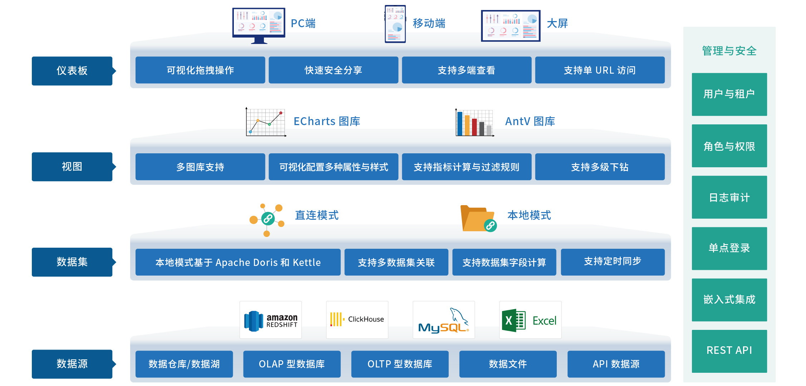
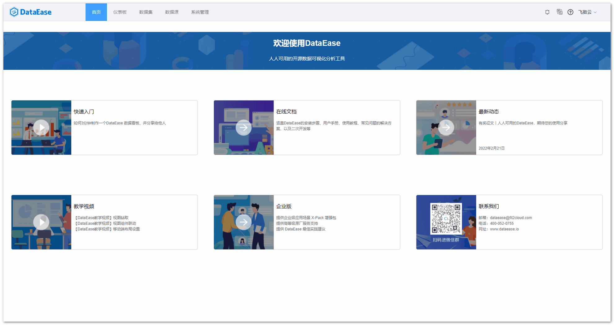

# 产品介绍

!!! Abstract ""
    DataEase 是开源的数据可视化分析工具，帮助用户快速分析数据并洞察业务趋势，从而实现业务的改进与优化。  
    DataEase 支持丰富的数据源连接，能够通过拖拉拽方式快速制作图表，并可以方便地与他人分享。

{ width="1235px" }

## 1 界面展示

{ width="1235px" }

## 2 模板市场

[{ width="1235px" }](https://dataease.io/templates/)

## 3 产品优势

!!! Abstract ""
    - 开源开放：零门槛，线上快速获取和安装；快速获取用户反馈、按月发布新版本；
    - 简单易用：极易上手，通过鼠标点击和拖拽即可完成分析；
    - 秒级响应：集成 Apache Doris，超大数据量下秒级查询返回延时；
    - 安全分享：支持多种数据分享方式，确保数据安全。

## 4 主要功能

!!! Abstract ""
    - 图表展示: 支持 PC 端、移动端及大屏；
    - 图表制作: 支持丰富的图表类型（基于 Apache ECharts 实现）、支持拖拉拽方式快速制作仪表板；
    - 数据引擎: 支持直连模式、本地模式（基于 Apache Doris / Kettle 实现）；
    - 数据连接: 支持关系型数据库、Excel 等文件、Hadoop 等大数据平台、NoSQL 等各种数据源。

## 5 功能列表

!!! Abstract ""
    说明：功能后带有 "X-Pack" 标识含义为此功能为企业版本所有，其它核心功能均开源开放。
<table>
	<tr>
		<td bgcolor="#3779d9" align="middle" style="font-weight:bold;color: white;width: 150px">
			功能模块
		</td>
		<td bgcolor="#3779d9" align="middle" style="font-weight:bold;color: white;width: 170px">
			功能名称
		</td>
		<td bgcolor="#3779d9" align="middle" style="font-weight:bold;color: white;width: 750px"> 
			功能描述
		</td>
	</tr>
	<tr>
		<td rowspan="1">
			首页
		</td>
		<td rowspan="1">
			欢迎导航页
		</td>
		<td>
			DataEase 常用文档、视频教程、更新日志等内容导航；
		</td>
	</tr>
	<tr>
		<td rowspan="43">
			仪表板
		</td>
		<td rowspan="4">
			仪表板管理
		</td>
		<td>
			支持仪表板的新建、重命名、删除、复制、移动、搜索等；
		</td>
	</tr>
	<tr>
		<td>
			支持仪表板的发布与下架；
		</td>
	</tr>
	<tr>
		<td>
			支持仪表板分组的新建、重命名、删除、移动等；
		</td>
	</tr>
	<tr>
		<td>
			支持以树状形式展示仪表板分组；
		</td>
	</tr>
	<tr>
		<td rowspan="20">
			仪表板制作
		</td>
		<td>
			支持在线编辑仪表板；
		</td>
	</tr>
	<tr>
		<td>
			支持仪表板通过矩阵或悬浮模式进行布局，支持开启辅助设计网格协助布局设计；
		</td>
	</tr>
	<tr>
		<td>
			支持仪表板中添加多种组件，例如：视图/时间组件/文本组件/数字组件/样式组件/图片/视频/ Tab 组件/ Web 组件/链接等；
		</td>
	</tr>
	<tr>
		<td>
			支持动态设置日期组件的默认值等；
		</td>
	</tr>
	<tr>
		<td>
			支持通过一个过滤组件，过滤多个视图（视图数据来自多个数据集）；
		</td>
	</tr>
	<tr>
		<td>
			支持组件样式设置，例如颜色、大小、标签、标题、图例等；
		</td>
	</tr>
	<tr>
		<td>
			支持仪表板中视图的下钻；
		</td>
	</tr>
	<tr>
		<td>
			支持仪表板中视图间的联动；
		</td>
	</tr>
	<tr>
		<td>
			支持仪表板中各组件背景图片、背景颜色、背景透明度、组件内边距、边框半径、边框样式等设置；
		</td>
	</tr>
	<tr>
		<td>
			支持仪表板跳转，例如跳转至系统内其他仪表板、外部链接。支持视图跳转外部链接时传递点击参数给第三方；
		</td>
	</tr>
	<tr>
		<td>
			支持视图及组件设置超链接；
		</td>
	</tr>
	<tr>
		<td>
			支持仪表板背景、组件间隙、刷新时间、展示数据量等设置；
		</td>
	</tr>
	<tr>
		<td>
			支持一键切换仪表板主题；
		</td>
	</tr>
	<tr>
		<td>
			支持仪表板导出为 PDF 文件及图片；
		</td>
	</tr>
	<tr>
		<td>
			支持撤销、重做、清空画布内容；
		</td>
	</tr>
	<tr>
		<td>
			支持仪表板的全屏预览；
		</td>
    </tr>
    <tr>
		<td>
			支持仪表板的收藏；
		</td>
	</tr>
	<tr>
		<td>
			支持默认仪表板的设置；
		</td>
	</tr>
	<tr>
		<td>
			支持仪表板模板的导出；
		</td>
	</tr>
	<tr>
		<td>
			支持仪表板模板保存；
		</td>
	</tr>
	<tr>
		<td rowspan="3">
			仪表板共享
		</td>
		<td>
			支持按组织/角色/用户分享，查阅分享记录等；
		</td>
	</tr>
	<tr>
		<td>
			支持创建公共链接，外部用户可通过密码访问仪表板，同时分享链接支持设置过期时间；
		</td>
	</tr>
    <tr>
		<td>
			支持公共链接接收第三方系统参数，过滤仪表板数据；
		</td>
	</tr>
	<tr>
		<td rowspan="16">
			视图制作
		</td>
        <td>
            支持通过简单的拖拉操作，制作视图；
        </td>
	</tr>
	<tr>
		<td>
			支持多种图表类型，明细表/汇总表/指标卡/文本卡/透视表/基础柱状图/堆叠柱状图/横向柱状图/横向堆叠柱状图/基础折线图/堆叠折线图/饼图/南丁格尔玫瑰图/漏斗图/雷达图/仪表盘/中国地图/气泡地图/散点图/气泡图/矩形树图/组合图/水波图/瀑布图/词云图/符号地图等；
		</td>
	</tr>
	<tr>
		<td>
			支持对柱状图、折线图、等有纵坐标的图表，设置纵坐标起始和结束值范围；
		</td>
	</tr>
    <tr>
        <td>
            支持柱状图和折线图设置缩略轴和辅助线；
        </td>
    </tr>
	<tr>
		<td>
			支持视图阈值设置；
		</td>
	</tr>
	<tr>
		<td>
			支持视图数据集的切换；
		</td>
	</tr>
	<tr>
		<td>
			支持视图数据集的编辑；
		</td>
	</tr>
	<tr>
		<td>
			支持选择视图的样式优先级；
		</td>
	</tr>
	<tr>
		<td>
			支持选择图表的排序方式，根据维度、指标升序、降序进行展示；
		</td>
	</tr>
	<tr>
		<td>
			支持视图的下钻和上卷；
		</td>
	</tr>
	<tr>
		<td>
			支持指标的多种汇总计算方式，例如求和、平均、最大值、最小值等；
		</td>
    </tr>
    <tr>
		<td>
			支持指标的高级计算，例如同比、环比等；
		</td>
	</tr>
	<tr>
		<td>
			支持对图表类型的图形属性进行设置；
		</td>
	</tr>
	<tr>
		<td>
			支持对图表类型的组件样式进行设置，支持批量修改图表样式属性；
		</td>
	</tr>
	<tr>
		<td >
			支持通过过滤条件筛选视图数据；
		</td>
    </tr>
	<tr>
		<td >
			支持导出视图图片及导出视图明细数据；
		</td>
    </tr>
    <tr>
        <td rowspan="12">
        数据集
        </td>
		<td rowspan="12">
			数据集管理
        </td>
	</tr>
	<tr>
		<td>
			支持添加多种类型的数据集，数据库数据集/ SQL 数据集/ Excel 数据集/自定义数据集/关联数据集/ API 数据集；
		</td>
	</tr>
	<tr>
		<td>
			支持 Excel 数据集数据的替换、追加；
		</td>
	</tr>
	<tr>
		<td>
			支持数据集的添加、移动、重命名、删除、预览等；
		</td>
	</tr>
	<tr>
		<td>
			数据库数据集和 SQL 数据集支持直连和定时同步两种连接方式；
		</td>
	</tr>
	<tr>
		<td>
			定时同步类型数据集，支持全量更新和增量更新两种方式；
		</td>
	</tr>
	<tr>
		<td>
			支持创建定时任务，以此控制数据集的更新；
		</td>
	</tr>
	<tr>
		<td>
			支持定时更新任务的查看；
		</td>
	</tr>
	<tr>
		<td>
			支持对数据集的字段类型/字段名/展示字段进行设置；
		</td>
	</tr>
	<tr>
		<td>
            支持数据集的维度、指标间的互相切换；
		</td>
	</tr>
	<tr>
		<td>
			支持自定义计算字段（内置常用计算函数支持）；
		</td>
	</tr>
    <tr>
        <td>
            支持创建数据集间的关联关系（左连接、右连接、内连接）；
        </td>
    </tr>
	<tr>
		<td rowspan="6">
			数据源
		</td>
		<td rowspan="6">
			数据源管理
		</td>
		<td>
			支持多种数据源，例如：多 Sheet 页的 Excel 文件，MySQL / Oracle / SQL Server / PostgreSQL / Elasticsearch / ClickHouse / MongoDB / AWS RedShift / MariaDB / Doris / Hive / DB2 数据库 / Impala / StarRocks / TiDB / MaxCompute / Presto / API 数据源等；
		</td>
	</tr>
	<tr>
		<td>
			支持数据源的新建、编辑、删除等；
		</td>
	</tr>
	<tr>
		<td>
			支持数据源的高级设置，例如最大连接数、最小连接数、连接超时时间等；
		</td>
	</tr>
	<tr>
		<td>
			支持数据源有效性校验；
		</td>
	</tr>
    <tr>
		<td>
			支持定时检测数据源的连接状态；
		</td>
	</tr>
    <tr>
		<td>
			支持用户自行上传数据库驱动并使用；
		</td>
	</tr>
	<tr>
		<td rowspan="26">
			系统管理
		</td>
		<td rowspan="3">
			用户管理
		</td>
		<td>
			支持用户的新建、编辑、删除、修改密码、启用、禁用、搜索等；
		</td>
	</tr>
	<tr>
		<td>
			支持给用户分配组织； X-Pack
		</td>
	</tr>
	<tr>
		<td>
			支持给用户分配角色； X-Pack
		</td>
	</tr>
	<tr>
		<td rowspan="1">
			角色管理
		</td>
		<td>
			支持角色的新建、编辑、删除、搜索等； X-Pack
		</td>
	</tr>
	<tr>
		<td rowspan="1">
			组织管理
		</td>
		<td>
			支持组织的新建、编辑、删除、搜索、排序、移动等； X-Pack
		</td>
	</tr>
	<tr>
		<td rowspan="5">
			权限管理
		</td>
		<td>
			支持从组织、角色、用户维度（组织架构维度）进行使用、管理、授权等形式的权限控制； X-Pack
		</td>
	</tr>
	<tr>
		<td>
			支持从数据源、数据集、仪表板（资源维度）进行使用、管理、授权等形式的权限控制； X-Pack
		</td>
	</tr>
	<tr>
		<td>
			支持菜单和操作层面的权限控制； X-Pack 
		</td>
	</tr>
	<tr>
		<td>
			支持数据集的行级权限控制、支持行级权限使用系统内置变量（用户 ID、用户名、组织、邮箱等）； X-Pack
		</td>
	</tr>
    <tr>
        <td>
            支持数据集的列级权限控制； X-pack
        </td>
    </tr>
	<tr>
		<td rowspan="1">
			显示设置
		</td>
		<td>
			支持头部系统 Logo 、登录页 Logo 、登录页图片、登录页标题、系统名称、移动端登录页面背景、帮助文档及首页链接等设置； X-Pack
		</td>
	</tr>
	<tr>
		<td rowspan="3">
			主题设置
		</td>
		<td>
			支持两种默认主题； X-Pack
		</td>
	</tr>
	<tr>
		<td>
			支持自定义主题的新建、编辑、删除等； X-Pack
		</td>
	</tr>
	<tr>
		<td>
			支持对主题进行基础配色、字体配色、边框配色、背景配色等多属性的设置； X-Pack
		</td>
	</tr>
	<tr>
		<td rowspan="1">
			LDAP 设置
		</td>
		<td>
			支持 LDAP 认证对接； X-Pack
		</td>
	</tr>
	<tr>
		<td rowspan="1">
			单点登录
		</td>
		<td>
			支持单点登录系统对接； X-Pack
		</td>
	</tr>
	<tr>
		<td rowspan="1">
			集成与扩展
		</td>
		<td>
			提供完善的 API 接口及文档； X-Pack
		</td>
	</tr>
	<tr>
		<td rowspan="2">
			模板管理
		</td>
		<td>
			支持系统模板和用户模板；
		</td>
	</tr>
	<tr>
		<td>
			支持模板的分类、导入、重命名、删除、搜索等；
		</td>
	</tr>
	<tr>
		<td rowspan="1">
			操作日志
		</td>
		<td>
			支持系统操作日志的记录、查看、搜索及导出；
		</td>
	</tr>
	<tr>
		<td rowspan="4">
			消息管理
		</td>
		<td>
			支持系统常见消息的通知；
		</td>
	</tr>
    <tr>
		<td>
			支持消息的接收配置；
		</td>
	</tr>
	<tr>
		<td>
			支持消息状态标记；
		</td>
	</tr>
	<tr>
		<td>
			支持已读消息的删除；
		</td>
	</tr>
	<tr>
		<td rowspan="2">
			任务管理
		</td>
		<td>
			支持对平台定时任务进行全生命周期管理；
		</td>
    </tr>
    <tr>
		<td>
			支持定时报告，可以定时以邮件形式发送仪表板报告。  X-Pack
		</td>
	</tr>
    <tr>
        <td rowspan="3">
            安装模式
        </td>
        <td rowspan="1">
            本地模式
        </td>
        <td>
            支持一键 All in one 部署，自带 Doris 与 Kettle 组件；
        </td>
    </tr>
    <tr>
        <td rowspan="1">
            精简模式
        </td>
        <td>
            支持精简模式部署，无需安装 Doris 与 Kettle，可另外配置 MySQL 引擎存放 Excel 与 API 数据集；
        </td>
    </tr>
   <tr>
        <td rowspan="1">
            集群模式
        </td>
        <td>
            支持集群模式部署，各组件可单独进行高可用部署，可在 DataEase 引擎设置与 Kettle 设置处配置组件链接信息。
        </td>
    </tr>
</table>

## 6 了解更多

!!! Abstract ""
    - **如何向团队介绍 DataEase？**：https://dataease.io/download/introduce-dataease_202203.pdf
    - **获取新一代数据可视化分析平台建设指南**：https://jinshuju.net/f/cerWRY
    - **DataEase 知识库**：https://kb.fit2cloud.com/categories/dataease
    - **飞致云学堂**：https://edu.fit2cloud.com/index

