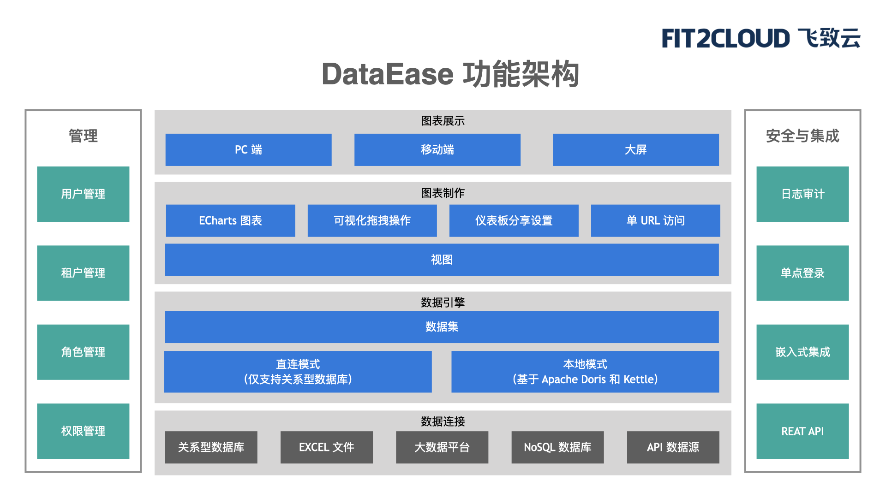

# 产品介绍

欢迎使用 DataEase。

DataEase 是开源的数据可视化分析工具，帮助用户快速分析数据并洞察业务趋势，从而实现业务的改进与优化。DataEase 支持丰富的数据源连接，能够通过拖拉拽方式快速制作图表，并可以方便的与他人分享。

## 界面展示

## 示例仪表板

## 产品优势

- 开源开放：零门槛，线上快速获取和安装；快速获取用户反馈、按月发布新版本；
- 简单易用：极易上手，通过鼠标点击和拖拽即可完成分析；
- 秒级响应：集成 Apache Doris，超大数据量下秒级查询返回延时；
- 安全分享：支持多种数据分享方式，确保数据安全。

## 主要功能

- 图表展示: 支持 PC 端、移动端及大屏;
- 图表制作: 支持丰富的图表类型(基于 Apache ECharts 实现)、支持拖拉拽方式快速制作仪表板;
- 数据引擎: 支持直连模式、本地模式(基于 Apache Doris / Kettle 实现);
- 数据连接: 支持关系型数据库、Excel 等文件、Hadoop 等大数据平台、NoSQL 等各种数据源。

## 功能列表

<table>
	<tr>
		<td bgcolor="#3779d9" align="middle" style="font-weight:bold;color: white;width: 150px">
			功能模块
		</td>
		<td bgcolor="#3779d9" align="middle" style="font-weight:bold;color: white;width: 170px">
			功能
		</td>
		<td bgcolor="#3779d9" align="middle" style="font-weight:bold;color: white;width: 750px">
			功能描述
		</td>
	</tr>
	<tr>
		<td rowspan="20">
			仪表板
		</td>
		<td rowspan="3">
			仪表板管理
		</td>
		<td>
			支持仪表板的新建、重命名、删除、复制、移动等
		</td>
	</tr>
	<tr>
		<td>
			支持仪表板分组的新建、重命名、删除、移动等
		</td>
	</tr>
	<tr>
		<td>
			支持以树状形式展示仪表板分组
		</td>
	</tr>
	<tr>
		<td rowspan="15">
			仪表板制作
		</td>
		<td>
			支持在线编辑仪表板
		</td>
	</tr>
	<tr>
		<td>
			支持仪表板中添加多种组件，如：视图/时间组件/文本组件/数字组件/样式组件/图片/tab组件/链接等
		</td>
	</tr>
	<tr>
		<td>
			支持组件样式设置，如图形属性、组件样式等
		</td>
	</tr>
	<tr>
		<td>
			支持仪表板中视图的下钻
		</td>
	</tr>
	<tr>
		<td>
			支持仪表板中视图间的联动
		</td>
	</tr>
	<tr>
		<td>
			支持仪表板中的视图跳转，如跳转至系统内其他仪表板、外部链接。
		</td>
	</tr>
	<tr>
		<td>
			支持仪表板背景、组件间隙、刷新时间等设置
		</td>
	</tr>
	<tr>
		<td>
			支持一键切换仪表板主题
		</td>
	</tr>
	<tr>
		<td>
			支持仪表板导出为pdf
		</td>
	</tr>
	<tr>
		<td>
			支持撤销、重做、清空画布内容
		</td>
	</tr>
	<tr>
		<td>
			支持仪表板的全屏预览
		</td>
	</tr>
	<tr>
		<td>
			支持仪表板的收藏
		</td>
	</tr>
	<tr>
		<td>
			支持默认仪表板的设置
		</td>
	</tr>
	<tr>
		<td>
			支持仪表板模板的导出
		</td>
	</tr>
	<tr>
		<td>
			支持仪表板模版保存
		</td>
	</tr>
	<tr>
		<td rowspan="2">
			仪表板共享
		</td>
		<td>
			支持按组织/角色/用户分享
		</td>
	</tr>
	<tr>
		<td>
			支持创建公共链接，外部用户可通过密码访问仪表板
		</td>
	</tr>
	<tr>
		<td rowspan="14">
			视图
		</td>
		<td rowspan="2">
			视图管理
		</td>
		<td>
			支持视图的添加、编辑、重命名、移动、删除等
		</td>
	</tr>
	<tr>
		<td>
			支持视图分组的添加、重命名、删除、移动等
		</td>
	</tr>
	<tr>
		<td rowspan="12">
			视图制作
		</td>
		<td>
			支持通过简单的拖拉操作，制作视图
		</td>
	</tr>
	<tr>
		<td>
			支持多种图表类型，明细表/汇总表/指标卡/基础柱状图/堆叠柱状图/横向柱状图/横向堆叠柱状图/基础折线图/堆叠折线图/饼图/南丁格尔玫瑰图/漏斗图/雷达图/仪表盘/中国地图/散点图/气泡图/矩形树图/组合图/水波图等
		</td>
	</tr>
	<tr>
		<td>
			支持对柱状图、折线图等有纵坐标的图表，设置纵坐标起始和结束值范围。
		</td>
	</tr>
	<tr>
		<td>
			支持视图数据集的切换
		</td>
	</tr>
	<tr>
		<td>
			支持视图数据集的编辑
		</td>
	</tr>
	<tr>
		<td>
			支持选择视图的样式优先级
		</td>
	</tr>
	<tr>
		<td>
			支持选择图表的排序方式，根据维度、指标升序、降序展示
		</td>
	</tr>
	<tr>
		<td>
			支持视图的下钻上卷
		</td>
	</tr>
	<tr>
		<td>
			支持指标的多种汇总计算方式，如求和、平均、最大值、最小值等
		</td>
	</tr>
	<tr>
		<td>
			支持对图表类型的图形属性进行设置
		</td>
	</tr>
	<tr>
		<td>
			支持对图表类型的组件样式进行设置
		</td>
	</tr>
	<tr>
		<td>
			支持通过过滤条件筛选视图数据
		</td>
	</tr>
	<tr>
		<td rowspan="10">
			数据集
		</td>
		<td rowspan="10">
			数据集管理
		</td>
		<td>
			支持添加多种类型的数据集，数据库数据集/SQL 数据集/Excel 数据集/自定义数据集
		</td>
	</tr>
	<tr>
		<td>
			支持数据集的添加、移动、重命名、删除、预览等
		</td>
	</tr>
	<tr>
		<td>
			数据库数据集和 SQL 数据集支持直连和定时同步两种连接方式
		</td>
	</tr>
	<tr>
		<td>
			定时同步类型数据集，支持全量更新和增量更新两种方式
		</td>
	</tr>
	<tr>
		<td>
			支持创建定时任务，以此控制数据集的更新
		</td>
	</tr>
	<tr>
		<td>
			支持定时更新任务的查看
		</td>
	</tr>
	<tr>
		<td>
			支持对数据集的字段类型/字段名/展示字段进行设置
		</td>
	</tr>
	<tr>
		<td>
			支持数据集的维度、指标间的互相切换
		</td>
	</tr>
	<tr>
		<td>
            支持自定义计算字段（内置常用计算函数支持）
		</td>
	</tr>
	<tr>
		<td>
			支持创建数据集间的关联关系（左连接、右连接、内连接）
		</td>
	</tr>
	<tr>
		<td rowspan="6">
			数据源
		</td>
		<td rowspan="6">
			数据源管理
		</td>
		<td>
			支持多种数据源，如：多sheet页 Excel 文件，MySQL / Oracle / SQL Server / PostgreSQL / Elasticsearch / ClickHouse / MongoDB / MariaDB / Doris 数据库
		</td>
	</tr>
	<tr>
		<td>
			支持数据源的新建、编辑、删除等
		</td>
	</tr>
	<tr>
		<td>
			支持数据源的高级设置，如最大连接数、最小连接数、连接超时时间等
		</td>
	</tr>
	<tr>
		<td>
			支持 Excel 数据集数据的替换、追加
		</td>
	</tr>
	<tr>
		<td>
			支持数据源有效性校验
		</td>
	</tr>
    <tr>
		<td>
			支持定时检测数据源的连接状态
		</td>
	</tr>
	<tr>
		<td rowspan="2">
			消息中心
		</td>
		<td rowspan="2">
			消息管理
		</td>
		<td>
			支持系统常见消息的通知
		</td>
	</tr>
    <tr>
		<td>
			支持消息的接收配置
		</td>
	</tr>
	<tr>
		<td rowspan="1">
			定时任务
		</td>
		<td rowspan="1">
			定时任务
		</td>
		<td>
			支持对平台定时任务进行全生命周期管理
		</td>
	</tr>

</table>

