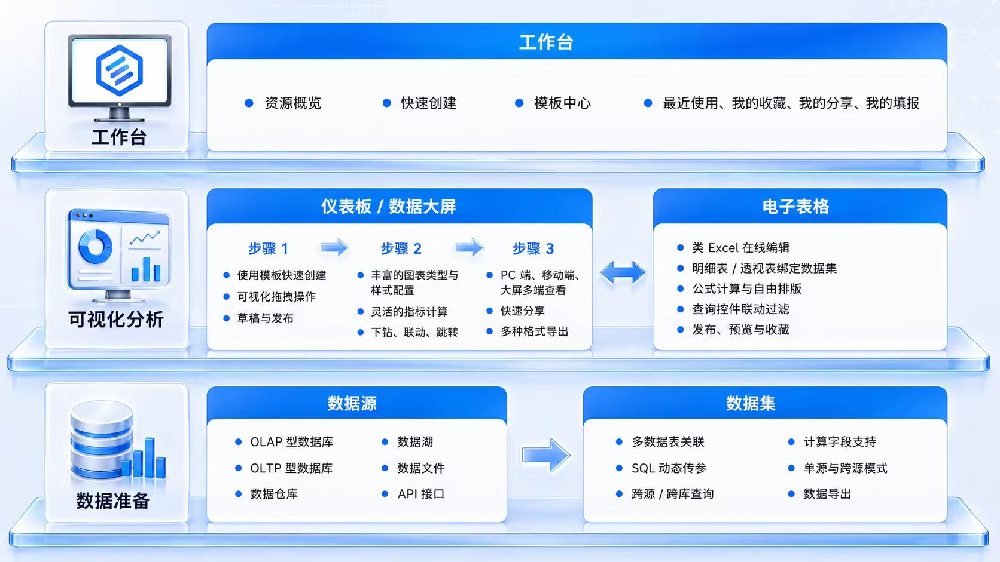
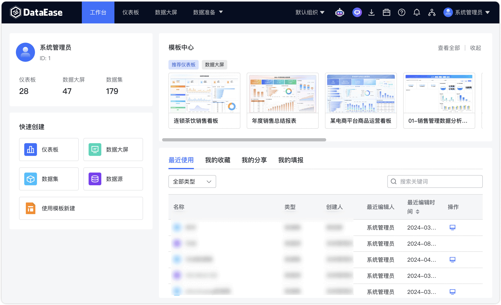
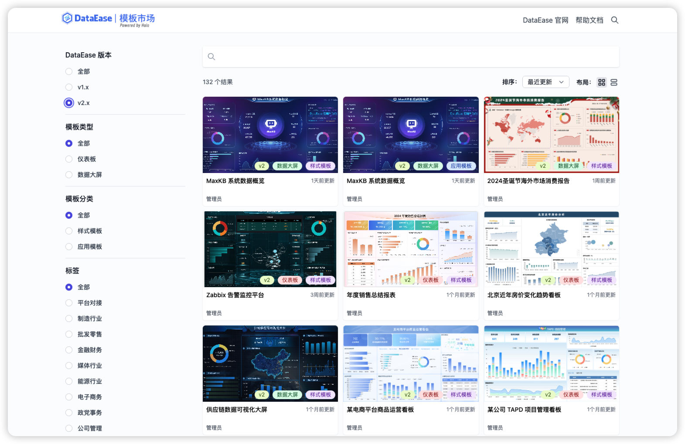

# 产品介绍

??? warning "重要通知 | DataEase 漏洞通知及修复方案"
    **2025 年 11 月，有用户反馈发现 DataEase 开源 BI 工具存在安全漏洞，并向 DataEase 开源项目组进行上报。**

    **漏洞信息：** 
     [【CVE-2025-64164】Oracle JNDI 注入漏洞；](https://github.com/dataease/dataease/security/advisories/GHSA-q754-4pc2-wjqw)    
     [【CVE-2025-64163】DB2 SSRF 漏洞；](https://github.com/dataease/dataease/security/advisories/GHSA-8397-v66p-539m)  
     [【CVE-2025-64428】DataEase DB2 JNDI 注入漏洞；](https://github.com/dataease/dataease/security/advisories/GHSA-88ph-3236-2m2h)   

    **影响版本：** 
    v2 版本：<= v2.10.16 版本。 
    注：v1 版本不受影响。   

    **安全版本：**   
    v2 版本：>= v2.10.17 版本。 
    注: DataEase v2.10.17 版本已于 2025 年 11 月 20 日发布。

    **修复方案：** 
    升级至安全版本如下: DataEase 版本 >= v2.10.17 版本

    **特别鸣谢：**   
    感谢社区用户 [ez-lbz](https://github.com/ez-lbz) 发现并向 DataEase 开源社区反馈上述漏洞。

!!! Abstract ""
    DataEase 是开源的数据可视化分析工具，帮助用户快速分析数据并洞察业务趋势，从而实现业务的改进与优化。  
    DataEase 支持丰富的数据源连接，能够通过拖拉拽方式快速制作图表，并可以方便地与他人分享。

{ width="1024px" }

## 1 界面展示

{ width="1024px" }

## 2 模板市场

!!! Abstract ""
    模板市场链接地址：https://templates.dataease.cn 。

{ width="1024px" }

## 3 产品优势

!!! Abstract ""

    - 开源开放：零门槛，线上快速获取和安装；快速获取用户反馈、按月发布新版本；
    - 简单易用：极易上手，通过鼠标点击和拖拽即可完成分析；
    - 全场景支持：多平台安装和多样化嵌入支持；
    - 安全分享：支持多种数据分享方式，确保数据安全。

## 4 主要功能

!!! Abstract ""

    - 图表展示: 支持 PC 端、移动端及大屏展示；
    - 图表制作: 支持丰富的图表类型、支持拖拉拽方式快速制作仪表板或数据大屏；
    - 数据查询：支持基于 Calcite 的跨源数据查询；
    - 数据连接: 支持关系型数据库、数据文件、数据仓库、API 等各种数据源。

## 5 版本对比

{ width="1024px" }

## 6 了解更多 

!!! Abstract ""

    - **如何向团队介绍 DataEase？：** [人人可用的开源 BI 工具](https://fit2cloud.com/dataease/download/introduce-dataease_202511.pdf)
    - **获取新一代数据可视化分析平台应用指南：** [新一代数据可视化分析工具应用指南](https://fit2cloud-support.oss-cn-beijing.aliyuncs.com/%E3%80%8A%E6%96%B0%E4%B8%80%E4%BB%A3%E6%95%B0%E6%8D%AE%E5%8F%AF%E8%A7%86%E5%8C%96%E5%88%86%E6%9E%90%E5%B7%A5%E5%85%B7%E5%BA%94%E7%94%A8%E6%8C%87%E5%8D%97%E3%80%8B%EF%BC%88DataEase%E7%BC%96%E8%91%97%EF%BC%89.pdf)
    - **DataEase 知识库：** https://kb.fit2cloud.com/categories/dataease
    - **飞致云培训认证中心：** https://edu.fit2cloud.com/index 
