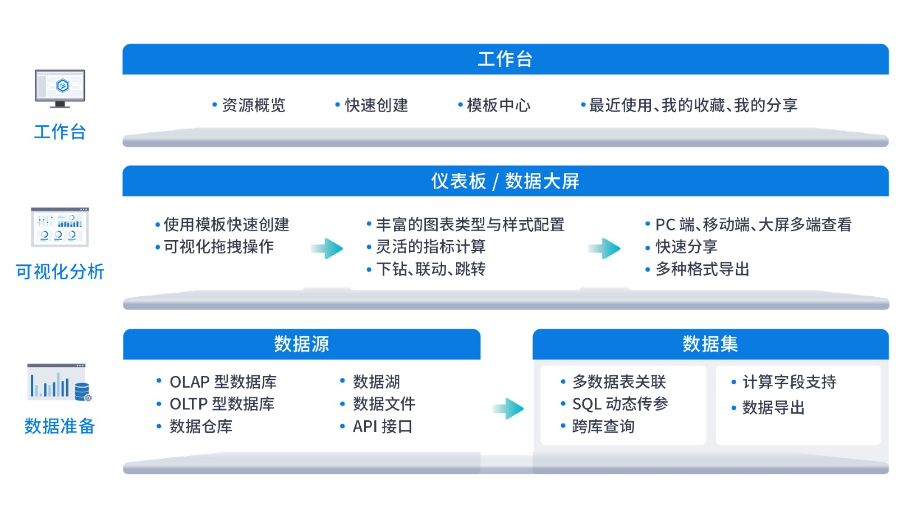
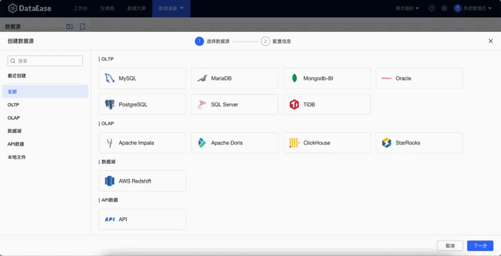

# 产品介绍

!!! Abstract ""
    DataEase 是开源的数据可视化分析工具，帮助用户快速分析数据并洞察业务趋势，从而实现业务的改进与优化。  
    DataEase 支持丰富的数据源连接，能够通过拖拉拽方式快速制作图表，并可以方便地与他人分享。

{ width="900px" }

## 1 界面展示

{ width="900px" }

## 2 模板市场

!!! Abstract ""
    模板市场链接地址：https://templates.dataease.cn 。

{ width="900px" }

## 3 产品优势

!!! Abstract ""

    - 开源开放：零门槛，线上快速获取和安装；快速获取用户反馈、按月发布新版本；
    - 简单易用：极易上手，通过鼠标点击和拖拽即可完成分析；
    - 全场景支持：多平台安装和多样化嵌入支持；
    - 安全分享：支持多种数据分享方式，确保数据安全。

## 4 主要功能

!!! Abstract ""

    - 图表展示: 支持 PC 端仪表板及数据大屏；
    - 图表制作: 支持丰富的图表类型、支持拖拉拽方式快速制作仪表板；
    - 数据引擎: 基于 Apache Calcite，实现统一的 SQL 解析、验证、优化和执行；
    - 数据连接: 支持关系型数据库、数据文件、数据仓库等各种数据源。

## 5 功能列表

!!! Abstract "功能列表"

<table>
	<tr>
		<td bgcolor="#3779d9" align="middle" style="font-weight:bold;color: white;width: 150px">
			功能模块
		</td>
		<td bgcolor="#3779d9" align="middle" style="font-weight:bold;color: white;width: 170px">
			功能
		</td>
		<td bgcolor="#3779d9" align="middle" style="font-weight:bold;color: white;width: 750px">
			功能描述
		</td>
	</tr>
	<tr>
		<td rowspan="6">
			工作台
		</td>
		<td rowspan="6">
			工作台
		</td>
		<td>
			支持统计并展示用户信息及个人权限内的资源信息
		</td>
	</tr>
	<tr>
		<td>
			支持快速创建数据源、数据集、仪表板、数据大屏
		</td>
	</tr>
	<tr>
		<td>
			支持搜索及查看最近使用的资源
		</td>
	</tr>
	<tr>
		<td>
			支持查看我的收藏
		</td>
	</tr>
	<tr>
		<td>
			支持查看我的分享
		</td>
	</tr>	
    <tr>
		<td>
			支持模板中心，用户可快速通过在线模板市场或系统模板管理中的模板创建仪表板和数据大屏；支持批量修改模板分类、批量删除模板
		</td>
	</tr>
			<td rowspan="29">
			仪表板
		</td>
		<td rowspan="13">
			图表组件
		</td>
		<td>
			支持通过简单的拖拉或点击操作，制作图表
		</td>
	</tr>
	<tr>
		<td>
			支持多种图表类型，仪表盘、水波图、明细表、汇总表、基础折线图、面积图、堆叠折线图、基础柱状图、堆叠柱状图、百分比柱状图、分组柱状图、分组堆叠柱状图、瀑布图、横向柱状图、横向堆叠柱状图、横向百分比柱状图、饼图、环形图、玫瑰图、玫瑰环形图、雷达图、矩形树图、词云图、地图、散点图、漏斗图、富文本视图等
		</td>
	</tr>
	<tr>
		<td>
			支持指标的多种汇总计算方式，例如求和、平均、最大值、最小值、标准差、方差、计数、去重计数等
		</td>
	</tr>
	<tr>
		<td>
			支持指标的高级计算，例如同环比与占比
		</td>
	</tr>
	<tr>
		<td>
			支持设置指标数值格式，例如小数位数、数量单位、单位后缀、千分符等
		</td>
	</tr>
	<tr>
		<td>
			支持制作图表时快速切换图表类型与关联数据集
		</td>
	</tr>
	<tr>
		<td>
			支持设置钻取、过滤、刷新频率、结果展示条数
		</td>
	</tr>
	<tr>
		<td>
			支持丰富的图表背景、基础样式、标签、提示、标题、图例等设置
		</td>
	</tr>
	<tr>
		<td>
			支持图表联动设置与跳转设置
		</td>
	</tr>
	<tr>
		<td>
			支持柱状图、折线图设置缩略轴与阈值辅助线
		</td>
	</tr>
	<tr>
		<td>
			支持仪表盘设置阈值区间
		</td>
	</tr>
	<tr>
		<td>
			支持表格设置自动滚动、阈值样式
		</td>
	</tr>
	<tr>
		<td>
			支持图表复制、放大、查看数据、导出 Excel 或图片等功能操作
		</td>
	</tr>
		<td rowspan="4">
			其他组件
		</td>
		<td>
			支持在仪表板中加入查询组件，可定义查询组件样式及标签，可为查询组件设置查询、清空、重置按钮。支持文本下拉、数字下拉、时间、时间范围等类型查询
		</td>
	</tr>
	<tr>
		<td>
			支持富文本组件，可自定义文字内容，可绑定后台动态数据
		</td>
	</tr>
	<tr>
		<td>
			支持图片等媒体组件
		</td>
	</tr>
	<tr>
		<td>
			支持 Tab 组件，支持 Tab 组件样式设置，支持 Tab 每个页签下放入多个其他组件
		</td>
	</tr>
		<td rowspan="6">
			仪表板制作
		</td>
		<td>
			支持在线编辑仪表板，支持放入各种图表与其他组件
		</td>
	</tr>
	<tr>
		<td>
			支持仪表板通过矩阵模式布局
		</td>
	</tr>
	<tr>
		<td>
			支持仪表板多种配置，包括风格、主题色、组件间隙、刷新频率、图表结果数量、仪表板背景、图表与其他组件的整体配置等
		</td>
	</tr>
	<tr>
		<td>
			支持图表与组件的复制与删除
		</td>
	</tr>
	<tr>
		<td>
			支持图表与组件的批量复制、批量设置、批量删除
		</td>
	</tr>
	<tr>
		<td>
			支持撤销及一键清空仪表板画布内容
		</td>
	</tr>
		<td rowspan="6">
			仪表板管理
		</td>
		<td>
			支持仪表板的新建、重命名、删除、复制、移动、搜索、预览等
		</td>
	</tr>
	<tr>
		<td>
			支持仪表板分组的新建、重命名、删除、移动等
		</td>
	</tr>
	<tr>
		<td>
			支持以树状形式展示仪表板分组
		</td>
	</tr>
	<tr>
		<td>
			支持导出仪表板为 PDF、模板或图片
		</td>
	</tr>
	<tr>
		<td>
			支持仪表板生成公共分享链接，并可设置链接有效期及访问密码
		</td>
	</tr>
	<tr>
		<td>
			支持用户收藏仪表板
		</td>
	</tr>
	</tr>
			<td rowspan="29">
			数据大屏	
		</td>
		<td rowspan="12">
			图表组件
		</td>
		<td>
			支持通过简单的拖拉或点击操作，制作图表
		</td>
	</tr>
	<tr>
		<td>
			支持多种图表类型，仪表盘、水波图、明细表、汇总表、基础折线图、面积图、堆叠折线图、基础柱状图、堆叠柱状图、百分比柱状图、分组柱状图、分组堆叠柱状图、瀑布图、横向柱状图、横向堆叠柱状图、横向百分比柱状图、饼图、环形图、玫瑰图、玫瑰环形图、雷达图、矩形树图、词云图、地图、散点图、漏斗图、富文本视图等
		</td>
	</tr>
	<tr>
		<td>
			支持指标的多种汇总计算方式，例如求和、平均、最大值、最小值、标准差、方差、计数、去重计数等
		</td>
	</tr>
	<tr>
		<td>
			支持指标的高级计算，例如同环比与占比
		</td>
	</tr>
	<tr>
		<td>
			支持设置指标数值格式，例如小数位数、数量单位、单位后缀、千分符等
		</td>
	</tr>
	<tr>
		<td>
			支持制作图表时快速切换关联数据集
		</td>
	</tr>
	<tr>
		<td>
			支持设置钻取、过滤、刷新频率、结果展示条数
		</td>
	</tr>
	<tr>
		<td>
			支持丰富的图表背景、基础样式、标签、提示、标题、图例等设置
		</td>
	</tr>
	<tr>
		<td>
			支持图表联动设置与跳转设置
		</td>
	</tr>
	<tr>
		<td>
			支持柱状图、折线图设置缩略轴与阈值辅助线
		</td>
	</tr>
	<tr>
		<td>
			支持仪表盘设置阈值区间
		</td>
	</tr>
	<tr>
		<td>
			支持表格设置自动滚动、阈值样式
		</td>
	</tr>
		<td rowspan="3">
			其他组件
		</td>
		<td>
			支持富文本组件，可自定义文字内容，可绑定后台动态数据
		</td>
	</tr>
	<tr>
		<td>
			支持图片等媒体组件
		</td>
	</tr>
	<tr>
		<td>
			支持边框、图标等素材组件
		</td>
	</tr>
		<td rowspan="8">
			大屏制作
		</td>
		<td>
			支持在线编辑大屏，支持放入各种图表与其他组件
		</td>
	</tr>
	<tr>
		<td>
			支持大屏通过精确定位模式进行布局
		</td>
	</tr>
	<tr>
		<td>
			支持大屏多种配置，包括尺寸、背景、配色、表格配色、刷新配置等
		</td>
	</tr>
	<tr>
		<td>
			支持图表与组件的复制、粘贴、剪切、删除等操作
		</td>
	</tr>
	<tr>
		<td>
			支持在图层管理中可以按照分组查看组件列表、移动定位、同比放大缩小
		</td>
	</tr>
	<tr>
		<td>
			支持图层管理，包括上移、下移、置顶、置底、隐藏、锁定等操作
		</td>
	</tr>
	<tr>
		<td>
			支持编辑大屏时使用快捷键操作
		</td>
	</tr>
	<tr>
		<td>
			支持撤销操作
		</td>
	</tr>
		<td rowspan="6">
			大屏管理
		</td>
		<td>
			支持大屏的新建、重命名、删除、复制、移动、搜索、预览等
		</td>
	</tr>
	<tr>
		<td>
			支持大屏分组的新建、重命名、删除、移动等
		</td>
	</tr>
	<tr>
		<td>
			支持以树状形式展示大屏分组
		</td>
	</tr>
	<tr>
		<td>
			支持导出大屏为 PDF、模板或图片
		</td>
	</tr>
	<tr>
		<td>
			支持大屏生成公共分享链接，并可设置链接有效期及访问密码
		</td>
	</tr>
	<tr>
		<td>
			支持用户收藏大屏
		</td>
	</tr>
	</tr>
			<td rowspan="17">
			数据准备	
		</td>
		<td rowspan="10">
			数据集
		</td>
		<td>
			支持数据集的创建、移动、重命名、删除、复制、预览
		</td>
	</tr>
	<tr>
		<td>
			支持数据集文件夹的创建、移动、重命名、删除
		</td>
	</tr>
	<tr>
		<td>
			支持通过拖拉拽的方式引用数据表
		</td>
	</tr>
	<tr>
		<td>
			支持自定义 SQL，支持快速复制表名与字段名、运行查看结果、设置 SQL 动态参数
		</td>
	</tr>
	<tr>
		<td>
			支持设置多表关联，包括左连接、右连接、内连接
		</td>
	</tr>
	<tr>
		<td>
			支持编辑数据集字段，包括指标与维度切换、更换字段类型、重命名、复制、删除
		</td>
	</tr>
	<tr>
		<td>
			支持批量管理数据集字段
		</td>
	</tr>
	<tr>
		<td>
			支持新建计算字段，内置常用计算函数，支持聚合计算
		</td>
	</tr>
	<tr>
		<td>
			支持二次计算，即基于计算字段创建新的计算字段
		</td>
	</tr>
	<tr>
		<td>
			支持 SQL 加密传输
		</td>
	</tr>
		<td rowspan="7">
			数据源
		</td>
		<td>
			支持多种数据源，包括多 Sheet 页的 Excel 文件，MySQL / Oracle / SQL Server / MariaDB / PostgreSQL / MongoDB-BI / Db2 / TiDB / Apache Doris / ClickHouse / StarRocks / AWS Redshift / Apache Impala / API 数据源等
		</td>
	</tr>
	<tr>
		<td>
			支持数据源的新建、编辑、重命名、移动、复制、删除
		</td>
	</tr>
	<tr>
		<td>
			支持数据源配置的预览，数据源表的预览
		</td>
	</tr>
	<tr>
		<td>
			支持数据源文件夹的创建、移动、重命名、删除
		</td>
	</tr>
	<tr>
		<td>
			支持数据源有效性校验
		</td>
	</tr>
	<tr>
		<td>
			支持定时检测数据源的连接状态
		</td>
	</tr>
	<tr>
		<td>
			支持 Excel 数据源替换数据与追加数据
		</td>
	</tr>
    <td rowspan="2">
        工具箱
    </td>
    <td rowspan="2">
        模板管理
    </td>
    <td>
        支持上传数据大屏或仪表板的模板文件到系统的模板管理中
    </td>
	<tr>
		<td>
			支持为系统模板进行分类管理
		</td>
	</tr>
    <td rowspan="17">
        系统管理  （X-Pack）
    </td>
    <td rowspan="3">
        用户管理
    </td>
    <td>
        支持用户的新建、编辑、删除、修改密码、启用、禁用、搜索、批量导入等
    </td>
	</tr>
	<tr>
		<td>
			支持为用户分配一个或多个角色
		</td>
	</tr>
	<tr>
		<td>
			支持用户通过切换组织管理及使用不同组织下的资源
		</td>
	</tr>
		<td rowspan="3">
			角色管理
		</td>
		<td>
			支持角色的新建、编辑、删除、搜索等
		</td>
	</tr>
	<tr>
		<td>
			支持系统内置角色（系统管理员、组织管理员、普通用户）与自定义角色，支持自定义角色继承于系统内置角色
		</td>
	</tr>
	<tr>
		<td>
			支持为角色添加与移除用户
		</td>
	</tr>
		<td rowspan="3">
			组织管理	
		</td>
		<td>
			支持组织的新建、编辑、删除、搜索、排序、移动等
		</td>
	</tr>
	<tr>
		<td>
			支持多级组织的创建与管理
		</td>
	</tr>
	<tr>
		<td>
			支持组织间的用户与资源隔离
		</td>
	</tr>
		<td rowspan="2">
			系统参数
		</td>
		<td>
			支持系统常见全局参数配置
		</td>
	</tr>
	<tr>
		<td>
			支持离线地图上传、在线地图 Key 的配置
		</td>
	</tr>
		<td rowspan="6">
			权限管理	
		</td>
		<td>
			支持按照用户视角窗口或资源视角窗口配置权限
		</td>
	</tr>
	<tr>
		<td>
			支持菜单权限管理，包括工作台、仪表板、数据大屏、数据集、数据源模块的权限管理
		</td>
	</tr>
	<tr>
		<td>
			支持资源权限管理，包括仪表板、数据大屏、数据集、数据源模块下的资源权限管理
		</td>
	</tr>
	<tr>
		<td>
			支持数据集的行级权限控制、支持行级权限使用系统内置变量（用户 ID、用户名、组织、邮箱等）
		</td>
	</tr>
	<tr>
		<td>
			支持数据集的列级权限控制，支持设置列的禁用或脱敏，支持自定义脱敏规则
		</td>
	</tr>
	</tr>
	<tr>
		<td>
			支持行列权限的白名单设置
		</td>
	</tr>
			<td rowspan="3">
			集成与扩展  （X-Pack）
		</td>
	</tr>
		<td rowspan="1">
			REST API	
		</td>
		<td>
					支持完善的 API 接口及文档
		</td>
	</tr>
	</tr>
		<td rowspan="1">
			嵌入式能力	
		</td>
		<td>
				支持通过 div 或 iframe 的方式将 DataEase 的单个视图、仪表板或数据大屏页面、仪表板或数据大屏设计器嵌入到第三方系统
		</td>
	</tr>

	

</table> 

## 6 了解更多 

!!! Abstract ""

    - **如何向团队介绍 DataEase？：** https://fit2cloud.com/dataease/download/introduce-dataease_202312.pdf
    - **获取新一代数据可视化分析平台建设指南：** https://jinshuju.net/f/cerWRY
    - **DataEase 知识库：** https://kb.fit2cloud.com/categories/dataease
    - **飞致云学堂：** https://edu.fit2cloud.com/index 