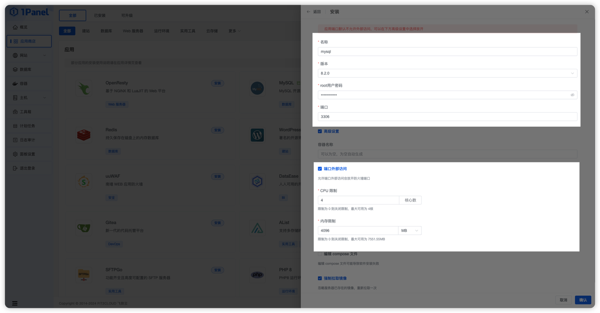
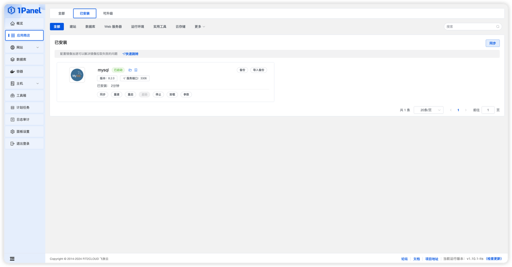
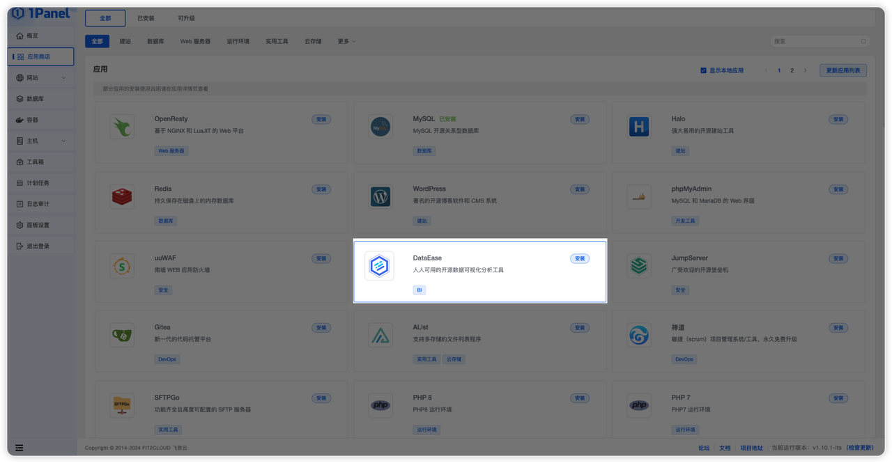
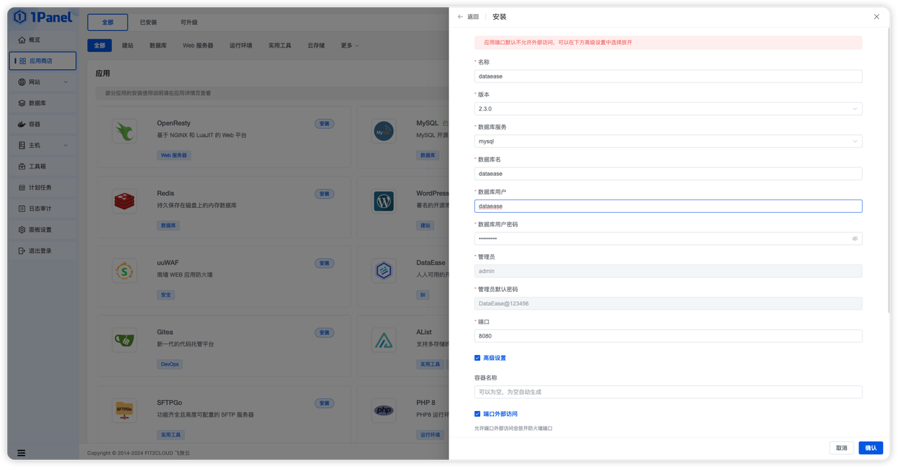
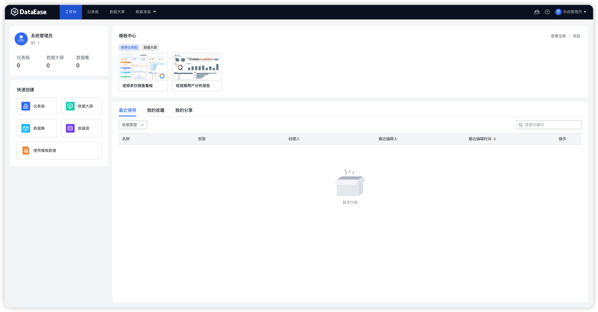

## 1 安装 1Panel

!!! Abstract ""
    关于 1Panel 的安装部署与基础功能介绍，请参考 [1Panel 官方文档](https://1panel.cn/docs/installation/online_installation/)。在完成了 1Panel 的安装部署后，根据提示网址打开浏览器进入 1Panel，如下界面。  
    **注意：暂不支持使用 1Panel 部署企业版/嵌入式版。**
{ width="900px" }

## 2 安装 MySQL 数据库

!!! Abstract ""
    在安装 DataEase 之前，需要先在 1Panel 上安装好所需的软件 MySQL。在应用商店中选择 MySQL 点击安装，选择 8.2.0 版本（这里必须选择 8.x.x 版本）。

{ width="900px" }

{ width="900px" }

!!! Abstract ""
    进行参数设置，设置完成后，点击确认。

    * 名称：创建的 MySQL 应用的名称。
    * root 用户密码：安装的 MySQL 应用的 root 用户密码。
    * 端口：MySQL 应用的服务端口。
    * 容器名称：MySQL 应用容器名称。
    * CPU 限制：MySQL 应用可以使用的 CPU 核心数。
    * 内存限制：MySQL 应用可以使用的 内存大小。

!!! Abstract ""
    点击安装完成后，页面自动跳转到已安装应用列表，等待安装的 MySQL 应用状态变为已启动。
{ width="900px" }

## 3 安装 DataEase

!!! Abstract ""
    安装好 MySQL 后，进入应用商店应用列表，找到 DataEase 应用进行安装。在应用详情页选择 v2.0 最新的 DataEase 版本进行安装。
{ width="900px" }

!!! Abstract ""
    在应用详情页选择最新的 DataEase 版本进行安装，进行相关参数设置。

    * 名称：要创建的 DataEase 应用的名称。
    * 数据库服务：DataEase 应用使用的数据库应用，支持下拉选择已安装的数据库应用，1Panel 会自动配置 DataEase 使用该数据库。
    * 数据库名：DataEase 应用使用的数据库名称，1Panel 会在选中的数据库中自动创建这个数据库。
    * 数据库用户：DataEase 应用使用的数据库用户名，1Panel 会在选中的数据库中自动创建这个用户，并添加对应的数据库授权。
    * 数据库用户密码：DataEase 应用使用的数据库用户密码，1Panel 会在选中的数据库中自动为上一步创建的用户配置该密码。
    * 管理员：DataEase 应用初始化创建的超级管理员用户名。
    * 管理员密码：DataEase 应用初始化创建的超级管理员密码（后续登录系统可以更改）。
    * 端口：DataEase 应用的服务端口。
    * 容器名称：DataEase 应用容器名称。
    * CPU 限制：DataEase 应用可以使用的 CPU 核心数。
    * 内存限制：DataEase 应用可以使用的内存大小。
    * 端口外部访问：DataEase 应用可以使用 IP:PORT 进行访问（DataEase 应用必须打开外部端口访问）。

{ width="900px" }

!!! Abstract ""
    点击开始安装后，页面自动跳转到已安装应用列表，等待安装的 DataEase 应用状态变为已启动。

## 4 访问 DataEase

!!! Abstract ""
    安装成功后，通过浏览器访问如下页面登录 DataEase：
    ```
    地址: http://目标服务器IP地址:服务运行端口（默认 8080）
    用户名: admin
    密码: DataEase@123456
    ```
!!! Abstract ""
    第一次登录需修改 admin 用户的密码，修改密码后，重新登录系统即可使用 DataEase。

{ width="900px" }

