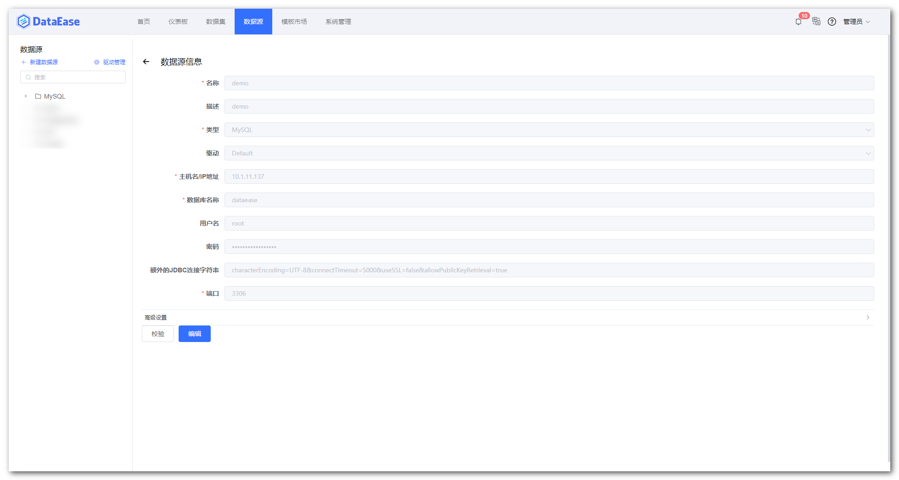
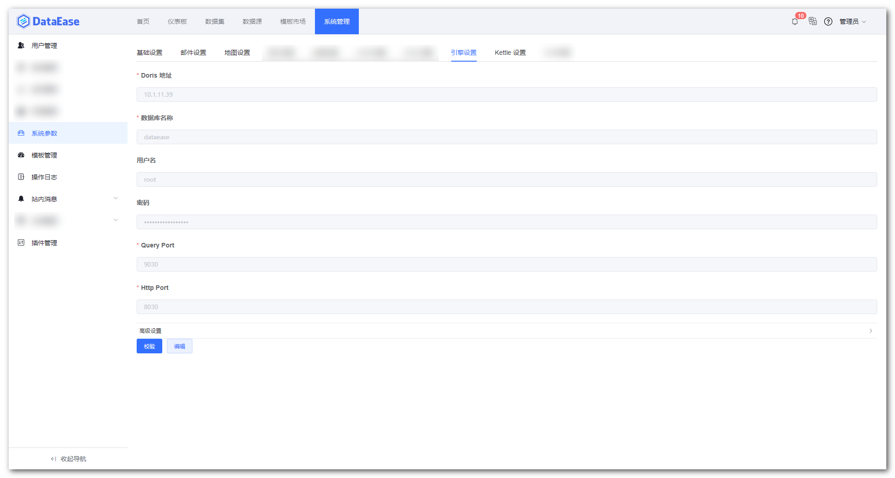
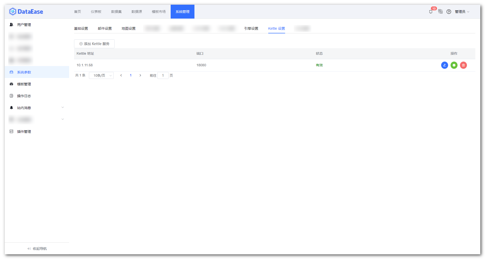

## 1 准备工作

!!! Abstract ""
    **DataEase 环境的搭建需要准备以下服务器：**

    * DataEase-1 节点，IP 为 10.1.11.5
    * DataEase-2 节点，IP 为 10.1.11.84
    * VIP：10.1.11.137

## 2 环境要求

!!! Abstract ""
    **部署 DataEase 服务器要求：**

    * 操作系统：CentOS 7.x
    * CPU/内存：4 核 8G
    * 磁盘空间：500G
    
## 3 配置文件

!!! Abstract ""
    在安装前需要离线下载 DataEase 最新安装包并传输至服务器内，且需要对 DataEase 运行时所需的一些配置文件进行修改；  
    进入 DataEase 安装包解压目录下，修改 install.conf 文件，将 DE_ENGINE_MODE 设置为 cluster，将 VIP 地址和映射的 MySQL 服务端口等信息填入对应的 MySQL 相关配置信息中，且 DE_EXTERNAL_MYSQL 设置为 true。
    
    ```properties
    # 基础配置
    ## 安装目录
    DE_BASE=/opt
    ## Service 端口
    DE_PORT=80
    ## 部署及运行模式，可选值有 local、simple、cluster，分别对应 本地模式、精简模式、集群模式
    DE_ENGINE_MODE=cluster
    ## docker 网段设置
    DE_DOCKER_SUBNET=172.19.0.0/16
    ## docker 网关 IP
    DE_DOCKER_GATEWAY=172.19.0.1
    ## Apache Doris FE IP (外部 Doris 此参数无效)
    DE_DORIS_FE_IP=172.19.0.198
    ## Apache Doris BE IP (外部 Doris 此参数无效)
    DE_DORIS_BE_IP=172.19.0.199
    
    # 数据库配置
    ## 是否使用外部数据库
    DE_EXTERNAL_MYSQL=true
    ## 数据库地址
    DE_MYSQL_HOST=10.1.11.137
    ## 数据库端口
    DE_MYSQL_PORT=3306
    ## DataEase 数据库库名
    DE_MYSQL_DB=dataease
    ## 数据库用户名
    DE_MYSQL_USER=root
    ## 数据库密码
    DE_MYSQL_PASSWORD=Password123@mysql
    ```
!!! Abstract ""	
	**修改 dataease/templates/dataease.properties 文件，加入 Redis 相关设置。根据实际 Redis 的配置放开对应的参数，并填入对应的信息即可，如下所示：**
    
    ```properties
    spring.cache.type=redis
    
    #redis 公共配置
    spring.redis.timeout=10000
    spring.redis.lettuce.pool.max-active=8
    spring.redis.lettuce.pool.max-wait=-1
    spring.redis.lettuce.pool.max-idle=8
    
    #单机模式 redis 配置
    #spring.redis.database=0
    #spring.redis.host=10.1.11.10
    #spring.redis.port=6379
    #spring.redis.password=admin123456
    
    #哨兵模式 redis 配置
    #spring.redis.sentinel.master=mymaster
    #spring.redis.sentinel.nodes=10.1.11.10:6379,10.1.11.10:6380,10.1.11.10:6381
    #spring.redis.sentinel.password=admin123456
    
    #cluster 模式 redis 配置
    spring.redis.cluster.nodes=10.1.11.10:6379,10.1.11.10:6380,10.1.11.10:6381,10.1.11.10:6382,10.1.11.10:6383,10.1.11.10:6384
    spring.redis.cluster.max-redirects=3
    spring.redis.password=admin123456
    ```

## 4 准备公共文件目录

!!! Abstract ""
    安装 NFS 服务的软件包：
    ```shell
    yum install -y nfs-utils
    ```

    创建挂载目录：
    ```shell
    mkdir -p /opt/dataease/data/kettle /opt/dataease/data/static-resource  /opt/dataease/plugins/thirdpart
    ```

    挂载：
    ```shell
    echo "10.1.11.64:/opt/kettle /opt/dataease/data/kettle nfs defaults 0 0" >> /etc/fstab
    echo "10.1.11.64:/opt/plugins/thirdpart /opt/dataease/plugins/thirdpart nfs defaults 0 0" >> /etc/fstab
    echo "10.1.11.64:/opt/static-resource /opt/dataease/data/static-resource nfs defaults 0 0" >> /etc/fstab
    mount -a
    ```

## 5 部署服务

!!! Abstract ""
    **执行安装包下的安装文件进行服务的部署：**
    ```
    bash install.sh
    ```
## 6 其他设置

### 6.1 设置 demo 数据源

!!! Abstract ""
    当 DataEase 服务启动完后，在浏览器中访问 VIP 即可访问 DataEase 控制台，默认登录信息：

    ```shell
    登录用户： admin
    登录密码： dataease
    ```
    登录控制台后，进入【数据源】页面，在左侧【MySQL】下选择【demo】数据源，点击最下方的【编辑】按钮编辑【demo】数据源；  
    将【主机名/IP 地址】改为 VIP，【数据库】、【用户名】、【密码】、【端口】等根据实际情况设置，最后点击【保存】按钮。

{ width="900px" }

{ width="900px" }

### 6.2 设置引擎

!!! Abstract ""
    进入【系统管理】页面，点击左侧的【系统参数】，在 Tab 页中选择【引擎设置】，将 Doris FE 节点的相关信息填入并保存。

{ width="900px" }

### 6.3 Kettle 设置

!!! Abstract ""
    进入【系统管理】页面，点击左侧的【系统参数】，在 Tab 页中选择【Kettle 设置】，点击【添加 Kettle 服务】，将各个 Kettle 节点的相关信息填入并保存。

{ width="900px" }